# AudioGraph -- Architecture Document

> **Source of truth** for the AudioGraph Tauri desktop application.
> Last updated: 2026-05-29.
>
> For a precise, code-grounded walkthrough of every thread and channel and the
> exact sequential/parallel boundaries, see the companion
> [`DATA_FLOW.md`](DATA_FLOW.md). This document is the higher-level
> product + architecture view.

---

## Table of Contents

1. [Vision and Philosophy](#1-vision-and-philosophy)
2. [System Architecture](#2-system-architecture)
3. [Provider Architecture](#3-provider-architecture)
4. [Threading Model](#4-threading-model)
5. [Data Flow](#5-data-flow)
6. [Credential Management](#6-credential-management)
7. [Settings and Configuration](#7-settings-and-configuration)
8. [Module Structure](#8-module-structure)
9. [Dependencies](#9-dependencies)
10. [Build and Run Instructions](#10-build-and-run-instructions)
11. [Testing Each Provider](#11-testing-each-provider)

---

## 1. Vision and Philosophy

AudioGraph captures live audio, transcribes it through configurable ASR providers, extracts entities via configurable LLM providers, and builds a real-time temporal knowledge graph. The core philosophy: **every pipeline stage has local AND cloud alternatives**, letting users choose based on their hardware, budget, and privacy requirements.

### Product Personalities

AudioGraph has two related product personalities that share capture, settings,
credentials, latency telemetry, and graph storage, but optimize for different
user outcomes.

#### Speech-to-Notes / Speech-to-TemporalGraph

This is the durable-memory product. It turns selected desktop audio into a
searchable transcript, structured notes, and a temporal knowledge graph that a
chatbot can recall later.

| Phase | Purpose | Local Options | Cloud Options | Current Status |
|---|---|---|---|---|
| Capture | Select system, device, process, or process-tree audio | rsac desktop capture on Windows/macOS/Linux | N/A | Implemented |
| Audio preparation | Resample, mono mix, source tagging, bounded fan-out | Rust audio pipeline with local fixed-window turn fallback | N/A | Implemented; dedicated local VAD planned |
| STT / ASR | Convert speech to transcript events | Whisper, Sherpa-ONNX | Groq/OpenAI-compatible batch API, AWS Transcribe, Deepgram, AssemblyAI, planned OpenAI Realtime transcription | Implemented except OpenAI Realtime |
| Speaker handling | Attach speaker labels where possible | Local diarization feature clustering | AWS/Deepgram/AssemblyAI provider labels | Implemented MVP |
| Entity extraction | Extract entities, relations, and facts | llama.cpp, mistral.rs | OpenAI-compatible HTTP endpoints, vLLM, AWS Bedrock | Implemented |
| Temporal graph | Store transcript-linked facts over time | petgraph + file persistence | N/A | Implemented |
| Recall chatbot | Ask about the accumulated transcript/graph | Local LLM providers | OpenAI-compatible HTTP, vLLM, AWS Bedrock | Implemented |

The normal user experience is note and memory oriented: capture a meeting,
call, video, or desktop workflow; watch transcript and graph deltas arrive; then
use chat to recall what was said, what entities appeared, and how they changed
over time.

#### Parallel Speech-to-Speech Agent

This is the realtime collaborator product. It listens to the same selected
audio stream in parallel with the graph-building path and can speak or propose
actions while the speech-to-graph pipeline continues to build memory.

| Phase | Purpose | Local Options | Cloud Options | Current Status |
|---|---|---|---|---|
| Capture fan-out | Share processed audio without starving graph work | Bounded Rust channels from the processed-audio dispatcher | N/A | Implemented for speech + Gemini |
| Realtime voice model | Receive audio and produce low-latency assistant output | Local/hybrid STT -> vLLM -> TTS chain; future local S2S model server | Gemini Live today; planned OpenAI Realtime `gpt-realtime-2` | Gemini implemented, OpenAI/local-hybrid planned |
| Agent reasoning | Interpret transcript, graph context, and user intent | Local LLM/vLLM through OpenAI-compatible API | Gemini Live, OpenAI-compatible APIs, AWS Bedrock, planned OpenAI Realtime tools | Implemented for text/proposals; realtime voice actions planned |
| Action proposal | Suggest graph edits, notes, or chat responses | Backend proposal queue | Provider tool calls normalized by backend | Implemented proposal queue |
| Speech response | Let the agent respond audibly | Future local TTS such as Kokoro/Piper/Coqui, or local S2S | Gemini Live responses today; planned OpenAI Realtime speech output; cloud TTS such as Deepgram Aura in hybrid mode | Partial |
| Latency display | Show stage timing and health | Backend telemetry events | Provider-specific timing samples | Implemented baseline; deeper percentiles planned |

The two personalities must not compete for ownership of the audio stream. The
processed-audio dispatcher owns fan-out, and each consumer has its own bounded
queue, cancellation path, and latency surface. Graph updates remain durable and
auditable; speech-to-speech actions should enter the same pending-proposal flow
unless a future action is explicitly marked safe for automatic execution.

The speech-to-speech personality has three provider families:

1. **Cloud-native Gemini Live** -- one Live API session owns audio input,
   model reasoning, native audio output, and optional tool behavior.
2. **Cloud-native OpenAI Realtime** -- one `gpt-realtime-2` session owns audio
   input/output and tool-capable voice-agent reasoning.
3. **Local/hybrid vLLM chain** -- AudioGraph composes STT, vLLM reasoning, and
   TTS. STT/TTS can be local or cloud providers, while vLLM should initially
   run as an external OpenAI-compatible server. The `../../HF/streaming-speech-to-speech`
   project is the pattern reference for turn state, cancellation, aggressive
   token-to-TTS flushing, and latency milestones.

### Logical Pipeline Diagram

This is the product-level routing view. `rsac` owns desktop audio capture, the
Rust backend owns provider credentials and streaming sockets, and React renders
both the graph/notes surface and the voice-agent surface.

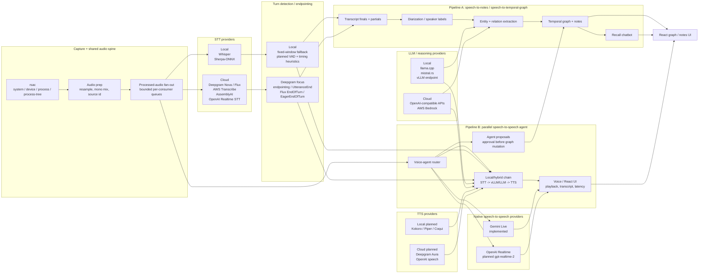

Near-term work should bias toward **Deepgram + local** because that gives us a
useful contrast: Deepgram can provide server-side endpointing/turn events for
cloud STT and voice-agent turns, while local Whisper/Sherpa plus the current
fixed-window fallback preserve offline operation until a dedicated local VAD
lands. The turn detector should become a shared contract used by both product
modes: graph/notes use it to commit transcript segments, and the voice agent
uses it to decide when to start, cancel, or finalize LLM/TTS work.

| Turn signal | Best fit | How AudioGraph should use it |
|---|---|---|
| Deepgram Nova endpointing / `speech_final` | Graph/notes transcript finalization | Commit stable transcript spans without waiting for a local silence timer. |
| Deepgram Nova `UtteranceEnd` | Notes and slower agent modes | Detect a gap after finalized words; useful for note-taking, but less precise for fast voice-agent turn-taking. |
| Deepgram Flux `EndOfTurn` | Voice-agent turn close | Treat as the reliable signal to finalize LLM/TTS work. |
| Deepgram Flux `EagerEndOfTurn` + `TurnResumed` | Optimized S2S latency | Speculatively start vLLM/TTS on eager turns, then cancel if `TurnResumed` arrives. Start with `EndOfTurn` only, then enable eager mode after telemetry proves the false-start rate is acceptable. |
| Local fixed-window fallback, future VAD + timing heuristics | Offline fallback | Preserve local operation and compare against Deepgram turn quality; tune conservatively to avoid cutting users off. |

### Core Capabilities

| Capability | Description |
|---|---|
| **Multi-source audio capture** | Capture system audio, per-application audio, or process-tree audio via rsac |
| **Turn Detection** | Deepgram endpointing/turn signals and local fixed-window fallback emit normalized turn lifecycle events |
| **Configurable ASR** | 6 provider families: local Whisper, local Sherpa-ONNX, Groq/OpenAI-compatible API, AWS Transcribe, Deepgram, AssemblyAI |
| **Configurable LLM** | 4 provider families: local llama.cpp, local mistral.rs, OpenAI-compatible API, AWS Bedrock |
| **Speaker Diarization** | Audio-feature clustering (MVP) with cloud diarization via Deepgram/AssemblyAI/AWS |
| **Gemini Live** | Streaming transcription + model responses via Google Gemini (API Key or Vertex AI) |
| **OpenAI Realtime (planned)** | Future realtime STT/S2S path: `gpt-realtime-whisper` for transcription-only and `gpt-realtime-2` for voice-agent speech-to-speech |
| **Agent Proposals** | Transcript-bound advisory notes/questions/graph suggestions that stay pending until user approval |
| **Temporal Knowledge Graph** | petgraph-based in-memory graph with temporal edges, entity resolution, and live mutation |
| **Live Visualization** | react-force-graph-2d rendering with streaming Tauri event updates |
| **Persistence** | File-based auto-save of transcripts and knowledge graph per session |

### Design Principles

1. **Provider-agnostic pipeline** -- Every stage accepts a provider enum; swap providers without touching pipeline code.
2. **Local-first, cloud-optional** -- The app works fully offline with local Whisper + llama.cpp. Cloud providers are opt-in.
3. **Credential isolation** -- API keys live in `~/.config/audio-graph/credentials.yaml` (chmod 600 on Unix), never in settings.json.
4. **Bounded fan-out** -- Capture, speech, Gemini, and extraction paths communicate through bounded channels and small worker pools so slow providers cannot silently consume unbounded memory.
5. **Graceful degradation** -- Missing models or failed providers fall through to the next available backend.

### Cross-Platform Support

| Platform | Audio Backend | Status |
|---|---|---|
| **Linux** | PipeWire via rsac | Supported |
| **macOS** | CoreAudio Process Tap via rsac | Supported (macOS 14.4+) |
| **Windows** | WASAPI Process Loopback via rsac | Supported |

---

## 2. System Architecture

### System Overview

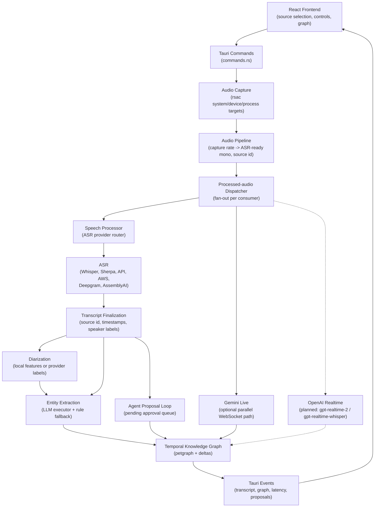

### Pipeline Modes

AudioGraph currently supports two pipeline modes, with one planned extension:

1. **Speech Processor** -- The modular speech-to-notes and speech-to-graph pipeline where each stage (ASR, diarization, extraction, recall chat) uses independently configured providers. This is the primary durable-memory mode.
2. **Gemini Live** -- A streaming speech-to-speech path where Google Gemini receives audio in parallel with the speech processor and can return model responses while graph work continues.
3. **OpenAI Realtime (planned)** -- A backend-owned OpenAI Realtime WebSocket path. `gpt-realtime-whisper` should map to transcription-only ASR for the notes/graph personality, while `gpt-realtime-2` should map to a Gemini-like full voice-agent path for the speech-to-speech personality.

Both personalities feed results into the same temporal knowledge graph and
React frontend, but they should be documented, configured, and tested as
separate user experiences.

### Repository Placement

```
<workspace parent>/
+-- audio-graph/                 # This Tauri + React application
|   +-- src-tauri/               # Rust backend
|   +-- src/                     # React frontend
|   +-- docs/                    # Architecture and design docs
+-- rsac/                        # Sibling checkout used by Cargo path deps
    +-- src/                     # rsac audio-capture library crate
```

The current development layout is standalone `audio-graph/` plus sibling
`rsac/`; `src-tauri/Cargo.toml` uses `rsac = { path = "../../rsac", ... }`.
The older `rust-crossplat-audio-capture/apps/audio-graph` submodule layout is
historical and only applies if the path dependency is edited back to the parent
repo root.

---

## 3. Provider Architecture

### Provider Overview Diagram

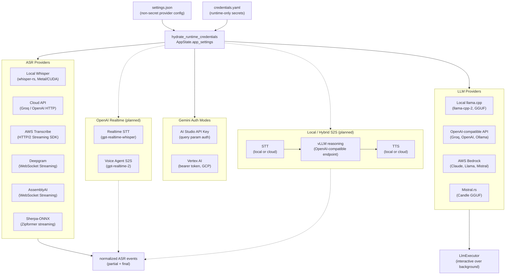

### All Providers Reference Table

| Provider | Category | Type | Protocol | Streaming | Diarization | Cost | Privacy |
|---|---|---|---|---|---|---|---|
| **Local Whisper** | ASR | Local | whisper-rs (C++ FFI) | No (batch) | No (separate stage) | Free | Full (on-device) |
| **Groq / OpenAI API** | ASR | Cloud | HTTP multipart POST | No (batch) | No | Per-minute | Data sent to cloud |
| **AWS Transcribe** | ASR | Cloud | HTTP/2 (AWS SDK) | Yes (streaming) | Yes (built-in) | $0.024/min | AWS data policies |
| **Deepgram** | ASR | Cloud | WebSocket | Yes (streaming) | Yes (built-in) | $0.0077/min | Deepgram data policies |
| **AssemblyAI** | ASR | Cloud | WebSocket | Yes (streaming) | Yes (built-in) | $0.012/min | AssemblyAI data policies |
| **Sherpa-ONNX** | ASR | Local | ONNX Zipformer | Yes (streaming) | No (separate) | Free | Full (on-device) |
| **Local llama.cpp** | LLM | Local | In-process (GGUF) | No | N/A | Free | Full (on-device) |
| **OpenAI-compatible API** | LLM | Cloud | HTTP JSON | No | N/A | Per-token | Varies by provider |
| **AWS Bedrock** | LLM | Cloud | HTTP (AWS SDK) | No | N/A | Per-token | AWS data policies |
| **Mistral.rs** | LLM | Local | In-process GGUF (Candle) | N/A | N/A | Free | Full (on-device) |
| **Gemini (API Key)** | Full Pipeline | Cloud | WebSocket | Yes | N/A | Per-token | Google data policies |
| **Gemini (Vertex AI)** | Full Pipeline | Cloud | WebSocket | Yes | N/A | Per-token | GCP data policies |
| **OpenAI Realtime STT (planned)** | ASR | Cloud | WebSocket / Realtime transcription session | Yes | Assume no; use AudioGraph diarization unless verified | Per-token / audio | OpenAI data policies |
| **OpenAI Realtime Voice Agent (planned)** | Full Pipeline | Cloud | WebSocket / WebRTC / SIP | Yes | N/A | Per-token / audio | OpenAI data policies |
| **Local / Hybrid vLLM S2S (planned)** | Full Pipeline | Local+Cloud mix | STT provider + OpenAI-compatible vLLM + TTS provider | Provider-dependent | N/A | Depends on STT/TTS providers | User-selected |

### ASR Provider Decision Tree

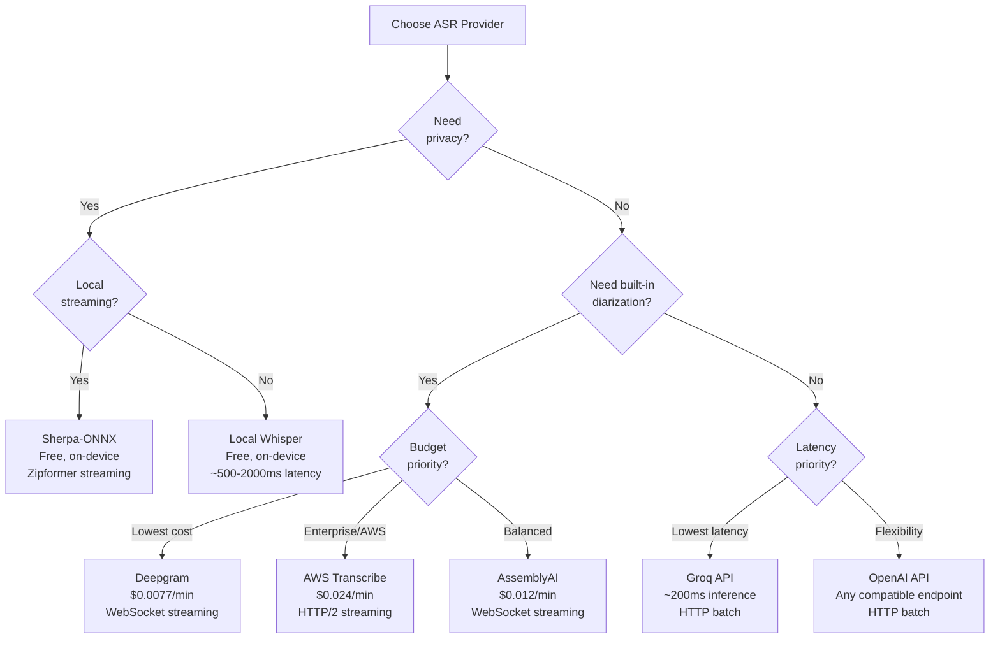

### ASR Provider Details

#### Local Whisper (`AsrProvider::LocalWhisper`)

- **Engine:** whisper-rs (Rust bindings to whisper.cpp)
- **Model:** `ggml-small.en.bin` (~466 MB), loaded once at startup
- **GPU:** Metal (macOS auto), CUDA/Vulkan (opt-in features)
- **Latency:** 300-2000ms depending on utterance length and hardware
- **Credentials:** None required

#### Cloud API (`AsrProvider::Api`)

- **Protocol:** HTTP multipart POST to `/v1/audio/transcriptions`
- **Compatible with:** Groq, OpenAI, any Whisper-compatible endpoint
- **Settings:** `endpoint`, `api_key`, `model`
- **Latency:** ~200-3000ms plus 2s audio accumulation
- **Implementation:** `asr/cloud.rs`

#### AWS Transcribe (`AsrProvider::AwsTranscribe`)

- **Protocol:** HTTP/2 event stream via AWS SDK
- **Settings:** `region`, `language_code`, `credential_source`, `enable_diarization`
- **Built-in diarization:** Yes (speaker labels in transcript results)
- **Implementation:** `asr/aws_transcribe.rs`

#### Deepgram (`AsrProvider::DeepgramStreaming`)

- **Protocol:** WebSocket to `wss://api.deepgram.com/v1/listen` for Nova
  transcription models and `wss://api.deepgram.com/v2/listen` for Flux
  turn-taking models
- **Settings:** `api_key`, `model` (default: `nova-3`),
  `enable_diarization`, Nova endpointing / `UtteranceEnd` / VAD event
  controls, and Flux EOT threshold controls
- **Built-in diarization:** Yes
- **Turn events:** Normalizes `speech_final`, `SpeechStarted`,
  `UtteranceEnd`, Flux `EndOfTurn`, `EagerEndOfTurn`, and `TurnResumed` into
  AudioGraph `turn-event` payloads
- **Implementation:** `asr/deepgram.rs`

#### AssemblyAI (`AsrProvider::AssemblyAI`)

- **Protocol:** WebSocket to AssemblyAI real-time transcription
- **Settings:** `api_key`, `enable_diarization`
- **Built-in diarization:** Yes
- **Implementation:** `asr/assemblyai.rs`

#### Sherpa-ONNX (`AsrProvider::SherpaOnnx`)

- **Engine:** sherpa-onnx Rust bindings (Zipformer transducer)
- **Model:** `streaming-zipformer-en-20M` by default (path resolved under the user's models directory)
- **Streaming:** Yes (online ONNX inference with optional endpoint detection)
- **Settings:** `model_dir`, `enable_endpoint_detection`
- **Credentials:** None required
- **Compilation:** Gated behind the `sherpa-streaming` Cargo feature to avoid ONNX Runtime linker conflicts with `parakeet-rs` diarization
- **Implementation:** `asr/sherpa_streaming.rs`

### LLM Provider Details

#### Local llama.cpp (`LlmProvider::LocalLlama`)

- **Engine:** llama-cpp-2 (Rust bindings to llama.cpp)
- **Model:** Any GGUF file (default: `lfm2-350m-extract-q4_k_m.gguf`)
- **Entity extraction:** GBNF grammar-constrained JSON output
- **Chat:** Free-form generation with graph context
- **GPU:** Metal (macOS auto), CUDA/Vulkan (opt-in)

#### OpenAI-compatible API (`LlmProvider::Api`)

- **Protocol:** HTTP JSON POST to `/v1/chat/completions`
- **Compatible with:** OpenAI, Groq, Ollama, LM Studio, vLLM, Together AI, OpenRouter
- **Settings:** `endpoint`, `api_key`, `model`
- **Default:** `http://localhost:11434/v1` (Ollama) with model `llama3.2`

#### AWS Bedrock (`LlmProvider::AwsBedrock`)

- **Protocol:** HTTP via AWS SDK
- **Settings:** `region`, `model_id`, `credential_source`
- **Available models:** Claude, Llama, Mistral via Bedrock
- **Shares credentials** with AWS Transcribe

### Gemini Live Details

#### API Key Mode (`GeminiAuthMode::ApiKey`)

- **Auth:** API key in WebSocket URL query parameter
- **Endpoint:** `wss://generativelanguage.googleapis.com/...?key=API_KEY`
- **Use case:** Developer/consumer, quick setup

#### Vertex AI Mode (`GeminiAuthMode::VertexAI`)

- **Auth:** Bearer token in WebSocket headers (via `gcp_auth`)
- **Settings:** `project_id`, `location`, optional `service_account_path`
- **Endpoint:** `wss://{location}-aiplatform.googleapis.com/...`
- **Use case:** Enterprise GCP deployments
- **Token refresh:** Automatic via `gcp_auth` crate (ADC or service account)

### OpenAI Realtime Details (Planned)

The current codebase does **not** yet have an OpenAI Realtime client. The
intended mapping is:

- **Realtime transcription:** add an ASR provider backed by OpenAI Realtime
  transcription sessions, using `gpt-realtime-whisper` for streaming transcript
  deltas when AudioGraph needs STT without model-generated speech. Treat
  provider diarization as unavailable until verified and continue to route
  finals through AudioGraph's diarization path.
- **Realtime voice agent:** add a Gemini-like full-pipeline provider backed by
  `gpt-realtime-2` for speech-to-speech responses, tool/action calls, and
  graph-aware voice-agent workflows.
- **Transport choice:** keep the default AudioGraph route backend-direct over
  WebSocket because PCM frames originate in `rsac` capture workers. Browser
  WebRTC remains a future mode for browser-origin audio or provider-native UI
  widgets with backend-minted ephemeral credentials.
- **Credential storage:** use the existing `openai_api_key` slot in
  `credentials.yaml`; do not persist OpenAI keys in `settings.json`.
- **Audio format:** explicitly choose the OpenAI session input format and sample
  rate before implementation. The current graph pipeline normalizes to 16 kHz
  mono PCM, while OpenAI Realtime transcription examples use Base64
  `input_audio_buffer.append` frames. The client must either request/confirm a
  compatible session format or resample at the OpenAI edge.
- **Transcript correlation:** aggregate OpenAI
  `conversation.item.input_audio_transcription.delta` and `.completed` events
  by provider item id before emitting AudioGraph partial/final transcript
  events. Completion ordering across turns must not be assumed.
- **Session surface:** settings must capture the OpenAI Realtime mode
  (transcription vs voice agent), model, input audio format, turn detection or
  manual commit behavior, voice where applicable, and any safety/user
  identifier headers required by the provider contract.
- **Normalization target:** emit the same `asr-partial`, `transcript-update`,
  `pipeline-latency`, `agent-status`, and graph events used by the existing
  speech/Gemini paths.

### Local / Hybrid Speech-to-Speech Details (Planned)

The local/hybrid S2S route should compose independently selected STT,
reasoning, and TTS providers rather than requiring a monolithic local model:

- **STT:** local Whisper/Sherpa or a cloud streaming STT provider such as
  Deepgram, AWS Transcribe, AssemblyAI, or OpenAI Realtime transcription.
- **Reasoning:** vLLM through the existing OpenAI-compatible HTTP provider
  (`LlmProvider::Api`). This is the only reasoning path that exists for vLLM —
  AudioGraph talks to a vLLM server over HTTP and never bundles it.
  > **Not implemented / research-only:** an in-process Python sidecar driving
  > vLLM `StreamingInput` was investigated but **never built**. The research
  > (`docs/research/vllm-rust-frontend.md`) concluded vLLM is a *server-side*
  > optimization only (`VLLM_USE_RUST_FRONTEND=1` on the server); there is no
  > sidecar process in `src-tauri`. Do not treat the sidecar as architecture.
- **TTS:** a local TTS provider such as Kokoro/Piper/Coqui or a cloud streaming
  TTS provider such as Deepgram Aura or OpenAI speech.
- **Turn protocol:** use bounded turn state with explicit start, end, cancel,
  cancel acknowledgement, and future barge-in. This mirrors the HF
  `streaming-speech-to-speech` project without porting its Python runtime.
- **Flush policy:** stream LLM tokens to TTS aggressively, starting with a
  conservative punctuation-or-word-count accumulator and tuning after latency
  measurements.
- **Graph safety:** local/hybrid agent actions must enter the existing
  pending-proposal queue before mutating the graph.

#### Mistral.rs (`LlmProvider::MistralRs`)

- **Engine:** mistral.rs (Candle-based GGUF inference, Rust-native)
- **Settings:** `model_id` (default: `lfm2-350m-extract-q4_k_m.gguf`)
- **Structured output:** Uses `schemars`-derived JSON Schemas for grammar-constrained extraction
- **GPU:** CPU by default; opt-in Metal support requires full Xcode (not just CLT) for the Metal shader compiler. Set `MISTRALRS_METAL_PRECOMPILE=0` to skip shader precompilation
- **Implementation:** `llm/mistralrs_engine.rs`

### Extraction Chain (Fallback Order)

LLM work is dispatched through a priority queue (`llm/executor.rs`) that lets interactive chat preempt background entity extraction. Each provider's fallback order:

```
LlmProvider::LocalLlama:
  native llama.cpp --> OpenRouter --> API client --> mistral.rs --> rule-based NER

LlmProvider::OpenRouter:
  OpenRouter --> API client --> native llama.cpp --> mistral.rs --> rule-based NER

LlmProvider::Api or LlmProvider::AwsBedrock:
  API client --> OpenRouter --> native llama.cpp --> mistral.rs --> rule-based NER

LlmProvider::MistralRs:
  Candle GGUF inference --> native llama.cpp --> OpenRouter --> API client --> rule-based NER
```

The rule-based extractor (`graph/extraction.rs`) is always available as a final fallback using regex-based NER patterns. The vocabulary (entity/relation types and the shared extraction prompt) is defined in `ontology.rs`.

---

## 4. Threading Model

### Thread Architecture Diagram

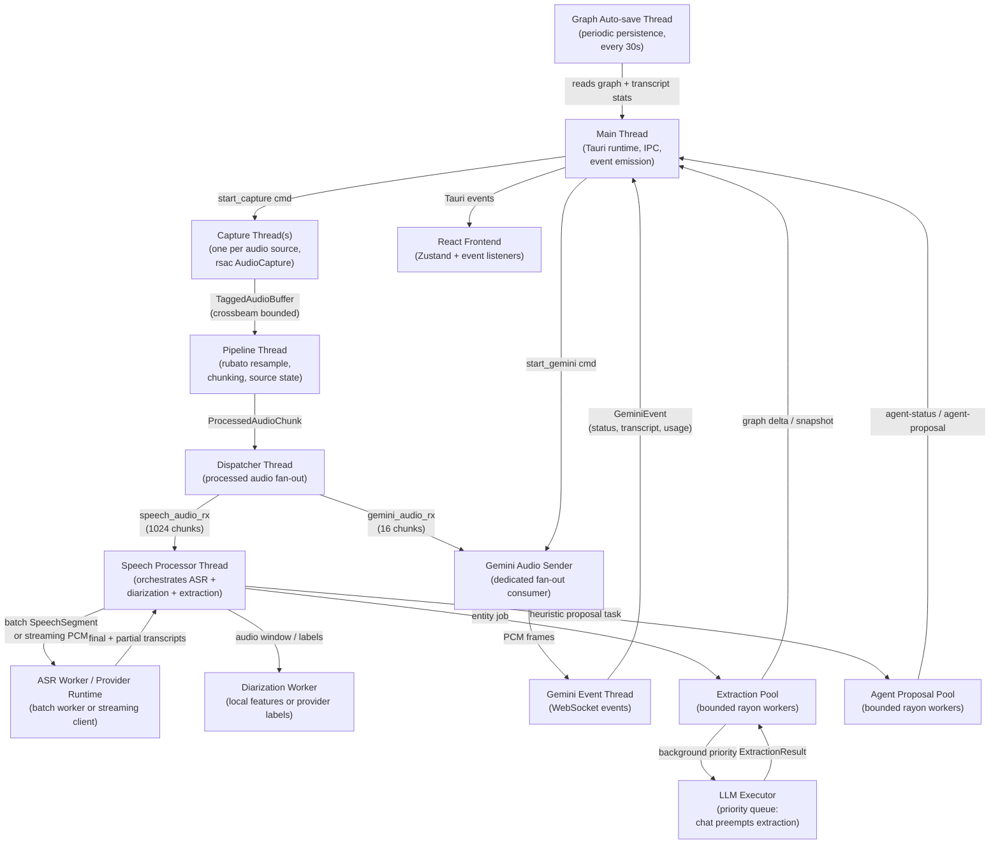

### Thread Inventory

| Thread | Responsibility | Input | Output |
|---|---|---|---|
| **main (Tauri)** | Runtime, commands, event emission | IPC commands | Tauri events to frontend |
| **capture-{id}** | Owns one rsac AudioCapture | Ring buffer reads | TaggedAudioBuffer via crossbeam |
| **audio-pipeline** | Mix down/resample capture audio to 16 kHz mono, preserve per-source state, emit fixed chunks | TaggedAudioBuffer | ProcessedAudioChunk via crossbeam |
| **processed-dispatcher** | Fans processed chunks to every active consumer | ProcessedAudioChunk | Speech and Gemini per-consumer channels |
| **speech-processor** | Orchestrates ASR + diarization + extraction | ProcessedAudioChunk | TranscriptSegment, GraphSnapshot events |
| **asr-worker / provider runtime** | Whisper, cloud batch, or streaming provider I/O | SpeechSegment or PCM chunks | Final and partial transcripts |
| **gemini-audio / gemini-events** | Streams PCM to Gemini and receives WebSocket events | ProcessedAudioChunk / WebSocket messages | GeminiEvent via crossbeam |
| **graph-autosave** | Periodic persistence (every 30s, also refreshes session-index segment/speaker/entity counts) | Arc<Mutex<TemporalKnowledgeGraph>> | JSON files to disk |
| **llm-executor** | Priority queue separating background extraction work from interactive chat (`llm/executor.rs`) | Queued LLM work items | Extraction / chat results via channels |
| **extraction-pool** | Bounded rayon pool for background graph extraction tasks | TranscriptSegment context | Graph deltas/snapshots |
| **agent-proposal-worker** | Bounded rayon-pool task for advisory notes / questions / graph suggestions | TranscriptSegment | `agent-proposal` Tauri event |

### Channel Communication

All inter-thread communication uses `crossbeam-channel` bounded channels to provide backpressure and prevent unbounded memory growth. The speech processor thread acts as the central orchestrator, dispatching work to ASR and diarization sub-workers, routing LLM work through the priority executor, and spawning agent-proposal tasks on the rayon pool when extraction completes.

> **Implementation note:** diarization does **not** run on a dedicated thread in
> the live path. `DiarizationWorker::run()` exists but the pipeline calls
> `process_input(...)` inline on the ASR worker/event-receiver thread,
> immediately after ASR and before extraction is spawned. Extraction (4-thread
> rayon pool) and agent proposals (2-thread rayon pool) are the parallel work;
> ASR -> diarization -> emit is sequential. The `llm-executor` runs **one job at
> a time**, but the streaming-chat path (`Api`/`OpenRouter`) bypasses the
> executor and runs on its own tokio task, so it is concurrent with background
> extraction. See [`DATA_FLOW.md`](DATA_FLOW.md) for the verified thread/channel
> map.

---

## 5. Data Flow

### Full Pipeline Sequence

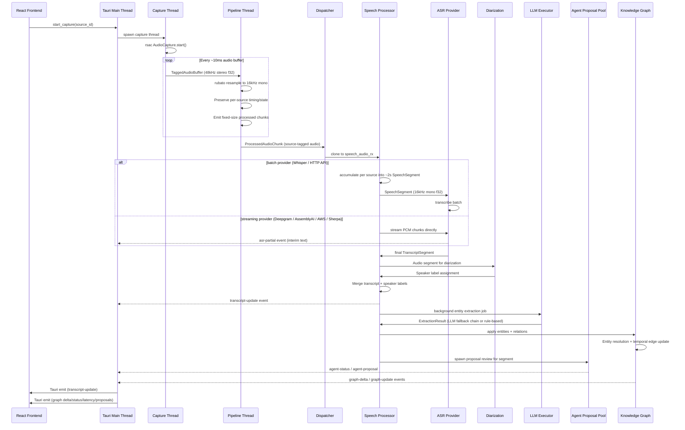

### Gemini Live Pipeline

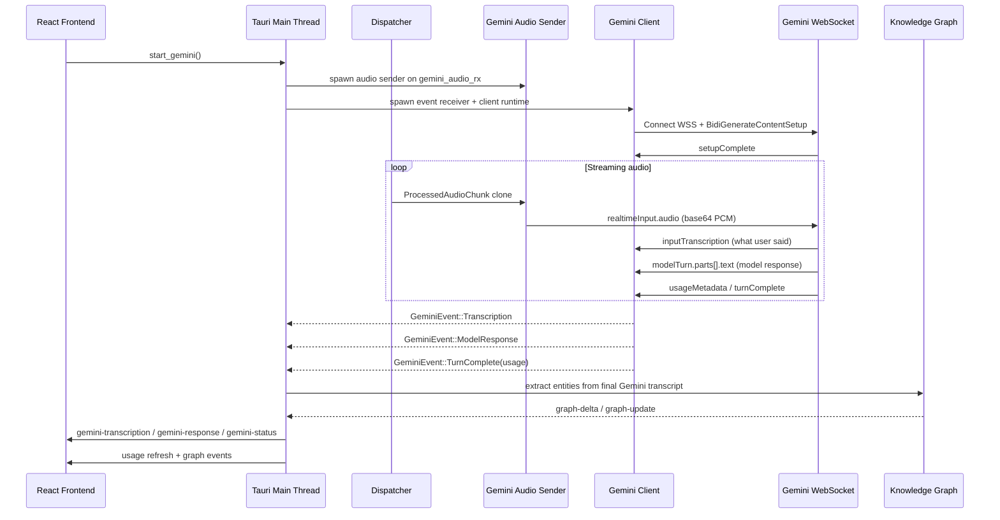

### Tauri Events

Event name constants and payload types are defined in `src-tauri/src/events.rs`.

| Event | Payload | Trigger |
|---|---|---|
| `transcript-update` | `TranscriptSegment` | New transcript segment available |
| `asr-partial` | `AsrPartialPayload` | Streaming ASR provider produced an interim hypothesis |
| `graph-update` | `GraphSnapshot` | Knowledge graph changed (full snapshot, throttled to every ~10th update or 30 s) |
| `graph-delta` | Delta payload | Incremental graph change (every extraction cycle) |
| `pipeline-status` | `PipelineStatus` | Pipeline stage status change (~2 s throttle) |
| `pipeline-latency` | `PipelineLatencyPayload` | Per-stage wall-clock duration sample |
| `agent-status` | `AgentStatusPayload` | Agent/react loop state change (idle / running / error) |
| `agent-proposal` | `AgentProposalPayload` | Advisory note, question, or graph suggestion awaiting user approval |
| `speaker-detected` | Speaker info | New speaker identified |
| `capture-error` | `CaptureErrorPayload` | Capture or processing error (with `recoverable` flag) |
| `capture-storage-full` | `CaptureStorageFullPayload` | Persistence write failed because storage is full (ENOSPC / `ERROR_DISK_FULL`) |
| `capture-backpressure` | `CaptureBackpressurePayload` | rsac ring buffer started/stopped dropping (edge-triggered) |
| `gemini-transcription` | Transcription text | Gemini Live input transcription |
| `gemini-response` | Model text | Gemini Live model response |
| `gemini-status` | Connection status | Gemini Live connection state change |
| `model-download-progress` | Progress payload | Model download progress (~1 Hz, plus completion / error) |
| `aws-error` | `AwsErrorPayload` | Structured AWS credential / region error (ag#13) |

### Chat and Agent Proposal Flow

In addition to the audio pipeline, two interactive flows feed the same UI:

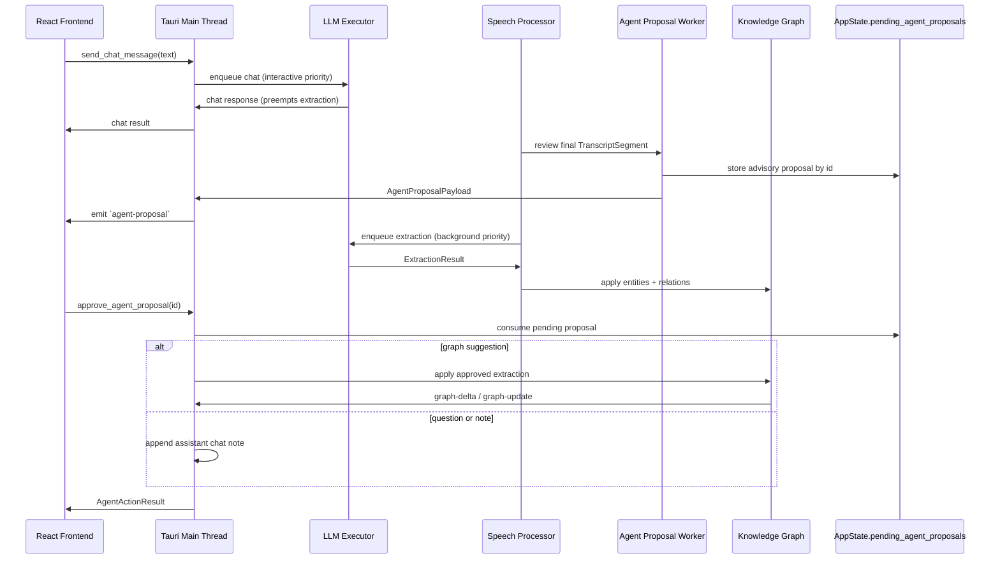

`approve_agent_proposal`, `dismiss_agent_proposal`, and `clear_agent_proposals` mutate the pending-proposals queue stored in `AppState`; only approved proposals modify the knowledge graph.

### User Data and Persistence Flow

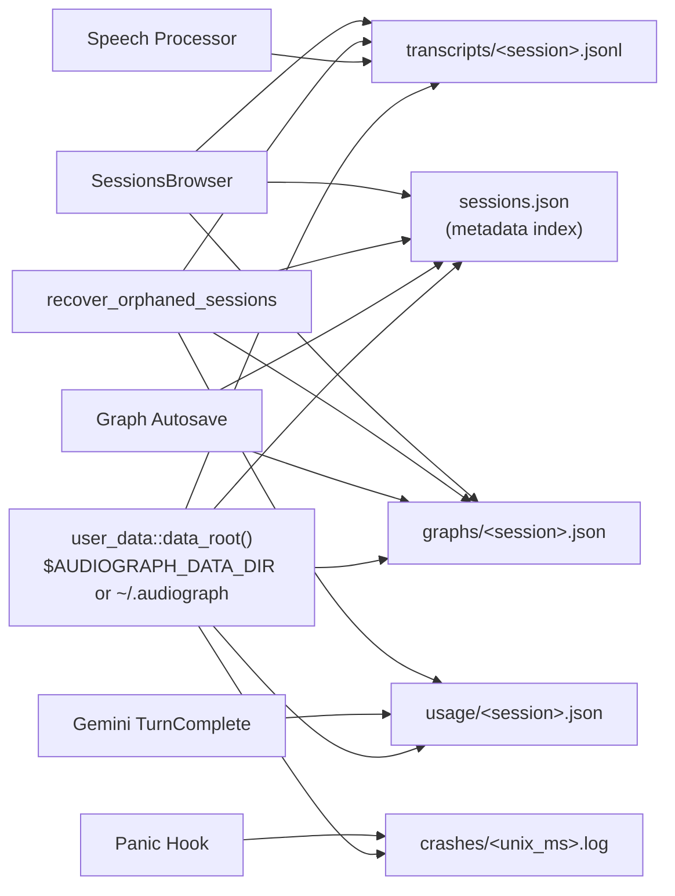

---

## 6. Credential Management

### Credential Flow Diagram

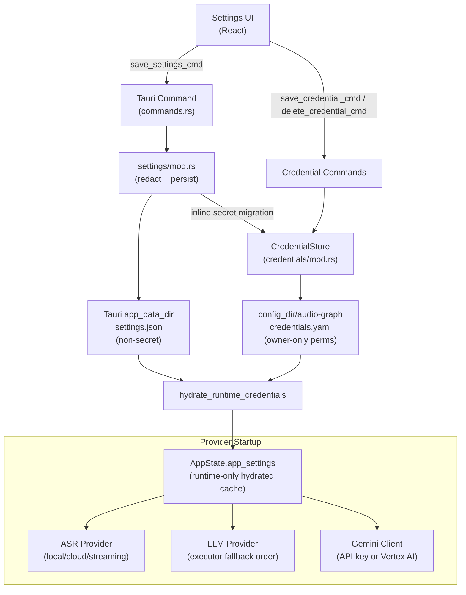

### CredentialStore Fields

The credential store (`~/.config/audio-graph/credentials.yaml`) holds these optional fields:

| Field | Provider | Purpose |
|---|---|---|
| `openai_api_key` | OpenAI / Groq API (ASR + LLM) | HTTP Authorization header |
| `openrouter_api_key` | OpenRouter | HTTP Authorization header |
| `groq_api_key` | Groq API | HTTP Authorization header |
| `deepgram_api_key` | Deepgram | WebSocket Authorization header |
| `gemini_api_key` | Gemini (API Key mode) | `x-goog-api-key` header |
| `assemblyai_api_key` | AssemblyAI | WebSocket Authorization header |
| `aws_access_key` | AWS (Transcribe + Bedrock) | AWS SigV4 signing |
| `aws_secret_key` | AWS (Transcribe + Bedrock) | AWS SigV4 signing |
| `aws_session_token` | AWS (temporary credentials) | AWS SigV4 signing |
| `google_service_account_path` | Gemini (Vertex AI mode) | Path to GCP service account JSON |
| `together_api_key` | Together AI API | HTTP Authorization header |
| `fireworks_api_key` | Fireworks AI API | HTTP Authorization header |
| `aws_profile` | AWS (named profile) | AWS profile name for credential resolution |
| `aws_region` | AWS (Transcribe + Bedrock) | AWS region override |

### Credential Operations

```
save_credential_cmd(key, value)   -- Upserts a credential and writes the YAML file
load_credential_presence_cmd()    -- Returns non-secret key presence/source state
load_credential_cmd(key)          -- Legacy explicit plaintext readback for narrow edit flows
list_aws_profiles()               -- Parses ~/.aws/config and returns profile names
```

### Security Measures

- YAML file has `chmod 600` on Unix (owner read/write only)
- Atomic writes via temp file + rename to prevent corruption
- API keys are never written to `settings.json` (only non-sensitive settings like region, model, endpoint URL)
- AWS credentials support three modes: DefaultChain (env/profile), Profile (named), AccessKeys (manual)

---

## 7. Settings and Configuration

### Settings Type Hierarchy

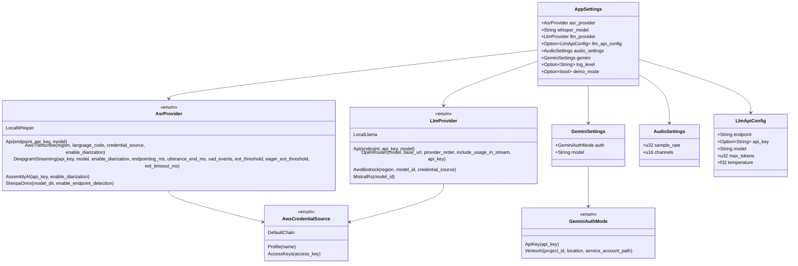

### Settings Storage

- **Location:** `{app_data_dir}/settings.json` (Tauri standard app data directory)
- **Format:** JSON with serde tagged enums (`"type": "local_whisper"`, etc.)
- **Load behavior:** Missing or unparseable files fall back to `AppSettings::default()`
- **Save behavior:** Atomic write via temp file + rename
- **Secrets:** Runtime-only provider secret fields are hydrated from
  `credentials.yaml` and skipped during settings serialization.

### User Data Roots

AudioGraph now has three intentional roots:

| Data | Root | Owner |
|---|---|---|
| Settings | Tauri `app_data_dir()/settings.json` | `settings/mod.rs` |
| Models | Tauri `app_data_dir()/models/` | `models/mod.rs` |
| Credentials | `dirs::config_dir()/audio-graph/credentials.yaml` | `credentials/mod.rs` |
| Session artifacts | `$AUDIOGRAPH_DATA_DIR` when set, otherwise `~/.audiograph/` | `user_data.rs`, `sessions/`, `persistence/` |

The session-artifact root contains `sessions.json`, `transcripts/`,
`graphs/`, `usage/`, and `crashes/`. `user_data.rs` centralizes that path so
commands no longer hand-assemble `~/.audiograph`; credentials intentionally
remain separate from both settings and session artifacts.

### Default Values

| Setting | Default |
|---|---|
| ASR provider | `LocalWhisper` |
| LLM provider | `Api { endpoint: "http://localhost:11434/v1", model: "llama3.2" }` |
| Audio sample rate | 48000 Hz, loaded from `src-tauri/config/default.toml` |
| Audio channels | 2 (stereo), loaded from `src-tauri/config/default.toml` |
| Gemini auth | `ApiKey { api_key: "" }` |
| Gemini model | `gemini-2.0-flash-live-001` |
| AWS region | `us-east-1` |
| Language code | `en-US` |
| Deepgram model | `nova-3` |
| LLM max tokens | 2048 |
| LLM temperature | 0.7 |

---

## 8. Module Structure

```
audio-graph/
+-- docs/
|   +-- ARCHITECTURE.md                 # This document
|   +-- adr/                            # Accepted architecture decisions
|   +-- designs/                        # Historical/current design notes
|   +-- ops/                            # Runbooks (Gemini reconnect, vLLM)
|   +-- reviews/                        # Review-loop evidence and audits
+-- scripts/
|   +-- download-models.sh              # Legacy/manual model download helper
|   +-- download-models.ps1             # Windows model download helper
+-- src-tauri/                          # Rust backend
|   +-- Cargo.toml                      # Rust dependencies and feature flags
|   +-- config/default.toml             # Bundled typed defaults
|   +-- tauri.conf.json                 # Tauri v2 configuration
|   +-- capabilities/default.json       # Tauri v2 permissions
|   +-- src/
|       +-- lib.rs                      # Tauri builder + command registration
|       +-- state.rs                    # AppState shared runtime state
|       +-- commands.rs                 # Tauri IPC boundary
|       +-- events.rs                   # Event constants + payload types
|       +-- error.rs                    # Structured AppError payloads
|       +-- ontology.rs                 # Entity/relation vocabulary + extraction prompt
|       +-- user_data.rs                # Session-artifact root resolver
|       +-- config.rs                   # Bundled TOML parser
|       +-- speak_aloud.rs              # Chat tokens -> TTS -> playback glue
|       +-- audio/                      # rsac capture + resample/chunk pipeline + mixer
|       +-- asr/                        # Whisper, HTTP API, AWS, Deepgram, AssemblyAI, Sherpa
|       +-- speech/                     # Speech orchestrator, extraction, agent proposals
|       +-- diarization/                # Speaker diarization (Simple + Sortformer, inline)
|       +-- llm/                        # llama.cpp, API, OpenRouter, mistral.rs, priority executor, streaming
|       +-- gemini/                     # Gemini Live WebSocket client
|       +-- tts/                        # Text-to-speech providers (Deepgram Aura)
|       +-- playback/                   # cpal audio output (dedicated thread + ringbuf)
|       +-- graph/                      # Entity extraction + temporal graph
|       +-- models/                     # Model catalog, status, downloads
|       +-- persistence/                # Transcript writer + graph autosave
|       +-- sessions/                   # Session index, recovery, token usage
|       +-- settings/                   # AppSettings load/save/hydration
|       +-- credentials/                # credentials.yaml management
|       +-- aws_util/                   # AWS credential and error helpers
|       +-- fs_util/                    # Filesystem helpers (atomic writes, ENOSPC)
|       +-- crash_handler/              # Panic report capture
|       +-- logging/                    # Runtime log-level controls
+-- src/                                # React frontend
|   +-- App.tsx                         # Root layout, modal mounting, startup fetches
|   +-- components/                     # Capture, transcript, graph, chat, settings, sessions
|   +-- hooks/useTauriEvents.ts         # Backend event bridge
|   +-- store/index.ts                  # Zustand state + invoke wrappers
|   +-- types/index.ts                  # Rust/TypeScript IPC contract
|   +-- utils/                          # Formatting, downloads, errors, capture targets
|   +-- i18n/                           # i18next locale resources
+-- package.json                        # Bun scripts and frontend dependencies
+-- vitest.config.ts                    # Test config and coverage settings
+-- index.html                          # Vite entry point
```

---

## 9. Dependencies

### Rust Crate Dependencies

#### Core Framework

| Crate | Version | Purpose |
|---|---|---|
| `tauri` | 2.10 | Application framework |
| `rsac` | path dep | Audio capture library |
| `serde` / `serde_json` | 1.0 | Serialization |
| `serde_yaml` | 0.9 | Credential store format |
| `tokio` | 1.50 | Async runtime (for WebSocket providers) |
| `crossbeam-channel` | 0.5 | Inter-thread communication |
| `log` / `env_logger` | 0.4 / 0.11 | Logging |
| `uuid` | 1.22 | UUID generation |
| `dirs` | 6 | Platform config directory resolution |

#### Audio Processing

| Crate | Version | Purpose |
|---|---|---|
| `rubato` | 2.0 | Audio resampling (48kHz to 16kHz) |
| `audioadapter-buffers` | 3.0 | Audio buffer utilities |

#### ASR

| Crate | Version | Purpose |
|---|---|---|
| `whisper-rs` | 0.16 | Local Whisper ASR (whisper.cpp bindings) |
| `reqwest` | 0.13 | HTTP client (cloud ASR API, multipart uploads) |
| `sherpa-onnx` | 1.13.x | Optional local streaming Zipformer ASR |

#### AWS Integration

| Crate | Version | Purpose |
|---|---|---|
| `aws-config` | 1.1 | AWS credential resolution (SSO, profiles, env) |
| `aws-sdk-transcribestreaming` | 1.102 | AWS Transcribe HTTP/2 streaming |
| `aws-credential-types` | 1 | AWS credential types |
| `aws-sdk-sts` | 1.101 | AWS STS (credential validation) |
| `aws-smithy-http` | 0.63 | AWS HTTP primitives |
| `tokio-stream` | 0.1 | Async stream utilities (AWS SDK) |

#### Gemini / WebSocket

| Crate | Version | Purpose |
|---|---|---|
| `tokio-tungstenite` | 0.29 | WebSocket client (Gemini, Deepgram, AssemblyAI) |
| `base64` | 0.22 | Audio encoding for Gemini protocol |
| `futures-util` | 0.3 | Async stream utilities |
| `url` | 2 | URL construction |
| `gcp_auth` | 0.12 | Google Cloud auth (Vertex AI bearer tokens) |

#### LLM

| Crate | Version | Purpose |
|---|---|---|
| `llama-cpp-2` | 0.1.139 | Native LLM inference (GGUF models) |
| `mistralrs` | 0.8 | Rust-native Candle/GGUF inference |
| `schemars` | 1 | JSON Schema generation for structured mistral.rs output |
| `encoding_rs` | 0.8 | Text encoding utilities |

#### Knowledge Graph

| Crate | Version | Purpose |
|---|---|---|
| `petgraph` | 0.8 | Graph data structure (StableGraph) |
| `strsim` | 0.11 | String similarity (entity resolution) |
| `regex` | 1 | Rule-based entity extraction |

### GPU Acceleration Features

| Feature | Crates Affected | Purpose |
|---|---|---|
| `cuda` | whisper-rs, llama-cpp-2 | NVIDIA GPU (requires CUDA Toolkit) |
| `vulkan` | whisper-rs, llama-cpp-2 | Cross-vendor GPU (requires Vulkan SDK) |
| `diarization` | parakeet-rs | Sortformer ONNX diarization model |
| *(macOS auto)* | whisper-rs, llama-cpp-2 | Metal GPU (enabled in platform-specific deps) |

### Frontend Dependencies (package.json)

| Package | Version | Purpose |
|---|---|---|
| `react` / `react-dom` | ^18.3 | UI framework |
| `@tauri-apps/api` | ^2.11 | Tauri IPC bridge |
| `@tauri-apps/plugin-shell` | ^2.0 | Shell integration |
| `react-force-graph-2d` | ^1.25 | Knowledge graph visualization |
| `zustand` | ^5.0 | Lightweight state management |
| `i18next` / `react-i18next` | ^26 / ^17 | Internationalization (en, pt) |
| `lucide-react` | ^1.17 | Icon system (ADR-0010) |
| `tailwindcss` / `@tailwindcss/vite` | ^4.3 | Utility CSS, token-bridged (ADR-0016) |
| `typescript` | ^5.7 | Type safety |
| `vite` | ^6.0 | Build tool |
| `@vitejs/plugin-react` | ^4.3 | React Vite plugin |
| `vitest` + `@testing-library/*` | ^4.1 / ^16 | Frontend tests (148 tests) |

**Styling architecture:** a layered CSS-variable **design-token system** in
`src/styles.css` (ADR-0009) is the single source of truth for color, spacing,
radius, type, shadow, z-index, and motion. Component-specific styling uses
**Tailwind v4 utilities** that resolve *through* those tokens via an
`@theme inline` bridge (ADR-0016, no Preflight). A small **retained
component-layer** of token-based CSS classes remains under `src/styles/` for
shared, reused patterns (`.btn`/`.icon-btn` in `primitives.css`, the settings
form system in `settings.css`, the app shell in `layout.css`, and all
`@keyframes` in `keyframes.css`) — these stay as classes by design rather than
being inlined as repeated utilities. See `docs/reviews/modernization-audit.md`.

---

## 10. Build and Run Instructions

### Prerequisites

| Requirement | Version | Notes |
|---|---|---|
| Rust | 1.95+ | Pinned in `src-tauri/rust-toolchain.toml` |
| Bun | 1.0+ | JavaScript runtime and package manager |
| CMake | 3.20+ | Required by whisper-rs and llama-cpp-2 |
| Clang/LLVM | 10+ | Required by bindgen for FFI |

#### Linux (Debian/Ubuntu)

```bash
# Build tools + clang + PipeWire + Tauri deps
sudo apt install build-essential cmake clang libclang-dev \
  libpipewire-0.3-dev libspa-0.2-dev \
  libwebkit2gtk-4.1-dev libgtk-3-dev libayatana-appindicator3-dev librsvg2-dev
```

#### macOS

```bash
xcode-select --install   # Xcode 15+ for macOS 14.4+ Process Tap
brew install cmake
```

#### Windows

```powershell
winget install Microsoft.VisualStudio.2022.BuildTools  # C++ workload
winget install Kitware.CMake
winget install LLVM.LLVM
```

### Install and Run

```bash
cd audio-graph

# Install frontend dependencies
bun install

# Download ML models (optional -- can use in-app model manager)
./scripts/download-models.sh

# Development mode (hot-reload frontend + Rust rebuild)
bun run tauri dev

# Production build
bun run tauri build

# Frontend type checking
bun run typecheck

# Rust checks
cd src-tauri && cargo check && cd ..
```

### GPU Builds

```bash
# CPU only (default)
bun run tauri build

# NVIDIA CUDA (requires CUDA Toolkit 11.7+)
cd src-tauri && cargo build --features cuda

# Vulkan (requires Vulkan SDK)
cd src-tauri && cargo build --features vulkan

# macOS Metal -- automatic, no extra flags
bun run tauri build
```

---

## 11. Testing Each Provider

### ASR Providers

#### Local Whisper (default)

1. Download the Whisper model:
   ```bash
   ./scripts/download-models.sh
   ```
2. Settings: `asr_provider.type = "local_whisper"` (this is the default).
3. Start capture -- transcription appears in the live transcript panel.

#### Groq API (fastest cloud ASR)

1. Get an API key from [console.groq.com](https://console.groq.com).
2. Save the credential:
   ```
   save_credential_cmd("groq_api_key", "gsk_...")
   ```
3. Configure settings:
   ```json
   {
     "asr_provider": {
       "type": "api",
       "endpoint": "https://api.groq.com/openai/v1",
       "api_key": "gsk_...",
       "model": "whisper-large-v3-turbo"
     }
   }
   ```

#### OpenAI API

1. Get an API key from [platform.openai.com](https://platform.openai.com).
2. Configure settings with endpoint `https://api.openai.com/v1` and model `whisper-1`.

#### AWS Transcribe

1. Configure AWS credentials (one of):
   - Set `AWS_ACCESS_KEY_ID` and `AWS_SECRET_ACCESS_KEY` environment variables
   - Configure an AWS profile in `~/.aws/config`
   - Provide manual access keys via the credential store
2. Configure settings:
   ```json
   {
     "asr_provider": {
       "type": "aws_transcribe",
       "region": "us-east-1",
       "language_code": "en-US",
       "credential_source": { "type": "default_chain" },
       "enable_diarization": true
     }
   }
   ```

#### Deepgram

1. Get an API key from [console.deepgram.com](https://console.deepgram.com).
2. Configure settings:
   ```json
   {
     "asr_provider": {
       "type": "deepgram",
       "api_key": "...",
       "model": "nova-3",
       "enable_diarization": true
     }
   }
   ```

#### AssemblyAI

1. Get an API key from [assemblyai.com](https://www.assemblyai.com/dashboard).
2. Configure settings:
   ```json
   {
     "asr_provider": {
       "type": "assemblyai",
       "api_key": "...",
       "enable_diarization": true
     }
   }
   ```

### LLM Providers

#### Local llama.cpp (default fallback)

1. Download a GGUF model:
   ```bash
   ./scripts/download-models.sh
   ```
2. Load the model via the in-app model manager or `load_llm_model` command.
3. Entity extraction uses GBNF grammar-constrained JSON output.

#### OpenAI-compatible API

1. Configure settings:
   ```json
   {
     "llm_provider": {
       "type": "api",
       "endpoint": "http://localhost:11434/v1",
       "api_key": "",
       "model": "llama3.2"
     }
   }
   ```
2. Compatible endpoints: Ollama, OpenAI, Groq, LM Studio, vLLM, Together AI, OpenRouter.

#### AWS Bedrock

1. Configure AWS credentials (same as AWS Transcribe).
2. Configure settings:
   ```json
   {
     "llm_provider": {
       "type": "aws_bedrock",
       "region": "us-east-1",
       "model_id": "anthropic.claude-sonnet-4-20250514-v1:0",
       "credential_source": { "type": "default_chain" }
     }
   }
   ```

### Gemini Live

#### API Key Mode

1. Get an API key from [aistudio.google.com](https://aistudio.google.com/apikey).
2. Configure settings:
   ```json
   {
     "gemini": {
       "auth": { "type": "api_key", "api_key": "AIza..." },
       "model": "gemini-2.0-flash-live-001"
     }
   }
   ```
3. Click "Start Gemini" in the UI.

#### Vertex AI Mode

1. Set up GCP credentials:
   - Run `gcloud auth application-default login` (ADC), or
   - Provide a service account JSON file path
2. Configure settings:
   ```json
   {
     "gemini": {
       "auth": {
         "type": "vertex_ai",
         "project_id": "my-gcp-project",
         "location": "us-central1",
         "service_account_path": "/path/to/sa.json"
       },
       "model": "gemini-2.0-flash-live-001"
     }
   }
   ```

---

*This document is the source of truth for the AudioGraph architecture. Last updated: 2026-05-17.*
