# AudioGraph -- Architecture Document

> **Source of truth** for the AudioGraph Tauri desktop application.
> Last updated: 2026-07-09.
>
> For a precise, code-grounded walkthrough of every thread and channel and the
> exact sequential/parallel boundaries, see the companion
> [`DATA_FLOW.md`](DATA_FLOW.md). This document is the higher-level
> product + architecture view.
>
> Retained `file:line` references are navigation aids from earlier source
> anchors; after the broad July working slice, symbols and the explicit dated
> implementation-status notes are authoritative when a line number drifts.

---

## Table of Contents

1. [Vision and Philosophy](#1-vision-and-philosophy)
2. [System Architecture](#2-system-architecture)
3. [Provider Architecture](#3-provider-architecture)
4. [Threading Model](#4-threading-model)
5. [Data Flow](#5-data-flow)
6. [Credential Management](#6-credential-management)
7. [Settings and Configuration](#7-settings-and-configuration)
8. [Module Structure](#8-module-structure)
9. [Dependencies](#9-dependencies)
10. [Build and Run Instructions](#10-build-and-run-instructions)
11. [Testing Each Provider](#11-testing-each-provider)

---

## 1. Vision and Philosophy

AudioGraph captures live audio, transcribes it through configurable ASR providers, extracts entities via configurable LLM providers, and builds a real-time temporal knowledge graph. The core philosophy: **every pipeline stage has local AND cloud alternatives**, letting users choose based on their hardware, budget, and privacy requirements.

### 2026-07-09 MVP boundary and truth labels

The provider adapters described in this document are broader than the providers
enabled for a new MVP session. The generated provider registry is the single
product-enablement authority, and backend start commands enforce it before a
content-bearing transport opens or processed audio is subscribed (ADR-0033).
For the current MVP that means:

- **ASR:** Deepgram is the only selectable ASR (`asr.deepgram`).
- **LLM:** local llama.cpp, generic OpenAI-compatible API, Cerebras, SambaNova,
  OpenRouter, AWS Bedrock, and mistral.rs are selectable (`llm.local_llama`,
  `llm.api`, `llm.cerebras`, `llm.sambanova`, `llm.openrouter`,
  `llm.aws_bedrock`, and `llm.mistralrs`).
- **TTS:** no TTS is the normal notes path; Deepgram Aura is the only selectable
  optional TTS adapter.
- Other implemented ASR, realtime-agent, and provider adapters remain
  inspectable and testable, but are **deferred** for new content-bearing MVP
  starts until their capture, privacy-route, recovery, and validation gates
  pass.

This document uses three status meanings:

- **Implemented** describes code that exists in this working slice.
- **Accepted target** describes an accepted ADR whose runtime migration is not
  necessarily complete.
- **Open** describes a correctness gate that must not be presented as working.

In particular, the source-aware clock/discontinuity contract (ADR-0020),
coordinated atomic lifecycle (ADR-0028), crash-durable `Accepted` storage
(ADR-0027), and the Ready/LiveNow/Review/Inspect shell (ADR-0030) are accepted
targets with open implementation work. The visible tabs now use Ready (changing
to Live now while capturing), Review, and Inspect, but the implementation still
composes the legacy `during`, `after`, and `analysis` view keys and current
capture/transcription start operations are not yet one atomic backend command.
Historical `load_session`
is now a side-effect-free Review read: it returns replayed artifacts without an
`AppState` argument and cannot rebind the live ledger, graph, materializer, or
schedulers. Because the frontend still has one shared live/Review store and
unscoped event envelopes, the MVP serializes those modes: Review Open is blocked
while live, and starting capture clears historical projections first. Concurrent
Review-while-Live and transactional Resume remain open lifecycle features.

### Product Personalities

AudioGraph has two related product personalities that share capture, settings,
credentials, latency telemetry, and graph storage, but optimize for different
user outcomes.

#### Speech-to-Notes / Speech-to-TemporalGraph

This is the durable-memory product. It turns selected desktop audio into a
searchable transcript, structured notes, and a temporal knowledge graph that a
chatbot can recall later.

| Phase | Purpose | Local Options | Cloud Options | Current Status |
|---|---|---|---|---|
| Capture | Select system, device, process, or process-tree audio | rsac desktop capture on Windows/macOS/Linux | N/A | Two-phase ownership implemented; live permission/source-loss and packaged three-OS proof remain |
| Audio preparation | Resample, mono mix, source tagging, bounded fan-out | Rust audio pipeline with local fixed-window turn fallback | N/A | Reset-acknowledged at lifecycle boundaries; mid-capture pipeline/dispatcher supervision and dedicated local VAD remain open |
| STT / ASR | Convert speech to transcript events | Whisper, Sherpa-ONNX | Groq/OpenAI-compatible batch API, AWS Transcribe, Deepgram, AssemblyAI, OpenAI Realtime transcription | Deepgram selectable for MVP; other adapters deferred |
| Speaker handling | Attach speaker labels where possible | Local diarization feature clustering | AWS/Deepgram/AssemblyAI provider labels | Implemented adapters; Deepgram-native labels are on the MVP route |
| Entity extraction | Extract entities, relations, and facts | llama.cpp, mistral.rs | OpenAI-compatible HTTP endpoints, Cerebras, SambaNova, OpenRouter, AWS Bedrock | Enabled LLM set is registry-gated |
| Temporal graph | Store transcript-linked facts over time | revisioned projection materializers plus a legacy mutable petgraph path | N/A | Implemented; durable projection commit remains open |
| Recall chatbot | Ask about the accumulated transcript/graph | Local LLM providers | OpenAI-compatible HTTP, vLLM, AWS Bedrock | Implemented |

The normal user experience is note and memory oriented: capture a meeting,
call, video, or desktop workflow; watch transcript and graph deltas arrive; then
use chat to recall what was said, what entities appeared, and how they changed
over time.

#### Parallel Speech-to-Speech Agent

This is the realtime collaborator product. It listens to the same selected
audio stream in parallel with the graph-building path and can speak or propose
actions while the speech-to-graph pipeline continues to build memory.

| Phase | Purpose | Local Options | Cloud Options | Current Status |
|---|---|---|---|---|
| Capture fan-out | Share processed audio without starving graph work | Bounded Rust channels from the processed-audio dispatcher | N/A | Implemented for speech and deferred realtime consumers; no mid-run dispatcher heartbeat/fatal supervisor yet |
| Realtime voice model | Receive audio and produce low-latency assistant output | Local/hybrid STT -> vLLM -> TTS chain; future local S2S model server | Gemini Live and OpenAI Realtime `gpt-realtime-2` adapters | Implemented adapters; deferred for MVP |
| Agent reasoning | Interpret transcript, graph context, and user intent | Local LLM/vLLM through OpenAI-compatible API | Gemini Live, OpenAI-compatible APIs, AWS Bedrock, OpenAI Realtime | Text/proposals implemented; realtime adapters deferred for MVP |
| Action proposal | Suggest graph edits, notes, or chat responses | Backend proposal queue | Provider tool calls normalized by backend | Implemented proposal queue |
| Speech response | Let the agent respond audibly | Future local TTS such as Kokoro/Piper/Coqui, or local S2S | Gemini Live/OpenAI Realtime adapters; Deepgram Aura for optional hybrid TTS | Implemented in deferred modes; not the MVP notes default |
| Latency display | Show stage timing and health | Backend telemetry events | Provider-specific timing samples | Implemented baseline; deeper percentiles planned |

The two personalities must not compete for ownership of the audio stream. The
processed-audio dispatcher owns fan-out, and each consumer has its own bounded
queue, cancellation path, and latency surface. Graph updates are designed to be
durable and auditable, but the ADR-0027 Accepted boundary is still open;
speech-to-speech actions should enter the same pending-proposal flow unless a
future action is explicitly marked safe for automatic execution.

The speech-to-speech personality has three provider families:

1. **Cloud-native Gemini Live** -- one Live API session owns audio input,
   model reasoning, native audio output, and optional tool behavior.
2. **Cloud-native OpenAI Realtime** -- one `gpt-realtime-2` session owns audio
   input/output and tool-capable voice-agent reasoning.
3. **Local/hybrid vLLM chain** -- AudioGraph composes STT, vLLM reasoning, and
   TTS. STT/TTS can be local or cloud providers, while vLLM should initially
   run as an external OpenAI-compatible server. The `../../HF/streaming-speech-to-speech`
   project is the pattern reference for turn state, cancellation, aggressive
   token-to-TTS flushing, and latency milestones.

### Logical Pipeline Diagram

This is the product-level routing view. `rsac` owns desktop audio capture, the
Rust backend owns provider credentials and streaming sockets, and React renders
both the graph/notes surface and the voice-agent surface.

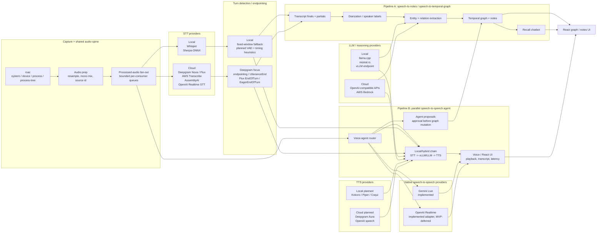
```mermaid
flowchart LR
    subgraph CAPTURE["Capture + shared audio spine"]
        RSAC["rsac<br/>system / device / process / process-tree"]
        PREP["Audio prep<br/>resample, mono mix, source id"]
        FANOUT["Processed-audio fan-out<br/>bounded per-consumer queues"]
        RSAC --> PREP --> FANOUT
    end

    subgraph STT["STT providers"]
        STT_LOCAL["Local<br/>Whisper<br/>Sherpa-ONNX"]
        STT_CLOUD["Cloud<br/>Deepgram Nova / Flux<br/>AWS Transcribe<br/>AssemblyAI<br/>OpenAI Realtime STT"]
    end

    subgraph TURN["Turn detection / endpointing"]
        LOCAL_TURN["Local<br/>fixed-window fallback<br/>planned VAD + timing heuristics"]
        DG_TURN["Deepgram focus<br/>endpointing / UtteranceEnd<br/>Flux EndOfTurn / EagerEndOfTurn"]
    end

    subgraph LLM["LLM / reasoning providers"]
        LLM_LOCAL["Local<br/>llama.cpp<br/>mistral.rs<br/>vLLM endpoint"]
        LLM_CLOUD["Cloud<br/>OpenAI-compatible APIs<br/>AWS Bedrock"]
    end

    subgraph TTS["TTS providers"]
        TTS_LOCAL["Local planned<br/>Kokoro / Piper / Coqui"]
        TTS_CLOUD["Cloud planned<br/>Deepgram Aura<br/>OpenAI speech"]
    end

    subgraph S2S_NATIVE["Native speech-to-speech providers"]
        GEMINI["Gemini Live<br/>implemented"]
        OAI_RT["OpenAI Realtime<br/>implemented adapter, MVP-deferred"]
    end

    subgraph GRAPH_PIPE["Pipeline A: speech-to-notes / speech-to-temporal-graph"]
        TRANSCRIPT["Transcript finals + partials"]
        DIAR["Diarization / speaker labels"]
        EXTRACT["Entity + relation extraction"]
        GRAPH["Temporal graph + notes"]
        CHAT["Recall chatbot"]
        TRANSCRIPT --> DIAR --> EXTRACT --> GRAPH --> CHAT
    end

    subgraph VOICE_PIPE["Pipeline B: parallel speech-to-speech agent"]
        S2S_ROUTER["Voice-agent router"]
        HYBRID["Local/hybrid chain<br/>STT -> vLLM/LLM -> TTS"]
        VOICE_UI["Voice / React UI<br/>playback, transcript, latency"]
        PROPOSALS["Agent proposals<br/>approval before graph mutation"]
        S2S_ROUTER --> HYBRID --> VOICE_UI
        S2S_ROUTER --> GEMINI --> VOICE_UI
        S2S_ROUTER --> OAI_RT --> VOICE_UI
        S2S_ROUTER --> PROPOSALS --> GRAPH
    end

    FANOUT --> STT_LOCAL
    FANOUT --> STT_CLOUD
    STT_LOCAL --> LOCAL_TURN --> TRANSCRIPT
    STT_CLOUD --> DG_TURN --> TRANSCRIPT
    FANOUT --> S2S_ROUTER
    LOCAL_TURN --> HYBRID
    DG_TURN --> HYBRID
    LLM_LOCAL --> EXTRACT
    LLM_CLOUD --> EXTRACT
    LLM_LOCAL --> HYBRID
    LLM_CLOUD --> HYBRID
    TTS_LOCAL --> HYBRID
    TTS_CLOUD --> HYBRID
    GRAPH --> UI["React graph / notes UI"]
    CHAT --> UI
    VOICE_UI --> UI
```

The MVP path is **Deepgram ASR plus one registry-enabled LLM**. Local
Whisper/Sherpa and the other implemented ASR paths remain useful engineering
adapters, but they are deferred for new MVP sessions rather than an advertised
offline fallback. Deepgram provides server-side endpointing/turn events; the
normalized turn contract is shared by notes/graph scheduling and future voice
agent work.

| Turn signal | Best fit | How AudioGraph should use it |
|---|---|---|
| Deepgram Nova endpointing / `speech_final` | Graph/notes transcript finalization | Commit stable transcript spans without waiting for a local silence timer. |
| Deepgram Nova `UtteranceEnd` | Notes and slower agent modes | Detect a gap after finalized words; useful for note-taking, but less precise for fast voice-agent turn-taking. |
| Deepgram Flux `EndOfTurn` | Voice-agent turn close | Treat as the reliable signal to finalize LLM/TTS work. |
| Deepgram Flux `EagerEndOfTurn` + `TurnResumed` | Optimized S2S latency | Speculatively start vLLM/TTS on eager turns, then cancel if `TurnResumed` arrives. Start with `EndOfTurn` only, then enable eager mode after telemetry proves the false-start rate is acceptable. |
| Local fixed-window fallback, future VAD + timing heuristics | Offline fallback | Preserve local operation and compare against Deepgram turn quality; tune conservatively to avoid cutting users off. |

### Core Capabilities

| Capability | Description |
|---|---|
| **Multi-source audio capture** | Capture system audio, per-application audio, or process-tree audio via rsac |
| **Turn Detection** | Deepgram endpointing/turn signals and local fixed-window fallback emit normalized turn lifecycle events |
| **Configurable ASR** | Multiple implemented adapters; Deepgram alone is enabled for new MVP content-bearing sessions |
| **Configurable LLM** | Registry-enabled local and cloud LLM adapters; the backend validates the selected descriptor at every content-bearing start |
| **Speaker Diarization** | Local backends (`Simple` audio-feature MVP, `Sortformer` ≤4-speaker neural, or unbounded sherpa-onnx **live clustering** on a dedicated thread, ADR-0017) plus cloud provider labels (Deepgram/AssemblyAI/AWS). All paths normalize into a provider-neutral [`SpeakerTimeline`](#speaker-timeline-and-diarization-normalization) revision ledger. |
| **Gemini Live** | Streaming transcription + model responses via Google Gemini (API Key or Vertex AI) |
| **OpenAI Realtime (deferred)** | Implemented realtime transcription and `gpt-realtime-2` voice-agent adapters; not enabled for new MVP starts |
| **Agent Proposals** | Transcript-bound advisory notes/questions/graph suggestions that stay pending until user approval |
| **Temporal Knowledge Graph** | petgraph-based in-memory graph with temporal edges, entity resolution, and live mutation |
| **Live Visualization** | react-force-graph-2d rendering with streaming Tauri event updates |
| **Persistence** | JSON/JSONL session files are the canonical MVP authority; current buffered writers are not yet crash-durable at the accepted-event boundary |

### Design Principles

1. **Provider-capability contracts** -- Adapters share typed stage contracts, while generated registry metadata controls what is actually selectable and startable.
2. **Local-first durable memory** -- Canonical user memory remains local and inspectable. The narrowed MVP intentionally uses Deepgram ASR; a fully offline ASR route is deferred until it passes the same promotion gates.
3. **Credential isolation** -- The OS keychain is the default secret backend. `credentials.yaml` is reserved for migration or an explicitly selected file/fallback mode; secrets never belong in `settings.json`.
4. **Bounded fan-out** -- Capture, speech, Gemini, and extraction paths communicate through bounded channels and small worker pools so slow providers cannot silently consume unbounded memory.
5. **Fail closed at content start** -- Missing readiness or a deferred provider returns a structured content-free error. Stop, cancel, cleanup, settings inspection, and allowed diagnostics remain available.
6. **Backend ownership** -- Rust owns capture, source timing, credentials, long-lived provider transports, transcript/projection state, and persistence. React configures, controls, and displays those backend truths.

### Cross-Platform Support

| Platform | Audio Backend | Status |
|---|---|---|
| **Linux** | PipeWire via rsac | Adapter configured; locked build and live capture/stop gate still required |
| **macOS** | CoreAudio Process Tap via rsac | Adapter configured for macOS 14.4+; TCC/no-signal and live gate still required |
| **Windows** | WASAPI Process Loopback via rsac | Local compile/tests pass; PID/process-tree live gate still required |

---

## 2. System Architecture

### System Overview

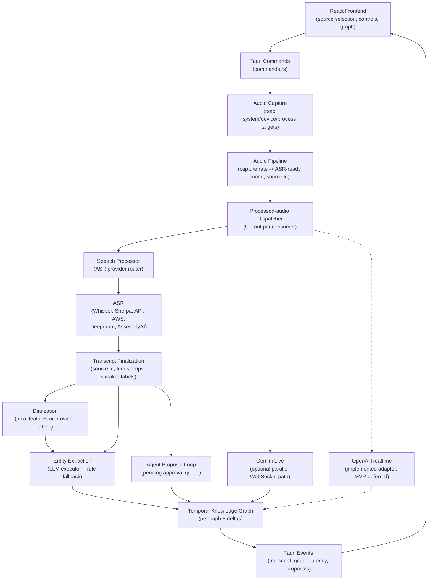
```mermaid
flowchart TD
    UI["React Frontend<br/>(source selection, controls, graph)"] --> CMD["Tauri Commands<br/>(commands.rs)"]
    CMD --> CAP["Audio Capture<br/>(rsac system/device/process targets)"]
    CAP --> PIPE["Audio Pipeline<br/>(capture rate -> ASR-ready mono, source id)"]
    PIPE --> BUS["Processed-audio Dispatcher<br/>(fan-out per consumer)"]

    BUS --> SPEECH["Speech Processor<br/>(ASR provider router)"]
    BUS --> GEMINI["Gemini Live<br/>(optional parallel WebSocket path)"]
    BUS -.-> OAI_RT["OpenAI Realtime<br/>(implemented adapter, MVP-deferred)"]

    SPEECH --> ASR["ASR<br/>(Whisper, Sherpa, API, AWS,<br/>Deepgram, AssemblyAI)"]
    ASR --> JOIN["Transcript Finalization<br/>(source id, timestamps, speaker labels)"]
    JOIN --> DIAR["Diarization<br/>(local features or provider labels)"]
    JOIN --> EXTRACT["Entity Extraction<br/>(LLM executor + rule fallback)"]
    JOIN --> AGENT["Agent Proposal Loop<br/>(pending approval queue)"]
    DIAR --> EXTRACT
    EXTRACT --> GRAPH["Temporal Knowledge Graph<br/>(petgraph + deltas)"]
    GEMINI --> GRAPH
    OAI_RT -.-> GRAPH
    AGENT --> GRAPH

    GRAPH --> EVENTS["Tauri Events<br/>(transcript, graph, latency, proposals)"]
    EVENTS --> UI
```

### Pipeline Modes

AudioGraph contains several runtime modes, but adapter implementation and MVP
enablement are separate axes:

1. **MVP speech processor** -- The primary durable-memory path is Deepgram
   ASR -> revisioned transcript -> one enabled LLM -> revisioned notes/graph
   projections. Optional TTS is off by default.
2. **Deferred speech adapters** -- Local Whisper, Sherpa-ONNX, batch API, AWS
   Transcribe, and AssemblyAI code paths exist, but backend start gates reject
   new MVP sessions through them.
3. **Deferred native realtime modes** -- Gemini Live/converse and OpenAI
   Realtime transports exist in the backend but are not enabled for new MVP
   content-bearing starts. They remain sibling product modes, not the main
   notes shell.

Both personalities feed results into the same temporal knowledge graph and
React frontend, but they should be documented, configured, and tested as
separate user experiences.

### Repository and rsac dependency placement

`audio-graph/` is a standalone Tauri + React repository. Its manifest does not
implicitly consume a sibling checkout. Each desktop target pins rsac v0.4.1 to
the same full Git revision:

```text
7956e6ef24a44672d502e72b0500efb27530e3b9
```

Target dependencies disable rsac default features and enable only
`feat_linux`, `feat_windows`, or `feat_macos`. The committed application
`src-tauri/Cargo.lock` is the intended build/release resolution authority and
must resolve that exact revision. Contributors working on both repositories may
use an explicit untracked Cargo `[patch]`; a local sibling is never selected
implicitly. CI/release revision deduplication and three-OS live capture evidence
remain open.

---

## 3. Provider Architecture

### Provider Overview Diagram

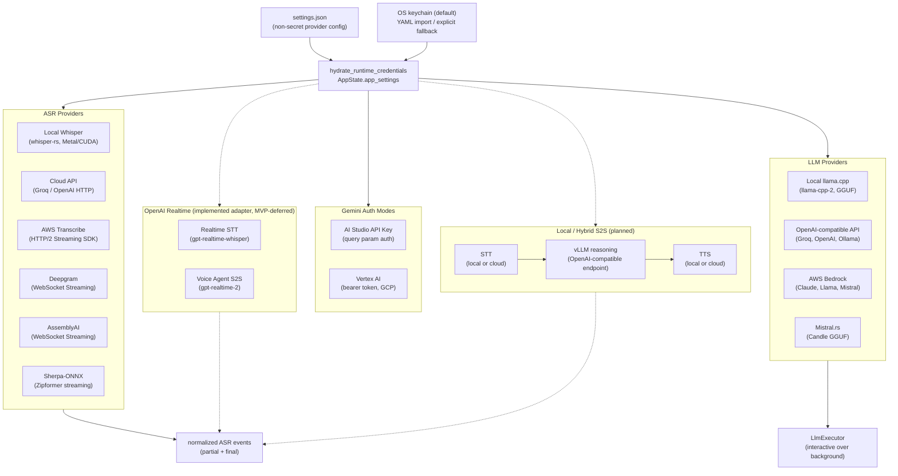
```mermaid
flowchart TD
    SETTINGS["settings.json<br/>(non-secret provider config)"]
    CREDS["OS keychain (default)<br/>YAML import / explicit fallback"]
    HYDRATE["hydrate_runtime_credentials<br/>AppState.app_settings"]

    subgraph ASR["ASR Providers"]
        A1["Local Whisper<br/>(whisper-rs, Metal/CUDA)"]
        A2["Cloud API<br/>(Groq / OpenAI HTTP)"]
        A3["AWS Transcribe<br/>(HTTP/2 Streaming SDK)"]
        A4["Deepgram<br/>(WebSocket Streaming)"]
        A5["AssemblyAI<br/>(WebSocket Streaming)"]
        A6["Sherpa-ONNX<br/>(Zipformer streaming)"]
    end

    subgraph LLM["LLM Providers"]
        L1["Local llama.cpp<br/>(llama-cpp-2, GGUF)"]
        L2["OpenAI-compatible API<br/>(Groq, OpenAI, Ollama)"]
        L3["AWS Bedrock<br/>(Claude, Llama, Mistral)"]
        L4["Mistral.rs<br/>(Candle GGUF)"]
    end

    subgraph GEMINI["Gemini Auth Modes"]
        G1["AI Studio API Key<br/>(query param auth)"]
        G2["Vertex AI<br/>(bearer token, GCP)"]
    end

    subgraph OPENAI_RT["OpenAI Realtime (implemented adapter, MVP-deferred)"]
        O1["Realtime STT<br/>(gpt-realtime-whisper)"]
        O2["Voice Agent S2S<br/>(gpt-realtime-2)"]
    end

    subgraph LOCAL_S2S["Local / Hybrid S2S (planned)"]
        S1["STT<br/>(local or cloud)"]
        S2["vLLM reasoning<br/>(OpenAI-compatible endpoint)"]
        S3["TTS<br/>(local or cloud)"]
        S1 --> S2 --> S3
    end

    SETTINGS --> HYDRATE
    CREDS --> HYDRATE
    HYDRATE --> ASR
    HYDRATE --> LLM
    HYDRATE --> GEMINI
    HYDRATE -.-> OPENAI_RT
    HYDRATE -.-> LOCAL_S2S
    LLM --> EXEC["LlmExecutor<br/>(interactive over background)"]
    ASR --> EVENTS["normalized ASR events<br/>(partial + final)"]
    OPENAI_RT -.-> EVENTS
    LOCAL_S2S -.-> EVENTS
```

### MVP provider enablement

`MVP_SELECTABLE_PROVIDERS` in the provider-registry crate is the one table that
promotes a provider into the product. Each descriptor derives
`ui_selectable` from that table. React filters and disables actionable surfaces
from generated registry data, while Rust repeats the check at the authoritative
Tauri start boundary. This prevents persisted legacy state, a direct store
call, or a DevTools/IPC invocation from opening a deferred content route.

| Stage | Enabled for a new MVP session | Deferred but inspectable/testable |
|---|---|---|
| ASR | Deepgram | Local Whisper, generic batch API, AWS Transcribe, AssemblyAI, Sherpa-ONNX, and other catalog adapters |
| LLM | local llama.cpp, generic API, Cerebras, SambaNova, OpenRouter, AWS Bedrock, mistral.rs | Any catalog entry absent from `MVP_SELECTABLE_PROVIDERS` |
| TTS | None; optional Deepgram Aura | Other TTS adapters |
| Realtime agent | None | Gemini Live/converse and OpenAI Realtime |

The provider reference below is therefore an **adapter inventory**, not a list
of routes the MVP permits. Promotion requires the provider content-egress
checklist and ADR-0032 evidence; it is a registry change, not a one-off UI or
command exception.

### Core adapter reference table

This retained table summarizes the original core adapters. It is not exhaustive;
the generated provider registry is the current inventory and capability source
for newer providers such as Cerebras and SambaNova as well as planned catalog
entries.

| Provider | Category | Type | Protocol | Streaming | Diarization | Cost | Privacy |
|---|---|---|---|---|---|---|---|
| **Local Whisper** | ASR | Local | whisper-rs (C++ FFI) | No (batch) | No (separate stage) | Free | Full (on-device) |
| **Groq / OpenAI API** | ASR | Cloud | HTTP multipart POST | No (batch) | No | Per-minute | Data sent to cloud |
| **AWS Transcribe** | ASR | Cloud | HTTP/2 (AWS SDK) | Yes (streaming) | Yes (built-in) | $0.024/min | AWS data policies |
| **Deepgram** | ASR | Cloud | WebSocket | Yes (streaming) | Yes (built-in) | $0.0077/min | Deepgram data policies |
| **AssemblyAI** | ASR | Cloud | WebSocket | Yes (streaming) | Yes (built-in) | $0.012/min | AssemblyAI data policies |
| **Sherpa-ONNX** | ASR | Local | ONNX Zipformer | Yes (streaming) | No (separate) | Free | Full (on-device) |
| **Local llama.cpp** | LLM | Local | In-process (GGUF) | No | N/A | Free | Full (on-device) |
| **OpenAI-compatible API** | LLM | Cloud | HTTP JSON | No | N/A | Per-token | Varies by provider |
| **AWS Bedrock** | LLM | Cloud | HTTP (AWS SDK) | No | N/A | Per-token | AWS data policies |
| **Mistral.rs** | LLM | Local | In-process GGUF (Candle) | N/A | N/A | Free | Full (on-device) |
| **Gemini (API Key)** | Full Pipeline | Cloud | WebSocket | Yes | N/A | Per-token | Google data policies |
| **Gemini (Vertex AI)** | Full Pipeline | Cloud | WebSocket | Yes | N/A | Per-token | GCP data policies |
| **OpenAI Realtime STT (deferred)** | ASR | Cloud | Backend WebSocket / Realtime transcription session | Yes | No provider diarization; use AudioGraph timeline | Per-token / audio | OpenAI data policies |
| **OpenAI Realtime Voice Agent (deferred)** | Full Pipeline | Cloud | Backend WebSocket | Yes | N/A | Per-token / audio | OpenAI data policies |
| **Local / Hybrid vLLM S2S (planned)** | Full Pipeline | Local+Cloud mix | STT provider + OpenAI-compatible vLLM + TTS provider | Provider-dependent | N/A | Depends on STT/TTS providers | User-selected |

### ASR Provider Decision Tree

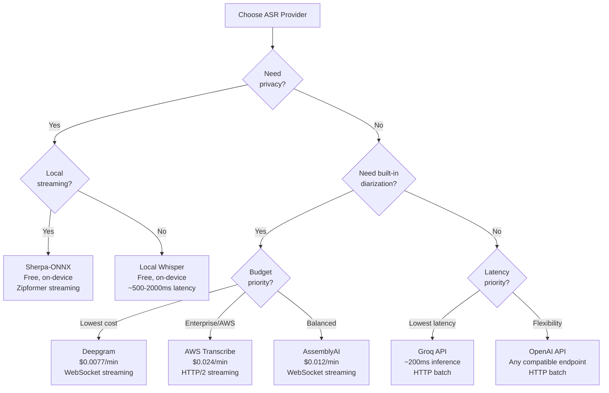
```mermaid
flowchart TD
    START["Choose ASR Provider"] --> Q1{"Need<br/>privacy?"}
    Q1 -->|"Yes"| Q5{"Local<br/>streaming?"}
    Q5 -->|"Yes"| SHERPA["Sherpa-ONNX<br/>Free, on-device<br/>Zipformer streaming"]
    Q5 -->|"No"| LOCAL["Local Whisper<br/>Free, on-device<br/>~500-2000ms latency"]
    Q1 -->|"No"| Q2{"Need built-in<br/>diarization?"}
    Q2 -->|"Yes"| Q3{"Budget<br/>priority?"}
    Q3 -->|"Lowest cost"| DG["Deepgram<br/>$0.0077/min<br/>WebSocket streaming"]
    Q3 -->|"Enterprise/AWS"| AWS["AWS Transcribe<br/>$0.024/min<br/>HTTP/2 streaming"]
    Q3 -->|"Balanced"| AAI["AssemblyAI<br/>$0.012/min<br/>WebSocket streaming"]
    Q2 -->|"No"| Q4{"Latency<br/>priority?"}
    Q4 -->|"Lowest latency"| GROQ["Groq API<br/>~200ms inference<br/>HTTP batch"]
    Q4 -->|"Flexibility"| API["OpenAI API<br/>Any compatible endpoint<br/>HTTP batch"]
```

### ASR Provider Details

#### Local Whisper (`AsrProvider::LocalWhisper`)

- **Engine:** whisper-rs (Rust bindings to whisper.cpp)
- **Model:** `ggml-small.en.bin` (~466 MB), loaded once at startup
- **GPU:** Metal (macOS auto), CUDA/Vulkan (opt-in features)
- **Latency:** 300-2000ms depending on utterance length and hardware
- **Credentials:** None required

#### Cloud API (`AsrProvider::Api`)

- **Protocol:** HTTP multipart POST to `/v1/audio/transcriptions`
- **Compatible with:** Groq, OpenAI, any Whisper-compatible endpoint
- **Settings:** `endpoint`, `api_key`, `model`
- **Latency:** ~200-3000ms plus 2s audio accumulation
- **Implementation:** `asr/cloud.rs`

#### AWS Transcribe (`AsrProvider::AwsTranscribe`)

- **Protocol:** HTTP/2 event stream via AWS SDK
- **Settings:** `region`, `language_code`, `credential_source`, `enable_diarization`
- **Built-in diarization:** Yes (speaker labels in transcript results)
- **Implementation:** `asr/aws_transcribe.rs`

#### Deepgram (`AsrProvider::DeepgramStreaming`)

- **Protocol:** WebSocket to `wss://api.deepgram.com/v1/listen` for Nova
  transcription models and `wss://api.deepgram.com/v2/listen` for Flux
  turn-taking models
- **Settings:** `api_key`, `model` (default: `nova-3`),
  `enable_diarization`, Nova endpointing / `UtteranceEnd` / VAD event
  controls, and Flux EOT threshold controls
- **Built-in diarization:** Yes
- **Turn events:** Normalizes `speech_final`, `SpeechStarted`,
  `UtteranceEnd`, Flux `EndOfTurn`, `EagerEndOfTurn`, and `TurnResumed` into
  AudioGraph `turn-event` payloads
- **Implementation:** `asr/deepgram.rs`

#### AssemblyAI (`AsrProvider::AssemblyAI`)

- **Protocol:** WebSocket to AssemblyAI real-time transcription
- **Settings:** `api_key`, `enable_diarization`
- **Built-in diarization:** Yes
- **Implementation:** `asr/assemblyai.rs`

#### Sherpa-ONNX (`AsrProvider::SherpaOnnx`)

- **Engine:** sherpa-onnx Rust bindings (Zipformer transducer)
- **Model:** `streaming-zipformer-en-20M` by default (path resolved under the user's models directory)
- **Streaming:** Yes (online ONNX inference with optional endpoint detection)
- **Settings:** `model_dir`, `enable_endpoint_detection`
- **Credentials:** None required
- **Compilation:** Gated behind the `sherpa-streaming` Cargo feature to avoid ONNX Runtime linker conflicts with `parakeet-rs` diarization
- **Implementation:** `asr/sherpa_streaming.rs`

### LLM Provider Details

#### Local llama.cpp (`LlmProvider::LocalLlama`)

- **Engine:** llama-cpp-2 (Rust bindings to llama.cpp)
- **Model:** Any GGUF file (default: `lfm2-350m-extract-q4_k_m.gguf`)
- **Entity extraction:** GBNF grammar-constrained JSON output
- **Chat:** Free-form generation with graph context
- **GPU:** Metal (macOS auto), CUDA/Vulkan (opt-in)

#### OpenAI-compatible API (`LlmProvider::Api`)

- **Protocol:** HTTP JSON POST to `/v1/chat/completions`
- **Compatible with:** OpenAI, Groq, Ollama, LM Studio, vLLM, Together AI, OpenRouter
- **Settings:** `endpoint`, `api_key`, `model`
- **Default:** `http://localhost:11434/v1` (Ollama) with model `llama3.2`

#### AWS Bedrock (`LlmProvider::AwsBedrock`)

- **Protocol:** HTTP via AWS SDK
- **Settings:** `region`, `model_id`, `credential_source`
- **Available models:** Claude, Llama, Mistral via Bedrock
- **Shares credentials** with AWS Transcribe

### Gemini Live Details (Implemented Adapter, MVP-Deferred)

The client and auth modes below are implemented, but
`realtime_agent.gemini_live` is not enabled for a new MVP content-bearing
start. The details are retained for adapter maintenance and later promotion.

#### API Key Mode (`GeminiAuthMode::ApiKey`)

- **Auth:** API key in WebSocket URL query parameter
- **Endpoint:** `wss://generativelanguage.googleapis.com/...?key=API_KEY`
- **Use case:** Developer/consumer, quick setup

#### Vertex AI Mode (`GeminiAuthMode::VertexAI`)

- **Auth:** Bearer token in WebSocket headers (via `gcp_auth`)
- **Settings:** `project_id`, `location`, optional `service_account_path`
- **Endpoint:** `wss://{location}-aiplatform.googleapis.com/...`
- **Use case:** Enterprise GCP deployments
- **Token refresh:** Automatic via `gcp_auth` crate (ADC or service account)

### OpenAI Realtime Details (Implemented Adapter, MVP-Deferred)

The Rust backend contains separate OpenAI Realtime transcription and native
voice-agent WebSocket paths. Provider descriptors advertise 24 kHz PCM16 input,
streaming partial/final event semantics, fixed model catalogs, and the shared
`openai_api_key` credential slot. The backend owns the long-lived socket,
resampling/wire conversion, correlation, cancellation, and processed-audio
consumer; React only configures and controls it.

This implementation status does **not** promote either route into the MVP.
`asr.openai_realtime` and `realtime_agent.openai_realtime` are absent from
`MVP_SELECTABLE_PROVIDERS`, so new content-bearing starts fail closed before
transport setup. Saved settings and permitted diagnostics remain inspectable,
and stop/cleanup remain available for a legacy active session. Promotion still
requires the provider content-egress checklist and the appropriate ADR-0032
validation evidence.

### Local / Hybrid Speech-to-Speech Details (Planned)

The local/hybrid S2S route should compose independently selected STT,
reasoning, and TTS providers rather than requiring a monolithic local model:

- **STT:** local Whisper/Sherpa or a cloud streaming STT provider such as
  Deepgram, AWS Transcribe, AssemblyAI, or OpenAI Realtime transcription.
- **Reasoning:** vLLM through the existing OpenAI-compatible HTTP provider
  (`LlmProvider::Api`). This is the only reasoning path that exists for vLLM —
  AudioGraph talks to a vLLM server over HTTP and never bundles it.
  > **Not implemented / research-only:** an in-process Python sidecar driving
  > vLLM `StreamingInput` was investigated but **never built**. The research
  > (`docs/research/vllm-rust-frontend.md`) concluded vLLM is a *server-side*
  > optimization only (`VLLM_USE_RUST_FRONTEND=1` on the server); there is no
  > sidecar process in `src-tauri`. Do not treat the sidecar as architecture.
- **TTS:** a local TTS provider such as Kokoro/Piper/Coqui or a cloud streaming
  TTS provider such as Deepgram Aura or OpenAI speech.
- **Turn protocol:** use bounded turn state with explicit start, end, cancel,
  cancel acknowledgement, and future barge-in. This mirrors the HF
  `streaming-speech-to-speech` project without porting its Python runtime.
- **Flush policy:** stream LLM tokens to TTS aggressively, starting with a
  conservative punctuation-or-word-count accumulator and tuning after latency
  measurements.
- **Graph safety:** local/hybrid agent actions must enter the existing
  pending-proposal queue before mutating the graph.

#### Mistral.rs (`LlmProvider::MistralRs`)

- **Engine:** mistral.rs (Candle-based GGUF inference, Rust-native)
- **Settings:** `model_id` (default: `lfm2-350m-extract-q4_k_m.gguf`)
- **Structured output:** Uses `schemars`-derived JSON Schemas for grammar-constrained extraction
- **GPU:** CPU by default; opt-in Metal support requires full Xcode (not just CLT) for the Metal shader compiler. Set `MISTRALRS_METAL_PRECOMPILE=0` to skip shader precompilation
- **Implementation:** `llm/mistralrs_engine.rs`

### LLM Route Table (one authorized route per job)

LLM work is dispatched through a priority queue (`llm/executor.rs`) that lets interactive chat preempt background entity extraction. **There is no cross-provider fallback chain.** Per [ADR-0038](adr/0038-route-llm-operations-through-a-single-skin-named-route-table.md), each job resolves the configured provider to exactly ONE named route in `llm/route.rs`, runs the [ADR-0033](adr/0033-enforce-mvp-provider-enablement-at-content-start.md) start gate against that route's registry descriptor, and dispatches only that route's backend:

```
route.local_llama              (llm.local_llama)  --> native llama.cpp
route.mistralrs                (llm.mistralrs)    --> Candle GGUF inference
route.cerebras_direct          (llm.cerebras)     --> OpenAI-compatible client, strict json_schema
route.sambanova_direct         (llm.sambanova)    --> OpenAI-compatible client
route.openai_compatible        (llm.api)          --> OpenAI-compatible client
route.openrouter               (llm.openrouter)   --> OpenRouter client
route.cerebras_via_openrouter  (llm.openrouter)   --> OpenRouter client, singleton Cerebras pin
route.aws_bedrock              (llm.aws_bedrock)  --> no blocking route (streaming chat only)
```

A dispatch carries an `AuthorizedRoute` token whose only constructor runs the start gate, so an ungated dispatch does not compile. A route attempt that fails surfaces its own error; it never hops to another provider, and a repair prompt re-runs on the same route. Same-provider **mode** downgrades (json_schema → json_object, vLLM structured outputs → json_object) are retained and recorded in the patch's route record — a mode substitution, never a provider substitution.

For entity extraction only, the rule-based extractor (`graph/extraction.rs`) remains the final fallback using regex-based NER patterns. That is a local, non-egress substitution, not a provider hop. The vocabulary (entity/relation types and the shared extraction prompt) is defined in `ontology.rs`.

---

## 4. Threading Model

### Thread Architecture Diagram

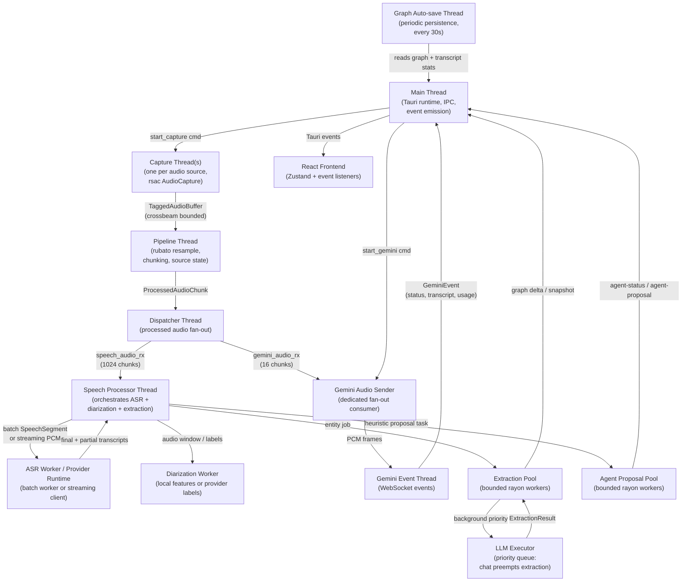
```mermaid
flowchart TD
    MAIN["Main Thread<br/>(Tauri runtime, IPC,<br/>event emission)"]
    CAP["Capture Thread(s)<br/>(one per audio source,<br/>rsac AudioCapture)"]
    PIPE["Pipeline Thread<br/>(rubato resample,<br/>chunking, source state)"]
    DISP["Dispatcher Thread<br/>(processed audio fan-out)"]
    SPEECH["Speech Processor Thread<br/>(orchestrates ASR +<br/>diarization + extraction)"]
    ASR["ASR Worker / Provider Runtime<br/>(batch worker or streaming client)"]
    DIAR["Diarization Worker<br/>(local features or provider labels)"]
    GEMINI_SEND["Gemini Audio Sender<br/>(dedicated fan-out consumer)"]
    GEMINI_EVT["Gemini Event Thread<br/>(WebSocket events)"]
    AUTOSAVE["Graph Auto-save Thread<br/>(periodic persistence,<br/>every 30s)"]
    EXEC["LLM Executor<br/>(priority queue:<br/>chat preempts extraction)"]
    EXPOOL["Extraction Pool<br/>(bounded rayon workers)"]
    AGENT["Agent Proposal Pool<br/>(bounded rayon workers)"]
    UI["React Frontend<br/>(Zustand + event listeners)"]

    MAIN -->|"start_capture cmd"| CAP
    CAP -->|"TaggedAudioBuffer<br/>(crossbeam bounded)"| PIPE
    PIPE -->|"ProcessedAudioChunk"| DISP
    DISP -->|"speech_audio_rx<br/>(1024 chunks)"| SPEECH
    DISP -->|"gemini_audio_rx<br/>(16 chunks)"| GEMINI_SEND
    SPEECH -->|"batch SpeechSegment<br/>or streaming PCM"| ASR
    ASR -->|"final + partial transcripts"| SPEECH
    SPEECH -->|"audio window / labels"| DIAR
    SPEECH -->|"entity job"| EXPOOL
    EXPOOL -->|"background priority"| EXEC
    EXEC -->|"ExtractionResult"| EXPOOL
    EXPOOL -->|"graph delta / snapshot"| MAIN
    SPEECH -->|"heuristic proposal task"| AGENT
    AGENT -->|"agent-status / agent-proposal"| MAIN
    MAIN -->|"start_gemini cmd"| GEMINI_SEND
    GEMINI_SEND -->|"PCM frames"| GEMINI_EVT
    GEMINI_EVT -->|"GeminiEvent<br/>(status, transcript, usage)"| MAIN
    MAIN -->|"Tauri events"| UI
    AUTOSAVE -->|"reads graph + transcript stats"| MAIN
```

### Thread Inventory

| Thread | Responsibility | Input | Output |
|---|---|---|---|
| **main (Tauri)** | Runtime, commands, event emission | IPC commands | Tauri events to frontend |
| **capture-{id}** | Owns one rsac AudioCapture | Ring buffer reads | TaggedAudioBuffer via crossbeam |
| **audio-pipeline** | Mix down/resample capture audio to 16 kHz mono, preserve per-source state, emit fixed chunks | TaggedAudioBuffer | ProcessedAudioChunk via crossbeam |
| **processed-dispatcher** | Fans processed chunks to every active consumer | ProcessedAudioChunk | Speech and Gemini per-consumer channels |
| **speech-processor** | Orchestrates ASR + diarization + extraction | ProcessedAudioChunk | TranscriptSegment, GraphSnapshot events |
| **asr-worker / provider runtime** | Whisper, cloud batch, or streaming provider I/O | SpeechSegment or PCM chunks | Final and partial transcripts |
| **gemini-audio / gemini-events** | Streams PCM to Gemini and receives WebSocket events | ProcessedAudioChunk / WebSocket messages | GeminiEvent via crossbeam |
| **graph-autosave** | Periodic persistence (every 30s, also refreshes session-index segment/speaker/entity counts) | Arc<Mutex<TemporalKnowledgeGraph>> | JSON files to disk |
| **llm-executor** | Priority queue separating background extraction work from interactive chat (`llm/executor.rs`) | Queued LLM work items | Extraction / chat results via channels |
| **extraction-pool** | Bounded rayon pool for background graph extraction tasks | TranscriptSegment context | Graph deltas/snapshots |
| **agent-proposal-worker** | Bounded rayon-pool task for advisory notes / questions / graph suggestions | TranscriptSegment | `agent-proposal` Tauri event |

### Channel Communication

The core capture, processed-audio, speech, and provider-input spine uses bounded
`crossbeam-channel` queues for backpressure. This is not universal: the TTS
command/event and playback command queues remain unbounded and must be treated
as separate output-spine risks. The speech processor thread acts as the central
orchestrator, dispatching work to ASR and diarization sub-workers, routing LLM
work through the priority executor, and spawning agent-proposal tasks on the
rayon pool when extraction completes.

The implemented `ProcessedAudioChunk` boundary is 16 kHz mono `f32`, normally
512 frames, with source identity and current per-source timing state. ADR-0020
extends that boundary beyond the now-carried rsac source-position timestamps
with source-clock generations, explicit source-to-session mappings, and
content-free discontinuities for every loss/reset/rate-change layer. Those
remaining provenance fields are an accepted target, not fully implemented
behavior; current processing must not be described as preserving all capture
loss or source-clock truth.

> **Implementation note:** for the `Simple` and `Sortformer` backends,
> diarization does **not** run on a dedicated thread in the live path.
> `DiarizationWorker::run()` exists but the pipeline calls `process_input(...)`
> inline on the ASR worker/event-receiver thread, immediately after ASR and
> before extraction is spawned, so ASR -> diarization -> emit is sequential. The
> exception is the unbounded **live clustering** backend
> (`DiarizationBackend::Clustering`, ADR-0017 / B16, feature
> `diarization-clustering`), whose `diarization-clustering` worker thread
> (`diarization/worker.rs`) re-diarizes a rolling window off a lock-free SPSC tap
> and runs parallel to ASR. Extraction (4-thread rayon pool) and agent proposals
> (2-thread rayon pool) are the other parallel work. The `llm-executor` runs
> **one job at a time**, but the streaming-chat path (`Api`/`OpenRouter`)
> bypasses the executor and runs on its own tokio task, so it is concurrent with
> background extraction. The processed-audio fan-out is owned by a
> **`ProcessedAudioConsumerRegistry`** (`audio/consumer.rs`); see
> [`DATA_FLOW.md`](DATA_FLOW.md) §6 for the verified thread/channel map.

### Speaker Timeline and Diarization Normalization

Speaker attribution comes from several engines that do **not** agree on speaker
identity, so AudioGraph routes all of them through one provider-neutral seam — the
`SpeakerTimeline` revision ledger (`src-tauri/src/projections.rs`, contract landed
under Seed `audio-graph-eb6c`). Readers should distinguish four distinct concepts:

- **Local diarization.** Three backends in `src-tauri/src/diarization/`, selected by
  `make_diarization_config` (`src-tauri/src/speech/mod.rs`):
  - `Simple` — pure-Rust RMS/ZCR/MAD fingerprint, nearest-neighbour, soft cap
    `max_speakers = 10` (`diarization/mod.rs`). Always available.
  - `Sortformer` — NVIDIA Sortformer ONNX via `parakeet-rs`, **hard-capped at 4
    speakers** (`SORTFORMER_MAX_SPEAKERS`), feature `diarization`.
  - `Clustering` — **unbounded** sherpa-onnx pyannote-segmentation + TitaNet
    embedding + FastClustering (`num_clusters = -1`), feature
    `diarization-clustering` (ADR-0017). Its live engine is the
    `LiveDiarizationWorker` on the dedicated `diarization-clustering` thread
    (`diarization/worker.rs`); it re-diarizes a rolling 10 s window every 3 s hop,
    emits only the freshly-covered trailing hop, and stabilizes the
    permutation-arbitrary per-window cluster ids into stable global speaker ids via
    an L2-normalized embedding-centroid registry with a cosine "cannot-link"
    greedy assignment (`diarization/stabilize.rs`). The `Simple` and `Sortformer`
    backends instead run **inline** (`process_input`) on the ASR worker thread.
- **Provider diarization.** Deepgram / AWS Transcribe / AssemblyAI return their own
  speaker labels on transcript segments. `speech/mod.rs` normalizes each final
  segment into a `DiarizationSpanRevision` via
  `diarization_span_revision_for_transcript` (`provider`, `provider_speaker_id`,
  `source_id`, optional `channel`, basis ASR/transcript ids). The raw provider
  speaker id is retained as provenance only — it is **never** the durable identity.
- **Metadata join (the default).** The durable identity is the provider-neutral
  `span_id`; the `SpeakerTimeline` ledger keys spans by it. Later revisions
  *replace* earlier ones (a `Provisional` rolling-window label is superseded by a
  `Stable`/`Final` remap of the same `span_id`), stale revisions are rejected, and a
  same-revision payload that disagrees is a conflict — mirroring `TranscriptLedger`.
  A projection (notes/graph) that cites speaker spans is gated by
  `validate_diarization_basis`; one that does not cite any is unaffected. The live
  clustering worker maps its spans onto transcript times by **time overlap**
  (`overlap_speaker_for_segment`), not by an audio split.
- **Physical multi-channel projection (research-gated, experimental).** AudioGraph
  does **not** synthesize one audio channel per diarized speaker. The processed
  pipeline is mono (ADR-0020); diarization is a metadata join over that mono stream,
  with `source_id: None` / `channel: None` for the session-level local timeline. The
  `DiarizationSpanRevision.channel` field exists so channel-aware providers can be
  normalized later, but `supports_multichannel` stays `false` until a capture source
  *and* a provider adapter both prove real, ordered, stable source channels and the
  session artifact stores the channel map. Speaker-separated PCM lanes are reserved
  for an explicit future source-separation mode. See
  [`docs/research/speaker-channel-routing-2026-06-26.md`](research/speaker-channel-routing-2026-06-26.md)
  for the decision and the provider channel-vs-diarization evidence.

---

## 5. Data Flow

### Full Pipeline Sequence

This sequence combines the implemented two-phase capture start with the
separately started transcription path. It is not the coordinated atomic Start
contract from ADR-0028; provider startup quorum, reverse-order rollback, and
whole-session stop/finalization remain open work.

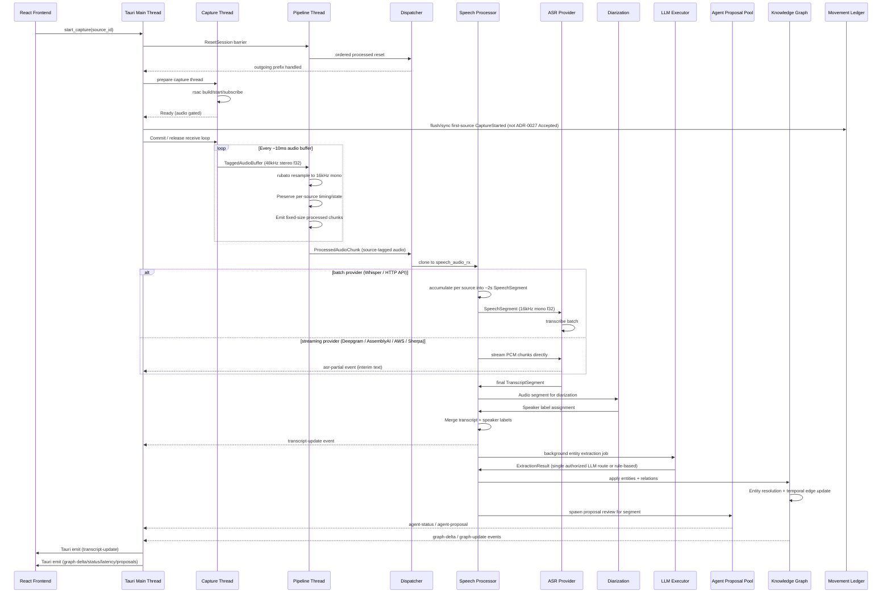
```mermaid
sequenceDiagram
    participant UI as React Frontend
    participant Main as Tauri Main Thread
    participant Cap as Capture Thread
    participant Pipe as Pipeline Thread
    participant Disp as Dispatcher
    participant Speech as Speech Processor
    participant ASR as ASR Provider
    participant Diar as Diarization
    participant Exec as LLM Executor
    participant Agent as Agent Proposal Pool
    participant Graph as Knowledge Graph
    participant Audit as Movement Ledger

    UI->>Main: start_capture(source_id)
    Main->>Pipe: ResetSession barrier
    Pipe->>Disp: ordered processed reset
    Disp-->>Main: outgoing prefix handled
    Main->>Cap: prepare capture thread
    Cap->>Cap: rsac build/start/subscribe
    Cap-->>Main: Ready (audio gated)
    Main->>Audit: flush/sync first-source CaptureStarted (not ADR-0027 Accepted)
    Main->>Cap: Commit / release receive loop

    loop Every ~10ms audio buffer
        Cap->>Pipe: TaggedAudioBuffer (48kHz stereo f32)
        Pipe->>Pipe: rubato resample to 16kHz mono
        Pipe->>Pipe: Preserve per-source timing/state
        Pipe->>Pipe: Emit fixed-size processed chunks
    end

    Pipe->>Disp: ProcessedAudioChunk (source-tagged audio)
    Disp->>Speech: clone to speech_audio_rx

    alt batch provider (Whisper / HTTP API)
        Speech->>Speech: accumulate per source into ~2s SpeechSegment
        Speech->>ASR: SpeechSegment (16kHz mono f32)
        ASR->>ASR: transcribe batch
    else streaming provider (Deepgram / AssemblyAI / AWS / Sherpa)
        Speech->>ASR: stream PCM chunks directly
        ASR-->>Main: asr-partial event (interim text)
    end

    ASR->>Speech: final TranscriptSegment

    Speech->>Diar: Audio segment for diarization
    Diar->>Speech: Speaker label assignment

    Speech->>Speech: Merge transcript + speaker labels
    Speech-->>Main: transcript-update event
    Speech->>Exec: background entity extraction job
    Exec->>Speech: ExtractionResult (single authorized LLM route or rule-based)
    Speech->>Graph: apply entities + relations
    Graph->>Graph: Entity resolution + temporal edge update
    Speech->>Agent: spawn proposal review for segment
    Agent-->>Main: agent-status / agent-proposal
    Graph-->>Main: graph-delta / graph-update events

    Main->>UI: Tauri emit (transcript-update)
    Main->>UI: Tauri emit (graph delta/status/latency/proposals)
```

### Gemini Live Pipeline

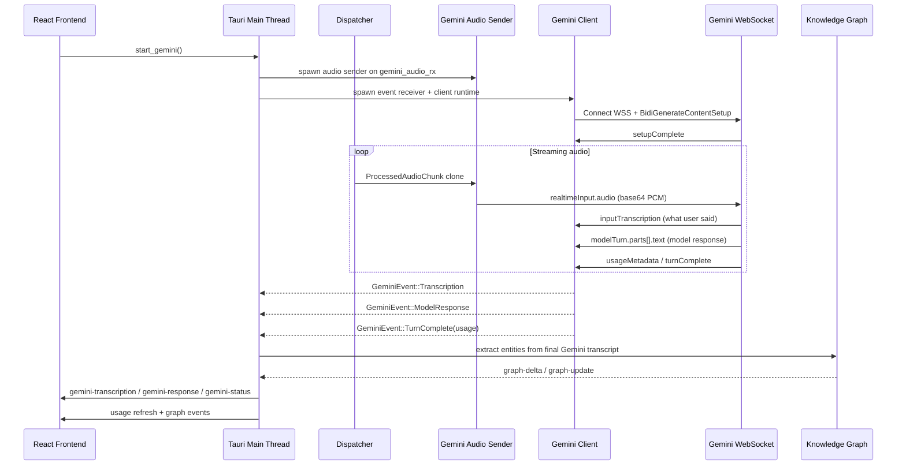
```mermaid
sequenceDiagram
    participant UI as React Frontend
    participant Main as Tauri Main Thread
    participant Disp as Dispatcher
    participant Audio as Gemini Audio Sender
    participant Gemini as Gemini Client
    participant WS as Gemini WebSocket
    participant Graph as Knowledge Graph

    UI->>Main: start_gemini()
    Main->>Audio: spawn audio sender on gemini_audio_rx
    Main->>Gemini: spawn event receiver + client runtime
    Gemini->>WS: Connect WSS + BidiGenerateContentSetup
    WS->>Gemini: setupComplete

    loop Streaming audio
        Disp->>Audio: ProcessedAudioChunk clone
        Audio->>WS: realtimeInput.audio (base64 PCM)
        WS->>Gemini: inputTranscription (what user said)
        WS->>Gemini: modelTurn.parts[].text (model response)
        WS->>Gemini: usageMetadata / turnComplete
    end

    Gemini-->>Main: GeminiEvent::Transcription
    Gemini-->>Main: GeminiEvent::ModelResponse
    Gemini-->>Main: GeminiEvent::TurnComplete(usage)
    Main->>Graph: extract entities from final Gemini transcript
    Graph-->>Main: graph-delta / graph-update
    Main->>UI: gemini-transcription / gemini-response / gemini-status
    Main->>UI: usage refresh + graph events
```

### Tauri Events

Event name constants and payload types are defined in `src-tauri/src/events.rs`.

| Event | Payload | Trigger |
|---|---|---|
| `transcript-update` | `TranscriptSegment` | New transcript segment available |
| `asr-partial` | `AsrPartialPayload` | Streaming ASR provider produced an interim hypothesis |
| `graph-update` | `GraphSnapshot` | Knowledge graph changed (full snapshot, throttled to every ~10th update or 30 s) |
| `graph-delta` | Delta payload | Incremental graph change (every extraction cycle) |
| `pipeline-status` | `PipelineStatus` | Pipeline stage status change (~2 s throttle) |
| `pipeline-latency` | `PipelineLatencyPayload` | Per-stage wall-clock duration sample |
| `agent-status` | `AgentStatusPayload` | Agent/react loop state change (idle / running / error) |
| `agent-proposal` | `AgentProposalPayload` | Advisory note, question, or graph suggestion awaiting user approval |
| `speaker-detected` | Speaker info | New speaker identified |
| `capture-error` | `CaptureErrorPayload` | Capture or processing error (with `recoverable` flag) |
| `capture-storage-full` | `CaptureStorageFullPayload` | Persistence write failed because storage is full (ENOSPC / `ERROR_DISK_FULL`) |
| `capture-backpressure` | `CaptureBackpressurePayload` | rsac ring buffer started/stopped dropping (edge-triggered) |
| `gemini-transcription` | Transcription text | Gemini Live input transcription |
| `gemini-response` | Model text | Gemini Live model response |
| `gemini-status` | Connection status | Gemini Live connection state change |
| `model-download-progress` | Progress payload | Model download progress (~1 Hz, plus completion / error) |
| `aws-error` | `AwsErrorPayload` | Structured AWS credential / region error (ag#13) |

### Chat and Agent Proposal Flow

In addition to the audio pipeline, two interactive flows feed the same UI:

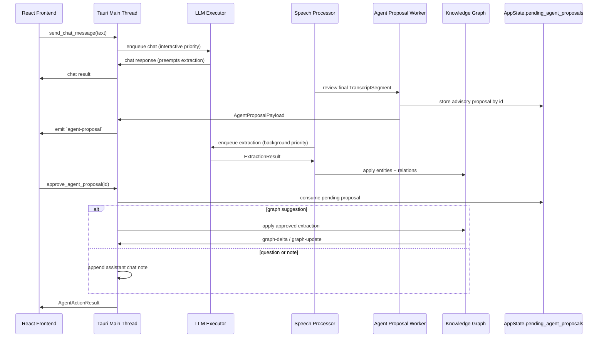
```mermaid
sequenceDiagram
    participant UI as React Frontend
    participant Main as Tauri Main Thread
    participant Exec as LLM Executor
    participant Speech as Speech Processor
    participant Agent as Agent Proposal Worker
    participant Graph as Knowledge Graph
    participant State as AppState.pending_agent_proposals

    UI->>Main: send_chat_message(text)
    Main->>Exec: enqueue chat (interactive priority)
    Exec->>Main: chat response (preempts extraction)
    Main->>UI: chat result

    Speech->>Agent: review final TranscriptSegment
    Agent->>State: store advisory proposal by id
    Agent->>Main: AgentProposalPayload
    Main->>UI: emit `agent-proposal`

    Speech->>Exec: enqueue extraction (background priority)
    Exec->>Speech: ExtractionResult
    Speech->>Graph: apply entities + relations

    UI->>Main: approve_agent_proposal(id)
    Main->>State: consume pending proposal
    alt graph suggestion
        Main->>Graph: apply approved extraction
        Graph->>Main: graph-delta / graph-update
    else question or note
        Main->>Main: append assistant chat note
    end
    Main->>UI: AgentActionResult
```

`approve_agent_proposal`, `dismiss_agent_proposal`, and `clear_agent_proposals` mutate the pending-proposals queue stored in `AppState`; only approved proposals modify the knowledge graph.

### Revisioned transcript and projection flow

The durable-memory path no longer treats rendered transcript text or a graph
snapshot as the sole source of truth. Rust owns a revision ledger and two
projection schedulers:

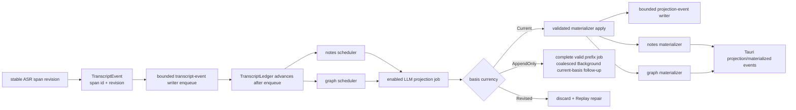
```mermaid
flowchart LR
    FINAL["stable ASR span revision"] --> TE["TranscriptEvent<br/>span id + revision"]
    TE --> TQ["bounded transcript-event writer enqueue"]
    TQ --> TL["TranscriptLedger advances after enqueue"]
    TL --> SN["notes scheduler"]
    TL --> SG["graph scheduler"]
    SN & SG --> LLM["enabled LLM projection job"]
    LLM --> BC{"basis currency"}
    BC -->|"Current"| APPLY["validated materializer apply"]
    BC -->|"AppendOnly"| FOLLOW["complete valid prefix job<br/>coalesced Background current-basis follow-up"]
    BC -->|"Revised"| REPAIR["discard + Replay repair"]
    APPLY --> PQ["bounded projection-event writer"]
    APPLY --> NM["notes materializer"]
    APPLY --> GM["graph materializer"]
    NM & GM --> EVT["Tauri projection/materialized events"]
```

Automatic bases contain final/end-of-turn stable spans. The shared classifier
hashes and compares the exact covered ordered subset before deciding whether a
completion is `Current`, valid-but-behind `AppendOnly`, or invalid `Revised`
(ADR-0031). An AppendOnly completion is recognized as a valid unchanged prefix
and schedules one coalesced Background job on the newest basis; that Current
follow-up becomes the applied view. Revised work is rejected and schedules
Replay repair when policy allows. Completion ownership is correlated by job id,
job session, scheduler session, and ledger session before generation metrics or
materialized output can advance. Per-kind job counters survive in-process
scheduler reset, so a same-session replacement cannot reuse a live worker's id;
offline reconstruction remains deterministic because no prior worker survives a
process restart.

This is implemented semantic scheduling, not a claim of durable acceptance.
The current writer `append` calls acknowledge bounded enqueue, and materialized
snapshots can be saved before canonical bytes are synchronized. Until the
ADR-0027 commit protocol lands, a live ledger/materializer update is not the
same thing as crash-durable `Accepted`. AppendOnly scheduling correctness does
not remove that open persistence boundary.

### User Data and Persistence Flow

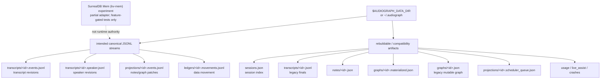
```mermaid
flowchart TD
    ROOT["$AUDIOGRAPH_DATA_DIR<br/>or ~/.audiograph"]
    ROOT --> CANON["intended canonical JSONL streams"]
    CANON --> TE["transcripts/&lt;id&gt;.events.jsonl<br/>transcript revisions"]
    CANON --> SE["transcripts/&lt;id&gt;.speaker.jsonl<br/>speaker revisions"]
    CANON --> PE["projections/&lt;id&gt;.events.jsonl<br/>notes/graph patches"]
    CANON --> ME["ledgers/&lt;id&gt;.movements.jsonl<br/>data movement"]

    ROOT --> DERIVED["rebuildable / compatibility artifacts"]
    DERIVED --> IDX["sessions.json<br/>session index"]
    DERIVED --> LEGACY_T["transcripts/&lt;id&gt;.jsonl<br/>legacy finals"]
    DERIVED --> NOTES["notes/&lt;id&gt;.json"]
    DERIVED --> MGRAPH["graphs/&lt;id&gt;.materialized.json"]
    DERIVED --> LGRAPH["graphs/&lt;id&gt;.json<br/>legacy mutable graph"]
    DERIVED --> SCHED["projections/&lt;id&gt;.scheduler_queue.json"]
    DERIVED --> AUX["usage / live_assist / crashes"]

    OPTIONAL["SurrealDB Mem (kv-mem) experiment<br/>partial adapter; feature-gated tests only"] -.->|"not runtime authority"| CANON
```

ADR-0027 makes the versioned session files the only canonical MVP store.
SurrealKV, SQLite, redb, or another embedded engine may be added later only as
a disposable, rebuildable query index after a named feature exceeds a measured
file-replay budget (ADR-0029). There is no runtime-selectable SurrealDB store.

The **current implementation is not yet the accepted durability protocol**:

- transcript and projection writers buffer JSONL and primarily synchronize at
  shutdown;
- enqueue can advance live state before the event is crash-durable;
- materialized snapshots and the legacy graph can outrun canonical streams;
- runtime data-movement evidence covers the capture Start/Stop aggregate and
  projection LLM calls rather than every ASR/TTS/realtime/provider/artifact/
  credential/promotion lifecycle transition. Positive egress rows remain
  actionable, but the backend exposes no versioned exhaustive-coverage marker,
  so every negative "stayed local" claim remains Unknown even after a valid
  closed capture; and
- recovery, schema envelopes, and one typed artifact manifest shared by export,
  deletion, purge, recovery, and backup remain incomplete. Raw destructive
  deletion now covers the 18 known current/temp paths, preserves the index on
  residual failure, and is retry-safe, but its IPC failure is not yet a typed
  residual payload.

Historical backend loading is no longer in that risk set: `load_session` is a
pure artifact read with replay validation and no live `AppState` mutation.
Focused tests cover replay fallback, sequential A/B reads, and preservation of
the active ledger and materialized projection state. The current frontend makes
this safe by serializing Review and Live; ADR-0028's concurrent workspaces and a
future Resume command remain open.

Consequently the UI must not equate writer enqueue, a saved snapshot, or an
in-memory materializer update with durable `Accepted`/Saved state. The
authoritative commit protocol remains P0 open work.

---

## 6. Credential Management

### Credential Flow Diagram

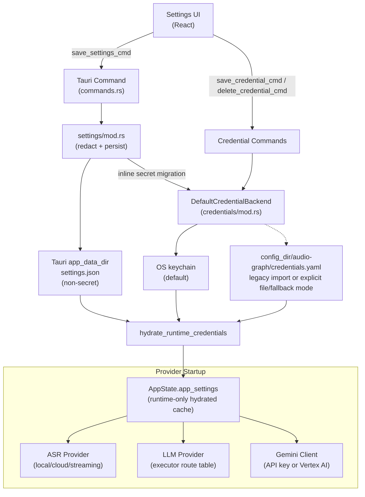
```mermaid
flowchart TD
    UI["Settings UI<br/>(React)"] -->|"save_settings_cmd"| CMD["Tauri Command<br/>(commands.rs)"]
    UI -->|"save_credential_cmd / delete_credential_cmd"| CREDCMD["Credential Commands"]

    CMD --> SETTINGS["settings/mod.rs<br/>(redact + persist)"]
    SETTINGS --> JSON["Tauri app_data_dir<br/>settings.json<br/>(non-secret)"]
    SETTINGS -->|"inline secret migration"| CRED["DefaultCredentialBackend<br/>(credentials/mod.rs)"]
    CREDCMD --> CRED
    CRED --> KEYCHAIN["OS keychain<br/>(default)"]
    CRED -.-> YAML["config_dir/audio-graph/credentials.yaml<br/>legacy import or explicit file/fallback mode"]

    JSON --> HYDRATE["hydrate_runtime_credentials"]
    KEYCHAIN --> HYDRATE
    YAML --> HYDRATE
    HYDRATE --> STATE["AppState.app_settings<br/>(runtime-only hydrated cache)"]

    subgraph PROVIDERS["Provider Startup"]
        STATE --> ASR_P["ASR Provider<br/>(local/cloud/streaming)"]
        STATE --> LLM_P["LLM Provider<br/>(executor route table)"]
        STATE --> GEM_P["Gemini Client<br/>(API key or Vertex AI)"]
    end
```

### CredentialStore Fields

`CredentialStore` is the typed in-memory secret shape. By default its values
are read from and written to the OS keychain. The same optional fields can
appear in `credentials.yaml` only for legacy import, an explicit file backend,
or an explicitly requested keychain-with-file-fallback mode:

| Field | Provider | Purpose |
|---|---|---|
| `openai_api_key` | OpenAI / Groq API (ASR + LLM) | HTTP Authorization header |
| `openrouter_api_key` | OpenRouter | HTTP Authorization header |
| `groq_api_key` | Groq API | HTTP Authorization header |
| `deepgram_api_key` | Deepgram | WebSocket Authorization header |
| `gemini_api_key` | Gemini (API Key mode) | `x-goog-api-key` header |
| `assemblyai_api_key` | AssemblyAI | WebSocket Authorization header |
| `aws_access_key` | AWS (Transcribe + Bedrock) | AWS SigV4 signing |
| `aws_secret_key` | AWS (Transcribe + Bedrock) | AWS SigV4 signing |
| `aws_session_token` | AWS (temporary credentials) | AWS SigV4 signing |
| `google_service_account_path` | Gemini (Vertex AI mode) | Path to GCP service account JSON |
| `together_api_key` | Together AI API | HTTP Authorization header |
| `fireworks_api_key` | Fireworks AI API | HTTP Authorization header |
| `aws_profile` | AWS (named profile) | AWS profile name for credential resolution |
| `aws_region` | AWS (Transcribe + Bedrock) | AWS region override |

### Credential Operations

```
save_credential_cmd(key, value)   -- Upserts through the selected credential backend
load_credential_presence_cmd()    -- Returns non-secret key presence/source state
load_credential_cmd(key)          -- Legacy explicit plaintext readback for narrow edit flows
list_aws_profiles()               -- Parses ~/.aws/config and returns profile names
```

### Security Measures

- OS keychain is the default and plaintext fallback is opt-in.
- A YAML file, when explicitly used, receives owner-only permissions and
  atomic temp-file replacement.
- API keys are never written to `settings.json` (only non-sensitive settings like region, model, endpoint URL)
- AWS credentials support three modes: DefaultChain (env/profile), Profile (named), AccessKeys (manual)

---

## 7. Settings and Configuration

### Settings Type Hierarchy

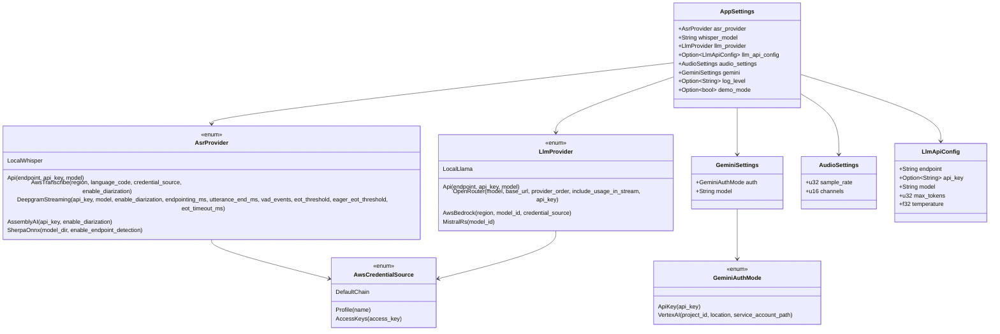
```mermaid
classDiagram
    class AppSettings {
        +AsrProvider asr_provider
        +String whisper_model
        +LlmProvider llm_provider
        +Option~LlmApiConfig~ llm_api_config
        +AudioSettings audio_settings
        +GeminiSettings gemini
        +Option~String~ log_level
        +Option~bool~ demo_mode
    }

    class AsrProvider {
        <<enum>>
        LocalWhisper
        Api(endpoint, api_key, model)
        AwsTranscribe(region, language_code, credential_source, enable_diarization)
        DeepgramStreaming(api_key, model, enable_diarization, endpointing_ms, utterance_end_ms, vad_events, eot_threshold, eager_eot_threshold, eot_timeout_ms)
        AssemblyAI(api_key, enable_diarization)
        SherpaOnnx(model_dir, enable_endpoint_detection)
    }

    class LlmProvider {
        <<enum>>
        LocalLlama
        Api(endpoint, api_key, model)
        OpenRouter(model, base_url, provider_order, include_usage_in_stream, api_key)
        AwsBedrock(region, model_id, credential_source)
        MistralRs(model_id)
    }

    class AwsCredentialSource {
        <<enum>>
        DefaultChain
        Profile(name)
        AccessKeys(access_key)
    }

    class GeminiSettings {
        +GeminiAuthMode auth
        +String model
    }

    class GeminiAuthMode {
        <<enum>>
        ApiKey(api_key)
        VertexAI(project_id, location, service_account_path)
    }

    class AudioSettings {
        +u32 sample_rate
        +u16 channels
    }

    class LlmApiConfig {
        +String endpoint
        +Option~String~ api_key
        +String model
        +u32 max_tokens
        +f32 temperature
    }

    AppSettings --> AsrProvider
    AppSettings --> LlmProvider
    AppSettings --> LlmApiConfig
    AppSettings --> AudioSettings
    AppSettings --> GeminiSettings
    GeminiSettings --> GeminiAuthMode
    AsrProvider --> AwsCredentialSource
    LlmProvider --> AwsCredentialSource
```

### Settings Storage

- **Location:** `{app_data_dir}/settings.json` (Tauri standard app data directory)
- **Format:** JSON with serde tagged enums (`"type": "local_whisper"`, etc.)
- **Load behavior:** Missing or unparseable files fall back to `AppSettings::default()`
- **Save behavior:** Atomic write via temp file + rename
- **Secrets:** Runtime-only provider secret fields are hydrated from the
  selected credential backend (OS keychain by default) and skipped during
  settings serialization.

### User Data Roots

AudioGraph now has three intentional roots:

| Data | Root | Owner |
|---|---|---|
| Settings | Tauri `app_data_dir()/settings.json` | `settings/mod.rs` |
| Models | Tauri `app_data_dir()/models/` | `models/mod.rs` |
| Credentials | OS keychain by default; `dirs::config_dir()/audio-graph/credentials.yaml` only for legacy import or explicit file/fallback mode | `credentials/mod.rs` |
| Session artifacts | `$AUDIOGRAPH_DATA_DIR` when set, otherwise `~/.audiograph/` | `user_data.rs`, `sessions/`, `persistence/` |

The session-artifact root contains `sessions.json`, `transcripts/`,
`graphs/`, `usage/`, and `crashes/`. `user_data.rs` centralizes that path so
commands no longer hand-assemble `~/.audiograph`; credentials intentionally
remain separate from both settings and session artifacts.

### Default Values

| Setting | Default |
|---|---|
| ASR provider | `LocalWhisper` |
| LLM provider | `Api { endpoint: "http://localhost:11434/v1", model: "llama3.2" }` |
| Audio sample rate | 48000 Hz, loaded from `src-tauri/config/default.toml` |
| Audio channels | 2 (stereo), loaded from `src-tauri/config/default.toml` |
| Gemini auth | `ApiKey { api_key: "" }` |
| Gemini model | `gemini-2.0-flash-live-001` |
| AWS region | `us-east-1` |
| Language code | `en-US` |
| Deepgram model | `nova-3` |
| LLM max tokens | 2048 |
| LLM temperature | 0.7 |

`AppSettings::default()` retains `LocalWhisper` for configuration/backward
compatibility, but defaults do not override provider enablement. A new
content-bearing session must resolve to Deepgram before the backend start gate
will permit ASR.

---

## 8. Module Structure

```
audio-graph/
+-- docs/
|   +-- ARCHITECTURE.md                 # This document
|   +-- adr/                            # Accepted architecture decisions
|   +-- designs/                        # Historical/current design notes
|   +-- ops/                            # Runbooks (Gemini reconnect, vLLM)
|   +-- reviews/                        # Review-loop evidence and audits
+-- scripts/
|   +-- download-models.sh              # Legacy/manual model download helper
|   +-- download-models.ps1             # Windows model download helper
+-- src-tauri/                          # Rust backend
|   +-- Cargo.toml                      # Rust dependencies and feature flags
|   +-- config/default.toml             # Bundled typed defaults
|   +-- tauri.conf.json                 # Tauri v2 configuration
|   +-- capabilities/default.json       # Tauri v2 permissions
|   +-- src/
|       +-- lib.rs                      # Tauri builder + command registration
|       +-- state.rs                    # AppState shared runtime state
|       +-- commands.rs                 # Tauri IPC boundary
|       +-- events.rs                   # Event constants + payload types
|       +-- error.rs                    # Structured AppError payloads
|       +-- ontology.rs                 # Entity/relation vocabulary + extraction prompt
|       +-- user_data.rs                # Session-artifact root resolver
|       +-- config.rs                   # Bundled TOML parser
|       +-- speak_aloud.rs              # Chat tokens -> TTS -> playback glue
|       +-- audio/                      # rsac capture + resample/chunk pipeline + mixer
|       +-- asr/                        # Whisper, HTTP API, AWS, Deepgram, AssemblyAI, Sherpa
|       +-- speech/                     # Speech orchestrator, extraction, agent proposals
|       +-- diarization/                # Speaker diarization (Simple/Sortformer inline + unbounded clustering worker)
|       +-- llm/                        # llama.cpp, API, OpenRouter, mistral.rs, priority executor, streaming
|       +-- gemini/                     # Gemini Live WebSocket client
|       +-- tts/                        # Text-to-speech providers (Deepgram Aura)
|       +-- playback/                   # cpal audio output (dedicated thread + ringbuf)
|       +-- graph/                      # Entity extraction + temporal graph
|       +-- models/                     # Model catalog, status, downloads
|       +-- projections.rs              # Revisioned transcript and notes/graph projection contracts
|       +-- projection_scheduler.rs     # Notes/graph scheduling and basis-currency policy
|       +-- persistence/                # Canonical-intent JSONL writers + derived snapshots/repositories
|       +-- sessions/                   # Session index, recovery, token usage
|       +-- settings/                   # AppSettings load/save/hydration
|       +-- credentials/                # OS keychain default + YAML import/explicit fallback
|       +-- aws_util/                   # AWS credential and error helpers
|       +-- fs_util/                    # Filesystem helpers (atomic writes, ENOSPC)
|       +-- crash_handler/              # Panic report capture
|       +-- logging/                    # Runtime log-level controls
+-- src/                                # React frontend
|   +-- App.tsx                         # Root layout, modal mounting, startup fetches
|   +-- components/                     # Capture, transcript, graph, chat, settings, sessions
|   +-- hooks/useTauriEvents.ts         # Backend event bridge
|   +-- store/index.ts                  # Zustand state + invoke wrappers
|   +-- types/index.ts                  # Rust/TypeScript IPC contract
|   +-- utils/                          # Formatting, downloads, errors, capture targets
|   +-- i18n/                           # i18next locale resources
+-- package.json                        # Bun scripts and frontend dependencies
+-- vitest.config.ts                    # Test config and coverage settings
+-- index.html                          # Vite entry point
```

---

## 9. Dependencies

### Rust Crate Dependencies

#### Core Framework

| Crate | Version | Purpose |
|---|---|---|
| `tauri` | 2.11 | Application framework |
| `rsac` | v0.4.1 Git pin at `7956e6ef24a44672d502e72b0500efb27530e3b9` | Cross-platform desktop audio capture |
| `serde` / `serde_json` | 1.0 | Serialization |
| `serde_yaml` | 0.9 | Credential store format |
| `tokio` | 1.50 | Async runtime (for WebSocket providers) |
| `crossbeam-channel` | 0.5 | Inter-thread communication |
| `log` / `env_logger` | 0.4 / 0.11 | Logging |
| `uuid` | 1.22 | UUID generation |
| `dirs` | 6 | Platform config directory resolution |
| `keyring` | 4.1 | Default OS credential backend |

#### Audio Processing

| Crate | Version | Purpose |
|---|---|---|
| `rubato` | 3.0 | Audio resampling (48kHz to 16kHz) |
| `audioadapter-buffers` | 3.0 | Audio buffer utilities |

#### ASR

| Crate | Version | Purpose |
|---|---|---|
| `whisper-rs` | 0.16 | Local Whisper ASR (whisper.cpp bindings) |
| `reqwest` | 0.13 | HTTP client (cloud ASR API, multipart uploads) |
| `sherpa-onnx` | 1.13.x | Optional local streaming Zipformer ASR |

#### AWS Integration

| Crate | Version | Purpose |
|---|---|---|
| `aws-config` | 1.1 | AWS credential resolution (SSO, profiles, env) |
| `aws-sdk-transcribestreaming` | 1.102 | AWS Transcribe HTTP/2 streaming |
| `aws-credential-types` | 1 | AWS credential types |
| `aws-sdk-sts` | 1.101 | AWS STS (credential validation) |
| `tokio-stream` | 0.1 | Async stream utilities (AWS SDK) |

#### Gemini / WebSocket

| Crate | Version | Purpose |
|---|---|---|
| `tokio-tungstenite` | 0.29 | WebSocket client (Gemini, Deepgram, AssemblyAI) |
| `base64` | 0.22 | Audio encoding for Gemini protocol |
| `futures-util` | 0.3 | Async stream utilities |
| `url` | 2 | URL construction |
| `gcp_auth` | 0.12 | Google Cloud auth (Vertex AI bearer tokens) |

#### LLM

| Crate | Version | Purpose |
|---|---|---|
| `llama-cpp-2` | 0.1.139 | Native LLM inference (GGUF models) |
| `mistralrs` | 0.8 | Rust-native Candle/GGUF inference |
| `schemars` | 1 | JSON Schema generation for structured mistral.rs output |
| `encoding_rs` | 0.8 | Text encoding utilities |

#### Knowledge Graph

| Crate | Version | Purpose |
|---|---|---|
| `petgraph` | 0.8 | Graph data structure (StableGraph) |
| `strsim` | 0.11 | String similarity (entity resolution) |
| `regex` | 1 | Rule-based entity extraction |

### GPU Acceleration Features

| Feature | Crates Affected | Purpose |
|---|---|---|
| `cuda` | whisper-rs, llama-cpp-2 | NVIDIA GPU (requires CUDA Toolkit) |
| `vulkan` | whisper-rs, llama-cpp-2 | Cross-vendor GPU (requires Vulkan SDK) |
| `diarization` | parakeet-rs | Sortformer ONNX diarization model |
| *(macOS auto)* | whisper-rs, llama-cpp-2 | Metal GPU (enabled in platform-specific deps) |

### Frontend Dependencies (package.json)

| Package | Version | Purpose |
|---|---|---|
| `react` / `react-dom` | ^19.2 | UI framework |
| `@tauri-apps/api` | ^2.11 | Tauri IPC bridge |
| `react-force-graph-2d` | ^1.29 | Knowledge graph visualization |
| `zustand` | ^5.0 | Lightweight state management |
| `i18next` / `react-i18next` | ^26 / ^17 | Internationalization (en, pt) |
| `lucide-react` | ^1.17 | Icon system (ADR-0010) |
| `tailwindcss` / `@tailwindcss/vite` | ^4.3 | Utility CSS, token-bridged (ADR-0016) |
| `typescript` | ^5.9 | Type safety |
| `vite` | ^6.4 | Build tool |
| `@vitejs/plugin-react` | ^4.7 | React Vite plugin |
| `vitest` + `@testing-library/*` | ^4.1 / ^16 | Frontend tests |

**Styling architecture:** a layered CSS-variable **design-token system** in
`src/styles.css` (ADR-0009) is the single source of truth for color, spacing,
radius, type, shadow, z-index, and motion. Component-specific styling uses
**Tailwind v4 utilities** that resolve *through* those tokens via an
`@theme inline` bridge (ADR-0016, no Preflight). A small **retained
component-layer** of token-based CSS classes remains under `src/styles/` for
shared, reused patterns (`.btn`/`.icon-btn` in `primitives.css`, the settings
form system in `settings.css`, the app shell in `layout.css`, and all
`@keyframes` in `keyframes.css`) — these stay as classes by design rather than
being inlined as repeated utilities. See `docs/reviews/modernization-audit.md`.

---

## 10. Build and Run Instructions

### Prerequisites

| Requirement | Version | Notes |
|---|---|---|
| Rust | 1.95+ | Pinned in `src-tauri/rust-toolchain.toml` |
| Bun | 1.3+ | JavaScript runtime and package manager |
| CMake | 3.20+ | Required by whisper-rs and llama-cpp-2 |
| Clang/LLVM | 10+ | Required by bindgen for FFI |

#### Linux (Debian/Ubuntu)

```bash
# Build tools + clang + PipeWire + Tauri deps
sudo apt install build-essential cmake clang libclang-dev \
  libpipewire-0.3-dev libspa-0.2-dev \
  libwebkit2gtk-4.1-dev libgtk-3-dev libayatana-appindicator3-dev librsvg2-dev
```

#### macOS

```bash
xcode-select --install   # Xcode 15+ for macOS 14.4+ Process Tap
brew install cmake
```

#### Windows

```powershell
winget install Microsoft.VisualStudio.2022.BuildTools  # C++ workload
winget install Kitware.CMake
winget install LLVM.LLVM
```

### Install and Run

```bash
cd audio-graph

# Install frontend dependencies
bun install

# Download ML models (optional -- can use in-app model manager)
./scripts/download-models.sh

# Development mode (hot-reload frontend + Rust rebuild)
bun run tauri dev

# Packaged desktop build (frontend bundle plus Rust/Tauri packaging)
bun run tauri build

# Frontend-only TypeScript + Vite bundle (not packaged-desktop proof)
bun run build

# Frontend type checking
bun run typecheck

# Rust checks against the pinned toolchain and lockfile
cd src-tauri && cargo +1.95.0 check --locked && cd ..
```

### GPU Builds

```bash
# CPU only (default)
bun run tauri build

# NVIDIA CUDA (requires CUDA Toolkit 11.7+)
cd src-tauri && cargo build --features cuda

# Vulkan (requires Vulkan SDK)
cd src-tauri && cargo build --features vulkan

# macOS Metal -- automatic, no extra flags
bun run tauri build
```

---

## 11. Testing Each Provider

This section is an adapter-development reference, not an instruction to bypass
MVP enablement. Deepgram is the only ASR that a normal new MVP session may
start. Deferred adapters are exercised only through deterministic, explicitly
test-only harnesses until they are promoted through the registry.

ADR-0032 requires evidence to match the claim:

1. fast deterministic contract/unit tests for the changed seam;
2. focused cross-boundary tests for provider, projection, capture, storage, or
   frontend/backend integration;
3. a full offline gate, including a timed-PCM golden MVP fixture through replay;
4. credentialed/hardware live tests only when claiming real provider or capture
   behavior; and
5. packaged Windows, macOS, and Linux release evidence, including the
   Cargo-resolved rsac revision and lockfile, for release claims.

No single parser fixture, frontend unit test, or local `cargo test` run proves
content-egress safety, crash durability, live capture, or three-OS packaging.

### ASR Providers

#### Local Whisper (settings default; MVP-deferred)

1. Download the Whisper model:
   ```bash
   ./scripts/download-models.sh
   ```
2. Settings: `asr_provider.type = "local_whisper"` (this is the default).
3. Exercise the adapter through its explicit test harness. A normal new
   content-bearing start is rejected by the MVP provider gate.

#### Groq API (MVP-deferred ASR)

1. Get an API key from [console.groq.com](https://console.groq.com).
2. Save the credential:
   ```
   save_credential_cmd("groq_api_key", "gsk_...")
   ```
3. Configure settings:
   ```json
   {
     "asr_provider": {
       "type": "api",
       "endpoint": "https://api.groq.com/openai/v1",
       "model": "whisper-large-v3-turbo"
     }
   }
   ```

#### OpenAI API (MVP-deferred ASR)

1. Get an API key from [platform.openai.com](https://platform.openai.com).
2. Save `openai_api_key` through the credential command/keychain, then
   configure endpoint `https://api.openai.com/v1` and model `whisper-1`.

#### AWS Transcribe (MVP-deferred ASR)

1. Configure AWS credentials (one of):
   - Set `AWS_ACCESS_KEY_ID` and `AWS_SECRET_ACCESS_KEY` environment variables
   - Configure an AWS profile in `~/.aws/config`
   - Provide manual access keys via the credential store
2. Configure settings:
   ```json
   {
     "asr_provider": {
       "type": "aws_transcribe",
       "region": "us-east-1",
       "language_code": "en-US",
       "credential_source": { "type": "default_chain" },
       "enable_diarization": true
     }
   }
   ```

#### Deepgram

1. Get an API key from [console.deepgram.com](https://console.deepgram.com).
2. Save `deepgram_api_key` through the credential command/keychain.
3. Configure non-secret settings:
   ```json
   {
     "asr_provider": {
       "type": "deepgram",
       "model": "nova-3",
       "enable_diarization": true
     }
   }
   ```

#### AssemblyAI (MVP-deferred ASR)

1. Get an API key from [assemblyai.com](https://www.assemblyai.com/dashboard).
2. Configure settings:
   ```json
   {
     "asr_provider": {
       "type": "assemblyai",
       "api_key": "...",
       "enable_diarization": true
     }
   }
   ```

### LLM Providers

#### Local llama.cpp (default fallback)

1. Download a GGUF model:
   ```bash
   ./scripts/download-models.sh
   ```
2. Load the model via the in-app model manager or `load_llm_model` command.
3. Entity extraction uses GBNF grammar-constrained JSON output.

#### OpenAI-compatible API

1. Configure settings:
   ```json
   {
     "llm_provider": {
       "type": "api",
       "endpoint": "http://localhost:11434/v1",
       "api_key": "",
       "model": "llama3.2"
     }
   }
   ```
2. Compatible endpoints: Ollama, OpenAI, Groq, LM Studio, vLLM, Together AI, OpenRouter.

#### AWS Bedrock

1. Configure AWS credentials (same as AWS Transcribe).
2. Configure settings:
   ```json
   {
     "llm_provider": {
       "type": "aws_bedrock",
       "region": "us-east-1",
       "model_id": "anthropic.claude-sonnet-4-20250514-v1:0",
       "credential_source": { "type": "default_chain" }
     }
   }
   ```

### Gemini Live (implemented adapter, MVP-deferred)

#### API Key Mode

1. Get an API key from [aistudio.google.com](https://aistudio.google.com/apikey).
2. Configure settings:
   ```json
   {
     "gemini": {
       "auth": { "type": "api_key", "api_key": "AIza..." },
       "model": "gemini-2.0-flash-live-001"
     }
   }
   ```
3. Exercise the adapter through its explicit test harness. A normal new
   content-bearing start is rejected by the MVP provider gate.

#### Vertex AI Mode

1. Set up GCP credentials:
   - Run `gcloud auth application-default login` (ADC), or
   - Provide a service account JSON file path
2. Configure settings:
   ```json
   {
     "gemini": {
       "auth": {
         "type": "vertex_ai",
         "project_id": "my-gcp-project",
         "location": "us-central1",
         "service_account_path": "/path/to/sa.json"
       },
       "model": "gemini-2.0-flash-live-001"
     }
   }
   ```

---

*This document is the source of truth for the AudioGraph architecture. Last updated: 2026-07-09.*
