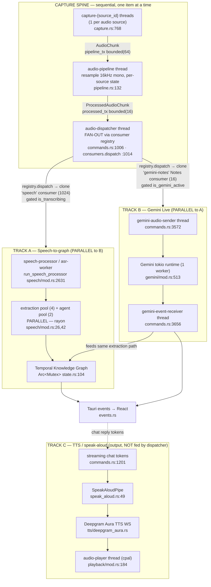
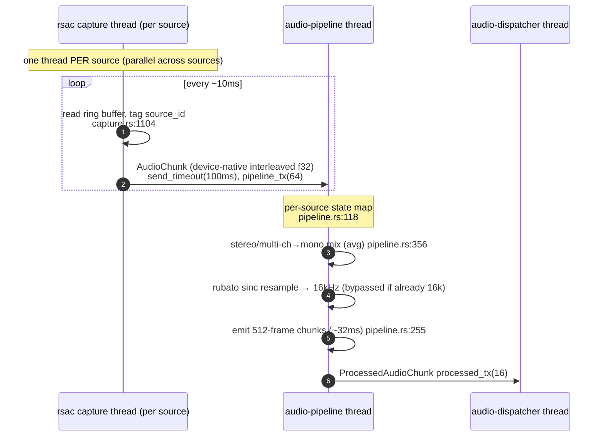
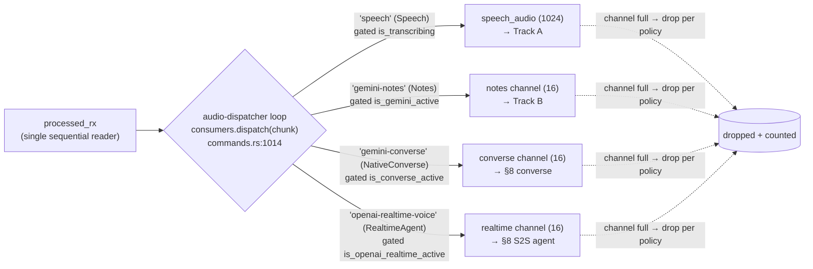
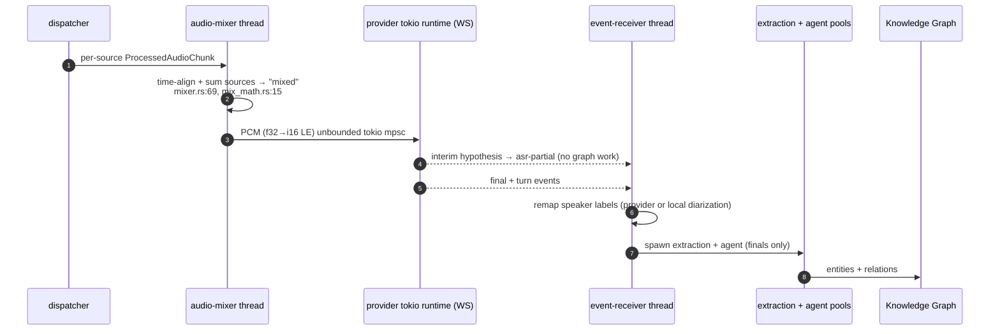
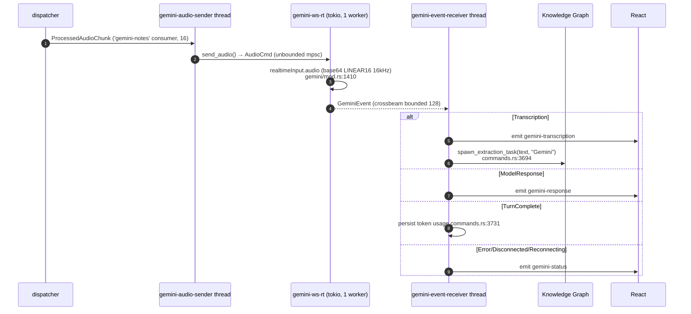
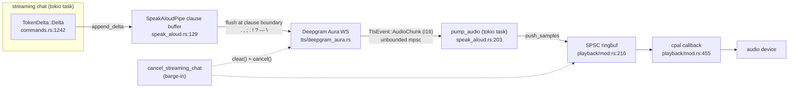
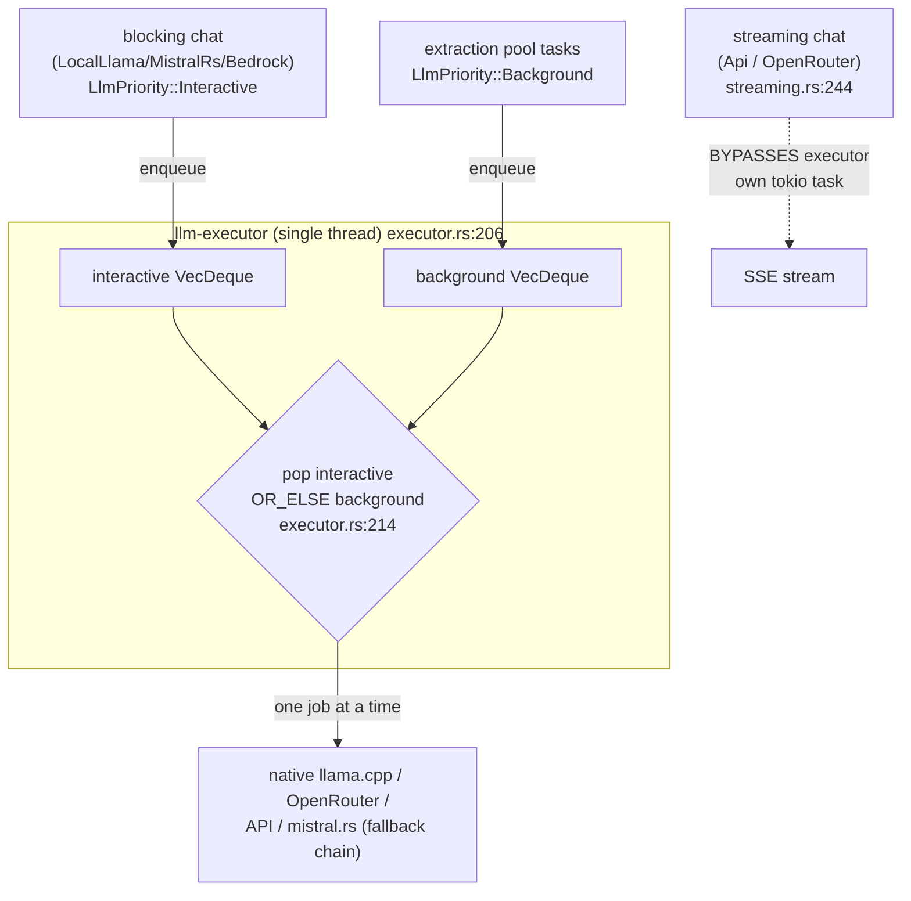
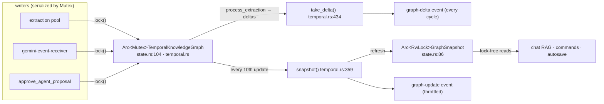
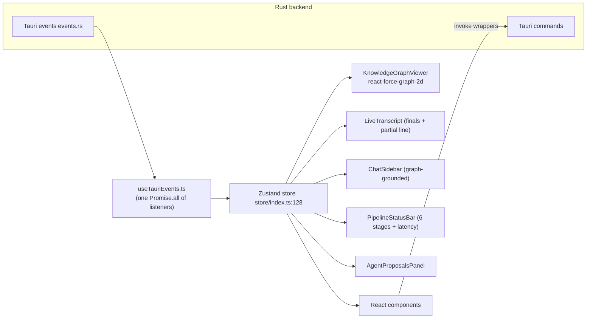

# AudioGraph — Data Flow & Concurrency

> **Code-grounded** companion to [`ARCHITECTURE.md`](ARCHITECTURE.md).
> Where `ARCHITECTURE.md` describes the product vision and provider matrix,
> this document describes **what the code actually does today**: every thread,
> every channel, and exactly where work transitions from **sequential** to
> **parallel**.
>
> All citations are `file:line` into `src-tauri/src/` (backend) or `src/`
> (frontend). Last verified: 2026-06-28.

---

## Table of Contents

1. [How to read this document](#1-how-to-read-this-document)
2. [Top-level concurrency map](#2-top-level-concurrency-map)
3. [Thread inventory](#3-thread-inventory)
4. [Channel inventory](#4-channel-inventory)
5. [The capture spine (sequential)](#5-the-capture-spine-sequential)
6. [The fan-out point (sequential → parallel)](#6-the-fan-out-point-sequential--parallel)
7. [Track A — Speech-to-graph pipeline](#7-track-a--speech-to-graph-pipeline)
8. [Track B — Gemini Live speech-to-speech](#8-track-b--gemini-live-speech-to-speech)
9. [Track C — TTS / speak-aloud / playback (output spine)](#9-track-c--tts--speak-aloud--playback-output-spine)
10. [LLM executor concurrency](#10-llm-executor-concurrency)
11. [Knowledge-graph concurrency](#11-knowledge-graph-concurrency)
12. [Frontend data flow](#12-frontend-data-flow)
13. [Sequential vs parallel — master summary](#13-sequential-vs-parallel--master-summary)
14. [Backpressure & drop policy](#14-backpressure--drop-policy)

---

## 1. How to read this document

AudioGraph is built from **three independent processing tracks** that all
hang off **one shared audio capture spine**:

| Track | What it does | Lives in |
|---|---|---|
| **A — Speech-to-graph** | transcribe → diarize → extract → temporal graph | `speech/`, `asr/`, `diarization/`, `llm/`, `graph/` |
| **B — Gemini Live** | stream audio to a realtime speech-to-speech model | `gemini/` |
| **C — TTS / speak-aloud** | turn chat tokens into spoken audio | `tts/`, `speak_aloud.rs`, `playback/` |

The whole system is **OS-thread based**, not a single async runtime. Cross-thread
communication is almost entirely `crossbeam-channel` bounded queues. Each
streaming provider (Deepgram, AssemblyAI, AWS, Gemini, Deepgram Aura TTS) owns
its **own small tokio runtime** internally and bridges back to the std-thread
world over channels.

Throughout, **boxes that run one-item-at-a-time are sequential**; **boxes that
fan out to multiple workers or independent threads are parallel**. The single
most important transition is the **dispatcher fan-out** (§6).

---

## 2. Top-level concurrency map

**Key insight:** Track A and Track B both consume the same processed audio
**simultaneously** because the dispatcher *clones* each chunk to a per-consumer
channel. They never compete for ownership of the stream. Track C is a separate
**output** spine driven by chat replies, not by captured audio.

The dispatcher no longer hardcodes two channels; it fans out through a
**`ProcessedAudioConsumerRegistry`** (`audio/consumer.rs:410`, see §6.1). The two
channels drawn above are now just the startup **speech** consumer and the Gemini
**notes** consumer; native-S2S modes (Gemini converse, OpenAI Realtime) register
additional consumers at runtime (§8). The AEC stage (`aec_vad/`) sits
conceptually *before* this spine and is not yet wired — see §5.

---

## 3. Thread inventory

Every row is an OS thread (`std::thread`) unless noted. Tokio runtimes are
flagged explicitly.

| Thread (name) | Count | Spawn site | Role | Internal model |
|---|---|---|---|---|
| `capture-{source_id}` | 1 per source | `audio/capture.rs:768` | Owns one `rsac::AudioCapture`, tags buffers | Sequential read loop |
| `audio-pipeline` | 1 | `commands.rs:981` (body `pipeline.rs:132`) | Resample/downmix to 16 kHz mono | Sequential |
| `audio-dispatcher` | 1 | `commands.rs:1006` | **Fan-out** via `consumers.dispatch` (`:1014`) | Sequential loop, registry fan-out |
| `speech-processor` (accumulator) | 1 | `commands.rs:1557` (body `speech/mod.rs:2631`) | Accumulate ~2 s segments (batch path) | Sequential |
| `asr-worker` | 1 | `speech/mod.rs:3041` | Whisper inference + diarization + emit | Sequential per segment |
| `audio-mixer` | 1 (streaming ASR only) | `audio/mixer.rs:112` | Sum per-source streams into one "mixed" stream | Sequential |
| `deepgram-ws-rt` etc. | 1 runtime per streaming ASR session | `asr/deepgram.rs:264`, `assemblyai.rs:554` | Provider WebSocket I/O | **tokio**, 1 worker |
| `deepgram-event-rx` (deepgram/assemblyai) | 1 | `speech/mod.rs:4200` | Consume provider events → finals/partials | Sequential |
| `extraction-*` pool | 4 | `speech/mod.rs:26` | Background entity extraction | **rayon**, parallel |
| `agent-react-*` pool | 2 | `speech/mod.rs:42` | Heuristic agent proposals | **rayon**, parallel |
| `diarization-clustering` | 1 (live clustering only) | `diarization/worker.rs:380` | Rolling-window clustering diarization | Sequential, SPSC ringbuf in |
| `llm-executor` | 1 | `llm/executor.rs:172` | Priority queue: chat preempts extraction | Sequential, 1 job at a time |
| `gemini-ws-rt` | 1 runtime | `gemini/mod.rs:513` | Gemini Live WebSocket | **tokio**, 1 worker |
| `gemini-audio-sender` | 1 | `commands.rs:3572` | Pump PCM to Gemini | Sequential |
| `gemini-event-receiver` | 1 | `commands.rs:3656` | Consume `GeminiEvent`, feed graph | Sequential |
| `audio-player` | 1 | `playback/mod.rs:190` | cpal output stream (`!Send`) | Sequential + lock-free ringbuf |
| `graph-autosave` | 1 | spawned at capture start | Persist graph + transcript every 30 s | Sequential |

> **Note on diarization:** the **batch/streaming ASR** paths have no dedicated
> diarization thread. `DiarizationWorker::run()` exists
> (`diarization/mod.rs:350`) but the pipeline calls `process_input(...)`
> **inline** on the ASR worker/event-receiver thread (e.g. `speech/mod.rs:3454`,
> `:3729`, `:4076`, `:4464`). For those backends (`Simple`, `Sortformer`)
> diarization is therefore **sequential, immediately after ASR**.
>
> The **live clustering** backend (`DiarizationBackend::Clustering`, ADR-0017 /
> B16, gated on `diarization-clustering`) is the exception: it runs on its own
> dedicated `diarization-clustering` thread fed by a lock-free `ringbuf` SPSC tap
> off the 16 kHz stream (`diarization/worker.rs:1-34`, spawn `:380`). It
> re-diarizes a rolling window on a fixed cadence and emits only the
> freshly-covered trailing hop, so it is parallel to the ASR critical path.

---

## 4. Channel inventory

All `crossbeam-channel` unless noted. Created in `AppState::new()`
(`state.rs:571`) except where stated.

| Channel | Created | Type / capacity | Payload | Full-channel policy |
|---|---|---|---|---|
| `pipeline_tx/rx` | `state.rs:576` | bounded(64) (~2 s) | `AudioChunk` | `send_timeout(100ms)`, drop on stall (`capture.rs:1121`) |
| `processed_tx/rx` | `state.rs:577` | bounded(16) | `ProcessedAudioChunk` | drained by dispatcher |
| `processed_audio_consumers` registry | `state.rs:590` | `ProcessedAudioConsumerRegistry` | per-consumer descriptors + channels | per-consumer drop policy |
| `speech_audio_tx/rx` (the "speech" consumer) | `state.rs:586` (registered `:591`) | bounded(1024) (~32 s) | `ProcessedAudioChunk` | `DropOldest` (in `dispatch`) |
| runtime native-S2S consumers (`gemini-notes`/`gemini-converse`/`openai-realtime-voice`) | `commands.rs:3495`, `:4188`, `:4745` | bounded(16) each | `ProcessedAudioChunk` | `DropOldest` (in `dispatch`) |
| mixer output | `mixer.rs:116` | bounded(1024) | `ProcessedAudioChunk` (`"mixed"`) | — |
| accumulator → ASR (Whisper) | `speech/mod.rs:3036` | bounded(4) (~8 s) | `AccumulatedSegment` | **drop** |
| accumulator → ASR (cloud HTTP) | `speech/mod.rs:3928` | bounded(32) (~64 s) | `AccumulatedSegment` | **drop** |
| Gemini events out | `gemini/mod.rs:291` | bounded(128) | `GeminiEvent` | — |
| Gemini audio in (to WS task) | `gemini/mod.rs:556` | tokio mpsc bounded(1000) | `AudioCmd` | `try_send`, drops if WS backs up (`:625`) |
| LLM job reply | `executor.rs:144` | std mpsc (per job) | `LlmJobResult` | 1 message |
| streaming chat tokens | `streaming.rs:249` | tokio mpsc bounded(64) | `TokenDelta` | — |
| TTS cmd / events (Aura) | `tts/deepgram_aura.rs:214` | tokio mpsc **unbounded** | `SessionCmd` / `TtsEvent` | — |
| Playback commands | `playback/mod.rs:180` | crossbeam **unbounded** | `AudioCommand` | — |
| Playback samples | `playback/mod.rs:216` | `ringbuf` SPSC (~192k samples) | `i16` | producer returns 0 |

---

## 5. The capture spine (sequential)

Everything before the dispatcher is strictly sequential per stage, but
**multiple capture threads run in parallel** — one per selected source.

Detail:

- **Target format:** 16 kHz mono, 512-frame chunks
  (`PROCESSED_AUDIO_SAMPLE_RATE_HZ`/`PROCESSED_AUDIO_CHUNK_FRAMES`,
  `pipeline.rs:36,43`). Input already at 16 kHz bypasses the resampler.
- **Per-source isolation:** `source_states: HashMap<Arc<str>, SourcePipelineState>`
  (`pipeline.rs:118`) — each source has its own resampler, buffers, and
  timestamp, so interleaved sources never mix at this stage.
- **Capture→pipeline drops rather than blocks indefinitely.** The capture thread
  uses `send_timeout` with a 100 ms budget (`capture.rs:1121`, Finding #53a): a
  stalled pipeline causes the chunk to be dropped (not held) so `stop_capture`
  can always reclaim the thread. rsac's internal ring buffer also drops on
  overflow; the thread polls `backpressure_report()` and raises edge-triggered
  `capture-backpressure` events (`capture.rs:1150,1164`).
- **Before the spine (not yet wired):** an AEC stage (`aec_vad/mod.rs`, seed
  098b) is scaffolded to clean mic/system capture against the assistant
  render-reference *before* this 16 kHz bus. It is a fixture harness only today
  — no runtime candidate is wired (that decision is tracked by seed `0bdc`).

---

## 6. The fan-out point (sequential → parallel)

This is the heart of the "mix of sequential and parallel tracks." The single
`audio-dispatcher` thread (`commands.rs:1006`) reads one `ProcessedAudioChunk`
and hands it to the **`ProcessedAudioConsumerRegistry`** (`audio/consumer.rs`),
which **clones it to every active, accepting consumer** so all tracks get the
full stream.

### 6.1 The consumer registry

Rather than hardcoding a channel field + dispatcher branch per consumer, each
downstream stage subscribes through the registry (`audio/consumer.rs:410`). A
`ProcessedAudioConsumerDescriptor` (`consumer.rs:135`) carries:

- a **stage** (`ProcessedAudioConsumerStage`, `consumer.rs:26`):
  `Speech`, `Notes`, `NativeConverse`, `RealtimeAgent`, `Other`;
- an optional **conflict_group** — registration is rejected if another consumer
  already holds the group (used to make the Gemini *notes* and *converse* modes
  mutually exclusive on the shared Live client, group `gemini-live-client`, and
  to gate the OpenAI Realtime client, group `openai-realtime-client`);
- a bounded **capacity** + **drop_policy** (`DropOldest` / `DropNewest`,
  `consumer.rs:46`);
- a **source_filter** (`All` / specific source ids) and **mixing_mode**
  (`PerSource` / `MixedMono`) so a consumer sees either the real per-source
  chunks or the synthetic `"mixed"` stream from the mixer, never both.

`register` (`consumer.rs:430`) validates the descriptor (bounded channel whose
capacity matches, non-empty labels, no duplicate id, free conflict group);
`dispatch` (`consumer.rs:532`) is the live fan-out hot path.

**Registered consumers today:**

| id | stage | gate (`is_active`) | registered |
|---|---|---|---|
| `speech` | `Speech` | `is_transcribing` | startup, `state.rs:591` |
| `gemini-notes` | `Notes` | `is_gemini_active` | `commands.rs:3495` |
| `gemini-converse` | `NativeConverse` | `is_converse_active` | `commands.rs:4188` |
| `openai-realtime-voice` | `RealtimeAgent` | `is_openai_realtime_active` | `commands.rs:4745` |

- **Independently gated:** each consumer carries an `is_active` closure; the
  dispatcher skips inactive consumers, so an inactive track costs only a flag
  read.
- **Never blocks:** `dispatch` delivers a clone under each consumer's drop
  policy (`DropOldest` evicts a queued chunk and retries; `DropNewest` discards
  the incoming chunk) — a slow consumer (e.g. Gemini reconnecting) can't stall
  the speech track. Per-chunk delivered/dropped counts come back in a
  `ProcessedAudioDispatchSummary`; the dispatcher logs every ~50 drops
  (`commands.rs:1017`) and emits an `audio-consumer-health` event with
  per-consumer queue depth + sent/dropped counters (`commands.rs:1030`,
  `events.rs:109`).
- This is the evolution of the original "Bug 1 fix": previously a single shared
  receiver *split* chunks between consumers; now each consumer is a registry
  entry that gets its own clone.

---

## 7. Track A — Speech-to-graph pipeline

Track A has **two internal topologies** chosen at runtime by the `AsrProvider`
enum in `run_speech_processor` (`speech/mod.rs:2631`).

### 7.1 Topology selection

### 7.2 Batch path (Whisper / HTTP API) — sequential 2-thread model

The batch path is the clearest example of **sequential-then-parallel**:

- **Sequential within the worker:** ASR → diarization → persist/emit happen
  one segment at a time on a single thread (`speech/mod.rs:1315-1411`). Whisper
  inference is blocking CPU work (`asr/mod.rs:234`); HTTP is a blocking
  `reqwest::blocking` POST with a 30 s timeout (`asr/cloud.rs:121`).
- **Parallel after emit:** `emit_transcript_and_extract` (`speech/mod.rs:564`)
  dispatches two **fire-and-forget** tasks onto bounded rayon pools so the ASR
  critical path is never blocked by LLM I/O:
  - **extraction pool** — 4 threads (`extraction-*`, `speech/mod.rs:26`),
  - **agent-proposal pool** — 2 threads (`agent-react-*`, `speech/mod.rs:42`).
  rayon was chosen over `std::thread::spawn` to avoid OS-thread exhaustion in
  long sessions (`speech/mod.rs:14-20`).
- **Heuristic proposals never hit the network.** The agent-proposal pool
  classifies each segment by simple rules (Question / Task / Note) and emits an
  `agent-proposal` event — it never calls an LLM, so it never rate-limits.
  **Questions default to the graph:** the frontend auto-calls
  `add_question_to_graph` (`store/index.ts:216`, local — adds a `Question` node)
  and the card then only offers the *optional* "Ask AI" action (routes to chat).

### 7.3 Streaming path (Deepgram / AssemblyAI / AWS / Sherpa) — parallel

- Multiple sources are collapsed into one **"mixed"** stream by the
  `audio-mixer` thread (`mixer.rs:29`) because each provider uses a single
  WebSocket. The mixer sums the per-source 16 kHz-mono streams (per-source ring
  buffers absorb jitter, laggards are silence-filled, the sum is scaled by
  `1/sqrt(active)` and clamped, idle sources evicted after ~2 s); it is
  transparent for a single source.
- **Per-provider source-count limit.** Only **Deepgram** is wired through the
  mixer, so `validate_streaming_asr_source_count` (`commands.rs:120`, via
  `single_session_streaming_asr_name` `commands.rs:103`) no longer caps Deepgram
  source count. **AssemblyAI, AWS Transcribe, and Sherpa-ONNX streaming keep the
  one-source-at-a-time limit** until the mixer is wired into their branches.
  Local Whisper and cloud-batch ASR already handle N sources independently and
  are unaffected.
- **Partials vs finals:** interim hypotheses emit `asr-partial` and do **no**
  downstream work; only finals build a `TranscriptSegment` and run extraction
  (Deepgram `speech/mod.rs:2025-2112`, AssemblyAI `:2379-2445`).
- **Diarization normalization (provider or local):** the "remap speaker labels"
  step is a metadata join, not an audio split. Each final segment that carries a
  speaker is normalized into a provider-neutral `DiarizationSpanRevision`
  (`diarization_span_revision_for_transcript`, `speech/mod.rs:233`) keyed by a
  provider-neutral `span_id`; the raw provider speaker id is provenance-only. The
  `Clustering` backend instead emits its own spans from the
  `diarization-clustering` thread and maps them onto transcript times by overlap
  (`overlap_speaker_for_segment`). All of these feed the session `SpeakerTimeline`
  ledger (`projections.rs`); see
  [`ARCHITECTURE.md`](ARCHITECTURE.md#speaker-timeline-and-diarization-normalization).
- **AWS** is the exception: it runs `block_on` on a current-thread runtime
  **inline on the processor thread** (no separate event-receiver), using
  callbacks for partial/final (`asr/aws_transcribe.rs:146-262`).
- **Sherpa** is fully local/synchronous (no tokio); endpoint = final
  (`asr/sherpa_streaming.rs:130`).

### 7.4 Turn detection (shared contract)

All providers normalize endpointing into one `TurnEventPayload`
(`events.rs:147`) with `TurnEventKind` (`events.rs:135`):
`SpeechStarted, SpeechFinal, UtteranceEnd, EagerEndOfTurn, EndOfTurn,
TurnResumed, LocalWindow`. The local batch path emits `LocalWindow` per ~2 s
window (`speech/mod.rs:1385`); Deepgram maps Nova/Flux signals
(`asr/deepgram.rs:933`, `speech/mod.rs:2122`).

---

## 8. Track B — Gemini Live speech-to-speech

- **Wiring:** `start_gemini` (`commands.rs:3406`) registers the `gemini-notes`
  consumer and spawns the two std-threads (`gemini-audio-sender`
  `commands.rs:3572`, `gemini-event-receiver` `:3656`); the client owns a
  dedicated 1-worker tokio runtime (`gemini/mod.rs:513`) with one `session_task`
  driving reader+writer in a single `select!` (`gemini/mod.rs:1241`).
- **Feeds the same graph:** Gemini transcripts run through the identical
  `speech::spawn_extraction_task` path as Track A, but with a hardcoded speaker
  `"Gemini"` and no diarization context (`commands.rs:3694`).
- **Reconnect:** exponential backoff ladder 1/2/5/10 s then give up
  (`gemini/mod.rs:27-43`); each reconnect replays the full
  `BidiGenerateContentSetup` handshake and threads the session-resumption handle.
  See the [reconnect runbook](ops/gemini-reconnect-runbook.md).
- **Independent of Track A:** Gemini and the speech pipeline can run at the same
  time ("comparison mode") since the dispatcher feeds both.

### 8.1 Native speech-to-speech (converse + OpenAI Realtime)

Two more fan-out paths consume the same processed-audio bus through their own
registry consumers (§6.1), each on a dedicated driver/sender thread pair:

- **Gemini converse** (`NativeConverse`, ADR-0018): `start_converse`
  (`commands.rs:4113`) registers the `gemini-converse` consumer (conflict group
  `gemini-live-client`, so it cannot coexist with notes mode) and spawns
  `converse-audio-sender` (`:4296`) + `converse-driver` (`:4348`). The driver
  runs the `crate::converse` turn-state FSM against the live Gemini client (the
  `GeminiConverseSink`, `commands.rs:3954`).
- **OpenAI Realtime** (`RealtimeAgent`): `start_openai_realtime`
  (`commands.rs:4674`) registers the `openai-realtime-voice` consumer (conflict
  group `openai-realtime-client`) and spawns `openai-realtime-audio-sender`
  (`:4851`) + `openai-realtime-driver` (`:4900`).

Both gate their consumer on a per-mode `is_*_active` flag and tear it down on
stop, so the dispatcher stops cloning to them the moment the session ends.

---

## 9. Track C — TTS / speak-aloud / playback (output spine)

This track is **not** fed by captured audio. It turns **streaming chat reply
tokens** into spoken audio, and is the only place audio flows *out*.

- **Aggressive flush:** the pipe drains the buffer up to the **last clause
  boundary** on each token batch for low first-audio latency
  (`speak_aloud.rs:129`, boundaries `:42`).
- **Playback thread:** cpal `Stream` is `!Send` on Windows (COM affinity), so it
  lives on its own `std::thread` (`playback/mod.rs:184`) and receives samples
  over a lock-free SPSC ringbuf — never through a lock on the hot path.
- **Barge-in cancel chain:** `cancel_streaming_chat` → `SpeakAloudPipe::cancel`
  → `TtsSession::clear()` (server drops in-flight utterance + session-layer
  `clearing` flag suppresses trailing chunks, `tts/deepgram_aura.rs:660`) **and**
  `AudioPlayer::cancel()` (drains ringbuf, outputs silence within one callback
  period, `playback/mod.rs:466`).
- **Only Deepgram Aura is implemented** today (`tts/deepgram_aura.rs`); Kokoro /
  Piper are referenced but not present.

---

## 10. LLM executor concurrency

- **One worker thread, one job at a time** (`executor.rs:128,206`). Priority is
  structural: the worker always drains the **interactive** deque before the
  **background** deque (`executor.rs:214`), so chat jumps ahead of queued
  extraction. It is **non-preemptive** — a running extraction is not interrupted.
- **429 cooldown:** a rate-limit error pauses *all* background extraction for
  60 s so chat keeps the quota (`executor.rs:50,257`).
- **Streaming chat bypasses the executor entirely** — `start_streaming_chat`
  for `Api`/`OpenRouter` runs on its own tokio task over a bounded(64) channel
  (`streaming.rs:244`), so it is genuinely concurrent with background
  extraction. Blocking chat (LocalLlama/MistralRs/Bedrock) goes *through* the
  executor as an interactive job (`commands.rs:1490`).
- **Fallback chain** (per provider, first success wins, `executor.rs:260`):
  e.g. `LocalLlama → native → openrouter → api → mistralrs`, with rule-based NER
  (`graph/extraction.rs`) as the always-available terminal fallback.

---

## 11. Knowledge-graph concurrency

- The graph itself is **`Arc<Mutex<TemporalKnowledgeGraph>>`** (a plain mutex,
  **not** `RwLock` — `state.rs:104`). All mutation is serialized.
- A separate cached **`Arc<RwLock<GraphSnapshot>>`** (`state.rs:86`) lets Tauri
  commands and chat RAG read the latest snapshot **without** taking the graph
  mutex.
- **petgraph `StableGraph`** with case-insensitive name dedup + temporal edges
  (`valid_from`/`valid_until`), node cap 1000 / edge cap 5000 with LRU-style
  eviction (`temporal.rs:32,284`).
- **Emission policy** (`speech/mod.rs:439`): `graph-delta` every extraction
  cycle that has changes; full `graph-update` snapshot every 10th update; cache
  refreshed every update.

---

## 12. Frontend data flow

- **Event → state map** (`useTauriEvents.ts:251`): `transcript-update` →
  append + clear partial; `asr-partial` → single interim line; `graph-update`
  → replace snapshot (preserving node identity/positions); `graph-delta` →
  incremental merge; `pipeline-latency`/`pipeline-status` → status bar;
  `agent-proposal` → proposal card + toast; chat token deltas coalesced at
  ~30 fps (`useTauriEvents.ts:131`).
- **Two product modes share one shell.** `nativeS2sEnabled` (a localStorage
  flag, `store/index.ts:571`) reveals the Gemini control; otherwise only the
  cascading transcribe pipeline is reachable. The two pipelines keep **separate
  transcript buffers** (`transcriptSegments` vs `geminiTranscripts`) and can run
  simultaneously (`ControlBar.tsx:131` `isComparing`).
- **Graph snapshot vs delta in the store** (`store/index.ts:303,322`): both
  paths `Object.assign` onto existing node objects to preserve react-force-graph
  `x/y/vx/vy` so the D3 simulation doesn't "jump"; new nodes are seeded near a
  neighbor (`seedNodePositions`, `store/index.ts:94`).

---

## 13. Sequential vs parallel — master summary

| Stage | Sequential or parallel | Why |
|---|---|---|
| Capture (across sources) | **Parallel** | one thread per source (`capture.rs:768`) |
| Capture → pipeline → dispatcher | **Sequential** | single thread each |
| Dispatcher fan-out | **Sequential reader, parallel writers** | registry clones to per-consumer channels (`commands.rs:1014`, `consumer.rs:532`) |
| Track A vs Track B | **Parallel** | both consume cloned chunks concurrently |
| Batch ASR worker (ASR→diar→emit) | **Sequential** per segment | single thread (`speech/mod.rs:1315`) |
| Streaming ASR (WS I/O) | **Parallel** | provider tokio runtime + event-receiver thread |
| Entity extraction | **Parallel** | 4-thread rayon pool (`speech/mod.rs:26`) |
| Agent proposals | **Parallel** | 2-thread rayon pool (`speech/mod.rs:42`) |
| LLM executor jobs | **Sequential** | single worker, 1 job at a time (`executor.rs:206`) |
| Streaming chat | **Parallel to executor** | bypasses executor, own tokio task (`streaming.rs:244`) |
| Graph mutation | **Serialized** | `Arc<Mutex>` (`state.rs:104`) |
| Graph reads (snapshot) | **Concurrent** | cached `Arc<RwLock>` (`state.rs:86`) |
| TTS → playback | **Parallel to everything** | separate output spine (`playback/mod.rs:184`) |

---

## 14. Backpressure & drop policy

The system favors **dropping audio over blocking** at every fan-out/handoff
boundary, so a slow consumer can never stall capture:

| Boundary | Policy | Citation |
|---|---|---|
| rsac ring buffer → capture thread | drop + edge-triggered `capture-backpressure` event | `capture.rs:1150,1164` |
| capture → pipeline | `send_timeout(100ms)`, **drop** on stall (reclaimable thread) | `capture.rs:1121` |
| dispatcher → each consumer | per-consumer drop policy in `dispatch`, **drop** + count (log ~every 50) | `consumer.rs:532`, `commands.rs:1017` |
| accumulator → ASR worker | `try_send`, **drop** segment | `speech/mod.rs:3108` |
| Gemini audio (to WS task) | bounded(1000) `try_send`, drops if WS backs up | `gemini/mod.rs:556,625` |
| extraction / agent enqueue | bounded rayon pools (backpressure via pool) | `speech/mod.rs:26,42` |
| background extraction (429) | **pause 60 s** | `executor.rs:37,74` |
| playback ringbuf full | `push_samples` returns count pushed (caller tolerates) | `playback/mod.rs:261` |

---

*This document is generated from a direct read of the source tree. If you change
thread/channel topology, update both this file and the threading/data-flow
sections of [`ARCHITECTURE.md`](ARCHITECTURE.md).*
