# AudioGraph — Data Flow & Concurrency

> **Code-grounded** companion to [`ARCHITECTURE.md`](ARCHITECTURE.md).
> Where `ARCHITECTURE.md` describes the product vision and provider matrix,
> this document describes **what the code actually does today**: every thread,
> every channel, and exactly where work transitions from **sequential** to
> **parallel**.
>
> All citations are `file:line` into `src-tauri/src/` (backend) or `src/`
> (frontend). Last verified: 2026-05-29.

---

## Table of Contents

1. [How to read this document](#1-how-to-read-this-document)
2. [Top-level concurrency map](#2-top-level-concurrency-map)
3. [Thread inventory](#3-thread-inventory)
4. [Channel inventory](#4-channel-inventory)
5. [The capture spine (sequential)](#5-the-capture-spine-sequential)
6. [The fan-out point (sequential → parallel)](#6-the-fan-out-point-sequential--parallel)
7. [Track A — Speech-to-graph pipeline](#7-track-a--speech-to-graph-pipeline)
8. [Track B — Gemini Live speech-to-speech](#8-track-b--gemini-live-speech-to-speech)
9. [Track C — TTS / speak-aloud / playback (output spine)](#9-track-c--tts--speak-aloud--playback-output-spine)
10. [LLM executor concurrency](#10-llm-executor-concurrency)
11. [Knowledge-graph concurrency](#11-knowledge-graph-concurrency)
12. [Frontend data flow](#12-frontend-data-flow)
13. [Sequential vs parallel — master summary](#13-sequential-vs-parallel--master-summary)
14. [Backpressure & drop policy](#14-backpressure--drop-policy)

---

## 1. How to read this document

AudioGraph is built from **three independent processing tracks** that all
hang off **one shared audio capture spine**:

| Track | What it does | Lives in |
|---|---|---|
| **A — Speech-to-graph** | transcribe → diarize → extract → temporal graph | `speech/`, `asr/`, `diarization/`, `llm/`, `graph/` |
| **B — Gemini Live** | stream audio to a realtime speech-to-speech model | `gemini/` |
| **C — TTS / speak-aloud** | turn chat tokens into spoken audio | `tts/`, `speak_aloud.rs`, `playback/` |

The whole system is **OS-thread based**, not a single async runtime. Cross-thread
communication is almost entirely `crossbeam-channel` bounded queues. Each
streaming provider (Deepgram, AssemblyAI, AWS, Gemini, Deepgram Aura TTS) owns
its **own small tokio runtime** internally and bridges back to the std-thread
world over channels.

Throughout, **boxes that run one-item-at-a-time are sequential**; **boxes that
fan out to multiple workers or independent threads are parallel**. The single
most important transition is the **dispatcher fan-out** (§6).

---

## 2. Top-level concurrency map

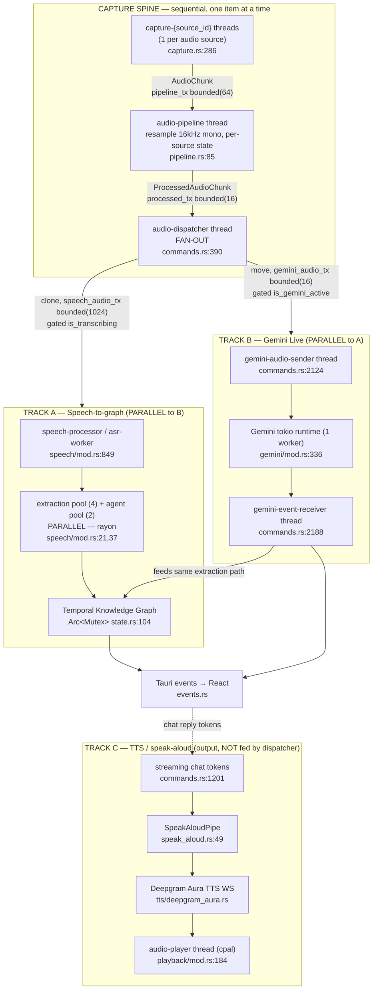

**Key insight:** Track A and Track B both consume the same processed audio
**simultaneously** because the dispatcher *clones* each chunk to a per-consumer
channel. They never compete for ownership of the stream. Track C is a separate
**output** spine driven by chat replies, not by captured audio.

---

## 3. Thread inventory

Every row is an OS thread (`std::thread`) unless noted. Tokio runtimes are
flagged explicitly.

| Thread (name) | Count | Spawn site | Role | Internal model |
|---|---|---|---|---|
| `capture-{source_id}` | 1 per source | `audio/capture.rs:286` | Owns one `rsac::AudioCapture`, tags buffers | Sequential read loop |
| `audio-pipeline` | 1 | `commands.rs:363` (body `pipeline.rs:85`) | Resample/downmix to 16 kHz mono | Sequential |
| `audio-dispatcher` | 1 | `commands.rs:390` | **Fan-out** to per-consumer channels | Sequential loop, `try_send` |
| `speech-processor` (accumulator) | 1 | `commands.rs:848` (loop `speech/mod.rs:1210`) | Accumulate ~2 s segments (batch path) | Sequential |
| `asr-worker` | 1 | `speech/mod.rs:1165` (body `:1262`) | Whisper inference + diarization + emit | Sequential per segment |
| `audio-mixer` | 1 (streaming ASR only) | `audio/mixer.rs:112` | Sum per-source streams into one "mixed" stream | Sequential |
| `deepgram-ws-rt` etc. | 1 runtime per streaming ASR session | `asr/deepgram.rs:245`, `assemblyai.rs:169` | Provider WebSocket I/O | **tokio**, 1 worker |
| `*-event-receiver` (deepgram/assemblyai) | 1 | `speech/mod.rs:1848` | Consume provider events → finals/partials | Sequential |
| `extraction-*` pool | 4 | `speech/mod.rs:21` | Background entity extraction | **rayon**, parallel |
| `agent-react-*` pool | 2 | `speech/mod.rs:37` | Heuristic agent proposals | **rayon**, parallel |
| `llm-executor` | 1 | `llm/executor.rs:128` | Priority queue: chat preempts extraction | Sequential, 1 job at a time |
| `gemini-ws-rt` | 1 runtime | `gemini/mod.rs:336` | Gemini Live WebSocket | **tokio**, 1 worker |
| `gemini-audio-sender` | 1 | `commands.rs:2124` | Pump PCM to Gemini | Sequential |
| `gemini-event-receiver` | 1 | `commands.rs:2188` | Consume `GeminiEvent`, feed graph | Sequential |
| `audio-player` | 1 | `playback/mod.rs:184` | cpal output stream (`!Send`) | Sequential + lock-free ringbuf |
| `graph-autosave` | 1 | spawned at capture start | Persist graph + transcript every 30 s | Sequential |

> **Note on diarization:** there is no dedicated diarization thread in the live
> path. `DiarizationWorker::run()` exists (`diarization/mod.rs:270`) but the
> pipeline calls `process_input(...)` **inline** on the ASR worker/receiver
> thread (`speech/mod.rs:1361`, `:2086`, `:2406`, `:2549`, `:2702`). Diarization
> is therefore **sequential, immediately after ASR**.

---

## 4. Channel inventory

All `crossbeam-channel` unless noted. Created in `AppState::new()`
(`state.rs:242-255`) except where stated.

| Channel | Created | Type / capacity | Payload | Full-channel policy |
|---|---|---|---|---|
| `pipeline_tx/rx` | `state.rs:242` | bounded(64) (~2 s) | `AudioChunk` | **blocks** (`capture.rs:526`) |
| `processed_tx/rx` | `state.rs:243` | bounded(16) | `ProcessedAudioChunk` | drained by dispatcher |
| `speech_audio_tx/rx` | `state.rs:252` | bounded(1024) (~32 s) | `ProcessedAudioChunk` | **drop** (`commands.rs:399`) |
| `gemini_audio_tx/rx` | `state.rs:254` | bounded(16) | `ProcessedAudioChunk` | **drop** (`commands.rs:416`) |
| mixer output | `mixer.rs:111` | bounded(1024) | `ProcessedAudioChunk` (`"mixed"`) | — |
| accumulator → ASR (Whisper) | `speech/mod.rs:1161` | bounded(4) (~8 s) | `AccumulatedSegment` | **drop** (`:1233`) |
| accumulator → ASR (cloud HTTP) | `speech/mod.rs:1623` | bounded(32) (~64 s) | `AccumulatedSegment` | **drop** |
| Gemini events out | `gemini/mod.rs:291` | bounded(128) | `GeminiEvent` | — |
| Gemini audio in (to WS task) | `gemini/mod.rs:380` | tokio mpsc **unbounded** | `AudioCmd` | buffers during reconnect |
| LLM job reply | `executor.rs:144` | std mpsc (per job) | `LlmJobResult` | 1 message |
| streaming chat tokens | `streaming.rs:249` | tokio mpsc bounded(64) | `TokenDelta` | — |
| TTS cmd / events (Aura) | `tts/deepgram_aura.rs:214` | tokio mpsc **unbounded** | `SessionCmd` / `TtsEvent` | — |
| Playback commands | `playback/mod.rs:180` | crossbeam **unbounded** | `AudioCommand` | — |
| Playback samples | `playback/mod.rs:216` | `ringbuf` SPSC (~192k samples) | `i16` | producer returns 0 |

---

## 5. The capture spine (sequential)

Everything before the dispatcher is strictly sequential per stage, but
**multiple capture threads run in parallel** — one per selected source.

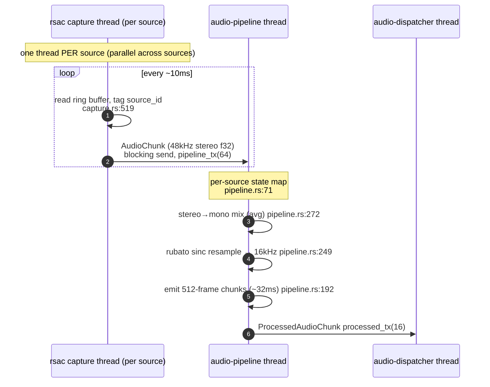

Detail:

- **Target format:** 16 kHz mono, 512-frame chunks (`pipeline.rs:30,33`).
  Input already at 16 kHz bypasses the resampler (`pipeline.rs:110`).
- **Per-source isolation:** `source_states: HashMap<String, SourcePipelineState>`
  (`pipeline.rs:71`) — each source has its own resampler, buffers, and timestamp,
  so interleaved sources never mix at this stage (test `pipeline.rs:363`).
- **Capture→pipeline is the only blocking hop.** Backpressure is absorbed by
  rsac's internal ring buffer, which drops on overflow and raises edge-triggered
  `capture-backpressure` events (`capture.rs:536`).

---

## 6. The fan-out point (sequential → parallel)

This is the heart of the "mix of sequential and parallel tracks." The single
`audio-dispatcher` thread reads one `ProcessedAudioChunk` and **clones it to
every active consumer** so Track A and Track B both get the full stream.

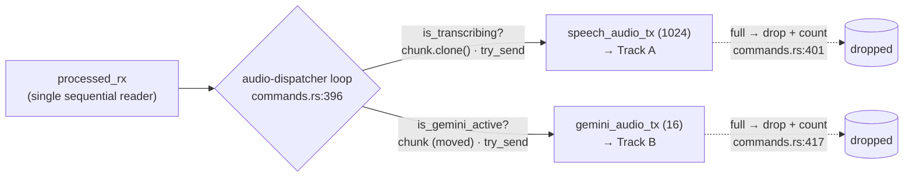

- Consumers are independently gated: speech by `is_transcribing` (`AtomicBool`,
  `commands.rs:398`), Gemini by `is_gemini_active` (`RwLock<bool>`, `:412`).
- **Never blocks:** both forwards use `try_send`; a full consumer channel drops
  the chunk and increments a counter logged every 10th drop. This guarantees a
  slow consumer (e.g. Gemini reconnecting) can't stall the speech track.
- This is the "Bug 1 fix": previously a single shared receiver *split* chunks
  between consumers; now each gets a clone (`state.rs:164-177`).

---

## 7. Track A — Speech-to-graph pipeline

Track A has **two internal topologies** chosen at runtime by the `AsrProvider`
enum in `run_speech_processor` (`speech/mod.rs:849`).

### 7.1 Topology selection

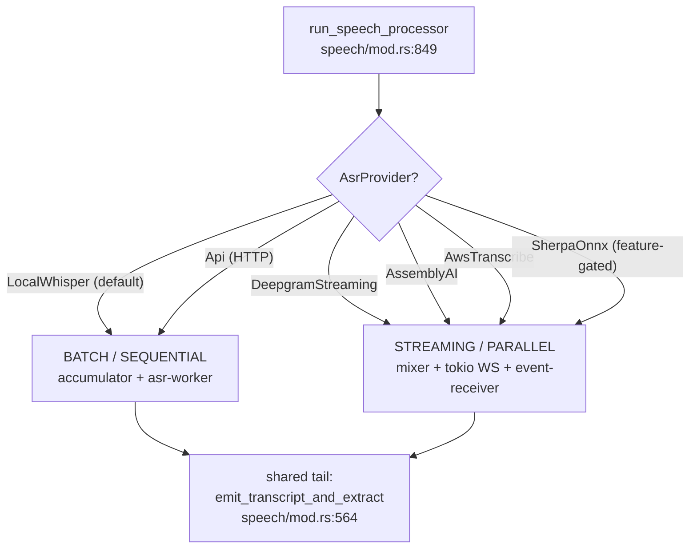

### 7.2 Batch path (Whisper / HTTP API) — sequential 2-thread model

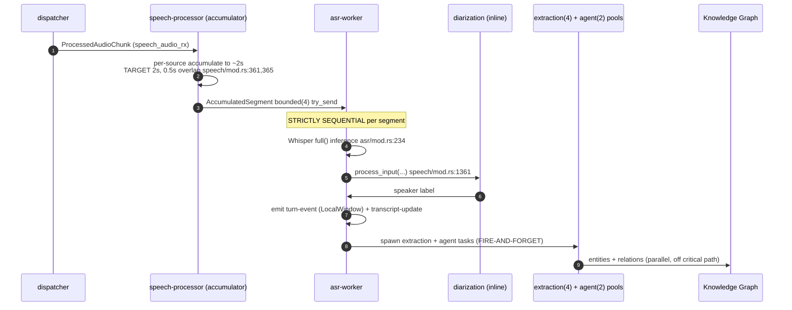

The batch path is the clearest example of **sequential-then-parallel**:

- **Sequential within the worker:** ASR → diarization → persist/emit happen
  one segment at a time on a single thread (`speech/mod.rs:1315-1411`). Whisper
  inference is blocking CPU work (`asr/mod.rs:234`); HTTP is a blocking
  `reqwest::blocking` POST with a 30 s timeout (`asr/cloud.rs:121`).
- **Parallel after emit:** `emit_transcript_and_extract` (`speech/mod.rs:564`)
  dispatches two **fire-and-forget** tasks onto bounded rayon pools so the ASR
  critical path is never blocked by LLM I/O:
  - **extraction pool** — 4 threads (`extraction-*`, `speech/mod.rs:21`),
  - **agent-proposal pool** — 2 threads (`agent-react-*`, `speech/mod.rs:37`).
  rayon was chosen over `std::thread::spawn` to avoid OS-thread exhaustion in
  long sessions (`speech/mod.rs:14-20`).

### 7.3 Streaming path (Deepgram / AssemblyAI / AWS / Sherpa) — parallel

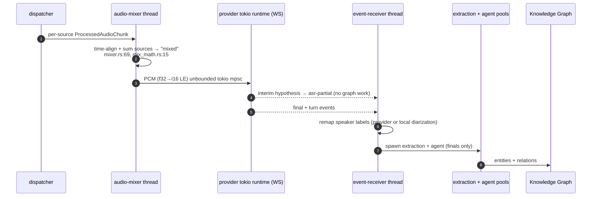

- Multiple sources are collapsed into one **"mixed"** stream by the
  `audio-mixer` thread (`mixer.rs:29`) because each provider uses a single
  WebSocket.
- **Partials vs finals:** interim hypotheses emit `asr-partial` and do **no**
  downstream work; only finals build a `TranscriptSegment` and run extraction
  (Deepgram `speech/mod.rs:2025-2112`, AssemblyAI `:2379-2445`).
- **AWS** is the exception: it runs `block_on` on a current-thread runtime
  **inline on the processor thread** (no separate event-receiver), using
  callbacks for partial/final (`asr/aws_transcribe.rs:146-262`).
- **Sherpa** is fully local/synchronous (no tokio); endpoint = final
  (`asr/sherpa_streaming.rs:130`).

### 7.4 Turn detection (shared contract)

All providers normalize endpointing into one `TurnEventPayload`
(`events.rs:147`) with `TurnEventKind` (`events.rs:135`):
`SpeechStarted, SpeechFinal, UtteranceEnd, EagerEndOfTurn, EndOfTurn,
TurnResumed, LocalWindow`. The local batch path emits `LocalWindow` per ~2 s
window (`speech/mod.rs:1385`); Deepgram maps Nova/Flux signals
(`asr/deepgram.rs:933`, `speech/mod.rs:2122`).

---

## 8. Track B — Gemini Live speech-to-speech

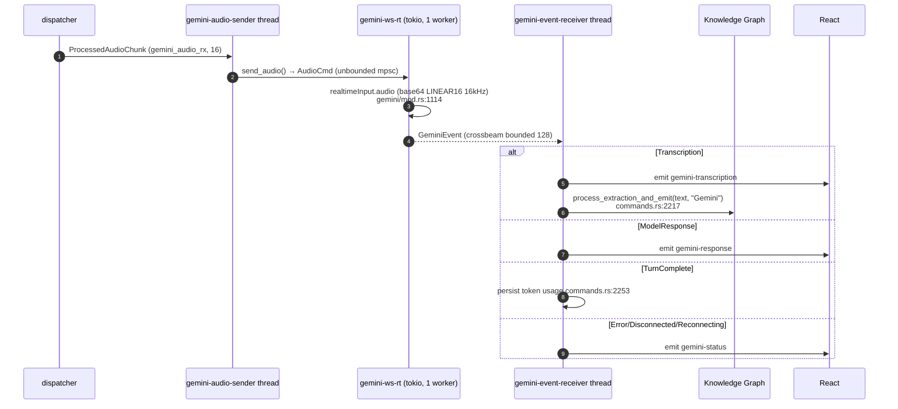

- **Wiring:** `start_gemini` (`commands.rs:2024`) spawns the two std-threads;
  the client owns a dedicated 1-worker tokio runtime (`gemini/mod.rs:336`) with
  one `session_task` driving reader+writer in a single `select!`
  (`gemini/mod.rs:1110`).
- **Feeds the same graph:** Gemini transcripts run through the identical
  `process_extraction_and_emit` path as Track A, but with a hardcoded speaker
  `"Gemini"` and no diarization context (`commands.rs:2219`).
- **Reconnect:** backoff ladder 1/2/5/10 s then give up
  (`gemini/mod.rs:909`); each reconnect replays the full
  `BidiGenerateContentSetup` handshake and threads the
  session-resumption handle (`gemini/mod.rs:1043`). See the
  [reconnect runbook](ops/gemini-reconnect-runbook.md).
- **Independent of Track A:** Gemini and the speech pipeline can run at the same
  time ("comparison mode") since the dispatcher feeds both.

---

## 9. Track C — TTS / speak-aloud / playback (output spine)

This track is **not** fed by captured audio. It turns **streaming chat reply
tokens** into spoken audio, and is the only place audio flows *out*.

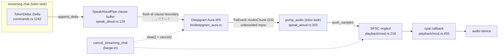

- **Aggressive flush:** the pipe drains the buffer up to the **last clause
  boundary** on each token batch for low first-audio latency
  (`speak_aloud.rs:129`, boundaries `:42`).
- **Playback thread:** cpal `Stream` is `!Send` on Windows (COM affinity), so it
  lives on its own `std::thread` (`playback/mod.rs:184`) and receives samples
  over a lock-free SPSC ringbuf — never through a lock on the hot path.
- **Barge-in cancel chain:** `cancel_streaming_chat` → `SpeakAloudPipe::cancel`
  → `TtsSession::clear()` (server drops in-flight utterance + session-layer
  `clearing` flag suppresses trailing chunks, `tts/deepgram_aura.rs:660`) **and**
  `AudioPlayer::cancel()` (drains ringbuf, outputs silence within one callback
  period, `playback/mod.rs:466`).
- **Only Deepgram Aura is implemented** today (`tts/deepgram_aura.rs`); Kokoro /
  Piper are referenced but not present.

---

## 10. LLM executor concurrency

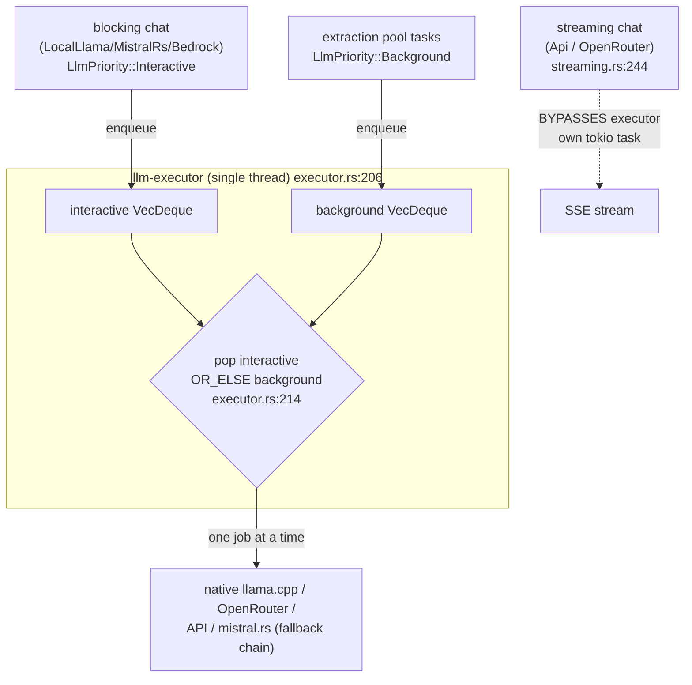

- **One worker thread, one job at a time** (`executor.rs:128,206`). Priority is
  structural: the worker always drains the **interactive** deque before the
  **background** deque (`executor.rs:214`), so chat jumps ahead of queued
  extraction. It is **non-preemptive** — a running extraction is not interrupted.
- **429 cooldown:** a rate-limit error pauses *all* background extraction for
  60 s so chat keeps the quota (`executor.rs:50,257`).
- **Streaming chat bypasses the executor entirely** — `start_streaming_chat`
  for `Api`/`OpenRouter` runs on its own tokio task over a bounded(64) channel
  (`streaming.rs:244`), so it is genuinely concurrent with background
  extraction. Blocking chat (LocalLlama/MistralRs/Bedrock) goes *through* the
  executor as an interactive job (`commands.rs:1490`).
- **Fallback chain** (per provider, first success wins, `executor.rs:260`):
  e.g. `LocalLlama → native → openrouter → api → mistralrs`, with rule-based NER
  (`graph/extraction.rs`) as the always-available terminal fallback.

---

## 11. Knowledge-graph concurrency

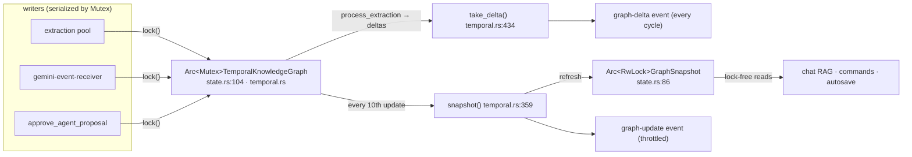

- The graph itself is **`Arc<Mutex<TemporalKnowledgeGraph>>`** (a plain mutex,
  **not** `RwLock` — `state.rs:104`). All mutation is serialized.
- A separate cached **`Arc<RwLock<GraphSnapshot>>`** (`state.rs:86`) lets Tauri
  commands and chat RAG read the latest snapshot **without** taking the graph
  mutex.
- **petgraph `StableGraph`** with case-insensitive name dedup + temporal edges
  (`valid_from`/`valid_until`), node cap 1000 / edge cap 5000 with LRU-style
  eviction (`temporal.rs:32,284`).
- **Emission policy** (`speech/mod.rs:439`): `graph-delta` every extraction
  cycle that has changes; full `graph-update` snapshot every 10th update; cache
  refreshed every update.

---

## 12. Frontend data flow

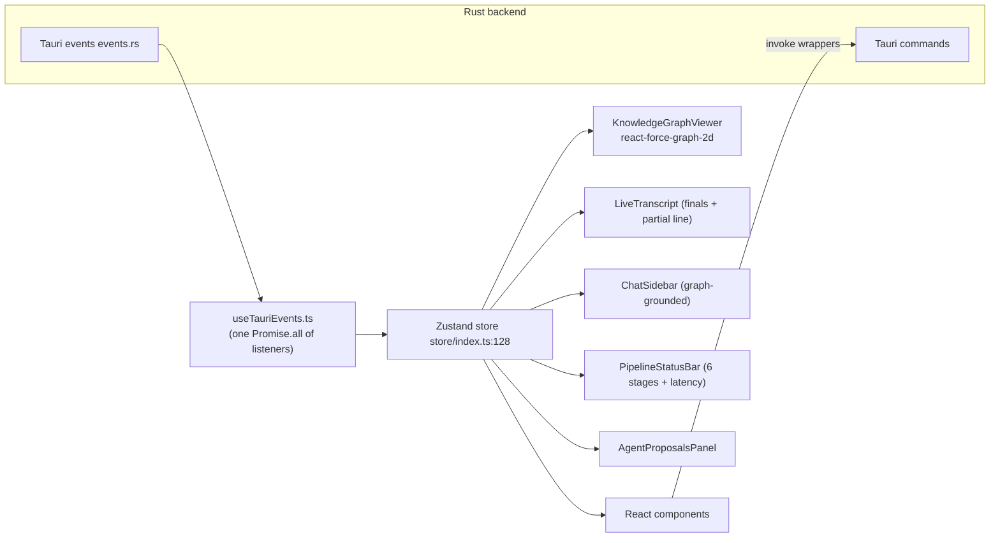

- **Event → state map** (`useTauriEvents.ts:251`): `transcript-update` →
  append + clear partial; `asr-partial` → single interim line; `graph-update`
  → replace snapshot (preserving node identity/positions); `graph-delta` →
  incremental merge; `pipeline-latency`/`pipeline-status` → status bar;
  `agent-proposal` → proposal card + toast; chat token deltas coalesced at
  ~30 fps (`useTauriEvents.ts:131`).
- **Two product modes share one shell.** `nativeS2sEnabled` (a localStorage
  flag, `store/index.ts:571`) reveals the Gemini control; otherwise only the
  cascading transcribe pipeline is reachable. The two pipelines keep **separate
  transcript buffers** (`transcriptSegments` vs `geminiTranscripts`) and can run
  simultaneously (`ControlBar.tsx:131` `isComparing`).
- **Graph snapshot vs delta in the store** (`store/index.ts:303,322`): both
  paths `Object.assign` onto existing node objects to preserve react-force-graph
  `x/y/vx/vy` so the D3 simulation doesn't "jump"; new nodes are seeded near a
  neighbor (`seedNodePositions`, `store/index.ts:94`).

---

## 13. Sequential vs parallel — master summary

| Stage | Sequential or parallel | Why |
|---|---|---|
| Capture (across sources) | **Parallel** | one thread per source (`capture.rs:286`) |
| Capture → pipeline → dispatcher | **Sequential** | single thread each |
| Dispatcher fan-out | **Sequential reader, parallel writers** | clones to per-consumer channels (`commands.rs:396`) |
| Track A vs Track B | **Parallel** | both consume cloned chunks concurrently |
| Batch ASR worker (ASR→diar→emit) | **Sequential** per segment | single thread (`speech/mod.rs:1315`) |
| Streaming ASR (WS I/O) | **Parallel** | provider tokio runtime + event-receiver thread |
| Entity extraction | **Parallel** | 4-thread rayon pool (`speech/mod.rs:21`) |
| Agent proposals | **Parallel** | 2-thread rayon pool (`speech/mod.rs:37`) |
| LLM executor jobs | **Sequential** | single worker, 1 job at a time (`executor.rs:206`) |
| Streaming chat | **Parallel to executor** | bypasses executor, own tokio task (`streaming.rs:244`) |
| Graph mutation | **Serialized** | `Arc<Mutex>` (`state.rs:104`) |
| Graph reads (snapshot) | **Concurrent** | cached `Arc<RwLock>` (`state.rs:86`) |
| TTS → playback | **Parallel to everything** | separate output spine (`playback/mod.rs:184`) |

---

## 14. Backpressure & drop policy

The system favors **dropping audio over blocking** at every fan-out/handoff
boundary, so a slow consumer can never stall capture:

| Boundary | Policy | Citation |
|---|---|---|
| rsac ring buffer → capture thread | drop + edge-triggered `capture-backpressure` event | `capture.rs:536` |
| capture → pipeline | **block** (only blocking hop; rsac absorbs) | `capture.rs:526` |
| dispatcher → speech | `try_send`, **drop** + count (log every 10th) | `commands.rs:399` |
| dispatcher → gemini | `try_send`, **drop** + count | `commands.rs:416` |
| accumulator → ASR worker | `try_send`, **drop** segment | `speech/mod.rs:1233` |
| Gemini audio (during reconnect) | **buffer** (unbounded mpsc, intentional) | `gemini/mod.rs:380` |
| extraction / agent enqueue | bounded rayon pools (backpressure via pool) | `speech/mod.rs:21,37` |
| background extraction (429) | **pause 60 s** | `executor.rs:50` |
| playback ringbuf full | `push_samples` returns count pushed (caller tolerates) | `playback/mod.rs:261` |

---

*This document is generated from a direct read of the source tree. If you change
thread/channel topology, update both this file and the threading/data-flow
sections of [`ARCHITECTURE.md`](ARCHITECTURE.md).*
