# AudioGraph — Data Flow & Concurrency

> **Code-grounded** companion to [`ARCHITECTURE.md`](ARCHITECTURE.md).
> Where `ARCHITECTURE.md` describes the product vision and provider matrix,
> this document describes **what the code actually does today**: every thread,
> every channel, and exactly where work transitions from **sequential** to
> **parallel**.
>
> All citations are `file:line` into `src-tauri/src/` (backend) or `src/`
> (frontend). Last verified: 2026-07-10.
> Retained line numbers are navigation aids and may move as the July working
> slice integrates; the named symbols and explicit status notes are
> authoritative.
>
> **Status rule:** this file distinguishes an implemented adapter from an
> enabled MVP route, and implemented behavior from an accepted-but-open ADR.
> Deepgram is the only ASR enabled for a new MVP session. The source-clock,
> atomic lifecycle, and crash-durable Accepted contracts are not yet complete.
> Historical `load_session` is now a side-effect-free Review read; transactional
> Resume remains separate and open.

---

## Table of Contents

1. [How to read this document](#1-how-to-read-this-document)
2. [Top-level concurrency map](#2-top-level-concurrency-map)
3. [Thread inventory](#3-thread-inventory)
4. [Channel inventory](#4-channel-inventory)
5. [The capture spine (sequential)](#5-the-capture-spine-sequential)
6. [The fan-out point (sequential → parallel)](#6-the-fan-out-point-sequential--parallel)
7. [Track A — Speech-to-graph pipeline](#7-track-a--speech-to-graph-pipeline)
8. [Track B — Gemini Live speech-to-speech](#8-track-b--gemini-live-speech-to-speech)
9. [Track C — TTS / speak-aloud / playback (output spine)](#9-track-c--tts--speak-aloud--playback-output-spine)
10. [LLM executor concurrency](#10-llm-executor-concurrency)
11. [Knowledge-graph concurrency](#11-knowledge-graph-concurrency)
12. [Frontend data flow](#12-frontend-data-flow)
13. [Sequential vs parallel — master summary](#13-sequential-vs-parallel--master-summary)
14. [Backpressure & drop policy](#14-backpressure--drop-policy)
15. [Provider gates and backend ownership](#15-provider-gates-and-backend-ownership)
16. [Revisioned transcript and projection path](#16-revisioned-transcript-and-projection-path)
17. [Canonical files, derived views, and open durability](#17-canonical-files-derived-views-and-open-durability)
18. [Implemented shell vs accepted product shell](#18-implemented-shell-vs-accepted-product-shell)

---

## 1. How to read this document

AudioGraph contains **three independent processing tracks** that all hang off
**one shared audio capture spine**. Only Track A's Deepgram notes route is
enabled for a new MVP content-bearing session; Track B is implemented but
registry-deferred, and Track C is optional output rather than part of the
default notes route:

| Track | What it does | Lives in |
|---|---|---|
| **A — Speech-to-graph** | Deepgram MVP; revisioned transcript → notes/graph projections | `speech/`, `asr/`, `projections.rs`, `projection_scheduler.rs`, `llm/`, `graph/` |
| **B — Native realtime** | Gemini and OpenAI realtime adapters; deferred for MVP starts | `gemini/`, `converse/`, `asr/openai_realtime.rs`, `openai_realtime_agent.rs` |
| **C — TTS / speak-aloud** | optional chat-token output; None is the notes default | `tts/`, `speak_aloud.rs`, `playback/` |

The backend processing system is **OS-thread based**, not a single async runtime. Cross-thread
communication is almost entirely `crossbeam-channel` bounded queues. Each
streaming provider (Deepgram, AssemblyAI, AWS, Gemini, Deepgram Aura TTS) owns
its **own small tokio runtime** internally and bridges back to the std-thread
world over channels.

Rust owns capture, source timing, credentials, long-lived provider sockets,
revision ledgers, projection scheduling/materialization, and session files.
React/Zustand owns configuration intent, user controls, and display state; it
does not own a provider socket or define whether a persisted provider may start.

Throughout, **boxes that run one-item-at-a-time are sequential**; **boxes that
fan out to multiple workers or independent threads are parallel**. The single
most important transition is the **dispatcher fan-out** (§6).

---

## 2. Top-level concurrency map

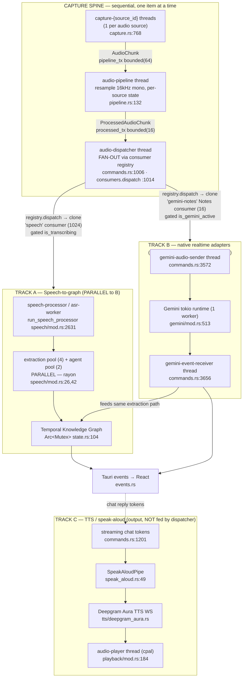
```mermaid
flowchart TD
    subgraph SPINE["CAPTURE SPINE — sequential, one item at a time"]
        direction TB
        CAP["capture-{source_id} threads<br/>(1 per audio source)<br/>capture.rs:768"]
        PIPE["audio-pipeline thread<br/>resample 16kHz mono, per-source state<br/>pipeline.rs:132"]
        DISP["audio-dispatcher thread<br/>FAN-OUT via consumer registry<br/>commands.rs:1006 · consumers.dispatch :1014"]
        CAP -->|"AudioChunk<br/>pipeline_tx bounded(64)"| PIPE
        PIPE -->|"ProcessedAudioChunk<br/>processed_tx bounded(16)"| DISP
    end

    DISP -->|"registry.dispatch → clone<br/>'speech' consumer (1024)<br/>gated is_transcribing"| TRACKA
    DISP -->|"registry.dispatch → clone<br/>'gemini-notes' Notes consumer (16)<br/>gated is_gemini_active"| TRACKB

    subgraph TRACKA["TRACK A — Speech-to-graph  (PARALLEL to B)"]
        SPEECH["speech-processor / asr-worker<br/>run_speech_processor speech/mod.rs:2631"]
        POOLS["extraction pool (4) + agent pool (2)<br/>PARALLEL — rayon<br/>speech/mod.rs:26,42"]
        GRAPH["Temporal Knowledge Graph<br/>Arc&lt;Mutex&gt;  state.rs:104"]
        SPEECH --> POOLS --> GRAPH
    end

    subgraph TRACKB["TRACK B — native realtime adapters<br/>(PARALLEL capability; MVP-deferred)"]
        GSEND["gemini-audio-sender thread<br/>commands.rs:3572"]
        GRT["Gemini tokio runtime (1 worker)<br/>gemini/mod.rs:513"]
        GEVT["gemini-event-receiver thread<br/>commands.rs:3656"]
        GSEND --> GRT --> GEVT
        GEVT -->|"feeds same extraction path"| GRAPH
    end

    GRAPH --> EVENTS["Tauri events → React<br/>events.rs"]
    GEVT --> EVENTS

    subgraph TRACKC["TRACK C — TTS / speak-aloud (output, NOT fed by dispatcher)"]
        CHATTOK["streaming chat tokens<br/>commands.rs:1201"]
        SPEAK["SpeakAloudPipe<br/>speak_aloud.rs:49"]
        TTSWS["Deepgram Aura TTS WS<br/>tts/deepgram_aura.rs"]
        PLAY["audio-player thread (cpal)<br/>playback/mod.rs:184"]
        CHATTOK --> SPEAK --> TTSWS --> PLAY
    end

    EVENTS -.->|"chat reply tokens"| CHATTOK
```

**Key insight:** when an allowed mode is active, Track A and a realtime track
can consume the same processed audio **simultaneously** because the dispatcher
*clones* each chunk to a per-consumer channel. They never compete for ownership
of the stream. The MVP gate currently prevents starting Track B, so this is an
implemented concurrency capability rather than a supported MVP workflow.
Track C is a separate **output** spine driven by chat replies, not by captured
audio.

The dispatcher no longer hardcodes two channels; it fans out through a
**`ProcessedAudioConsumerRegistry`** (`audio/consumer.rs:410`, see §6.1). The two
channels drawn above are now just the startup **speech** consumer and the Gemini
**notes** consumer; native-S2S modes (Gemini converse, OpenAI Realtime) register
additional consumers at runtime (§8). The AEC stage (`aec_vad/`) sits
conceptually *before* this spine and is not yet wired — see §5.

---

## 3. Thread inventory

Every row is an OS thread (`std::thread`) unless noted. Tokio runtimes are
flagged explicitly.

| Thread (name) | Count | Spawn site | Role | Internal model |
|---|---|---|---|---|
| `capture-{source_id}` | 1 per source | `audio/capture.rs:768` | Owns one `rsac::AudioCapture`, tags buffers | Sequential read loop |
| `audio-pipeline` | 1 | `commands.rs:981` (body `pipeline.rs:132`) | Resample/downmix to 16 kHz mono | Sequential |
| `audio-dispatcher` | 1 | `commands.rs:1006` | **Fan-out** via `consumers.dispatch` (`:1014`) | Sequential loop, registry fan-out |
| `speech-processor` (accumulator) | 1 | `commands.rs:1557` (body `speech/mod.rs:2631`) | Accumulate ~2 s segments (batch path) | Sequential |
| `asr-worker` | 1 | `speech/mod.rs:3041` | Whisper inference + diarization + emit | Sequential per segment |
| `audio-mixer` | 1 (streaming ASR only) | `audio/mixer.rs:112` | Sum per-source streams into one "mixed" stream | Sequential |
| `deepgram-ws-rt` etc. | 1 runtime per streaming ASR session | `asr/deepgram.rs:264`, `assemblyai.rs:554` | Provider WebSocket I/O | **tokio**, 1 worker |
| `deepgram-event-rx` (deepgram/assemblyai) | 1 | `speech/mod.rs:4200` | Consume provider events → finals/partials | Sequential |
| `extraction-*` pool | 4 | `speech/mod.rs:26` | Background entity extraction | **rayon**, parallel |
| `agent-react-*` pool | 2 | `speech/mod.rs:42` | Heuristic agent proposals | **rayon**, parallel |
| `diarization-clustering` | 1 (live clustering only) | `diarization/worker.rs:380` | Rolling-window clustering diarization | Sequential, SPSC ringbuf in |
| `llm-executor` | 1 | `llm/executor.rs:172` | Priority queue: chat preempts extraction | Sequential, 1 job at a time |
| `gemini-ws-rt` | 1 runtime | `gemini/mod.rs:513` | Gemini Live WebSocket | **tokio**, 1 worker |
| `gemini-audio-sender` | 1 | `commands.rs:3572` | Pump PCM to Gemini | Sequential |
| `gemini-event-receiver` | 1 | `commands.rs:3656` | Consume `GeminiEvent`, feed graph | Sequential |
| `audio-player` | 1 | `playback/mod.rs:190` | cpal output stream (`!Send`) | Sequential + lock-free ringbuf |
| `graph-autosave` | 1 | spawned at capture start | Persist graph + transcript every 30 s | Sequential |

> **Note on diarization:** the **batch/streaming ASR** paths have no dedicated
> diarization thread. `DiarizationWorker::run()` exists
> (`diarization/mod.rs:350`) but the pipeline calls `process_input(...)`
> **inline** on the ASR worker/event-receiver thread (e.g. `speech/mod.rs:3454`,
> `:3729`, `:4076`, `:4464`). For those backends (`Simple`, `Sortformer`)
> diarization is therefore **sequential, immediately after ASR**.
>
> The **live clustering** backend (`DiarizationBackend::Clustering`, ADR-0017 /
> B16, gated on `diarization-clustering`) is the exception: it runs on its own
> dedicated `diarization-clustering` thread fed by a lock-free `ringbuf` SPSC tap
> off the 16 kHz stream (`diarization/worker.rs:1-34`, spawn `:380`). It
> re-diarizes a rolling window on a fixed cadence and emits only the
> freshly-covered trailing hop, so it is parallel to the ASR critical path.

---

## 4. Channel inventory

All `crossbeam-channel` unless noted. Created in `AppState::new()`
(`state.rs:571`) except where stated.

| Channel | Created | Type / capacity | Payload | Full-channel policy |
|---|---|---|---|---|
| `pipeline_tx/rx` | `state.rs:576` | bounded(64) (~2 s) | `AudioChunk` | `send_timeout(100ms)`, drop on stall (`capture.rs:1121`) |
| `processed_tx/rx` | `state.rs:577` | bounded(16) | `ProcessedAudioChunk` | drained by dispatcher |
| `processed_audio_consumers` registry | `state.rs:590` | `ProcessedAudioConsumerRegistry` | per-consumer descriptors + channels | per-consumer drop policy |
| `speech_audio_tx/rx` (the "speech" consumer) | `state.rs:586` (registered `:591`) | bounded(1024) (~32 s) | `ProcessedAudioChunk` | `DropOldest` (in `dispatch`) |
| runtime native-S2S consumers (`gemini-notes`/`gemini-converse`/`openai-realtime-voice`) | `commands.rs:3495`, `:4188`, `:4745` | bounded(16) each | `ProcessedAudioChunk` | `DropOldest` (in `dispatch`) |
| mixer output | `mixer.rs:116` | bounded(1024) | `ProcessedAudioChunk` (`"mixed"`) | — |
| accumulator → ASR (Whisper) | `speech/mod.rs:3036` | bounded(4) (~8 s) | `AccumulatedSegment` | **drop** |
| accumulator → ASR (cloud HTTP) | `speech/mod.rs:3928` | bounded(32) (~64 s) | `AccumulatedSegment` | **drop** |
| Gemini events out | `gemini/mod.rs:291` | bounded(128) | `GeminiEvent` | — |
| Gemini audio in (to WS task) | `gemini/mod.rs:556` | tokio mpsc bounded(1000) | `AudioCmd` | `try_send`, drops if WS backs up (`:625`) |
| LLM job reply | `executor.rs:144` | std mpsc (per job) | `LlmJobResult` | 1 message |
| streaming chat tokens | `streaming.rs:249` | tokio mpsc bounded(64) | `TokenDelta` | — |
| TTS cmd / events (Aura) | `tts/deepgram_aura.rs:214` | tokio mpsc **unbounded** | `SessionCmd` / `TtsEvent` | — |
| Playback commands | `playback/mod.rs:180` | crossbeam **unbounded** | `AudioCommand` | — |
| Playback samples | `playback/mod.rs:216` | `ringbuf` SPSC (~192k samples) | `i16` | producer returns 0 |

---

## 5. The capture spine (sequential)

Everything before the dispatcher is strictly sequential per stage, but
**multiple capture threads run in parallel** — one per selected source.

All desktop targets resolve rsac v0.4.4 from Git revision
`ea2019bba217cab695d45696bc2ca25430b23dc2`, with default features disabled
and only the target OS backend enabled. A sibling checkout is not part of the
dependency graph. The committed `src-tauri/Cargo.lock` resolves exactly this
revision, and CI verifies the resolution against the manifest pin under
`--locked`.

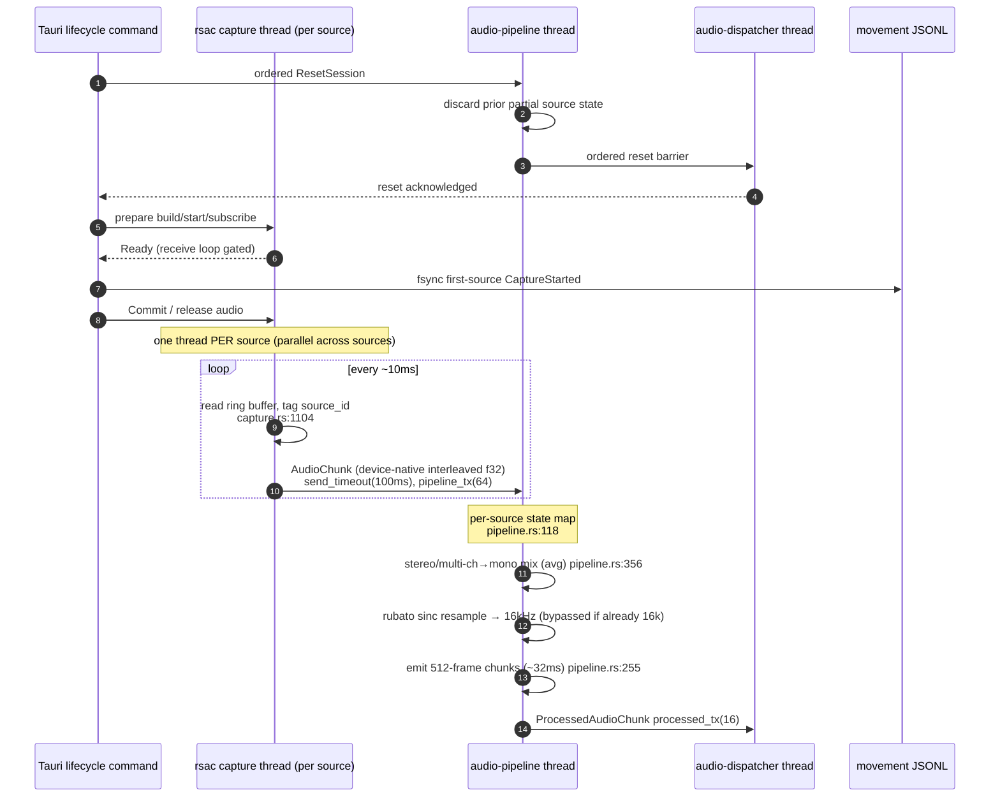
```mermaid
sequenceDiagram
    autonumber
    participant CMD as Tauri lifecycle command
    participant RSAC as rsac capture thread (per source)
    participant PIPE as audio-pipeline thread
    participant DISP as audio-dispatcher thread
    participant AUDIT as movement JSONL

    CMD->>PIPE: ordered ResetSession
    PIPE->>PIPE: discard prior partial source state
    PIPE->>DISP: ordered reset barrier
    DISP-->>CMD: reset acknowledged
    CMD->>RSAC: prepare build/start/subscribe
    RSAC-->>CMD: Ready (receive loop gated)
    CMD->>AUDIT: fsync first-source CaptureStarted
    CMD->>RSAC: Commit / release audio

    Note over RSAC: one thread PER source (parallel across sources)
    loop every ~10ms
        RSAC->>RSAC: read ring buffer, tag source_id<br/>capture.rs:1104
        RSAC->>PIPE: AudioChunk (device-native interleaved f32)<br/>send_timeout(100ms), pipeline_tx(64)
    end

    Note over PIPE: per-source state map<br/>pipeline.rs:118
    PIPE->>PIPE: stereo/multi-ch→mono mix (avg)  pipeline.rs:356
    PIPE->>PIPE: rubato sinc resample → 16kHz (bypassed if already 16k)
    PIPE->>PIPE: emit 512-frame chunks (~32ms)  pipeline.rs:255
    PIPE->>DISP: ProcessedAudioChunk  processed_tx(16)
```

Detail:

- **Target format:** 16 kHz mono, 512-frame chunks
  (`PROCESSED_AUDIO_SAMPLE_RATE_HZ`/`PROCESSED_AUDIO_CHUNK_FRAMES`,
  `pipeline.rs:36,43`). Input already at 16 kHz bypasses the resampler.
- **Per-source isolation:** `source_states: HashMap<Arc<str>, SourcePipelineState>`
  (`pipeline.rs:118`) — each source has its own resampler, buffers, and
  current timestamp state, so interleaved sources never mix at this stage.
- **Session-epoch isolation:** Reset travels in FIFO order on the raw channel,
  clears every partial resampler/accumulation buffer, then crosses the processed
  channel. Dispatcher acknowledgement proves the complete outgoing prefix was
  handled before a restarted source or New Session may proceed.
- **Two-phase source start:** rsac Ready does not release audio. The command
  synchronizes the first-source movement boundary and then commits the prepared
  worker. Startup/audit failure stop-signals the still-gated worker.
- **Capture→pipeline drops rather than blocks indefinitely.** The capture thread
  uses `send_timeout` with a 100 ms budget (`capture.rs:1121`, Finding #53a): a
  stalled pipeline causes the chunk to be dropped (not held) so `stop_capture`
  can always reclaim the thread. rsac's internal ring buffer also drops on
  overflow; the thread polls both `backpressure_report()` and v0.4.1's separate
  subscriber-drop counter and raises edge-triggered `capture-backpressure`
  events with layer-specific diagnostics.
- **Before the spine (not yet wired):** an AEC stage (`aec_vad/mod.rs`, seed
  098b) is scaffolded to clean mic/system capture against the assistant
  render-reference *before* this 16 kHz bus. It is a fixture harness only today
  — no runtime candidate is wired (that decision is tracked by seed `0bdc`).

The diagram is the **implemented sample path**, not the complete ADR-0020
provenance contract. AudioGraph now waits for each requested source's rsac
build/start/subscription acknowledgement and carries rsac source-position time
into the raw chunk (with a monotonic fallback). It does not yet carry
source-clock generations, explicit source-to-session mappings, or a typed
discontinuity for every producer/subscriber/queue/reset/rate-change loss through
`ProcessedAudioChunk`. Fatal exits now reconcile exact handle generations and
one last-source aggregate Stop, but coordinated multi-source/provider rollback
and mid-capture pipeline/dispatcher supervision remain open ADR-0028 work.

---

## 6. The fan-out point (sequential → parallel)

This is the heart of the "mix of sequential and parallel tracks." The single
`audio-dispatcher` thread (`commands.rs:1006`) reads one `ProcessedAudioChunk`
and hands it to the **`ProcessedAudioConsumerRegistry`** (`audio/consumer.rs`),
which **clones it to every active, accepting consumer** so all tracks get the
full stream.

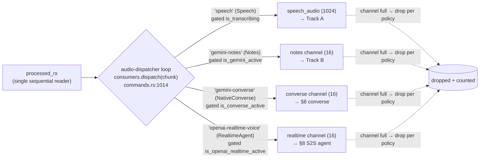
```mermaid
flowchart LR
    PROC["processed_rx<br/>(single sequential reader)"] --> D{"audio-dispatcher loop<br/>consumers.dispatch(chunk)<br/>commands.rs:1014"}
    D -->|"'speech' (Speech)<br/>gated is_transcribing"| SP["speech_audio (1024)<br/>→ Track A"]
    D -->|"'gemini-notes' (Notes)<br/>gated is_gemini_active"| GM["notes channel (16)<br/>→ Track B"]
    D -->|"'gemini-converse' (NativeConverse)<br/>gated is_converse_active"| CV["converse channel (16)<br/>→ §8 converse"]
    D -->|"'openai-realtime-voice' (RealtimeAgent)<br/>gated is_openai_realtime_active"| RA["realtime channel (16)<br/>→ §8 S2S agent"]
    SP & GM & CV & RA -.->|"channel full → drop per policy"| DROP[("dropped + counted")]
```

### 6.1 The consumer registry

Rather than hardcoding a channel field + dispatcher branch per consumer, each
downstream stage subscribes through the registry (`audio/consumer.rs:410`). A
`ProcessedAudioConsumerDescriptor` (`consumer.rs:135`) carries:

- a **stage** (`ProcessedAudioConsumerStage`, `consumer.rs:26`):
  `Speech`, `Notes`, `NativeConverse`, `RealtimeAgent`, `Other`;
- an optional **conflict_group** — registration is rejected if another consumer
  already holds the group (used to make the Gemini *notes* and *converse* modes
  mutually exclusive on the shared Live client, group `gemini-live-client`, and
  to gate the OpenAI Realtime client, group `openai-realtime-client`);
- a bounded **capacity** + **drop_policy** (`DropOldest` / `DropNewest`,
  `consumer.rs:46`);
- a **source_filter** (`All` / specific source ids) and **mixing_mode**
  (`PerSource` / `MixedMono`) so a consumer sees either the real per-source
  chunks or the synthetic `"mixed"` stream from the mixer, never both.

`register` (`consumer.rs:430`) validates the descriptor (bounded channel whose
capacity matches, non-empty labels, no duplicate id, free conflict group);
`dispatch` (`consumer.rs:532`) is the live fan-out hot path.

**Registered consumers today:**

| id | stage | gate (`is_active`) | registered |
|---|---|---|---|
| `speech` | `Speech` | `is_transcribing` | startup, `state.rs:591` |
| `gemini-notes` | `Notes` | `is_gemini_active` | `commands.rs:3495` |
| `gemini-converse` | `NativeConverse` | `is_converse_active` | `commands.rs:4188` |
| `openai-realtime-voice` | `RealtimeAgent` | `is_openai_realtime_active` | `commands.rs:4745` |

- **Independently gated:** each consumer carries an `is_active` closure; the
  dispatcher skips inactive consumers, so an inactive track costs only a flag
  read.
- **Never blocks:** `dispatch` delivers a clone under each consumer's drop
  policy (`DropOldest` evicts a queued chunk and retries; `DropNewest` discards
  the incoming chunk) — a slow consumer (e.g. Gemini reconnecting) can't stall
  the speech track. Per-chunk delivered/dropped counts come back in a
  `ProcessedAudioDispatchSummary`; the dispatcher logs every ~50 drops
  (`commands.rs:1017`) and emits an `audio-consumer-health` event with
  per-consumer queue depth + sent/dropped counters (`commands.rs:1030`,
  `events.rs:109`).
- This is the evolution of the original "Bug 1 fix": previously a single shared
  receiver *split* chunks between consumers; now each consumer is a registry
  entry that gets its own clone.

---

## 7. Track A — Speech-to-graph pipeline

Track A has **two internal topologies** chosen at runtime by the `AsrProvider`
enum in `run_speech_processor` (`speech/mod.rs:2631`).

The topology diagram is an adapter inventory. Under ADR-0033, the backend
resolves the selected provider descriptor before a new content-bearing start;
only the `DeepgramStreaming` branch is MVP-enabled. The other branches remain
compiled, inspectable, and fixture-testable but a normal or direct IPC start is
rejected before provider transport or audio subscription.

### 7.1 Topology selection

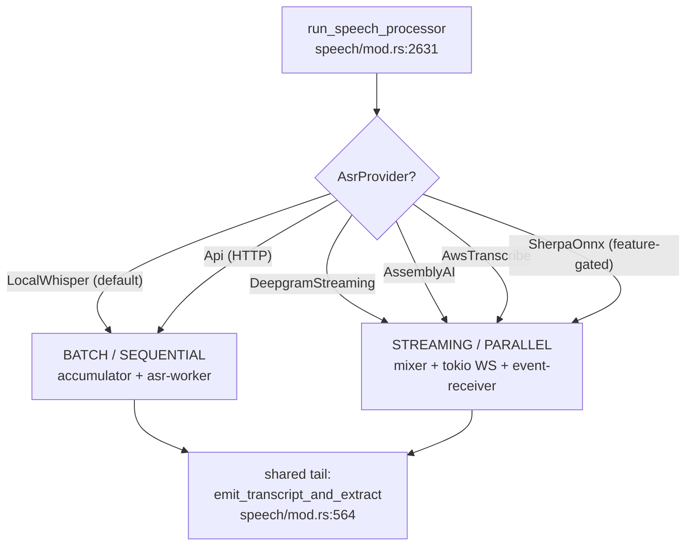
```mermaid
flowchart TD
    START["run_speech_processor<br/>speech/mod.rs:2631"] --> Q{AsrProvider?}
    Q -->|"LocalWhisper (default)"| BATCH["BATCH / SEQUENTIAL<br/>accumulator + asr-worker"]
    Q -->|"Api (HTTP)"| BATCH
    Q -->|"DeepgramStreaming"| STREAM["STREAMING / PARALLEL<br/>mixer + tokio WS + event-receiver"]
    Q -->|"AssemblyAI"| STREAM
    Q -->|"AwsTranscribe"| STREAM
    Q -->|"SherpaOnnx (feature-gated)"| STREAM
    BATCH --> TAIL
    STREAM --> TAIL["shared tail:<br/>emit_transcript_and_extract<br/>speech/mod.rs:564"]
```

### 7.2 Batch path (Whisper / HTTP API) — sequential 2-thread model

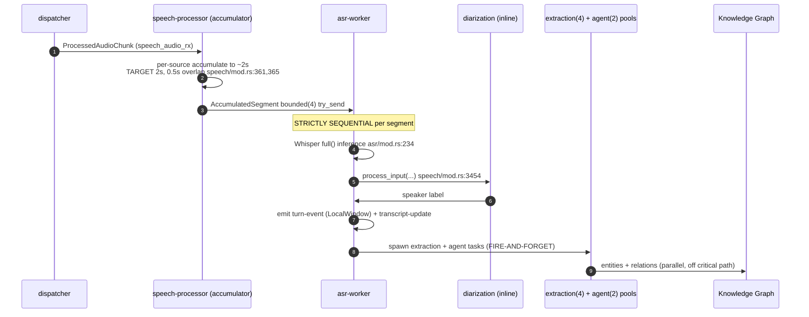
```mermaid
sequenceDiagram
    autonumber
    participant DISP as dispatcher
    participant ACC as speech-processor (accumulator)
    participant ASR as asr-worker
    participant DIAR as diarization (inline)
    participant POOL as extraction(4) + agent(2) pools
    participant G as Knowledge Graph

    DISP->>ACC: ProcessedAudioChunk (speech_audio_rx)
    ACC->>ACC: per-source accumulate to ~2s<br/>TARGET 2s, 0.5s overlap  speech/mod.rs:361,365
    ACC->>ASR: AccumulatedSegment  bounded(4) try_send
    Note over ASR: STRICTLY SEQUENTIAL per segment
    ASR->>ASR: Whisper full() inference  asr/mod.rs:234
    ASR->>DIAR: process_input(...)  speech/mod.rs:3454
    DIAR->>ASR: speaker label
    ASR->>ASR: emit turn-event (LocalWindow) + transcript-update
    ASR->>POOL: spawn extraction + agent tasks (FIRE-AND-FORGET)
    POOL->>G: entities + relations (parallel, off critical path)
```

The batch path is the clearest example of **sequential-then-parallel**:

- **Sequential within the worker:** ASR → diarization → persist/emit happen
  one segment at a time on a single thread (`speech/mod.rs:1315-1411`). Whisper
  inference is blocking CPU work (`asr/mod.rs:234`); HTTP is a blocking
  `reqwest::blocking` POST with a 30 s timeout (`asr/cloud.rs:121`).
- **Parallel after emit:** `emit_transcript_and_extract` (`speech/mod.rs:564`)
  dispatches two **fire-and-forget** tasks onto bounded rayon pools so the ASR
  critical path is never blocked by LLM I/O:
  - **extraction pool** — 4 threads (`extraction-*`, `speech/mod.rs:26`),
  - **agent-proposal pool** — 2 threads (`agent-react-*`, `speech/mod.rs:42`).
  rayon was chosen over `std::thread::spawn` to avoid OS-thread exhaustion in
  long sessions (`speech/mod.rs:14-20`).
- **Heuristic proposals never hit the network.** The agent-proposal pool
  classifies each segment by simple rules (Question / Task / Note) and emits an
  `agent-proposal` event — it never calls an LLM, so it never rate-limits.
  **Questions default to the graph:** the frontend auto-calls
  `add_question_to_graph` (`store/index.ts:216`, local — adds a `Question` node)
  and the card then only offers the *optional* "Ask AI" action (routes to chat).

### 7.3 Streaming path (Deepgram / AssemblyAI / AWS / Sherpa) — parallel

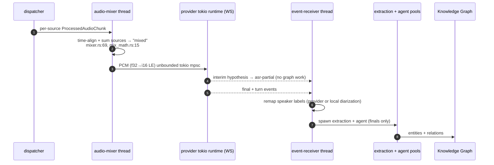
```mermaid
sequenceDiagram
    autonumber
    participant DISP as dispatcher
    participant MIX as audio-mixer thread
    participant WS as provider tokio runtime (WS)
    participant RX as event-receiver thread
    participant POOL as extraction + agent pools
    participant G as Knowledge Graph

    DISP->>MIX: per-source ProcessedAudioChunk
    MIX->>MIX: time-align + sum sources → "mixed"<br/>mixer.rs:69, mix_math.rs:15
    MIX->>WS: PCM (f32→i16 LE)  unbounded tokio mpsc
    WS-->>RX: interim hypothesis → asr-partial (no graph work)
    WS-->>RX: final + turn events
    RX->>RX: remap speaker labels (provider or local diarization)
    RX->>POOL: spawn extraction + agent (finals only)
    POOL->>G: entities + relations
```

- Multiple sources are collapsed into one **"mixed"** stream by the
  `audio-mixer` thread (`mixer.rs:29`) because each provider uses a single
  WebSocket. The mixer sums the per-source 16 kHz-mono streams (per-source ring
  buffers absorb jitter, laggards are silence-filled, the sum is scaled by
  `1/sqrt(active)` and clamped, idle sources evicted after ~2 s); it is
  transparent for a single source.
- **Per-provider source-count limit.** Only **Deepgram** is wired through the
  mixer, so `validate_streaming_asr_source_count` (`commands.rs:120`, via
  `single_session_streaming_asr_name` `commands.rs:103`) no longer caps Deepgram
  source count. **AssemblyAI, AWS Transcribe, and Sherpa-ONNX streaming keep the
  one-source-at-a-time limit** until the mixer is wired into their branches.
  Local Whisper and cloud-batch ASR already handle N sources independently and
  are unaffected.
- **Partials vs finals:** interim hypotheses emit `asr-partial` and do **no**
  downstream work; only finals build a `TranscriptSegment` and run extraction
  (Deepgram `speech/mod.rs:2025-2112`, AssemblyAI `:2379-2445`).
- **Diarization normalization (provider or local):** the "remap speaker labels"
  step is a metadata join, not an audio split. Each final segment that carries a
  speaker is normalized into a provider-neutral `DiarizationSpanRevision`
  (`diarization_span_revision_for_transcript`, `speech/mod.rs:233`) keyed by a
  provider-neutral `span_id`; the raw provider speaker id is provenance-only. The
  `Clustering` backend instead emits its own spans from the
  `diarization-clustering` thread and maps them onto transcript times by overlap
  (`overlap_speaker_for_segment`). All of these feed the session `SpeakerTimeline`
  ledger (`projections.rs`); see
  [`ARCHITECTURE.md`](ARCHITECTURE.md#speaker-timeline-and-diarization-normalization).
- **AWS** is the exception: it runs `block_on` on a current-thread runtime
  **inline on the processor thread** (no separate event-receiver), using
  callbacks for partial/final (`asr/aws_transcribe.rs:146-262`).
- **Sherpa** is fully local/synchronous (no tokio); endpoint = final
  (`asr/sherpa_streaming.rs:130`).

### 7.4 Turn detection (shared contract)

All providers normalize endpointing into one `TurnEventPayload`
(`events.rs:147`) with `TurnEventKind` (`events.rs:135`):
`SpeechStarted, SpeechFinal, UtteranceEnd, EagerEndOfTurn, EndOfTurn,
TurnResumed, LocalWindow`. The local batch path emits `LocalWindow` per ~2 s
window (`speech/mod.rs:1385`); Deepgram maps Nova/Flux signals
(`asr/deepgram.rs:933`, `speech/mod.rs:2122`).

---

## 8. Track B — Gemini Live speech-to-speech

This section documents an implemented adapter that is **deferred for new MVP
starts**. `realtime_agent.gemini_live` is not in the current selectable table;
the backend start gate is authoritative even if saved settings or a frontend
caller still reference it.

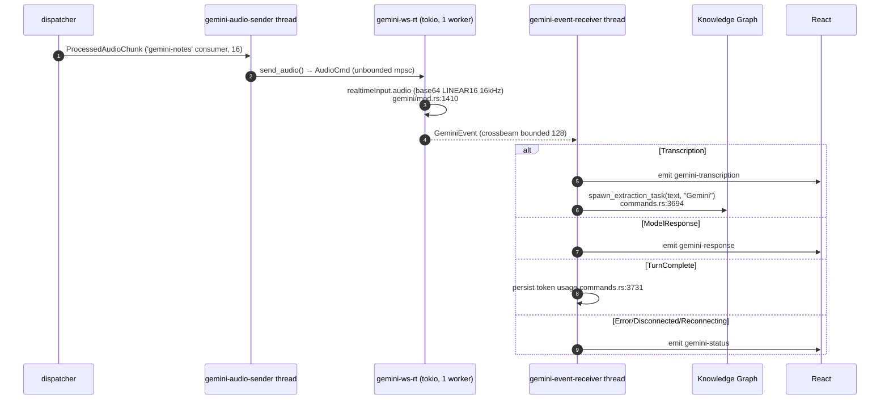
```mermaid
sequenceDiagram
    autonumber
    participant DISP as dispatcher
    participant SEND as gemini-audio-sender thread
    participant RT as gemini-ws-rt (tokio, 1 worker)
    participant RX as gemini-event-receiver thread
    participant G as Knowledge Graph
    participant UI as React

    DISP->>SEND: ProcessedAudioChunk ('gemini-notes' consumer, 16)
    SEND->>RT: send_audio() → AudioCmd (unbounded mpsc)
    RT->>RT: realtimeInput.audio (base64 LINEAR16 16kHz)<br/>gemini/mod.rs:1410
    RT-->>RX: GeminiEvent (crossbeam bounded 128)
    alt Transcription
        RX->>UI: emit gemini-transcription
        RX->>G: spawn_extraction_task(text, "Gemini")<br/>commands.rs:3694
    else ModelResponse
        RX->>UI: emit gemini-response
    else TurnComplete
        RX->>RX: persist token usage  commands.rs:3731
    else Error/Disconnected/Reconnecting
        RX->>UI: emit gemini-status
    end
```

- **Wiring:** `start_gemini` (`commands.rs:3406`) registers the `gemini-notes`
  consumer and spawns the two std-threads (`gemini-audio-sender`
  `commands.rs:3572`, `gemini-event-receiver` `:3656`); the client owns a
  dedicated 1-worker tokio runtime (`gemini/mod.rs:513`) with one `session_task`
  driving reader+writer in a single `select!` (`gemini/mod.rs:1241`).
- **Feeds the same graph:** Gemini transcripts run through the identical
  `speech::spawn_extraction_task` path as Track A, but with a hardcoded speaker
  `"Gemini"` and no diarization context (`commands.rs:3694`).
- **Reconnect:** exponential backoff ladder 1/2/5/10 s then give up
  (`gemini/mod.rs:27-43`); each reconnect replays the full
  `BidiGenerateContentSetup` handshake and threads the session-resumption handle.
  See the [reconnect runbook](ops/gemini-reconnect-runbook.md).
- **Independent of Track A:** Gemini and the speech pipeline can run at the same
  time ("comparison mode") since the dispatcher feeds both.

### 8.1 Native speech-to-speech (converse + OpenAI Realtime)

Two more fan-out paths consume the same processed-audio bus through their own
registry consumers (§6.1), each on a dedicated driver/sender thread pair:

- **Gemini converse** (`NativeConverse`, ADR-0018): `start_converse`
  (`commands.rs:4113`) registers the `gemini-converse` consumer (conflict group
  `gemini-live-client`, so it cannot coexist with notes mode) and spawns
  `converse-audio-sender` (`:4296`) + `converse-driver` (`:4348`). The driver
  runs the `crate::converse` turn-state FSM against the live Gemini client (the
  `GeminiConverseSink`, `commands.rs:3954`).
- **OpenAI Realtime** (`RealtimeAgent`): `start_openai_realtime`
  (`commands.rs:4674`) registers the `openai-realtime-voice` consumer (conflict
  group `openai-realtime-client`) and spawns `openai-realtime-audio-sender`
  (`:4851`) + `openai-realtime-driver` (`:4900`).

Both gate their consumer on a per-mode `is_*_active` flag and tear it down on
stop, so the dispatcher stops cloning to them the moment the session ends.
Both are registry-deferred for new MVP starts; the runtime details explain
implementation and cleanup, not product enablement.

---

## 9. Track C — TTS / speak-aloud / playback (output spine)

This track is **not** fed by captured audio. It turns **streaming chat reply
tokens** into spoken audio, and is the only place audio flows *out*.

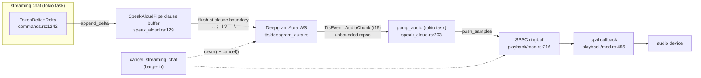
```mermaid
flowchart LR
    subgraph CHAT["streaming chat (tokio task)"]
        TOK["TokenDelta::Delta<br/>commands.rs:1242"]
    end
    TOK -->|"append_delta"| BUF["SpeakAloudPipe clause buffer<br/>speak_aloud.rs:129"]
    BUF -->|"flush at clause boundary<br/>. , ; : ! ? — \\n"| TTS["Deepgram Aura WS<br/>tts/deepgram_aura.rs"]
    TTS -->|"TtsEvent::AudioChunk (i16)<br/>unbounded mpsc"| PUMP["pump_audio (tokio task)<br/>speak_aloud.rs:203"]
    PUMP -->|"push_samples"| RING["SPSC ringbuf<br/>playback/mod.rs:216"]
    RING --> CB["cpal callback<br/>playback/mod.rs:455"]
    CB --> DEV["audio device"]

    CANCEL["cancel_streaming_chat<br/>(barge-in)"] -.->|"clear() + cancel()"| TTS
    CANCEL -.-> RING
```

- **Aggressive flush:** the pipe drains the buffer up to the **last clause
  boundary** on each token batch for low first-audio latency
  (`speak_aloud.rs:129`, boundaries `:42`).
- **Playback thread:** cpal `Stream` is `!Send` on Windows (COM affinity), so it
  lives on its own `std::thread` (`playback/mod.rs:184`) and receives samples
  over a lock-free SPSC ringbuf — never through a lock on the hot path.
- **Barge-in cancel chain:** `cancel_streaming_chat` → `SpeakAloudPipe::cancel`
  → `TtsSession::clear()` (server drops in-flight utterance + session-layer
  `clearing` flag suppresses trailing chunks, `tts/deepgram_aura.rs:660`) **and**
  `AudioPlayer::cancel()` (drains ringbuf, outputs silence within one callback
  period, `playback/mod.rs:466`).
- **Only Deepgram Aura is implemented** today (`tts/deepgram_aura.rs`); Kokoro /
  Piper are referenced but not present.

---

## 10. LLM executor concurrency

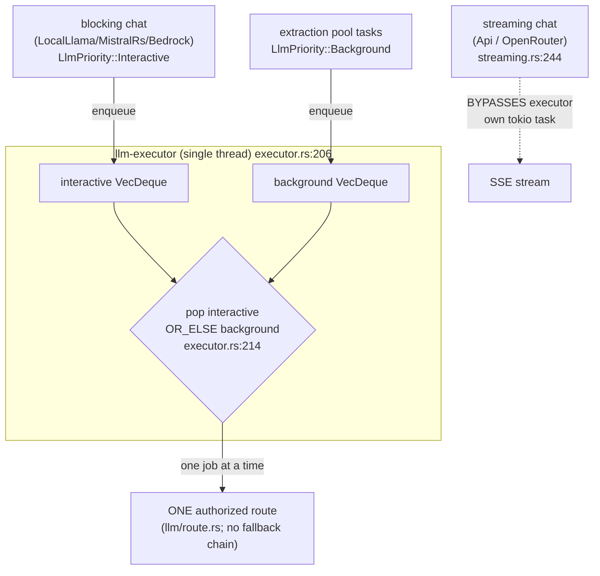
```mermaid
flowchart TD
    EXTRACT["extraction pool tasks<br/>LlmPriority::Background"] -->|enqueue| BQ
    CHATBLK["blocking chat<br/>(LocalLlama/MistralRs/Bedrock)<br/>LlmPriority::Interactive"] -->|enqueue| IQ
    subgraph EXEC["llm-executor (single thread)  executor.rs:206"]
        IQ["interactive VecDeque"]
        BQ["background VecDeque"]
        WORKER{"pop interactive<br/>OR_ELSE background<br/>executor.rs:214"}
        IQ --> WORKER
        BQ --> WORKER
    end
    WORKER -->|"one job at a time"| BACKENDS["ONE authorized route<br/>(llm/route.rs; no fallback chain)"]

    CHATSTREAM["streaming chat<br/>(Api / OpenRouter)<br/>streaming.rs:244"] -.->|"BYPASSES executor<br/>own tokio task"| SSE["SSE stream"]
```

- **One worker thread, one job at a time** (`executor.rs:128,206`). Priority is
  structural: the worker always drains the **interactive** deque before the
  **background** deque (`executor.rs:214`), so chat jumps ahead of queued
  extraction. It is **non-preemptive** — a running extraction is not interrupted.
- **429 cooldown:** a rate-limit error pauses *all* background extraction for
  60 s so chat keeps the quota (`executor.rs:50,257`).
- **Streaming chat bypasses the executor entirely** — `start_streaming_chat`
  for `Api`/`OpenRouter` runs on its own tokio task over a bounded(64) channel
  (`streaming.rs:244`), so it is genuinely concurrent with background
  extraction. Blocking chat (LocalLlama/MistralRs/Bedrock) goes *through* the
  executor as an interactive job (`commands.rs:1490`).
- **Fallback chain** (per provider, first success wins, `executor.rs:260`):
  e.g. `LocalLlama → native → openrouter → api → mistralrs`, with rule-based NER
  (`graph/extraction.rs`) as the always-available terminal fallback.

---

## 11. Knowledge-graph concurrency

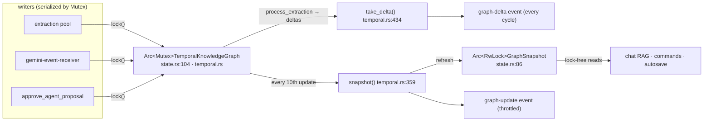
```mermaid
flowchart LR
    subgraph WRITERS["writers (serialized by Mutex)"]
        EX["extraction pool"]
        GM["gemini-event-receiver"]
        AP["approve_agent_proposal"]
    end
    EX & GM & AP -->|"lock()"| KG["Arc&lt;Mutex&gt;TemporalKnowledgeGraph<br/>state.rs:104 · temporal.rs"]
    KG -->|"process_extraction → deltas"| DELTA["take_delta()  temporal.rs:434"]
    KG -->|"every 10th update"| SNAP["snapshot()  temporal.rs:359"]
    SNAP -->|"refresh"| CACHE["Arc&lt;RwLock&gt;GraphSnapshot<br/>state.rs:86"]
    CACHE -->|"lock-free reads"| READERS["chat RAG · commands · autosave"]
    DELTA --> EVT["graph-delta event (every cycle)"]
    SNAP --> EVT2["graph-update event (throttled)"]
```

- The graph itself is **`Arc<Mutex<TemporalKnowledgeGraph>>`** (a plain mutex,
  **not** `RwLock` — `state.rs:104`). All mutation is serialized.
- A separate cached **`Arc<RwLock<GraphSnapshot>>`** (`state.rs:86`) lets Tauri
  commands and chat RAG read the latest snapshot **without** taking the graph
  mutex.
- **petgraph `StableGraph`** with case-insensitive name dedup + temporal edges
  (`valid_from`/`valid_until`), node cap 1000 / edge cap 5000 with LRU-style
  eviction (`temporal.rs:32,284`).
- **Emission policy** (`speech/mod.rs:439`): `graph-delta` every extraction
  cycle that has changes; full `graph-update` snapshot every 10th update; cache
  refreshed every update.

---

## 12. Frontend data flow

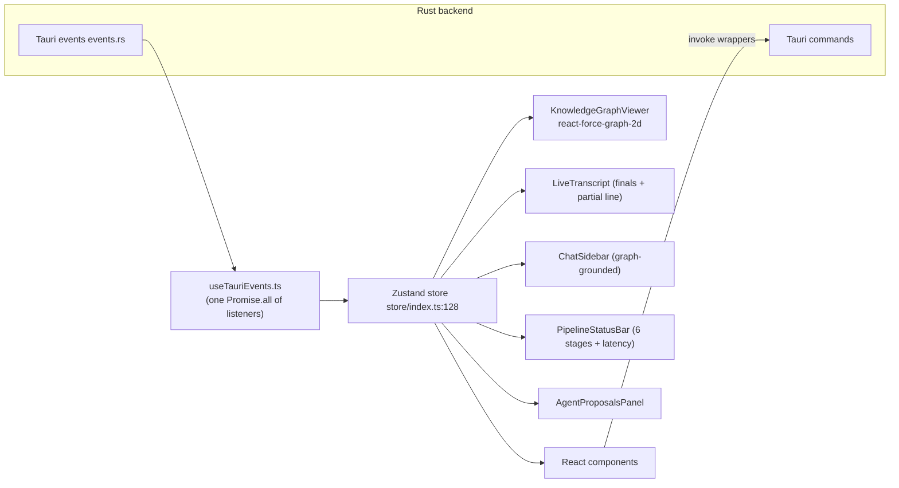
```mermaid
flowchart LR
    subgraph BACKEND["Rust backend"]
        EV["Tauri events  events.rs"]
        CMD["Tauri commands"]
    end
    EV --> HOOK["useTauriEvents.ts<br/>(one Promise.all of listeners)"]
    HOOK --> STORE["Zustand store  store/index.ts:128"]
    STORE --> COMP["React components"]
    COMP -->|"invoke wrappers"| CMD

    STORE --> KGV["KnowledgeGraphViewer<br/>react-force-graph-2d"]
    STORE --> LT["LiveTranscript (finals + partial line)"]
    STORE --> CS["ChatSidebar (graph-grounded)"]
    STORE --> PSB["PipelineStatusBar (6 stages + latency)"]
    STORE --> APP["AgentProposalsPanel"]
```

- **Event → state map** (`useTauriEvents.ts:251`): `transcript-update` →
  append + clear partial; `asr-partial` → single interim line; `graph-update`
  → replace snapshot (preserving node identity/positions); `graph-delta` →
  incremental merge; `pipeline-latency`/`pipeline-status` → status bar;
  `agent-proposal` → proposal card + toast; chat token deltas coalesced at
  ~30 fps (`useTauriEvents.ts:131`).
- **Two product modes share one shell.** `nativeS2sEnabled` (a localStorage
  flag, `store/index.ts:571`) reveals the Gemini control; otherwise only the
  cascading transcribe pipeline is reachable. The two pipelines keep **separate
  transcript buffers** (`transcriptSegments` vs `geminiTranscripts`) and can run
  simultaneously (`ControlBar.tsx:131` `isComparing`).
- **Graph snapshot vs delta in the store** (`store/index.ts:303,322`): both
  paths `Object.assign` onto existing node objects to preserve react-force-graph
  `x/y/vx/vy` so the D3 simulation doesn't "jump"; new nodes are seeded near a
  neighbor (`seedNodePositions`, `store/index.ts:94`).

---

## 13. Sequential vs parallel — master summary

| Stage | Sequential or parallel | Why |
|---|---|---|
| Capture (across sources) | **Parallel** | one thread per source (`capture.rs:768`) |
| Capture → pipeline → dispatcher | **Sequential** | single thread each |
| Dispatcher fan-out | **Sequential reader, parallel writers** | registry clones to per-consumer channels (`commands.rs:1014`, `consumer.rs:532`) |
| Track A vs Track B | **Parallel** | both consume cloned chunks concurrently |
| Batch ASR worker (ASR→diar→emit) | **Sequential** per segment | single thread (`speech/mod.rs:1315`) |
| Streaming ASR (WS I/O) | **Parallel** | provider tokio runtime + event-receiver thread |
| Entity extraction | **Parallel** | 4-thread rayon pool (`speech/mod.rs:26`) |
| Agent proposals | **Parallel** | 2-thread rayon pool (`speech/mod.rs:42`) |
| LLM executor jobs | **Sequential** | single worker, 1 job at a time (`executor.rs:206`) |
| Streaming chat | **Parallel to executor** | bypasses executor, own tokio task (`streaming.rs:244`) |
| Graph mutation | **Serialized** | `Arc<Mutex>` (`state.rs:104`) |
| Graph reads (snapshot) | **Concurrent** | cached `Arc<RwLock>` (`state.rs:86`) |
| TTS → playback | **Parallel to everything** | separate output spine (`playback/mod.rs:184`) |

---

## 14. Backpressure & drop policy

The system favors **dropping audio over blocking** at every fan-out/handoff
boundary, so a slow consumer can never stall capture:

| Boundary | Policy | Citation |
|---|---|---|
| rsac ring buffer → capture thread | drop + edge-triggered `capture-backpressure` event | `capture.rs:1150,1164` |
| capture → pipeline | `send_timeout(100ms)`, **drop** on stall (reclaimable thread) | `capture.rs:1121` |
| dispatcher → each consumer | per-consumer drop policy in `dispatch`, **drop** + count (log ~every 50) | `consumer.rs:532`, `commands.rs:1017` |
| accumulator → ASR worker | `try_send`, **drop** segment | `speech/mod.rs:3108` |
| Gemini audio (to WS task) | bounded(1000) `try_send`, drops if WS backs up | `gemini/mod.rs:556,625` |
| extraction / agent enqueue | bounded rayon pools (backpressure via pool) | `speech/mod.rs:26,42` |
| background extraction (429) | **pause 60 s** | `executor.rs:37,74` |
| playback ringbuf full | `push_samples` returns count pushed (caller tolerates) | `playback/mod.rs:261` |

---

## 15. Provider gates and backend ownership

The provider registry separates **adapter status** from **MVP enablement**.
`MVP_SELECTABLE_PROVIDERS` is the promotion table, and each descriptor derives
`ui_selectable` from it. The current enabled set is:

| Stage | Provider ids enabled for new content-bearing starts |
|---|---|
| ASR | `asr.deepgram` |
| LLM | `llm.local_llama`, `llm.api`, `llm.cerebras`, `llm.sambanova`, `llm.openrouter`, `llm.aws_bedrock`, `llm.mistralrs` |
| TTS | `tts.none`, `tts.deepgram_aura` |
| Realtime agent | none |

The frontend mirrors this set to prevent dead-end choices and provide immediate
accessible feedback. The Rust command boundary repeats the lookup before every
new ASR, LLM, TTS, or realtime content start. That backend check is the policy
boundary: stale persisted settings, a direct Zustand call, or direct Tauri IPC
cannot open a deferred provider route. Stop, cancel, disconnect, drain, and
cleanup do not use the start gate, so an already-active legacy route remains
recoverable.

Ownership is intentionally asymmetric:

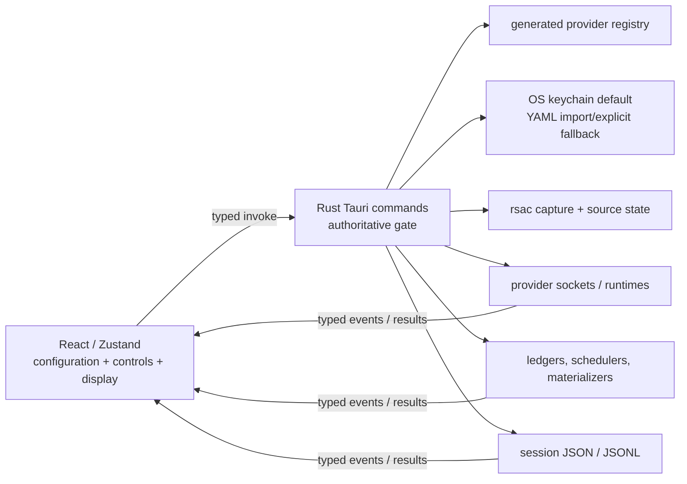
```mermaid
flowchart LR
    UI["React / Zustand<br/>configuration + controls + display"] -->|"typed invoke"| CMD["Rust Tauri commands<br/>authoritative gate"]
    CMD --> REG["generated provider registry"]
    CMD --> CREDS["OS keychain default<br/>YAML import/explicit fallback"]
    CMD --> CAP["rsac capture + source state"]
    CMD --> SOCKETS["provider sockets / runtimes"]
    CMD --> MEMORY["ledgers, schedulers, materializers"]
    CMD --> FILES["session JSON / JSONL"]
    SOCKETS & MEMORY & FILES -->|"typed events / results"| UI
```

Secrets are hydrated into backend runtime state and are not persisted in
`settings.json`, emitted to React, or written to session artifacts. The OS
keychain is the default backend. `credentials.yaml` exists for legacy import or
an explicitly configured file/fallback mode.

---

## 16. Revisioned transcript and projection path

The event-sourced notes/graph path runs alongside the legacy extraction graph
described in §11. Stable ASR revisions drive it as follows:

```mermaid
sequenceDiagram
    autonumber
    participant ASR as ASR event receiver
    participant TW as transcript event writer
    participant TL as TranscriptLedger
    participant PS as notes + graph schedulers
    participant LLM as projection job / enabled LLM
    participant BC as basis classifier
    participant PW as projection event writer
    participant MAT as notes / graph materializer
    participant UI as React

    ASR->>TW: enqueue TranscriptEvent(span id, revision, stability)
    ASR->>TL: apply same revision after enqueue succeeds
    alt partial or unstable revision
        TL-->>UI: transcript state only; no automatic projection job
    else final / end-of-turn / stable revision
        TL->>PS: observe projection-eligible ledger basis
        PS->>LLM: start exact job id + session + basis
        LLM->>BC: completion or failure
        BC->>BC: hash covered ordered subset first
        alt Current
            BC->>MAT: apply semantic patch
            MAT->>PW: enqueue canonical-intent projection patch
            MAT->>MAT: save notes or graph snapshot
            MAT-->>UI: projection patch + materialized update events
        else AppendOnly
            BC->>PS: complete valid-prefix job; coalesce Background current-basis follow-up
            PS->>LLM: run newest stable basis once
        else Revised
            BC-->>PS: reject output; schedule Replay repair if allowed
        end
    end
```

The classifier and scheduler implement ADR-0031's `Current`, `AppendOnly`, and
`Revised` classification and follow-up policy. Covered identities/revisions and
the covered hash are checked before later spans are considered. Automatic bases
exclude unrelated partials. A completion must still own the exact job id, job
session, scheduler session, and ledger session; ownership is checked again
before generation telemetry or apply can advance. Per-kind launch counters are
preserved across in-process scheduler reset, so a replacement job cannot reuse
a still-running same-session worker's id. Reconstructing after process restart
remains deterministic because no old worker survives it.

The schedulers use Background follow-up for valid append-only growth and Replay
repair for revision/reorder/deletion/hash mismatch. They track notes and graph
independently. An AppendOnly completion finishes as a semantically valid prefix
and coalesces one Background job on the newest basis; the resulting Current
patch is folded into `MaterializedProjectionState`. A Revised completion never
mutates the notes or graph view. The legacy mutable
`TemporalKnowledgeGraph` and its autosave remain a second graph generation
until lifecycle/storage work explicitly retires or reconciles it.

The sequence above does **not** mean a patch is crash-durable. Today the writer
calls acknowledge bounded enqueue, not filesystem synchronization; live ledger
and materializer state can therefore advance before canonical bytes cross the
ADR-0027 durability boundary. `Accepted` is an accepted target term, not the
meaning of current `append()` success.

---

## 17. Canonical files, derived views, and open durability

ADR-0027 selects files as the only canonical MVP authority, and ADR-0029 keeps
any future database/index disposable and rebuildable. The current artifact
topology is:

| Artifact | Current role |
|---|---|
| `transcripts/<id>.events.jsonl` | canonical-intent transcript revision stream |
| `transcripts/<id>.speaker.jsonl` | canonical-intent speaker revision stream |
| `projections/<id>.events.jsonl` | canonical-intent notes/graph patch stream |
| `ledgers/<id>.movements.jsonl` | privacy/data-movement evidence stream |
| `sessions.json` | rebuildable session index/pointer |
| `transcripts/<id>.jsonl` | legacy final-transcript compatibility view |
| `notes/<id>.json` | derived materialized notes snapshot |
| `graphs/<id>.materialized.json` | derived event-sourced graph snapshot |
| `graphs/<id>.json` | legacy mutable graph snapshot |
| `projections/<id>.scheduler_queue.json` | operational scheduler snapshot |
| `usage/`, `live_assist/`, `crashes/` | auxiliary session/diagnostic artifacts |

The feature-gated code is a partial SurrealDB Mem (`kv-mem`) experiment; no
production command selects it, and it is neither canonical, durable, nor
repository-conformance-complete. A future SurrealDB, SQLite, redb, or other
index must rebuild from the file streams and may be discarded without
preventing capture, Review, export, or deletion.

The accepted commit protocol remains open. Current risks that callers and UI
must represent honestly include:

- buffered transcript/projection writers synchronize primarily on shutdown;
- enqueue can precede durable write/flush/sync success;
- a derived snapshot can outrun or disagree with its canonical-intent log;
- production data-movement writes now cover the capture Start/Stop aggregate
  and projection LLM activity, but not every ASR/TTS/realtime/provider/artifact/
  credential/promotion transition. Positive egress rows remain useful, but the
  backend emits no versioned exhaustive-coverage marker; every negative route
  claim therefore remains Unknown even when capture Start/Stop is closed;
- a torn JSONL tail and interior corruption do not yet have the full framed
  recovery policy;
- one complete typed artifact manifest does not yet drive every export,
  delete, purge, recovery, retention, and usage operation. Permanent delete and
  purge now use an expanded retry-safe 18-path inventory with index-last
  removal, but export/recovery parity and typed residual IPC remain open.

Historical backend loading is side-effect-free: `load_session` no longer takes
`AppState`; it validates and replays the requested artifacts into a return
payload without replacing the active graph, transcript ledger, materialized
projection state, or schedulers. The MVP frontend blocks Review Open while live
and clears historical projections before a new capture, because shared view
state and unscoped event envelopes do not yet support concurrent Review-while-
Live. Resume is not implicit and remains a future transactional command.

ADR-0027's eventual contract is `Pending` at bounded enqueue and `Accepted`
only after canonical bytes plus required filesystem metadata cross the named
durability boundary. Snapshot failure after that point is cache lag, not event
failure. Until implemented and fault-tested on all three operating systems,
neither enqueue nor a materialized JSON save is evidence for a Saved label.

---

## 18. Implemented shell vs accepted product shell

The React shell now presents Ready (changing to Live now during capture),
Review, and Inspect labels while retaining the proven internal `during`,
`after`, and `analysis` view keys. It mounts existing notes, transcript,
timeline, graph, settings, session, focus, shortcut, and accessibility
primitives. This is a vocabulary/composition checkpoint; it does **not** yet
implement ADR-0028's orthogonal lifecycle or all of ADR-0030's target:

| State model | Current implementation | Accepted target |
|---|---|---|
| Foreground workspace | Ready / Live now / Review / Inspect visible labels over legacy internal view keys; Inspect remains a peer tab | Ready / LiveNow / Review, with Inspect contextual rather than peer-primary |
| Start | separate frontend capture/transcription actions | one backend-owned coordinated Start with source-last acknowledgement and reverse-order rollback |
| Capture vs navigation | historical `load_session` is read-only; Review and Live are serialized; start/stop/rotation share a lifecycle mutex but coordinated Start is still split | backend lifecycle independent from concurrent foreground Review; explicit Resume separately transactional |
| Route label | configured/readiness views exist; positive egress is observable while every negative claim stays Unknown | planned in Ready; observed in LiveNow/Review only after a backend-owned exhaustive coverage marker exists |
| Persistence status | writer/store status surfaces exist | non-dismissible RecoveryRequired and truthful durable Saved boundary |

ADR-0030 is a composition/state-contract rewrite, not a mandate to discard the
working Zustand/Tauri contracts or data panels. The product vocabulary has
landed; independent lifecycle/workspace ownership, contextual Inspect, and the
atomic Start contract remain target work.

Validation follows ADR-0032's claim-sized layers: deterministic contract tests,
focused boundary tests, a full offline timed-PCM-to-replay fixture, opt-in live
provider/hardware tests, and packaged three-OS evidence. A unit test can prove a
queue or classifier rule; it cannot by itself prove real capture, content-egress
policy, crash durability, or release packaging.

---

*This document is generated from a direct read of the source tree. If you change
thread/channel topology, update both this file and the threading/data-flow
sections of [`ARCHITECTURE.md`](ARCHITECTURE.md).*
