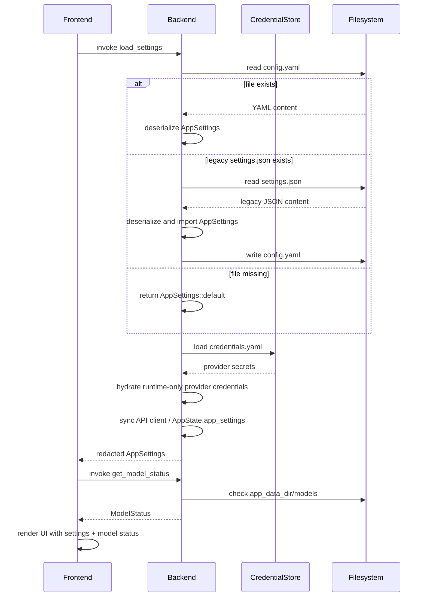
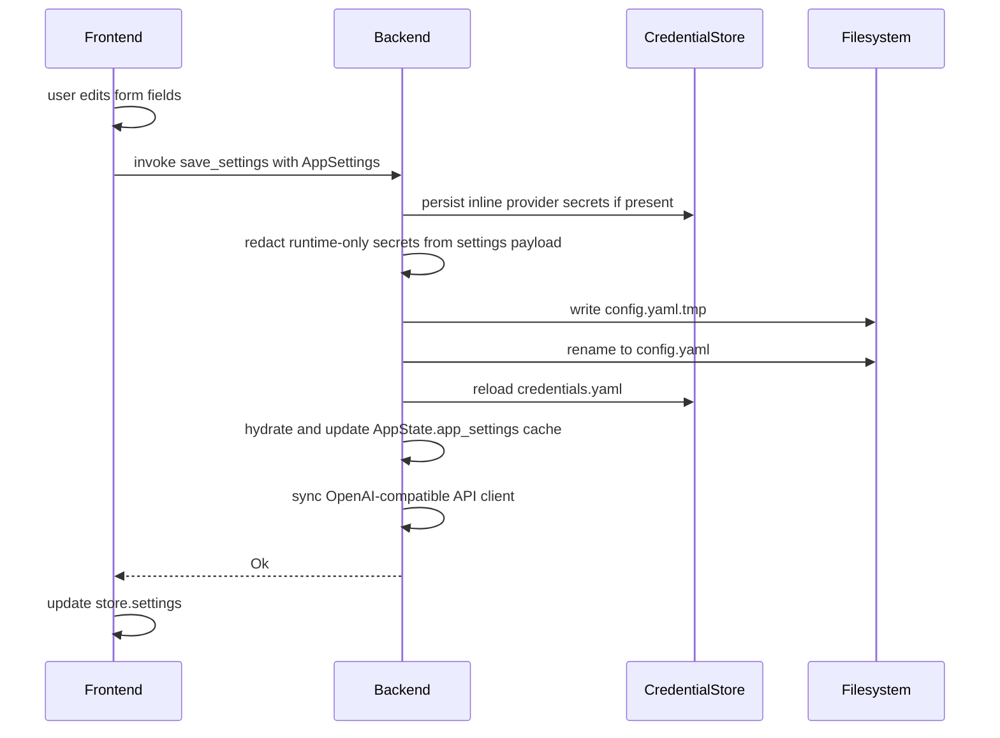
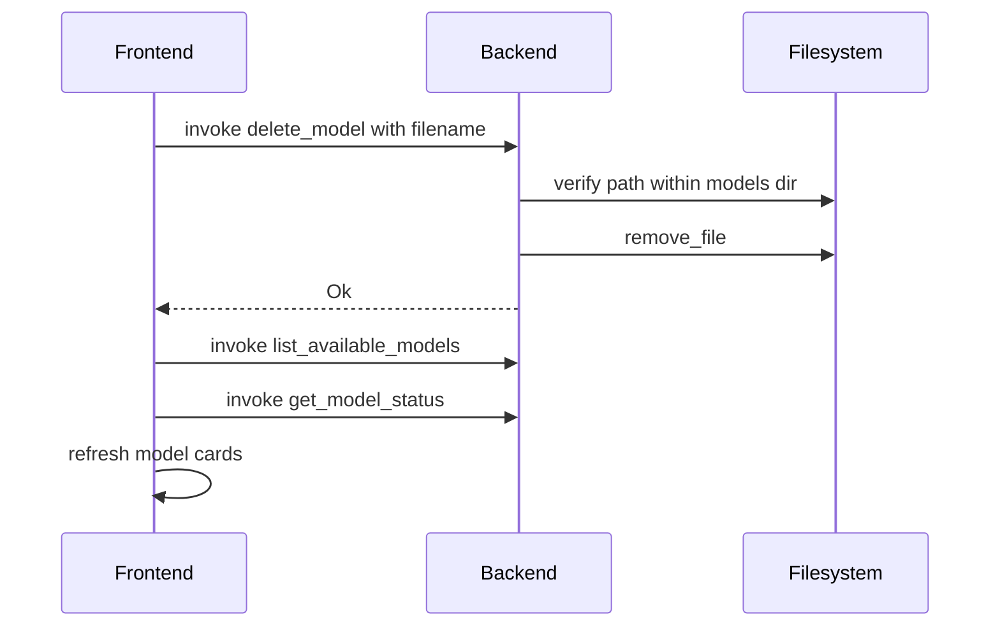
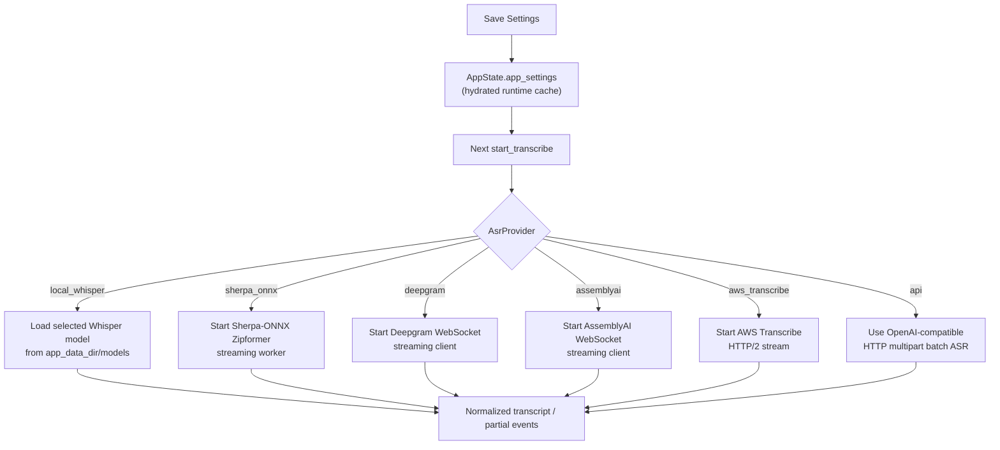

# Settings Page Architecture — Design Document

> **Status:** Implemented baseline; retained as design rationale and gap ledger.
> **Scope:** New `settings/` module, changes to `commands.rs`, `state.rs`, `lib.rs`, frontend types/store/components.

> **Current code note:** Settings now support local/cloud ASR, local/cloud LLM,
> Gemini auth, OpenAI Realtime S2S voice-agent auth
> ([`openai_realtime_agent`](../src-tauri/src/settings/mod.rs:1170)), diarization
> mode ([`diarization`](../src-tauri/src/settings/mod.rs:1172)), OpenRouter
> routing policy ([`openrouter_routing_policy`](../src-tauri/src/settings/mod.rs:1158)),
> TTS provider + speak-aloud ([`tts_provider`](../src-tauri/src/settings/mod.rs:1179),
> [`speak_aloud`](../src-tauri/src/settings/mod.rs:1187)), streaming prefill
> ([`streaming_prefill`](../src-tauri/src/settings/mod.rs:1197)), demo mode, and
> two independent **diagnostics toggles** — anonymous analytics and local file
> logging (see [§12](#12-diagnostics--analytics--local-logging)). The
> cross-cutting [`privacy_mode`](../src-tauri/src/settings/mod.rs:1174) gate
> governs cloud content egress (see [§13](#13-privacy-mode)).
>
> Non-secret user settings persist to `config.yaml` in the app config directory
> ([`get_settings_path`](../src-tauri/src/settings/mod.rs:1740)), with legacy
> app-data `settings.json` imported when `config.yaml` is absent
> ([`get_legacy_settings_json_path`](../src-tauri/src/settings/mod.rs:1748)).
> Credentials default to the **OS credential store** (macOS Keychain, Windows
> Credential Manager, Linux Secret Service via `keyring`); `credentials.yaml` is
> now a non-destructive import source and an explicit dev/headless fallback
> selected via `AUDIO_GRAPH_CREDENTIAL_BACKEND`
> ([`credentials/mod.rs:1-13`](../src-tauri/src/credentials/mod.rs:1)). Secret
> fields are skipped during settings serialization; examples below are
> historical unless explicitly marked current.

---

## Table of Contents

1. [Overview](#1-overview)
2. [Config Schema](#2-config-schema)
3. [Rust Type Definitions](#3-rust-type-definitions)
4. [Settings Module](#4-settings-module)
5. [New Backend Commands](#5-new-backend-commands)
6. [TypeScript Type Definitions](#6-typescript-type-definitions)
7. [Store Changes](#7-store-changes)
8. [Settings Page UI Design](#8-settings-page-ui-design)
9. [Data Flow](#9-data-flow)
10. [File Changes Summary](#10-file-changes-summary)
11. [Implementation Order](#11-implementation-order)
12. [Diagnostics — Analytics + Local Logging](#12-diagnostics--analytics--local-logging)
13. [Privacy Mode](#13-privacy-mode)

---

## 1. Overview

The Settings page provides a unified UI for configuring:

- **Model management** — download, verify, and delete AI models (Whisper, LLM, diarization)
- **ASR provider selection** — local Whisper, Sherpa-ONNX, Deepgram,
  AssemblyAI, AWS Transcribe, or remote OpenAI-compatible API
- **LLM API configuration** — endpoint, API key, and model for entity extraction + chat

Settings are persisted as YAML in the Tauri app config directory. The UI is a full-screen modal overlay triggered by a gear icon in the [`ControlBar`](../src/components/ControlBar.tsx), avoiding the need for `react-router`.

### Design Principles

- **YAML persistence** — non-secret user settings live in `config.yaml`; legacy `settings.json` is import-only compatibility
- **Thin command wrappers** — logic lives in `settings/mod.rs`, commands in `commands.rs`
- **Modal pattern** — no routing library needed; `settingsOpen` boolean in Zustand store
- **Existing CSS conventions** — BEM naming, CSS custom properties, dark theme

---

## 2. Config Schema

Settings are stored at `app_config_dir()/config.yaml`. Older `app_data_dir()/settings.json` files are imported when `config.yaml` does not exist.

### YAML Example

```yaml
asr_provider:
  type: local_whisper
llm_api_config:
  endpoint: https://openrouter.ai/api/v1
  api_key: null
  model: qwen/qwen3-30b-a3b
  max_tokens: 512
  temperature: 0.1
audio_settings:
  sample_rate: 48000
  channels: 2
```

### ASR Provider Variants

**Local Whisper** (default — uses downloaded `ggml-small.en.bin`):
```json
{
  "asr_provider": {
    "type": "local_whisper"
  }
}
```

**API-based ASR** (OpenAI-compatible endpoint):
```json
{
  "asr_provider": {
    "type": "api",
    "endpoint": "https://api.openai.com/v1",
    "api_key": "sk-...",
    "model": "whisper-1"
  }
}
```

### File Location

| Platform | Path |
|---|---|
| **macOS/Linux** | `~/.config/audio-graph/config.yaml` |
| **Windows** | `%APPDATA%\audio-graph\config.yaml` |

Secrets live separately in `credentials.yaml` in the same config directory.

### Public Settings JSON Schema

The backend exposes `public_app_settings_schema_json()` in
[`src-tauri/src/settings/mod.rs`](../src-tauri/src/settings/mod.rs) as the
inspectable schema for `config.yaml` and redacted settings IPC. It is a
**non-secret settings schema** only: runtime credential fields such as
`api_key`, `access_key`, `secret_key`, `session_token`, and
`service_account_path` are excluded with `#[schemars(skip)]` and remain owned
by the credential backend.

---

## 3. Rust Type Definitions

### New file: `src-tauri/src/settings/mod.rs`

```rust
use serde::{Deserialize, Serialize};
use std::path::PathBuf;

use crate::llm::ApiConfig;

// ---------------------------------------------------------------------------
// ASR Provider
// ---------------------------------------------------------------------------

/// How speech recognition is performed.
#[derive(Debug, Clone, Serialize, Deserialize, PartialEq)]
#[serde(tag = "type", rename_all = "snake_case")]
pub enum AsrProvider {
    /// Use the local Whisper model (default).
    LocalWhisper,
    /// Use an OpenAI-compatible speech-to-text API.
    Api {
        endpoint: String,
        #[serde(default, skip_serializing)]
        api_key: String,
        model: String,
    },
    /// Use AWS Transcribe Streaming.
    AwsTranscribe {
        region: String,
        language_code: String,
        credential_source: AwsCredentialSource,
        enable_diarization: bool,
    },
    /// Use Deepgram's realtime WebSocket STT.
    DeepgramStreaming {
        #[serde(default, skip_serializing)]
        api_key: String,
        model: String,
        enable_diarization: bool,
        endpointing_ms: u32,
        utterance_end_ms: u32,
        vad_events: bool,
        eot_threshold: f32,
        eager_eot_threshold: f32,
        eot_timeout_ms: u32,
    },
    /// Use AssemblyAI realtime STT.
    AssemblyAI {
        #[serde(default, skip_serializing)]
        api_key: String,
        enable_diarization: bool,
    },
    /// Use local Sherpa-ONNX streaming ASR.
    SherpaOnnx {
        model_dir: String,
        enable_endpoint_detection: bool,
    },
}

impl Default for AsrProvider {
    fn default() -> Self {
        Self::LocalWhisper
    }
}

// ---------------------------------------------------------------------------
// Audio Settings
// ---------------------------------------------------------------------------

/// Audio capture parameters loaded by start_capture and seeded from
/// `src-tauri/config/default.toml`.
#[derive(Debug, Clone, Serialize, Deserialize, PartialEq)]
pub struct AudioSettings {
    /// Sample rate in Hz. Default 48000.
    pub sample_rate: u32,
    /// Number of audio channels. Default 2.
    pub channels: u16,
}

impl Default for AudioSettings {
    fn default() -> Self {
        Self {
            sample_rate: 48000,
            channels: 2,
        }
    }
}

// ---------------------------------------------------------------------------
// AppSettings
// ---------------------------------------------------------------------------

/// Top-level application settings, persisted to `settings.json`.
#[derive(Debug, Clone, Serialize, Deserialize, PartialEq)]
pub struct AppSettings {
    /// ASR provider configuration.
    #[serde(default)]
    pub asr_provider: AsrProvider,

    /// Whisper model filename selected in Settings.
    #[serde(default = "default_whisper_model")]
    pub whisper_model: String,

    /// LLM provider configuration for entity extraction and chat.
    #[serde(default)]
    pub llm_provider: LlmProvider,

    /// Legacy/OpenAI-compatible LLM API configuration.
    #[serde(default)]
    pub llm_api_config: Option<LlmApiConfig>,

    /// Audio capture settings.
    #[serde(default)]
    pub audio_settings: AudioSettings,

    /// Gemini Live pipeline settings.
    #[serde(default)]
    pub gemini: GeminiSettings,

    /// Runtime log verbosity and first-launch demo state.
    #[serde(default, skip_serializing_if = "Option::is_none")]
    pub log_level: Option<String>,
    #[serde(default, skip_serializing_if = "Option::is_none")]
    pub demo_mode: Option<bool>,
}

impl Default for AppSettings {
    fn default() -> Self {
        Self {
            asr_provider: AsrProvider::default(),
            whisper_model: default_whisper_model(),
            llm_provider: LlmProvider::default(),
            llm_api_config: None,
            audio_settings: AudioSettings::default(),
            gemini: GeminiSettings::default(),
            log_level: Some("info".to_string()),
            demo_mode: None,
        }
    }
}
```

### Changes to existing types

The existing [`ApiConfig`](../src-tauri/src/llm/api_client.rs:17) already has `Serialize` and `Deserialize` derives, so it can be reused directly in `AppSettings`. No changes needed to [`ApiConfig`](../src-tauri/src/llm/api_client.rs:17).

---

## 4. Settings Module

### `src-tauri/src/settings/mod.rs` — persistence functions

```rust
use std::fs;
use std::path::PathBuf;
use tauri::{AppHandle, Manager};

// ... (types from section 3 above) ...

// ---------------------------------------------------------------------------
// Path resolution
// ---------------------------------------------------------------------------

/// Get the path to `settings.json` in the app data directory.
pub fn get_settings_path(app: &AppHandle) -> Result<PathBuf, String> {
    let base = app
        .path()
        .app_data_dir()
        .map_err(|e| format!("Failed to resolve app data dir: {}", e))?;

    if !base.exists() {
        fs::create_dir_all(&base)
            .map_err(|e| format!("Failed to create app data dir: {}", e))?;
    }

    Ok(base.join("settings.json"))
}

// ---------------------------------------------------------------------------
// Load / Save
// ---------------------------------------------------------------------------

/// Load settings from disk. Returns defaults if the file doesn't exist.
///
/// If the file exists but is malformed, logs a warning and returns defaults
/// rather than failing — this prevents a corrupt file from blocking app startup.
pub fn load_settings(app: &AppHandle) -> Result<AppSettings, String> {
    let path = get_settings_path(app)?;

    if !path.exists() {
        log::info!("No settings file found at {}, using defaults", path.display());
        return Ok(AppSettings::default());
    }

    let content = fs::read_to_string(&path)
        .map_err(|e| format!("Failed to read settings file: {}", e))?;

    match serde_json::from_str::<AppSettings>(&content) {
        Ok(settings) => {
            log::info!("Loaded settings from {}", path.display());
            Ok(settings)
        }
        Err(e) => {
            log::warn!(
                "Failed to parse settings from {}: {}. Using defaults.",
                path.display(),
                e
            );
            Ok(AppSettings::default())
        }
    }
}

/// Save settings to disk (atomic write via temp file + rename).
pub fn save_settings(app: &AppHandle, settings: &AppSettings) -> Result<(), String> {
    let path = get_settings_path(app)?;

    let json = serde_json::to_string_pretty(settings)
        .map_err(|e| format!("Failed to serialize settings: {}", e))?;

    // Write to temp file first, then rename for atomicity.
    let tmp_path = path.with_extension("json.tmp");
    fs::write(&tmp_path, &json)
        .map_err(|e| format!("Failed to write settings file: {}", e))?;
    fs::rename(&tmp_path, &path)
        .map_err(|e| format!("Failed to rename settings file: {}", e))?;

    log::info!("Saved settings to {}", path.display());
    Ok(())
}
```

### Key design decisions

1. **Graceful fallback on parse failure** — a corrupt `config.yaml` returns defaults rather than an error, preventing the app from being bricked by a bad config file.
2. **Atomic writes** — write to `.yaml.tmp` then rename, preventing partial writes from corrupting the file on crash.
3. **`app_config_dir()`** — user-editable configuration lives next to `credentials.yaml`; model data remains in app data.

---

## 5. New Backend Commands

### 5.1 `load_settings` — Load settings from disk

```rust
/// Load persisted settings from `config.yaml` (with legacy settings.json import and defaults fallback).
#[tauri::command]
pub async fn load_settings(
    app: tauri::AppHandle,
    state: State<'_, AppState>,
) -> Result<crate::settings::AppSettings, String> {
    let settings = crate::settings::load_settings(&app)?;

    // Sync in-memory state with loaded settings
    if let Some(ref api_config) = settings.llm_api_config {
        let client = ApiClient::new(api_config.clone());
        *state.api_client.lock().map_err(|e| e.to_string())? = Some(client);
    }

    // Cache in AppState for quick access
    *state.settings.lock().map_err(|e| e.to_string())? = Some(settings.clone());

    Ok(settings)
}
```

### 5.2 `save_settings` — Persist settings to disk

```rust
/// Save settings to `config.yaml` and update in-memory state.
#[tauri::command]
pub async fn save_settings(
    app: tauri::AppHandle,
    settings: crate::settings::AppSettings,
    state: State<'_, AppState>,
) -> Result<(), String> {
    // Persist to disk
    crate::settings::save_settings(&app, &settings)?;

    // Update in-memory API client if LLM config changed
    if let Some(ref api_config) = settings.llm_api_config {
        let client = ApiClient::new(api_config.clone());
        *state.api_client.lock().map_err(|e| e.to_string())? = Some(client);
    } else {
        *state.api_client.lock().map_err(|e| e.to_string())? = None;
    }

    // Cache updated settings
    *state.settings.lock().map_err(|e| e.to_string())? = Some(settings);

    Ok(())
}
```

### 5.3 `get_settings` — Get current in-memory settings

```rust
/// Get the current in-memory settings (fast, no disk I/O).
#[tauri::command]
pub async fn get_settings(
    state: State<'_, AppState>,
) -> Result<crate::settings::AppSettings, String> {
    let guard = state.settings.lock().map_err(|e| e.to_string())?;
    Ok(guard.clone().unwrap_or_default())
}
```

### 5.4 `delete_model` — Delete a model file

```rust
/// Delete a downloaded model file from the models directory.
#[tauri::command]
pub async fn delete_model(
    app: tauri::AppHandle,
    filename: String,
) -> Result<String, String> {
    let models_dir = crate::models::get_models_dir(&app);
    let path = models_dir.join(&filename);

    if !path.exists() {
        return Err(format!("Model file not found: {}", filename));
    }

    // Safety: ensure path is within models_dir (prevent path traversal)
    let canonical_models = models_dir.canonicalize()
        .map_err(|e| format!("Failed to resolve models dir: {}", e))?;
    let canonical_path = path.canonicalize()
        .map_err(|e| format!("Failed to resolve model path: {}", e))?;
    if !canonical_path.starts_with(&canonical_models) {
        return Err("Invalid model path: path traversal detected".to_string());
    }

    std::fs::remove_file(&path)
        .map_err(|e| format!("Failed to delete model file: {}", e))?;

    log::info!("Deleted model file: {}", filename);
    Ok(format!("Deleted {}", filename))
}
```

### 5.5 Command Registration

Add to [`lib.rs`](../src-tauri/src/lib.rs:35) `generate_handler![]`:

```rust
commands::load_settings,
commands::save_settings,
commands::get_settings,
commands::delete_model,
```

### Command Summary

| Command | Parameters | Returns | Description |
|---|---|---|---|
| `load_settings` | `app: AppHandle, state: State` | `Result<AppSettings>` | Load from disk (defaults if missing) + sync in-memory |
| `save_settings` | `app: AppHandle, settings: AppSettings, state: State` | `Result<()>` | Persist to disk + update in-memory |
| `get_settings` | `state: State` | `Result<AppSettings>` | Read current in-memory settings (no I/O) |
| `delete_model` | `app: AppHandle, filename: String` | `Result<String>` | Delete a model file from models dir |

---

## 6. TypeScript Type Definitions

### New types in `types/index.ts`

```typescript
// ---------------------------------------------------------------------------
// Model readiness types (mirrors Rust ModelReadiness enum)
// ---------------------------------------------------------------------------

export type ModelReadiness = "Ready" | "NotDownloaded" | "Invalid";

export interface ModelStatus {
    whisper: ModelReadiness;
    llm: ModelReadiness;
    sortformer: ModelReadiness;
}

export type AwsCredentialSource =
    | { type: "default_chain" }
    | { type: "profile"; name: string }
    | { type: "access_keys"; access_key?: string };

// ---------------------------------------------------------------------------
// ASR Provider (mirrors Rust AsrProvider enum with serde tag)
// ---------------------------------------------------------------------------

export type AsrProvider =
    | { type: "local_whisper" }
    | { type: "api"; endpoint: string; api_key?: string; model: string }
    | { type: "aws_transcribe"; region: string; language_code: string; credential_source: AwsCredentialSource; enable_diarization: boolean }
    | { type: "deepgram"; api_key?: string; model: string; enable_diarization: boolean }
    | { type: "assemblyai"; api_key?: string; enable_diarization: boolean }
    | { type: "sherpa_onnx"; model_dir: string; enable_endpoint_detection: boolean };

export type LlmProvider =
    | { type: "local_llama" }
    | { type: "api"; endpoint: string; api_key?: string; model: string }
    | { type: "aws_bedrock"; region: string; model_id: string; credential_source: AwsCredentialSource }
    | { type: "mistralrs"; model_id: string };

// ---------------------------------------------------------------------------
// Audio Settings
// ---------------------------------------------------------------------------

export interface AudioSettings {
    sample_rate: number;
    channels: number;
}

// ---------------------------------------------------------------------------
// Application Settings (mirrors Rust AppSettings)
// ---------------------------------------------------------------------------

export interface AppSettings {
    asr_provider: AsrProvider;
    whisper_model: string;
    llm_provider: LlmProvider;
    llm_api_config: LlmApiConfig | null;
    audio_settings: AudioSettings;
    gemini: GeminiSettings;
    log_level?: string;
    demo_mode?: boolean;
}

/** LLM API configuration (mirrors Rust ApiConfig). */
export interface LlmApiConfig {
    endpoint: string;
    api_key: string | null;
    model: string;
    max_tokens: number;
    temperature: number;
}
```

### Updated `ModelInfo` type

Add the missing `is_valid` and `description` fields to match the Rust struct:

```typescript
export interface ModelInfo {
    name: string;
    filename: string;
    url: string;
    size_bytes: number | null;
    is_downloaded: boolean;
    is_valid: boolean;          // ← NEW
    local_path: string | null;
    description: string;        // ← NEW
}
```

### Updated `AudioGraphStore` interface

Add new settings-related fields:

```typescript
export interface AudioGraphStore {
    // ... existing fields ...

    // ── Settings ──────────────────────────────────────────────────────────
    settings: AppSettings | null;
    modelStatus: ModelStatus | null;
    settingsOpen: boolean;
    settingsLoading: boolean;

    openSettings: () => void;
    closeSettings: () => void;
    fetchSettings: () => Promise<void>;
    saveSettings: (settings: AppSettings) => Promise<void>;
    fetchModelStatus: () => Promise<void>;
    deleteModel: (filename: string) => Promise<void>;
}
```

---

## 7. Store Changes

### New store fields and actions in `store/index.ts`

```typescript
// ── Settings ──────────────────────────────────────────────────────────
settings: null,
modelStatus: null,
settingsOpen: false,
settingsLoading: false,

openSettings: () => set({ settingsOpen: true }),
closeSettings: () => set({ settingsOpen: false }),

fetchSettings: async () => {
    set({ settingsLoading: true });
    try {
        const settings = await invoke<AppSettings>("load_settings");
        set({ settings, settingsLoading: false, error: null });
    } catch (e) {
        set({
            settingsLoading: false,
            error: e instanceof Error ? e.message : String(e),
        });
    }
},

saveSettings: async (settings: AppSettings) => {
    try {
        await invoke("save_settings", { settings });
        set({ settings, error: null });
    } catch (e) {
        set({ error: e instanceof Error ? e.message : String(e) });
    }
},

fetchModelStatus: async () => {
    try {
        const modelStatus = await invoke<ModelStatus>("get_model_status");
        set({ modelStatus, error: null });
    } catch (e) {
        set({ error: e instanceof Error ? e.message : String(e) });
    }
},

deleteModel: async (filename: string) => {
    try {
        await invoke("delete_model", { filename });
        // Refresh models list and status after deletion
        const models = await invoke<ModelInfo[]>("list_available_models");
        const modelStatus = await invoke<ModelStatus>("get_model_status");
        set({ models, modelStatus, error: null });
    } catch (e) {
        set({ error: e instanceof Error ? e.message : String(e) });
    }
},
```

### Startup initialization

In `App.tsx` or the `useTauriEvents` hook, call `fetchSettings()` on mount to load persisted settings and hydrate the API client on the backend:

```typescript
useEffect(() => {
    fetchSettings();
    fetchModelStatus();
    fetchModels();
}, []);
```

---

## 8. Settings Page UI Design

### 8.1 Entry Point — Gear Icon in ControlBar

Add a gear icon button to [`ControlBar`](../src/components/ControlBar.tsx:92) in the `control-bar__right` div:

```tsx
<div className="control-bar__right">
    {/* existing active-source display */}
    <button
        className="control-bar__settings-btn"
        onClick={openSettings}
        aria-label="Open settings"
        title="Settings"
    >
        ⚙️
    </button>
</div>
```

### 8.2 Modal Overlay

The settings page is a full-screen modal rendered in [`App.tsx`](../src/App.tsx) when `settingsOpen` is `true`:

```tsx
{settingsOpen && <SettingsPage />}
```

### 8.3 SettingsPage Component Structure

```
SettingsPage (modal overlay)
├── Settings Header (title + close button)
└── Settings Body (scrollable)
    ├── Section: Models
    │   ├── ModelCard (Whisper)
    │   ├── ModelCard (LLM)
    │   └── ModelCard (Sortformer / diarization readiness)
    ├── Section: ASR Provider
    │   ├── Radio: Local Whisper
    │   ├── Radio: Sherpa-ONNX
    │   ├── Radio: OpenAI-compatible API
    │   ├── Radio: Deepgram
    │   ├── Radio: AssemblyAI
    │   └── Radio: AWS Transcribe
    ├── Section: LLM Provider
    │   ├── Local llama.cpp
    │   ├── Mistral.rs
    │   ├── OpenAI-compatible API
    │   └── AWS Bedrock
    └── Section: Gemini Live + credential management
        ├── API Key / Vertex AI auth
        ├── Provider-specific Test buttons
        └── Clear saved credential actions
```

### 8.4 ASCII UI Mockup

```
┌──────────────────────────────────────────────────────────────────┐
│  ⚙ Settings                                              ✕ Close│
├──────────────────────────────────────────────────────────────────┤
│                                                                  │
│  ── Models ──────────────────────────────────────────────────    │
│                                                                  │
│  ┌────────────────────────────────────────────────────────────┐  │
│  │  🎤 Whisper Small - English                      ✅ Ready  │  │
│  │  Speech recognition model for English transcription        │  │
│  │  Size: 465 MB    Path: .../models/ggml-small.en.bin       │  │
│  │                                          [🗑 Delete]       │  │
│  └────────────────────────────────────────────────────────────┘  │
│                                                                  │
│  ┌────────────────────────────────────────────────────────────┐  │
│  │  🧠 LFM2-350M Extract                    ⬇ Not Downloaded │  │
│  │  Small language model for entity extraction                │  │
│  │  Size: 218 MB                                              │  │
│  │                                          [⬇ Download]      │  │
│  └────────────────────────────────────────────────────────────┘  │
│                                                                  │
│  ┌────────────────────────────────────────────────────────────┐  │
│  │  🎙 Sortformer Diarization                       ✅ Ready  │  │
│  │  Speaker diarization model readiness                      │  │
│  └────────────────────────────────────────────────────────────┘  │
│                                                                  │
│  ── ASR Provider ────────────────────────────────────────────    │
│                                                                  │
│  (●) Local Whisper   Uses downloaded Whisper model               │
│  ( ) Sherpa-ONNX     Local streaming Zipformer model             │
│  ( ) Deepgram        Cloud realtime STT                          │
│  ( ) AssemblyAI      Cloud realtime STT                          │
│  ( ) AWS Transcribe  AWS streaming STT                           │
│  ( ) API             OpenAI-compatible speech-to-text API        │
│                                                                  │
│  ── LLM API Configuration ───────────────────────────────────    │
│                                                                  │
│  Endpoint    [https://openrouter.ai/api/v1              ]        │
│  API Key     [••••••••••••••••••••                       ]        │
│  Model       [qwen/qwen3-30b-a3b                        ]        │
│  Max Tokens  [512        ]    Temperature  [0.1       ]          │
│                                                                  │
│                                       [Save Settings]            │
│                                                                  │
└──────────────────────────────────────────────────────────────────┘
```

### 8.5 Model Card States

| State | Badge | Actions |
|---|---|---|
| `Ready` | `✅ Ready` (green) | `🗑 Delete` button |
| `NotDownloaded` | `⬇ Not Downloaded` (gray) | `⬇ Download` button |
| `Invalid` | `⚠ Invalid` (amber) | `🗑 Delete` + `⬇ Re-download` buttons |
| Downloading | `⏳ Downloading 42%` (blue, animated) | Progress bar, no actions |

### 8.6 ASR Provider Section Behavior

- When "Local Whisper" is selected: no additional fields shown.
- When "API" is selected: show three input fields:
  - **Endpoint** — text input, placeholder: `https://api.openai.com/v1`
  - **API Key** — password input, placeholder: `sk-...` (optional)
  - **Model** — text input, placeholder: `whisper-1`

### 8.7 CSS Classes (BEM convention)

```
.settings-modal                 — Fixed overlay, z-index: 2000
.settings-modal__backdrop       — Semi-transparent background
.settings-modal__container      — Centered panel (max-width: 680px)
.settings-modal__header         — Title + close button
.settings-modal__body           — Scrollable content
.settings-modal__close-btn      — Close button (top right)

.settings-section               — Section wrapper
.settings-section__title        — Section heading

.model-card                     — Individual model card
.model-card__header             — Name + status badge row
.model-card__name               — Model display name
.model-card__badge              — Status badge (Ready/NotDownloaded/Invalid)
.model-card__badge--ready       — Green badge
.model-card__badge--missing     — Gray badge
.model-card__badge--invalid     — Amber badge
.model-card__badge--downloading — Blue animated badge
.model-card__description        — Model description text
.model-card__meta               — Size + path info
.model-card__actions            — Button row
.model-card__progress           — Download progress bar

.settings-radio                 — Radio button group
.settings-radio__option         — Individual radio option
.settings-radio__option--selected — Selected state

.settings-form                  — Form section
.settings-form__field           — Label + input wrapper
.settings-form__label           — Field label
.settings-form__input           — Text/password input
.settings-form__row             — Horizontal field group

.settings-modal__save-btn       — Save button
```

---

## 9. Data Flow

### 9.1 Startup Flow



### 9.2 Save Settings Flow



### 9.3 Model Delete Flow



### 9.4 ASR Provider Impact

When the saved ASR provider changes, the speech processor thread needs to be
aware. The current implementation hydrates runtime credentials into
`AppState.app_settings` on load/save, and `start_transcribe()` reads that
runtime settings snapshot when it builds the ASR path. Provider changes
therefore take effect on the **next transcription start**, not mid-stream.



> **Status note:** This design document started as the settings persistence/UI
> plan. Runtime ASR routing has since landed for the local, cloud, and
> streaming providers listed above.

---

## 10. Implemented File Changes Summary

### New Files

| File | Description |
|---|---|
| `src-tauri/src/settings/mod.rs` | `AppSettings`, `AsrProvider`, `AudioSettings` types + `load_settings()`, `save_settings()`, `get_settings_path()` |
| `src/components/SettingsPage.tsx` | Settings modal overlay component |
| `src/components/SettingsPage.css` (or append to `App.css`) | Settings-specific styles |

### Modified Files — Backend

| File | Changes |
|---|---|
| [`src-tauri/src/lib.rs`](../src-tauri/src/lib.rs) | Registers settings, model, credential, provider-test, and runtime log-level commands |
| [`src-tauri/src/commands.rs`](../src-tauri/src/commands.rs) | Owns `load_settings_cmd`, `save_settings_cmd`, `set_log_level`, model status/download/delete, provider connection tests, and credential commands |
| [`src-tauri/src/state.rs`](../src-tauri/src/state.rs) | Holds `app_settings: Arc<RwLock<AppSettings>>` plus hydrated provider state |

### Modified Files — Frontend

| File | Changes |
|---|---|
| [`src/types/index.ts`](../src/types/index.ts) | Defines `ModelReadiness`, `ModelStatus`, provider variants, settings types, structured error payloads, and the store contract. |
| [`src/store/index.ts`](../src/store/index.ts) | Holds settings/model/UI state and invoke wrappers for settings, models, credentials, provider tests, and proposal approval. |
| [`src/components/ControlBar.tsx`](../src/components/ControlBar.tsx) | Provides the settings trigger alongside capture/transcribe/Gemini controls. |
| [`src/App.tsx`](../src/App.tsx) | Renders `<SettingsPage />` when `settingsOpen` is true and performs startup fetches. |
| [`src/App.css`](../src/App.css) | Contains settings modal, model card, provider form, and control styling. |

### Cargo.toml — No changes needed

`serde_json` is already a dependency. No new crates required.

### `AppState` Changes

```rust
// state.rs — add to AppState struct
pub struct AppState {
    // ... existing fields ...

    /// Persisted application settings hydrated with runtime-only credentials.
    pub app_settings: Arc<RwLock<crate::settings::AppSettings>>,
}
```

---

## 11. Historical Implementation Order

Each step is independently shippable and testable:

1. **Create `settings/mod.rs`** — types + `load_settings()` / `save_settings()` / `get_settings_path()`. Unit-testable without UI.
2. **Wire backend commands** — Add settings/model commands to `commands.rs`, register in `lib.rs`, and add cached `app_settings` to `AppState`.
3. **Frontend types** — Add new types to `types/index.ts`, update `ModelInfo` and `AudioGraphStore`.
4. **Store actions** — Implement `fetchSettings`, `saveSettings`, `fetchModelStatus`, `deleteModel`, `openSettings`, `closeSettings` in `store/index.ts`.
5. **SettingsPage component** — Build the modal overlay with model cards, ASR radio buttons, LLM API form.
6. **ControlBar gear icon** — Add the settings button trigger.
7. **App.tsx integration** — Render modal conditionally, add startup init.
8. **CSS styling** — Settings modal, model cards, form fields matching existing dark theme.

---

## 12. Diagnostics — Analytics + Local Logging

The app carries **two fully independent diagnostics toggles**. Either, both, or
neither may be on — there is no coupling between them, and neither touches the
local crash handler ([`crash_handler::install`](../src-tauri/src/crash_handler/mod.rs:23), always on)
([`analytics/mod.rs:7-10`](../src-tauri/src/analytics/mod.rs:7)).

| Setting | Field | Default | Persisted | Subsystem |
|---|---|---|---|---|
| Anonymous analytics | [`analytics_enabled: Option<bool>`](../src-tauri/src/settings/mod.rs:1234) | `Some(false)` — **opt-in, OFF** ([`mod.rs:1261`](../src-tauri/src/settings/mod.rs:1261)) | `config.yaml` | [`analytics/mod.rs`](../src-tauri/src/analytics/mod.rs) (Sentry) |
| Local file logging | [`file_logging: Option<bool>`](../src-tauri/src/settings/mod.rs:1212) | `None` / `Some(true)` — **ON** ([`mod.rs:1258`](../src-tauri/src/settings/mod.rs:1258)) | `config.yaml` | [`logging/mod.rs`](../src-tauri/src/logging/mod.rs) (tee logger) |

Both behaviors are decided per ADR-0023
([`docs/adr/0023-anonymous-analytics-sentry-integration.md`](adr/0023-anonymous-analytics-sentry-integration.md)).

### 12.1 Anonymous analytics (Sentry)

`analytics_enabled` gates an **opt-in, anonymous, PII-stripped** error/diagnostics
channel built on the raw Sentry Rust SDK. It defaults OFF and stays disabled
until the user explicitly turns it on
([`settings/mod.rs:1226-1234`](../src-tauri/src/settings/mod.rs:1226)).

**Privacy invariants (load-bearing).** `send_default_pii` is forced `false`, and
a `before_send` scrubber nulls identity (`server_name`/`user`/`request`), reduces
every free-text field to redaction sentinels (dropping all free prose so no
transcript can leak), clears tags/extra/breadcrumbs, and basenames every stack
frame path
([`analytics/mod.rs:12-33`](../src-tauri/src/analytics/mod.rs:12),
[`scrub_event` `:278`](../src-tauri/src/analytics/mod.rs:278)). The
[`capture_message`](../src-tauri/src/analytics/mod.rs:366) /
[`capture_anonymous_event`](../src-tauri/src/analytics/mod.rs:372) helpers are the
only intentional send paths and must never carry transcript, audio, or
credential data. The Sentry **DSN is a client-side public key** (safe to embed),
overridable via the `SENTRY_DSN` env var; an explicitly-empty value makes
analytics inert even when "enabled"
([`analytics/mod.rs:68-103`](../src-tauri/src/analytics/mod.rs:68)).

#### Analytics runtime semantics

When the user flips analytics ON or OFF at runtime, the
[`set_analytics_enabled`](../src-tauri/src/commands.rs:3357) command drives the
toggle through [`set_analytics_enabled_runtime`](../src-tauri/src/analytics/mod.rs:171),
which acts on the **Sentry Hub/client** — not just a settings flag. The toggle is
modelled on the **process hub** ([`sentry::Hub::main`](../src-tauri/src/analytics/mod.rs:176)),
the template every thread-local hub is cloned from, so the change is visible to
threads spawned **after** the toggle ([`analytics/mod.rs:35-57`](../src-tauri/src/analytics/mod.rs:35)).

- **Startup** — the client is initialized **only** when the persisted setting is
  `true`. [`init_if_enabled(enabled)`](../src-tauri/src/analytics/mod.rs:141) is a
  no-op when `enabled` is `false` and otherwise calls `sentry::init`, storing the
  `ClientInitGuard` in a process-lifetime static and capturing the bound
  `Arc<Client>` for later runtime control ([`analytics/mod.rs:141-164`](../src-tauri/src/analytics/mod.rs:141)).
  Wired at [`lib.rs:182-191`](../src-tauri/src/lib.rs:182).
- **Runtime ON** ([`set_analytics_enabled_runtime(true)`](../src-tauri/src/analytics/mod.rs:177)) —
  rebinds the live captured client on the process hub via `hub.bind_client(..)`.
  If no client is live (the app started OFF, or a prior OFF closed the transport),
  the command first calls [`init_if_enabled(true)`](../src-tauri/src/analytics/mod.rs:141)
  to **init a fresh client**, then binds it
  ([`commands.rs:3362-3367`](../src-tauri/src/commands.rs:3362)). `init_if_enabled`
  is idempotent: a second call while a live client already exists keeps the
  existing guard.
- **Runtime OFF** ([`set_analytics_enabled_runtime(false)`](../src-tauri/src/analytics/mod.rs:185)) —
  unbinds the client on the process hub **and** calls
  [`client.close(CLOSE_TIMEOUT)`](../src-tauri/src/analytics/mod.rs:198) to shut
  down the shared transport (`CLOSE_TIMEOUT` is 500 ms —
  [`analytics/mod.rs:66`](../src-tauri/src/analytics/mod.rs:64)). Closing the
  client is the load-bearing, **thread-global** kill: every thread's hub holds a
  clone of the same `Arc<Client>` sharing one transport slot, so closing it stops
  sends from worker/audio/panic-thread hubs that snapshotted the client *before*
  the toggle. The captured `Arc<Client>` and the guard are then dropped — `close`
  is terminal — so a later ON must re-init a fresh client
  ([`analytics/mod.rs:185-206`](../src-tauri/src/analytics/mod.rs:185)). This
  thread-global behavior is locked in by the
  [`off_is_thread_global_worker_hub_cannot_send_after_off`](../src-tauri/src/analytics/mod.rs:651)
  regression test.

> **Flush note:** the OFF kill does **not** rely on `Drop` of the static guard at
> process exit (Rust does not run `Drop` for `static`s at normal termination), so
> do not assume a guaranteed flush-on-exit of the last buffered event
> ([`analytics/mod.rs:53-57`](../src-tauri/src/analytics/mod.rs:53)).

**Independence from file logging (and the crash handler).** The analytics toggle
is fully independent of the local file-logging toggle ([§12.2](#122-local-file-logging))
and of the always-on local crash handler
([`crash_handler::install`](../src-tauri/src/crash_handler/mod.rs:23)). The user
may enable either, both, or neither; flipping analytics ON/OFF only binds/unbinds
and inits/closes the Sentry client and never touches the tee logger's file sink
or the crash handler ([`analytics/mod.rs:7-10`](../src-tauri/src/analytics/mod.rs:7)).

**No-PII guarantee.** The anonymous channel is PII-stripped by construction, and
this holds *whenever* analytics is on regardless of how it was turned on (startup
or runtime), because every send routes through the same client options:
`send_default_pii` is forced `false` and the
[`before_send`](../src-tauri/src/analytics/mod.rs:278) / `before_breadcrumb`
scrubbers are installed in [`client_options`](../src-tauri/src/analytics/mod.rs:116),
which both `init_if_enabled` paths use. [`AnalyticsInfo.pii_disabled`](../src-tauri/src/analytics/mod.rs:384)
is therefore a structural invariant — always `true`. The runtime path adds no
event-emitting side effects of its own (it only binds/unbinds/inits/closes the
client), so toggling at runtime cannot weaken the scrubbing.

**Persistence.** [`set_analytics_enabled`](../src-tauri/src/commands.rs:3357)
applies the toggle at runtime, updates the in-memory cache, and patches just the
`analytics_enabled` field on disk (load → patch → save) so it never clobbers
unsaved form edits. [`get_analytics_info`](../src-tauri/src/commands.rs:3332)
returns [`AnalyticsInfo`](../src-tauri/src/analytics/mod.rs:379)
(`enabled` / `dsn_configured` / `pii_disabled`, the last always `true`) for the UI.

### 12.2 Local file logging

`file_logging` controls a process-wide **tee logger** that mirrors every
`log::*` record to stderr and, when enabled, to a rotating file under
`<config_dir>/audio-graph/logs/` ([`logging/mod.rs:46-65`](../src-tauri/src/logging/mod.rs:46),
[`logs_dir`](../src-tauri/src/logging/mod.rs:176)). It defaults ON: a `None`
value means "use the default (enabled)", and `init()` starts file logging in
Archive mode so startup is always captured before the user's persisted choice is
applied ([`settings/mod.rs:1207-1212`](../src-tauri/src/settings/mod.rs:1207),
[`logging::init` `:193`](../src-tauri/src/logging/mod.rs:193)).

Two companion fields shape the tee:

- [`log_file_mode: Option<String>`](../src-tauri/src/settings/mod.rs:1217) —
  `"archive"` (default: rename the previous log to a timestamped file, then
  append to a fresh one) or `"overwrite"` (truncate one file each launch). See
  [`LogFileMode`](../src-tauri/src/logging/mod.rs:69).
- [`log_level: Option<String>`](../src-tauri/src/settings/mod.rs:1206) —
  `off`/`error`/`warn`/`info`/`debug`/`trace` (case-insensitive; unknown falls
  back to `info`). Applied **live** via
  [`apply_log_level`](../src-tauri/src/logging/mod.rs:40), which calls
  `log::set_max_level` and takes effect immediately for every subsequent log
  call. Noisy transport crates (WebSocket/HTTP/TLS plumbing, audio backends) are
  capped at WARN regardless of the global level
  ([`logging/mod.rs:96-128`](../src-tauri/src/logging/mod.rs:96)).

**Runtime semantics.**
[`set_log_level`](../src-tauri/src/commands.rs:3196) flips the in-process level
immediately but does **not** write to disk (only dirties the cache;
`save_settings_cmd` owns persistence — [`commands.rs:3193-3214`](../src-tauri/src/commands.rs:3193)).
[`set_logging_config`](../src-tauri/src/commands.rs:3239) is the deliberate
commit: it (re)configures the file sink via
[`configure_file_logging`](../src-tauri/src/logging/mod.rs:217), applies the
level, updates the cache, and patches the three logging fields into `config.yaml`
under the settings I/O lock so a concurrent full save can't revert them.
[`get_log_info`](../src-tauri/src/commands.rs:3218) returns
[`LogInfo`](../src-tauri/src/logging/mod.rs:277) (enabled/mode/level/dir + the
on-disk log file list); [`purge_logs_cmd`](../src-tauri/src/commands.rs:3302)
deletes archived logs (never the active file —
[`purge_logs`](../src-tauri/src/logging/mod.rs:335)).

---

## 13. Privacy Mode

[`privacy_mode: PrivacyMode`](../src-tauri/src/settings/mod.rs:1174) is the
single most security-relevant setting: it is the cross-cutting gate every
content-egress provider checks before sending session content (audio, transcript
text, prompts) to the cloud. It is defined at
[`settings/mod.rs:1091`](../src-tauri/src/settings/mod.rs:1091).

| Variant | `config.yaml` value | Allows cloud content egress? |
|---|---|---|
| `LocalOnly` | `local_only` | No |
| `ByokCloud` (**default**) | `byok_cloud` | **Yes** |
| `CloudDisabledReadinessOnly` | `cloud_disabled_readiness_only` | No (readiness probes only) |
| `OrgPromotion` | `org_promotion` | No |

The content gate lives in
[`PrivacyMode::allows_session_cloud_content_transfer`](../src-tauri/src/settings/mod.rs:1118),
which returns `true` for **only** `ByokCloud`. Note the default is `ByokCloud`
(content egress allowed) — the bring-your-own-key posture — because the user has
supplied their own provider keys.
[`allows_no_content_provider_probe`](../src-tauri/src/settings/mod.rs:1122)
returns `true` for every mode, so connectivity/readiness checks that send no
content are always permitted.

Every cloud provider derives a
[`ProviderContentEgressPolicy`](../src-tauri/src/asr/mod.rs:46) from the mode via
[`from_privacy_mode`](../src-tauri/src/asr/mod.rs:66) (or
[`from_privacy_mode_and_transfer_requirement`](../src-tauri/src/asr/mod.rs:74)
for probe-vs-content distinction) and calls `check_audio`/`check_text`/
`check_prompt`/`check_json` before egress; a blocked transfer returns an error
rather than silently sending ([`asr/mod.rs:85-110`](../src-tauri/src/asr/mod.rs:85)).
The policy threads into long-lived provider clients so a lower-level call cannot
bypass the command/session gate ([`asr/mod.rs:40-49`](../src-tauri/src/asr/mod.rs:40)).
The default `ProviderContentEgressPolicy` is fail-closed
(`block("explicit_policy_required")` — [`asr/mod.rs:113-117`](../src-tauri/src/asr/mod.rs:113)).

---

## Appendix A: Relationship to Existing `configure_api_endpoint`

The existing [`configure_api_endpoint`](../src-tauri/src/commands.rs:281) command will remain functional but becomes redundant once settings are fully wired. The migration path:

1. **Phase 1** (this design): Settings page calls `save_settings` which updates the `ApiClient` in memory.
2. **Phase 2** (future): The existing `configure_api_endpoint` command can be deprecated, with settings being the single source of truth for API configuration.
3. The `apiConfig` store field and `configureApiEndpoint` store action continue to work alongside the new settings flow for backward compatibility.

## Appendix B: Default Settings

On first launch (no `config.yaml` file exists, and no legacy `settings.json` is importable), the app uses:

```json
{
    "asr_provider": { "type": "local_whisper" },
    "whisper_model": "ggml-small.en.bin",
    "llm_provider": {
        "type": "api",
        "endpoint": "http://localhost:11434/v1",
        "api_key": "",
        "model": "llama3.2"
    },
    "llm_api_config": null,
    "audio_settings": { "sample_rate": 48000, "channels": 2 },
    "gemini": {
        "auth": { "type": "api_key" },
        "model": "gemini-3.1-flash-live-preview",
        "response_modalities": ["audio"],
        "enable_transcription": true
    },
    "log_level": "info"
}
```

This matches the current default shape: local Whisper ASR, OpenAI-compatible
LLM defaults that can point at a local vLLM/Ollama-style server, Gemini Live
defaults, and 48kHz stereo audio.
