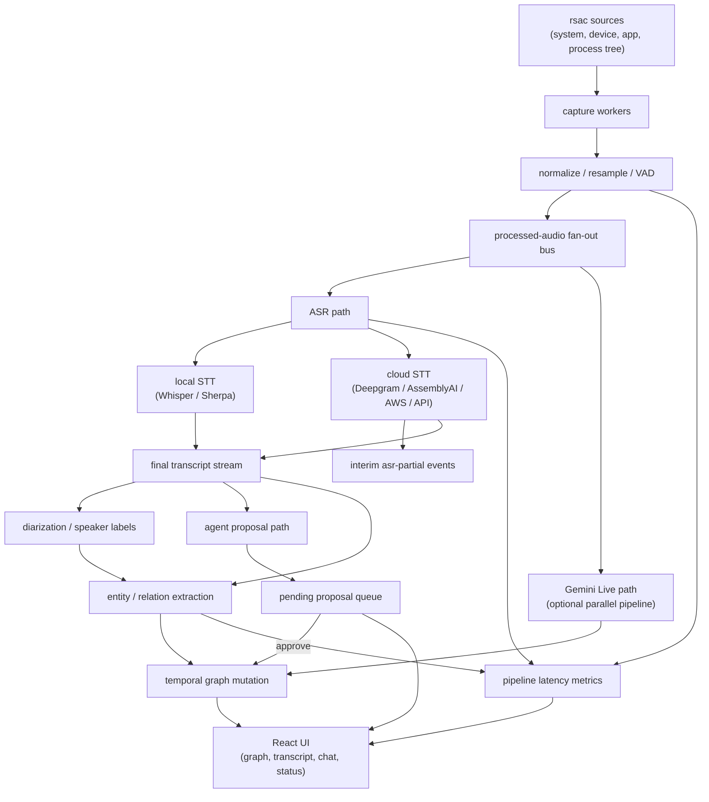

# ADR-0001: Parallel Realtime Pipeline

## Status

Accepted for phased implementation.

## Context

The current AudioGraph pipeline has the right building blocks but its work is
still conceptually linear: capture, resample, ASR, diarization, extraction, and
graph updates are mostly reasoned about as a single tail. The target product is
more interactive:

- AudioGraph has a durable **speech-to-notes / speech-to-temporal-graph**
  personality and a parallel **speech-to-speech agent** personality. They share
  capture and graph context but need separate controls, telemetry, and provider
  expectations.
- Local and cloud ASR should be interchangeable.
- Diarization and entity/relation extraction should run beside an LLM/agent
  loop, not block it.
- Both paths should update the same temporal graph.
- The UI should show stage latency and health as the pipeline runs.
- The user should be able to select system audio, devices, applications,
  processes, and process trees through an intuitive React control.

The `/mnt/e/CS/HF/streaming-speech-to-speech` project is the closest internal
reference. Its useful patterns are bounded turn state, aggressive overlap
between stages, explicit cancellation/barge-in, per-stage latency metrics, and
separate frontend state for realtime status. Its backlog also shows the kind of
edge cases to preserve: bounded queues, origin/connection guards, cancellation
acknowledgement, and immediate retry after cancellation.

External reference points:

- Deepgram supports realtime speech and agent WebSockets from browser JS and
  temporary token auth for client-side use.
- AssemblyAI Universal Streaming supports temporary one-use client tokens,
  turn-oriented transcripts, word timing, and optional streaming speaker labels.
- AWS Transcribe supports WebSocket streaming, but requires SigV4-style
  authentication and recommends SDK usage for streaming setup.
- vLLM exposes async generation APIs that can be used for token streaming and,
  in Python systems, for StreamingInput-style prefill overlap.

## Decision

AudioGraph will move toward a split realtime topology. The current
implementation now has the fan-out bus, provider-specific ASR routes, latency
events, graph deltas, and backend-owned agent proposals:

The first implementation waves should avoid a large rewrite. The existing
dispatcher, speech processor, and Gemini path already provide usable seams.
Initial work should add observability and contracts, then progressively move
provider workers behind a common event bus.

Runtime direction: AudioGraph already uses Tokio for provider I/O. The target
runtime is not "add Tokio" but consolidate I/O-heavy stages under a supervised
Tokio runtime with bounded `tokio::sync::mpsc` channels. CPU-heavy local model
work stays on `spawn_blocking`, Rayon, or dedicated bounded worker pools. This
prevents cloud provider sockets from each inventing their own lifecycle while
still avoiding accidental blocking on the async runtime.

Cloud provider routing is explicit and provider-specific:

| Provider / mode | Preferred route | Reason |
|---|---|---|
| Local STT, including Whisper and Sherpa | Rust backend | Models, `rsac` frames, timestamps, and graph mutation already live in Tauri. |
| Deepgram streaming STT | Rust backend internal client | Browser WebSockets and JS SDK are supported, but AudioGraph audio originates in `rsac`; the Rust client keeps source timing, buffering, telemetry, and graph updates in one runtime. |
| Deepgram Voice Agent | Rust backend by default; React-direct only for a future provider-native browser widget mode | Keep the normal pipeline unified. Browser widgets may still use backend-minted short-lived tokens if the product intentionally opts into provider-managed UX. |
| AssemblyAI Universal Streaming | Rust backend internal client | Temporary token query auth can support browser clients, but backend-direct remains canonical for `rsac` system/device/process capture. |
| AWS Transcribe Streaming | Rust backend | SigV4 credential handling and SDK-preferred streaming setup should stay out of React. |
| OpenAI Realtime transcription (`gpt-realtime-whisper`) | Rust backend internal client | Realtime STT should consume `rsac` PCM and normalize deltas/finals into the same ASR event stream as Deepgram/AWS/AssemblyAI. |
| OpenAI Realtime voice agent (`gpt-realtime-2`) | Rust backend by default; React WebRTC only for future browser-origin audio | This is the closest OpenAI analogue to Gemini Live. Keep credentials, tool/action hooks, graph updates, and latency telemetry in the Rust-supervised pipeline. |
| Future OpenAI-compatible or custom WebSocket ASR | Route per auth and audio-origin contract | Use React-direct only when short-lived client auth and browser-origin audio are first-class. |

The backend therefore owns long-lived credentials and cloud sockets for the
default `rsac` pipeline. React does not proxy `rsac` PCM frames to cloud
providers. If a future browser-origin mode is added, it must use backend-minted
short-lived credentials and still normalize back into the same `AsrEvent`
stream: provider id, source id, segment or turn id, audio cursor/timestamps,
partial/final text, word timings, speaker labels when present, confidence, and
provider latency metadata.

The internal Rust provider clients are intentionally small SDK boundaries, not
generic full-service SDKs. For Deepgram this means a narrow `DeepgramConfig`,
`DeepgramStreamingClient`, and `DeepgramEvent` surface covering Listen
WebSocket connect/reconnect, PCM send, KeepAlive, transcript parsing, and
disconnect. REST management APIs and unrelated provider features stay out of
the pipeline crate until the product needs them.

vLLM should run as an external OpenAI-compatible server for now. AudioGraph's
Rust backend calls it through `llm/api_client.rs`, so the LLM/agent/entity
extraction blocks stay in the same Rust-supervised pipeline while vLLM owns GPU
scheduling, CUDA graph warmup, prefix caching, and structured decoding. Direct
embedding of `AsyncLLM`/`StreamingInput` belongs in a Python sidecar only if the
OpenAI-compatible route cannot meet latency targets.

## Implementation Waves

1. Baseline documentation and backlog ledger.
2. Pipeline latency event contract and UI display.
3. Source-selection contract for system/device/application/process-tree capture.
4. Graph delta frontend consumption.
5. Session restore that loads both transcript and graph.
6. Secret isolation cleanup so provider settings never persist plaintext keys.
7. Sherpa model packaging/preflight fix.
8. Config loader for `src-tauri/config/default.toml`.
9. Agent-loop skeleton: transcript/context input, action events, and graph-aware
   tool hooks.
10. Full review loop and verification.

## Acceptance Criteria

- ASR provider selection can choose local or cloud STT without changing pipeline
  topology.
- Diarization/extraction and agent reaction can run concurrently against the
  same transcript/segment stream.
- Each major stage emits latency telemetry visible in the UI.
- Source selection makes capture target semantics obvious and supports process
  tree targeting where `rsac` supports it.
- Graph updates remain ordered, bounded, and recoverable.
- Secrets are not written to settings files.
- Tests cover event routing, latency display, source-id parsing, and any new
  persistence/session restore behavior.

## Rollback

Each wave should keep the existing speech processor usable. The first waves add
events and docs only or consume already-emitted data. If a wave destabilizes
capture/transcription, revert that wave without changing model/provider config
or session persistence formats.
