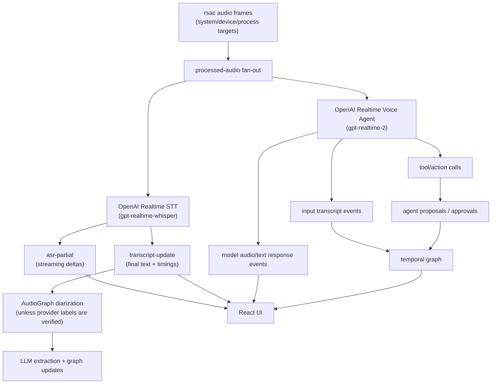

# ADR-0002: OpenAI Realtime Provider Family

## Status

Accepted; partial. **Wave A (STT transcription leg) landed 2026-05-30** (B15):
`asr/openai_realtime.rs` implements the `gpt-realtime-whisper` GA streaming-STT
client (sync-over-tokio + crossbeam, modeled on `asr/deepgram.rs`), with the
`AsrProvider::OpenAiRealtimeTranscription` settings variant (key in the shared
`openai_api_key` slot, never serialized) and a graph-pipeline dispatch branch.
clippy `--all-targets -D warnings` + fmt green; `item_id`-correlated parser is
unit-tested with verbatim GA JSON. Live-key WebSocket validation is the
runtime-gated remainder. **Wave B (voice s2s, `gpt-realtime-2`)** remains for
B18 under ADR-0018's turn-state machine.

## Context

AudioGraph already has two realtime-capable paths:

- The modular speech processor path, where `rsac` audio feeds ASR,
  diarization, entity extraction, agent proposals, and temporal graph updates.
- The Gemini Live path, where a cloud realtime model receives audio and returns
  transcription/model-response events through a WebSocket connection.

Gemini Live is specifically the Gemini realtime/live model family. It should
not be the only native speech-to-speech option. OpenAI now has a Realtime API
surface that supports low-latency voice agents and realtime transcription:

- `gpt-realtime-2` is the voice-agent / speech-to-speech model target.
- `gpt-realtime-whisper` is the realtime transcription target for streaming
  transcript deltas.
- WebRTC is the preferred browser/mobile transport when the browser captures or
  plays audio directly.
- WebSocket is the right shape when a server or worker already owns raw audio
  frames.

AudioGraph's default audio origin is not browser microphone capture; it is
`rsac` system/device/application/process/process-tree capture inside the Rust
backend. Therefore the normal OpenAI Realtime route should remain backend-owned
and should not require React to proxy PCM frames to OpenAI.

This ADR serves two product personalities:

- **Speech-to-notes / speech-to-temporal-graph:** add OpenAI Realtime as a
  streaming STT option that feeds the existing transcript, diarization,
  extraction, temporal graph, and recall-chat pipeline.
- **Parallel speech-to-speech agent:** add OpenAI Realtime as a Gemini-like
  voice-agent option that can speak and propose actions while the graph path
  continues to build durable memory.

## Decision

Add OpenAI Realtime as a separate provider family, not as a minor variant of
the existing OpenAI-compatible HTTP API provider.



### Provider split

| Mode | Model target | AudioGraph placement | Reason |
|---|---|---|---|
| Realtime transcription | `gpt-realtime-whisper` | ASR provider | Produces streaming text deltas/finals without model-generated spoken responses. |
| Voice agent / speech-to-speech | `gpt-realtime-2` | Gemini-like full-pipeline provider | Produces assistant speech/text and can participate in tool/action flows. |
| Browser-origin future mode | `gpt-realtime-2` over WebRTC | React + backend-minted ephemeral credentials | Only appropriate when the browser captures/plays audio directly. |

### Backend ownership

The default implementation should be a Rust WebSocket client:

- Use `openai_api_key` from `credentials.yaml`, hydrated at runtime.
- Keep API keys out of `settings.json`.
- Send `rsac` PCM frames from the processed-audio fan-out.
- Own the OpenAI-specific audio format conversion, including sample-rate
  selection and Base64 `input_audio_buffer.append` framing.
- Aggregate transcription deltas/completions by provider item id before
  emitting AudioGraph transcript events; provider completion order is not an
  ordering guarantee.
- Bound outbound audio backlog as the Deepgram/AssemblyAI clients do.
- Emit normalized `asr-partial`, `transcript-update`, `pipeline-latency`,
  `agent-status`, `graph-delta`, and `graph-update` events.
- Route tool/action calls into the backend-owned proposal queue before graph
  mutation, matching the current `approve_agent_proposal` contract.

### Settings shape

Add explicit provider variants rather than overloading existing ones:

```rust
pub enum AsrProvider {
    // existing variants...
    OpenAiRealtimeTranscription {
        model: String, // default: "gpt-realtime-whisper"
        language: Option<String>,
        input_audio_format: String, // e.g. provider-supported PCM format
        turn_detection: Option<String>, // server VAD or manual commit
    },
}

pub enum RealtimeProvider {
    GeminiLive,
    OpenAiRealtimeVoice {
        model: String, // default: "gpt-realtime-2"
        voice: Option<String>,
        reasoning_effort: Option<String>,
        input_audio_format: String,
        turn_detection: Option<String>,
    },
}
```

`RealtimeProvider` may initially live as a command/config helper instead of a
top-level settings enum if that keeps the first patch smaller. The ADR decision
is the separation of STT-only vs S2S provider surfaces.

## Deep Work Loop Plan

1. **Investigate** current Gemini, ASR streaming, and credential hydration
   seams; confirm the exact current OpenAI Realtime event names before coding.
2. **Design** a narrow Rust client surface analogous to `asr/deepgram.rs`:
   config, client, event enum, reconnect/backlog policy, and parser tests.
3. **Plan** two implementation waves:
   - Wave A: STT-only `gpt-realtime-whisper` ASR provider with partial/final
     transcript events, item-id correlation, audio-format conversion, and
     parser fixtures for append/delta/completed events.
   - Wave B: `gpt-realtime-2` voice-agent path with text/audio response
     events, tool/action proposal routing, and graph integration.
4. **Act** in small patches: settings/types first, backend client second,
   frontend controls third, graph/agent integration last.
5. **Review** against existing Deepgram, AssemblyAI, AWS, and Gemini tests.
6. **Loop** until the backlog item has tests for connect failure, reconnect,
   cancellation, malformed events, partial/final transcript mapping, and
   proposal approval.

## Acceptance Criteria

- Settings can select OpenAI Realtime STT without changing the rest of the
  speech pipeline.
- `gpt-realtime-whisper` produces visible partial text and final
  `TranscriptSegment` records with source attribution.
- The STT client explicitly handles OpenAI audio input format, sample rate, and
  Base64 audio append framing instead of assuming AudioGraph's internal 16 kHz
  PCM chunks match provider defaults.
- The STT client correlates
  `conversation.item.input_audio_transcription.delta` and `.completed` events
  by provider item id and tolerates out-of-order completion across turns.
- OpenAI Realtime transcription uses AudioGraph diarization unless fixture tests
  verify provider speaker labels for the selected model/session type.
- Settings expose session mode, model, input audio format, turn detection or
  manual commit, and voice/reasoning fields where relevant.
- `gpt-realtime-2` can run as an optional full-pipeline path parallel to the
  speech processor, like Gemini Live.
- OpenAI Realtime credentials are loaded from `credentials.yaml` and are never
  persisted in `settings.json`.
- Per-stage latency samples distinguish OpenAI Realtime connect, audio send,
  first partial, final transcript, and voice response timings where available.
- Tool/action calls do not mutate the graph directly; they become backend-owned
  pending proposals unless explicitly safe and approved.
- Tests cover parser behavior, reconnect/cancel behavior, settings
  serialization redaction, frontend provider selection, and event routing.

## Consequences

- The provider matrix becomes clearer: OpenAI-compatible HTTP remains for
  request/response ASR and LLM calls, while OpenAI Realtime owns streaming STT
  and speech-to-speech.
- The Rust backend grows another WebSocket client, so shared lifecycle helpers
  may become worth extracting after the first OpenAI client lands.
- React remains simpler for the default desktop pipeline because it does not
  proxy system audio to cloud providers.
- A future browser/WebRTC mode is still possible, but it should be treated as a
  separate product mode with ephemeral credentials and browser-origin audio.

## Rollback

Keep OpenAI Realtime behind provider selection. If the provider destabilizes
the speech pipeline, remove only the OpenAI Realtime enum/options and client
registration; existing Whisper, Sherpa, Deepgram, AssemblyAI, AWS, Gemini, and
OpenAI-compatible HTTP paths should continue unchanged.

## References

- OpenAI Realtime and audio overview: <https://developers.openai.com/api/docs/guides/realtime>
- OpenAI Realtime WebSocket guide: <https://developers.openai.com/api/docs/guides/realtime-websocket>
- OpenAI realtime transcription guide: <https://developers.openai.com/api/docs/guides/realtime-transcription>
- OpenAI `gpt-realtime-2` model page: <https://developers.openai.com/api/docs/models/gpt-realtime-2>
- OpenAI `gpt-realtime-whisper` model page: <https://developers.openai.com/api/docs/models/gpt-realtime-whisper>
- ADR-0001 parallel realtime pipeline: [`0001-parallel-realtime-pipeline.md`](0001-parallel-realtime-pipeline.md)
