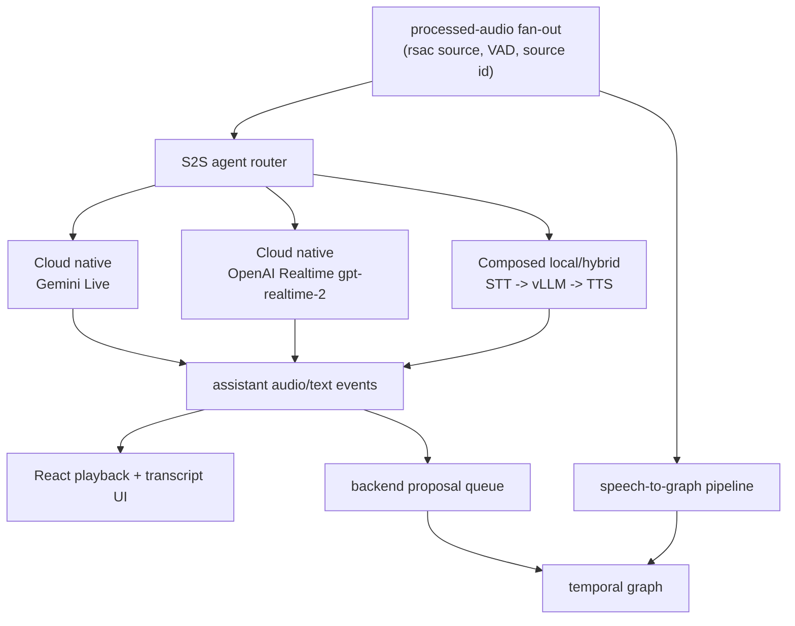

# ADR-0003: Speech-to-Speech Agent Provider Matrix

## Status

Proposed for phased implementation.

## Context

AudioGraph now has two product personalities:

- **Speech-to-notes / speech-to-temporal-graph:** durable transcript, graph,
  and recall.
- **Parallel speech-to-speech agent:** low-latency voice collaboration that
  listens to the same selected audio source while graph construction continues.

The cloud-native realtime providers are not the same shape as a local vLLM
pipeline:

- Gemini Live owns speech input, model reasoning, and native audio output in a
  single server-to-server Live API session.
- OpenAI Realtime `gpt-realtime-2` owns audio input/output and tool-capable
  voice-agent reasoning in a Realtime session.
- A local vLLM path is a composed pipeline: STT -> LLM -> TTS. STT and TTS may
  be local or cloud providers, while vLLM handles the reasoning/model step
  through the existing OpenAI-compatible client or a future sidecar.

The nearby `../../HF/streaming-speech-to-speech` project proves the composed
pipeline shape. The useful patterns to copy are bounded turn state, explicit
`turn_start`/`turn_end`/`cancel`, cooperative cancellation checks at every async
boundary, aggressive token-to-TTS flushing, and latency milestones. We should
not port the Python stack wholesale into the Rust backend.

## Decision

Add a speech-to-speech agent abstraction with three provider families:



### Provider matrix

| S2S provider      | STT owner                                                                                               | Reasoning owner                                                                | TTS owner                                                                     | Best use                                                                                      |
| ----------------- | ------------------------------------------------------------------------------------------------------- | ------------------------------------------------------------------------------ | ----------------------------------------------------------------------------- | --------------------------------------------------------------------------------------------- |
| Gemini Live       | Gemini Live                                                                                             | Gemini Live                                                                    | Gemini native audio                                                           | Fast cloud-native voice agent with existing implementation path.                              |
| OpenAI Realtime   | OpenAI `gpt-realtime-2`                                                                                 | OpenAI `gpt-realtime-2`                                                        | OpenAI native audio                                                           | Tool-capable cloud-native voice agent alternative to Gemini.                                  |
| Local/hybrid vLLM | Local Whisper/Sherpa/vLLM Realtime STT or cloud STT such as Deepgram/AWS/AssemblyAI/OpenAI Realtime STT | Local vLLM through OpenAI-compatible HTTP first; future sidecar only if needed | Local TTS/Kokoro/Piper/Coqui or cloud TTS such as Deepgram Aura/OpenAI speech | User-controlled model and privacy/cost tradeoffs; can mix local reasoning with cloud STT/TTS. |

### Local/hybrid vLLM topology

The first local/hybrid implementation should keep vLLM external and call it
through AudioGraph's existing OpenAI-compatible LLM provider. The Rust backend
owns orchestration:

```mermaid
sequenceDiagram
    participant Bus as ProcessedAudioBus
    participant Turn as S2STurnState
    participant STT as STT Provider
    participant LLM as vLLM/OpenAI-compatible LLM
    participant TTS as TTS Provider
    participant UI as React UI
    participant Graph as Temporal Graph

    Bus->>Turn: start turn / append audio chunks
    Turn->>STT: stream or finalize audio
    STT-->>Turn: partial/final transcript
    Turn->>LLM: prompt with graph context + stable transcript
    LLM-->>Turn: token deltas
    Turn->>TTS: flush text chunks aggressively
    TTS-->>UI: audio chunks + timing
    Turn-->>UI: asr/llm/tts latency events
    Turn-->>Graph: proposal events only; no direct unsafe mutation
```

The local/hybrid route should start with final-transcript STT, then add
streaming STT/prefill overlap after the turn protocol is stable.

### Turn protocol

Adopt the HF project's protocol ideas in Rust terms:

- `turn_start`: allocate a bounded `S2STurnState` with source id, provider ids,
  sample rate, start timestamp, and cancellation token.
- audio append: enqueue PCM chunks with a byte/chunk/time cap.
- `turn_end`: close the audio queue and allow STT/LLM/TTS to finish.
- `cancel`: set the cancellation token, stop feeding providers, interrupt UI
  playback, and emit an acknowledgement before allowing immediate retry.
- `barge_in`: future shorthand for cancel current output and start a new turn.

### Latency milestones

Emit provider-tagged timing events for:

- turn start
- first STT partial
- STT final
- LLM request start
- first LLM token
- first TTS audio
- final TTS audio
- cancel acknowledgement

These timings should be displayed beside the existing pipeline latency status
so users can see whether the bottleneck is STT, LLM, TTS, network, or playback.

## Implementation Waves

1. **Model the abstraction:** add docs and settings shape for `RealtimeAgent`
   provider families without changing runtime behavior.
2. **Cloud-native parity:** keep Gemini Live as the first implemented provider;
   implement OpenAI Realtime in a separate wave after ADR-0002 STT groundwork.
3. **Local/hybrid MVP:** add a turn-state orchestrator that uses existing ASR
   finals, OpenAI-compatible vLLM chat, and a pluggable TTS provider. Start
   without StreamingInput.
4. **Streaming overlap:** add stable-partial support and vLLM prefill overlap
   only after measuring whether final-STT -> vLLM -> TTS misses latency goals.
5. **Barge-in and playback polish:** add interruption semantics, cancellation
   acknowledgements, and immediate retry guards.

## Acceptance Criteria

- The UI can present speech-to-speech agent providers separately from
  speech-to-graph ASR/LLM providers.
- Gemini Live remains available as the implemented cloud-native S2S provider.
- OpenAI Realtime `gpt-realtime-2` is documented and routed as a cloud-native
  S2S provider, not as a generic STT or HTTP LLM.
- Local/hybrid S2S can choose STT, vLLM reasoning, and TTS independently.
- Cloud STT/TTS providers such as Deepgram can be used in the local/hybrid
  route without moving provider credentials into React.
- Every turn has bounded buffers, cancellation acknowledgement, and provider
  latency telemetry.
- Voice-agent tool calls and local agent actions enter the backend proposal
  queue before mutating the temporal graph.

## Consequences

- AudioGraph can support both cloud-native voice agents and local/hybrid voice
  agents without forcing them into one provider enum.
- The local/hybrid route creates a new orchestration surface but reuses existing
  ASR, LLM, graph, credential, and event infrastructure.
- vLLM remains easiest to operate as an external server. A Python sidecar with
  vLLM `StreamingInput` should be considered only if the OpenAI-compatible HTTP
  route cannot hit latency goals.
- TTS becomes a first-class provider category for the S2S personality.

## Rollback

Keep the speech-to-speech agent abstraction behind provider selection. If the
local/hybrid path destabilizes the app, disable only that provider family and
leave Gemini Live, speech-to-graph, and recall chat unchanged.

## References

- HF streaming S2S design: `../../HF/streaming-speech-to-speech/docs/design/streaming-pipeline.md`
- HF vLLM StreamingInput ADR: `../../HF/streaming-speech-to-speech/docs/adr/0003-vllm-streaminginput-for-prefill-overlap.md`
- OpenAI `gpt-realtime-2` model page: <https://developers.openai.com/api/docs/models/gpt-realtime-2>
- Gemini Live API capabilities: <https://ai.google.dev/gemini-api/docs/live-api/capabilities>
- Deepgram streaming TTS: <https://developers.deepgram.com/docs/tts-websocket>
- vLLM OpenAI-compatible server: <https://docs.vllm.ai/en/latest/serving/openai_compatible_server/>
