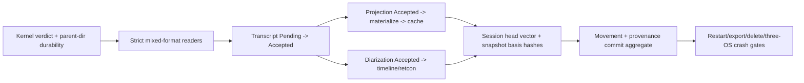

# Runtime integration map for canonical Pending -> Accepted durability

Date: 2026-07-10

Seed: `audio-graph-90f3`

Status: read-only cartography and staged implementation recommendation; no
runtime code or Seed state changed by this artifact.

## 1. Executive recommendation

Do **not** replace the live transcript/projection writers immediately after a
green kernel verdict. The smallest safe next slice is to route the four
canonical readers (transcript, projection, diarization, and data movement)
through the kernel's mixed legacy/framed decoder in **strict, non-mutating
mode**, with cross-version fixtures and no runtime writer change.

That slice proves that newly framed streams will remain reviewable/exportable
and that existing JSONL remains authoritative. In parallel only at clean file
ownership boundaries, close the kernel's new-file parent-directory durability
and typed quarantine-inventory gaps. Once those two prerequisites are green,
the first Pending -> Accepted writer migration should be the transcript event
stream, because every downstream durable claim (projection bases, diarization
basis links, Review transcript, and legacy transcript derivation) depends on it.

Current runtime truth:

- Transcript and projection “acceptance” is only successful bounded-channel
  enqueue; the worker may fail later and only log the failure.
- Diarization emits and mutates the live timeline/graph before a best-effort
  append whose error is swallowed.
- Data-movement writes are synchronous, flushed, and file-synced, but new-file
  parent-directory durability is not named or proven.
- Projection snapshots are rebuildable and canonical replay now wins, but the
  snapshot schema has no canonical head/hash vector.
- Rotation pre-opens three legacy writers, then resets aggregates and swaps
  writers, but a timed-out old writer is detached and may retain the old file
  handle.
- Graceful exit clears producer flags but does not join speech/ASR/projection
  workers before closing writer slots.

The full migration is therefore a dependency chain, not a one-file writer
swap:



## 2. Evidence snapshots and notation

All line references in this document are pinned to the following two
read-only snapshots. `I:` means the dirty integration checkout; `K:` means the
isolated candidate kernel checkout.

| Snapshot | Root | Git baseline | Relevant file fingerprints |
|---|---|---|---|
| `I` | `E:/CS/github/audio-graph` | `master`, `f97e19c251e4c227aade1289b2aba56e0d40ffca`, broad dirty tree | `persistence/mod.rs` `8278cb5a...7791b3`; `state.rs` `7cdb1ace...c8fdb4`; `speech/mod.rs` `3faa2a48...47885`; `commands.rs` `86664520...b7a5c`; `lib.rs` `9a35f02f...91639a`; `sessions/mod.rs` `093e3b44...824b7` |
| `K` | `E:/CS/github/audio-graph-canonical-log` | branch `codex-audiograph-canonical-log`, baseline `f97e19c251e4c227aade1289b2aba56e0d40ffca` | `canonical_log.rs` `e5a30537...adffa`; `persistence/mod.rs` `7edb7b67...bdc76` |

The integration checkout is intentionally the current product snapshot even
though it is not a clean commit. The candidate checkout has no runtime caller:
its only non-test integration is `pub mod canonical_log` (`K:src-tauri/src/persistence/mod.rs:33`).

## 3. Canonical authority and current artifact graph

ADR-0027 names lifecycle/provenance, transcript revisions, speaker revisions,
accepted projection patches, and privacy/data-movement events as canonical
streams (`I:docs/adr/0027-file-canonical-durable-session-store.md:55-64`). It
requires `Pending` at bounded enqueue and `Accepted` only after framed bytes and
required filesystem metadata cross the declared durability boundary
(`I:docs/adr/0027-file-canonical-durable-session-store.md:66-78`).

### 3.1 Current per-session artifacts

| Artifact | Current authority/use | Current writer | Current reader/consumer | Pending -> Accepted impact |
|---|---|---|---|---|
| `transcripts/<id>.events.jsonl` | Canonical transcript revisions | `TranscriptEventWriter` bounded actor | Review transcript, projection replay/report, timeline, export | First live migration. Replace enqueue `bool` with a receipt-bearing commit result; ledger/UI/scheduler advance only on `Accepted`/matching `AlreadyAccepted`. |
| `transcripts/<id>.jsonl` | Legacy derived transcript view | unbounded `TranscriptWriter` | fallback for pre-event-log sessions | Keep as a compatibility derivative initially; it must run after transcript Accepted and may lag/fail without changing logical acceptance. |
| `transcripts/<id>.speaker.jsonl` | Canonical speaker revisions | direct `append_jsonl` from speech path | Review, timeline, export | Commit before timeline apply, graph retcon, graph snapshot update, or UI event. |
| `projections/<id>.events.jsonl` | Canonical accepted notes/graph patches | `ProjectionEventWriter` bounded actor | materialized replay/report, Review, export | Commit with stable job/idempotency identity before materialized/live/UI advance. Snapshot failure becomes cache lag. |
| `ledgers/<id>.movements.jsonl` | Canonical privacy/movement evidence | direct serialized `append_jsonl` | Review privacy route | Adopt framed commit using the event's existing `event_id`; callers must retain the exact event across uncertainty recovery. |
| `notes/<id>.json` | Rebuildable notes cache | atomic `save_json` | Review only when no canonical projection authority; otherwise replay wins | Add stream head/hash basis envelope; never blocks canonical Accepted after the event commits. |
| `graphs/<id>.materialized.json` | Rebuildable projection graph cache | atomic `save_json` | same authority rule as notes | Same as notes. |
| `graphs/<id>.json` | Legacy temporal/extraction graph snapshot | 30-second autosave + final save | Review graph and timeline edge linkage | Derived from accepted transcript/diarization inputs; remain non-canonical and fence autosave by session ownership/head. |
| `scheduler/<id>...json` | Best-effort projection queue snapshot | save on rotation | later restore seam | Persisted jobs are diagnostic/pending, not Accepted events. Store head basis and never resurrect an in-flight task. |
| `sessions.json`, usage, live-assist audit/current | Index/auxiliary durable state | separate atomic/append helpers | list/review/delete | Not canonical stream authority in this slice, but the eventual manifest must include canonical logs, temp files, quarantine evidence, and heads for deletion/export parity. |

The current hard-coded deletion inventory includes transcript, transcript-event,
speaker, projection, notes, legacy graph, materialized graph, movement,
scheduler, usage, and live-assist artifacts
(`I:src-tauri/src/sessions/mod.rs:466-513`). It does not discover candidate
`*.corrupt-tail-*` quarantine files or a future session head/manifest file.

## 4. Session ownership, startup, rotation, and shutdown

### 4.1 Startup and active aggregate

`AppState` owns the current session id plus live transcript buffer, transcript
writer, transcript-event writer, transcript ledger, speaker timeline,
materialized projection state, schedulers, projection-event writer, live graph,
and autosave handle (`I:src-tauri/src/state.rs:72-112`). This is the correct
aggregate boundary for a future `CanonicalSessionStore`; do not place one
appender per call site.

Startup currently creates a fresh UUID and independently attempts to spawn the
three writers (`I:src-tauri/src/state.rs:684-693`). Failure leaves an `Option`
empty and only logs (`I:src-tauri/src/state.rs:694-714`). Capture preflight later
requires all three writer slots to be `Some`
(`I:src-tauri/src/commands.rs:1038-1059`), but successful construction means
“file opened and actor spawned,” not “canonical stream validated, locked, and
directory entry durable.”

Required integration shape:

1. Open and validate all canonical appenders for one session generation.
2. Acquire their cooperative OS locks for the generation lifetime.
3. Register any tail quarantine receipts in the typed artifact inventory.
4. Establish or validate the complete session head vector.
5. Publish the aggregate only if every required stream is ready at a named
   durability level.
6. Treat legacy segment writer and snapshots as optional derivatives, not
   readiness authorities.

### 4.2 Rotation

`new_session_cmd` holds the async `session_lifecycle` mutex, demands idle and
quiesced workers, resets the audio pipeline, then calls `rotate_session`
(`I:src-tauri/src/commands.rs:7070-7107`). `rotate_session` pre-opens transcript,
transcript-event, and projection-event writers before mutation
(`I:src-tauri/src/state.rs:888-926`), then resets transcript ledger, speaker
timeline, materializers, scheduler, buffers, graph, snapshot, chat, proposals,
and status (`I:src-tauri/src/state.rs:928-1005`). It drains audio queues
(`I:src-tauri/src/state.rs:1007-1012`), then shuts down and swaps each writer
(`I:src-tauri/src/state.rs:1014-1065`) and publishes the new session id last
(`I:src-tauri/src/state.rs:1097-1108`).

Failure modes/hazards:

- A timed-out old writer is detached while the new writer is installed
  (`I:src-tauri/src/state.rs:1024-1033`, `1040-1049`, `1055-1064`). With an
  exclusive canonical appender this must instead leave rotation in
  `RecoveryRequired` and retain ownership; overlapping old/new appenders are not
  allowed.
- Scheduler queue state is saved best-effort before reset
  (`I:src-tauri/src/state.rs:954-963`); failure is logged and ignored by the save
  helper (`I:src-tauri/src/persistence/mod.rs:2722-2755`). It cannot be used as a
  source of Accepted projection work.
- Writer preparation happens before old aggregate reset, but canonical appender
  creation may create new files. If parent-directory persistence fails, the new
  session cannot be advertised as Saved-equivalent.
- `session_lifecycle` serializes commands, not background ASR/projection jobs.
  Rotation currently relies on worker quiescence plus session-id fences. The
  canonical aggregate must preserve that fence and reject late commit requests
  from the old generation.

Rollback: before publish, close/delete only newly created empty stream files and
their manifest entry when safe; otherwise retain the failed draft generation as
recovery evidence. After any canonical event is Accepted, never “roll back” by
truncation—finish/repair the session and leave the old session published until
the new aggregate is wholly ready.

### 4.3 Clean shutdown

The intended order is capture/movement close, producer flags, autosave stop +
join, final legacy graph save, writer shutdown, then session-index finalize
(`I:src-tauri/src/lib.rs:175-265`, `I:src-tauri/src/lib.rs:691-702`). The current
implementation clears `is_transcribing` and mode flags
(`I:src-tauri/src/lib.rs:184-199`) but `ShutdownHandles` contains no speech,
ASR, or projection-worker ownership (`I:src-tauri/src/lib.rs:111-127`). It then
closes writer slots (`I:src-tauri/src/lib.rs:239-259`).

This is insufficient for an exclusive long-lived appender: a late speech or
projection task can race a closed/removed writer, and projection job threads are
spawned without retained handles (`I:src-tauri/src/speech/mod.rs:1977-1999`).
The migration must introduce an aggregate drain barrier:

1. stop capture and append/Accept terminal movement;
2. stop producers and reject new commit requests;
3. join or retain/fence every session-scoped worker, including projection jobs;
4. drain every Pending canonical request to Accepted/Rejected/RecoveryRequired;
5. persist the session head vector and rebuildable caches;
6. close/unlock appenders;
7. finalize the index only if the drain has a non-uncertain result.

If the bounded drain times out, do not mark the session complete. Preserve a
`RecoveryRequired` state for next-start replay and keep diagnostics content-free.

## 5. Transcript path: every producer and consumer

### 5.1 Main partial/final ingestion path

`record_asr_span_revision_event` currently:

1. locks the live `TranscriptLedger`;
2. clones it and validates/applies the event to the clone;
3. locks the `TranscriptEventWriter`;
4. calls `writer.append`, which returns only a queue-admission `bool`;
5. installs the cloned ledger immediately after successful enqueue.

Evidence: `I:src-tauri/src/speech/mod.rs:1803-1874`. The writer's `append`
uses `try_send` and returns `true` at queue admission
(`I:src-tauri/src/persistence/mod.rs:2188-2216`). Its worker later performs a
buffered `writeln`; a write error is logged but not returned to the producer
(`I:src-tauri/src/persistence/mod.rs:1673-1688`,
`I:src-tauri/src/persistence/mod.rs:2043-2086`). Flush occurs primarily at
shutdown and there is no per-event `sync_all` in this actor.

After that queue admission, final-event handling immediately observes the new
ledger in both projection schedulers (`I:src-tauri/src/speech/mod.rs:1877-1938`).
The common final tail then mutates the legacy transcript ring, enqueues a legacy
segment, emits transcript/ASR/speaker events, starts proposals, updates status,
and schedules extraction (`I:src-tauri/src/speech/mod.rs:2474-2612`). Partials
likewise become UI-visible immediately after queue admission
(`I:src-tauri/src/speech/mod.rs:694-762`).

Current failure semantics:

- queue full/disconnected: main paths return `false`; ledger and main partial/final
  UI events do not advance;
- later serialize/write/flush failure: ledger, projection scheduling, UI, and
  downstream extraction may already have advanced;
- process/power loss before final flush: an acknowledged live span can disappear;
- a short/torn row makes `load_jsonl` fail the whole stream; it has no tail
  recovery (`I:src-tauri/src/persistence/mod.rs:2597-2629`);
- holding the ledger lock while waiting for a future durable receipt would
  serialize correctness but can stall projection basis reads and rotation for a
  full disk sync.

Required transcript commit order:

1. capture active session generation and build one immutable `TranscriptEvent`;
2. derive a stable event id from `(session_id, span_id, revision_number)` (the
   payload equality check catches conflicting same-revision content);
3. validate against a cloned ledger without publishing it;
4. enqueue a `Pending` request to the session-owned canonical transcript actor;
5. wait for `Accepted` or matching `AlreadyAccepted`; on
   `OutcomeUncertain`/`RecoveryRequired`, freeze this stream and surface storage
   recovery without advancing live state;
6. revalidate the session generation, then install the prepared ledger;
7. only now observe schedulers and emit transcript/ASR UI events;
8. enqueue legacy `TranscriptSegment` JSONL as an optional derivative.

The actor must carry the immutable metadata/payload and a receipt channel. A
caller must never reconstruct a different payload on uncertainty retry.

### 5.2 Local diarization-only transcript bypass

The local diarization-only loop is a separate producer and currently violates
even the queue-before-live ordering: it pushes `final_segment` to the live
buffer and enqueues the legacy segment first
(`I:src-tauri/src/speech/mod.rs:4522-4533`), then tries the transcript event
(`I:src-tauri/src/speech/mod.rs:4535-4577`), but emits `TRANSCRIPT_UPDATE`
unconditionally even when canonical enqueue failed
(`I:src-tauri/src/speech/mod.rs:4597-4599`). This path must call the same single
transcript commit function as every other provider. Do not patch it with a
second durability implementation.

### 5.3 Transcript replay/read surfaces

All of these must use the compatibility decoder before framed writing is
enabled:

- `load_session_transcript` and Review transcript derive a duplicate-free view
  from events, else fall back to legacy rows (`I:src-tauri/src/commands.rs:6563-6608`);
- `load_session` reloads transcript events and validates replay without
  installing it into the live aggregate (`I:src-tauri/src/commands.rs:6665-6750`);
- projection replay reports load transcript events as their basis history
  (`I:src-tauri/src/commands.rs:6404-6443`);
- session timeline replays transcript plus speaker streams
  (`I:src-tauri/src/commands.rs:6864-6899`);
- export loads transcript events and the derived legacy view
  (`I:src-tauri/src/commands.rs:6783-6823`).

Reader requirements:

- preserve the current “missing file = empty” compatibility behavior;
- preserve explicit file existence as a separate authority signal—an existing
  empty canonical projection stream is not the same as no stream;
- decode legacy prefix + framed suffix, never framed + later legacy;
- use `Strict` while any appender may exist; only an owned recovery phase after
  appender quiescence may quarantine/truncate a tail;
- expose stream head and quarantine receipt alongside payload rows, even if
  existing command DTOs initially discard the head.

## 6. Projection path: provider result, canonical patch, materialization, UI

### 6.1 Current order

Projection job ids are generated as
`projection:<session>:<kind>:<process-local-index>`
(`I:src-tauri/src/projection_scheduler.rs:499-527`). The index is preserved
across in-process reset but not stored in `SchedulerQueueState`; persisted
in-flight jobs are demoted to pending basis on restore
(`I:src-tauri/src/projection_scheduler.rs:815-856`). Therefore `job.id` alone
is not a cross-process idempotency contract for a future same-session resume.

For each job, the runtime:

1. chooses the next domain patch sequence from current materialized state;
2. appends a movement “started” row;
3. calls the LLM;
4. appends a movement terminal-success/failure row;
5. checks scheduler ownership;
6. calls `apply_runtime_projection_patch`;
7. on success emits patch + materialized UI events and completes the scheduler.

Evidence: `I:src-tauri/src/speech/mod.rs:2104-2297` and
`I:src-tauri/src/speech/mod.rs:2362-2424`.

`ProjectionRuntimeHandle::apply_runtime_projection_patch` snapshots the
transcript ledger, locks materialized state, checks session/basis/writer,
applies the patch to a clone, enqueues the projection event, atomically writes
the notes/graph cache, checks session generation again, and installs live state
(`I:src-tauri/src/state.rs:466-637`). The queue enqueue at
`I:src-tauri/src/state.rs:577-595` is not a durable acknowledgement; the worker
can fail later and only log (`I:src-tauri/src/persistence/mod.rs:2289-2332`).

The recent cache-lag fix is directionally correct: snapshot failure no longer
rejects a logically enqueued patch and live sequence advances
(`I:src-tauri/src/state.rs:597-636`). But until enqueue becomes a canonical
receipt, that can still make live state and a successful snapshot outrun the
event log.

### 6.2 Required projection commit order

1. Keep scheduler ownership and session-generation checks.
2. Under the materialized-state serialization lock, validate the basis and
   apply to a clone, but do not publish it.
3. Freeze the complete canonical payload before the first write. In particular,
   `apply_latency_ms` is currently inserted from elapsed wall time before
   enqueue (`I:src-tauri/src/state.rs:564-575`); recomputing it during an
   uncertainty retry would make the same event id conflict. Either compute it
   once in the immutable Pending record or move non-deterministic latency out of
   the canonical payload.
4. Use a stable event id. For the current schema, the minimum safe candidate is
   `(session_id, kind, llm_request_id, domain_sequence)`; `llm_request_id`
   already incorporates job/provider/sequence
   (`I:src-tauri/src/llm/executor.rs:838-868`). Before future same-session
   resume, persist a monotonic job epoch or define an id independent of the
   process-local job index.
5. Append and wait for `Accepted`/matching `AlreadyAccepted`.
6. Install the cloned materialized state and unique domain sequence.
7. Best-effort save a snapshot carrying the canonical projection stream head,
   transcript/speaker basis heads, and a snapshot content hash.
8. Emit UI events and complete scheduler telemetry only after live install.

`Accepted + snapshot failure` returns success with explicit cache lag.
`OutcomeUncertain` freezes this projection stream/job and must not be translated
to a normal scheduler failure/retry, because that can generate a different
patch for the same domain sequence. `Rejected` before any write may fail the
job normally. A matching `AlreadyAccepted` must replay/install the exact
accepted patch rather than call the model again.

Live-assist approval is another projection producer and already funnels through
the same runtime apply function (`I:src-tauri/src/commands.rs:3189-3261`); it
must inherit the same receipt rather than add a special-case writer.

### 6.3 Basis and cross-stream causality

The data model supports diarization revisions in `ProjectionBasis`
(`I:src-tauri/src/projections.rs:208-252`), and validation can consume a
`SpeakerTimeline`. The active `TranscriptLedger::current_basis` currently builds
a transcript-only basis (`I:src-tauri/src/projections.rs:702-718`), while runtime
schedulers observe only a `TranscriptLedger`
(`I:src-tauri/src/projection_scheduler.rs:656-664`).

Do not fabricate a speaker basis during the first transcript slice. When the
diarization stream migrates, projection canonical metadata must carry the exact
transcript and speaker `CanonicalBasisHead`s that the patch actually used.
Until runtime generation uses speaker heads, leave the speaker basis absent and
describe that limitation honestly.

## 7. Diarization, retcon, and legacy temporal graph path

### 7.1 Current order and failure modes

`emit_and_dispatch_diarization_span_revision` currently emits the diarization UI
event before validation (`I:src-tauri/src/speech/mod.rs:435-443`), locks speaker
timeline then knowledge graph, applies the revision and possible entity retcon
(`I:src-tauri/src/speech/mod.rs:445-473`), then persists outside those locks as a
best-effort call (`I:src-tauri/src/speech/mod.rs:475-520`). Only afterward does it
update/emit graph delta and snapshot (`I:src-tauri/src/speech/mod.rs:487-497`).

Consequences:

- a UI can see a speaker revision before the timeline accepts it;
- accepted live speaker attribution/graph retcon can survive only in memory if
  append fails;
- direct diarization appends have no process-wide serialization lock (unlike
  data movement), so independent producers can open and append to the same file;
- a graph retcon and its later autosave can become durable while its speaker
  basis row did not;
- `persist_diarization_span_revision` swallows all errors by design, so callers
  cannot enter RecoveryRequired.

Required order:

1. derive a stable event id from `(session_id, span_id, revision_number)`;
2. clone/validate timeline and compute the prospective retcon without
   publishing;
3. commit the speaker row and receive Accepted;
4. recheck session generation;
5. install timeline and apply graph retcon under the established
   timeline-before-graph lock order;
6. update cached graph snapshot and emit speaker/graph UI events;
7. let legacy graph autosave persist the derived result.

If prospective retcon computation cannot be separated cleanly from graph
mutation, serialize commit + apply inside a session-owned method and retain the
pre-validated copies. Do not append first and then discover that the domain
ledger rejects the event; the canonical stream must contain only accepted
domain events.

### 7.2 Legacy graph extraction/autosave

After an accepted final transcript, the common path coalesces background entity
extraction (`I:src-tauri/src/speech/mod.rs:2567-2612`). Extraction mutates the
live temporal graph, and the autosave thread writes `graphs/<id>.json` every 30
seconds and updates index counts (`I:src-tauri/src/persistence/mod.rs:2782-2851`).
Clean exit performs one final autosave before closing event writers
(`I:src-tauri/src/lib.rs:230-259`).

This graph remains a rebuildable/legacy read model in the staged migration. Its
save must never be treated as proof that transcript or speaker inputs are
Accepted. Attach the last applied transcript/speaker head vector in a future
snapshot envelope, or rebuild/quarantine it when its basis is not a prefix of
canonical heads.

## 8. Data movement and provenance

### 8.1 Current movement durability

The generic direct `append_jsonl` path creates/opens a file, serializes a row,
writes a newline, flushes, and calls `File::sync_all`
(`I:src-tauri/src/persistence/mod.rs:183-233`). Data-movement calls additionally
take one process-wide mutex so rows from concurrent producers cannot interleave
(`I:src-tauri/src/persistence/mod.rs:236-240`,
`I:src-tauri/src/persistence/mod.rs:1226-1245`). This is stronger than the async
transcript/projection actors, but it does not sync the newly created file's
parent directory.

Every `DataMovementEvent` already receives a UUID event id and schema version
from its builder (`I:src-tauri/src/persistence/data_movement.rs:49-93`). That
event id is the natural canonical idempotency key, but current callers generally
build-and-append in one function. After an uncertain append they would build a
new UUID, which cannot recover the poisoned candidate appender. The session
aggregate must retain the exact immutable event until its outcome resolves.

Capture demonstrates why movement is part of lifecycle authority:

- first-source `CaptureStarted` is synchronously appended after rsac Ready and
  before capture commit; append failure rolls the source back
  (`I:src-tauri/src/commands.rs:1334-1405`);
- last-source `CaptureStopped` is appended during stop, and failure is returned
  as a cleanup/audit error (`I:src-tauri/src/commands.rs:1650-1665`);
- graceful exit stops capture and closes movement before writer teardown
  (`I:src-tauri/src/lib.rs:145-182`).

Projection movement is weaker: its production sink swallows append errors
(`I:src-tauri/src/speech/mod.rs:1676-1692`), and terminal provider-success is
recorded before the projection patch is canonically accepted
(`I:src-tauri/src/speech/mod.rs:2112-2157`). The event correctly means “provider
call succeeded,” not “projection patch Accepted,” but the streams need causal
ids linking call-start, terminal transport outcome, and accepted patch.

Staged movement/provenance order:

1. keep current synchronous capture lifecycle behavior, but move it onto the
   session-owned movement appender and exact-event retry contract;
2. require an Accepted `ProviderCallStarted` event before content egress once
   exhaustive runtime evidence is implemented;
3. append provider terminal outcome after the call;
4. append the projection patch with causal ids to those movement events;
5. add the separate canonical session-provenance stream for redacted source,
   negotiated format, clock mapping, discontinuities, drops, and route changes;
6. include movement/provenance heads in the session head vector and export.

ASR, TTS/realtime, credentials, artifact load/export/delete, and promotion do
not yet have exhaustive producers, and the v1 export explicitly excludes
movement (`I:src-tauri/src/commands.rs:6764-6766`). Do not make completion of
those P1/P2 coverage paths a prerequisite for the first transcript durability
slice; track them separately and preserve the current Unknown negative-egress
UI semantics.

## 9. Snapshots, session heads, replay, export, and delete

### 9.1 Snapshot write and authority

`save_json` writes a temp file, flushes and syncs that file, renames it, and
reapplies permissions (`I:src-tauri/src/persistence/mod.rs:2512-2578`). It does
not sync the parent directory after rename. `MaterializedNotes` and
`MaterializedGraph` carry only `schema_version`, `session_id`, and a domain
`last_sequence` (`I:src-tauri/src/projections.rs:1347-1377`,
`I:src-tauri/src/projections.rs:1567-1601`); neither records canonical stream
head hashes or transcript/speaker basis heads.

The current Review hardening treats projection-log file existence as canonical
authority even when empty and replays it instead of trusting orphan snapshots
(`I:src-tauri/src/commands.rs:6691-6740`). Preserve this rule. The next snapshot
envelope should add:

- snapshot schema version and content hash;
- projection stream `CanonicalStreamHead`;
- exact transcript and speaker basis-head vector used by the last patch;
- created-at and named durability level (content-free metadata only);
- cache state such as `current`, `behind_rebuildable`, `ahead_quarantined`, or
  `different_content_quarantined` determined during load.

Load policy is deterministic: equal head + equal content can be used; behind is
rebuilt from canonical logs; ahead or equal-head/different-content is
quarantined and rebuilt; missing snapshot is rebuilt; canonical corruption
fails closed and never promotes a cache.

### 9.2 Kernel reader/recovery fit

The candidate reader validates context and mixed legacy/framed records, and can
optionally quarantine only an unterminated corrupt tail
(`K:src-tauri/src/persistence/canonical_log.rs:444-507`). It derives stable
legacy event ids/hashes from session, stream, requested domain version,
sequence, and payload (`K:src-tauri/src/persistence/canonical_log.rs:1373-1451`).
Once a framed row appears, later legacy rows are rejected
(`K:src-tauri/src/persistence/canonical_log.rs:1395-1400`).

Integration hazards:

- recovery mode mutates through a reader that has no lock; its own comments
  require callers to quiesce writers (`K:src-tauri/src/persistence/canonical_log.rs:444-447`);
- a strict read concurrent with a writer can observe a transient unterminated
  frame and report corruption; active-session reads need a shared-lock protocol
  or an actor-provided snapshot;
- caller-supplied `domain_schema_version` must have a version-dispatch policy.
  A later domain version cannot simply ask the v1 stream reader to reinterpret
  prior framed rows as a new version;
- quarantine receipt paths exist only in memory until consumed by a typed
  manifest (`K:src-tauri/src/persistence/canonical_log.rs:759-763`);
- an existing empty file yields an empty snapshot, so the repository adapter
  must retain the separate path-exists authority bit used by Review.

### 9.3 Export

The v1 bundle reads transcript, transcript events, diarization events,
projection events, raw materialized snapshots, and the legacy graph
(`I:src-tauri/src/commands.rs:6764-6823`). It omits usage, scheduler,
live-assist audit, movement, provenance, canonical heads, and quarantine
evidence. It also returns raw materialized snapshots without the same replay
selection that `load_session` applies.

During reader integration, export must decode both formats and fail closed on
canonical corruption. During snapshot-head integration, export should either
include a validated/rebuilt materialized state or explicitly label a raw cache
as non-authoritative. The final typed-manifest export must include every
canonical stream plus head vector and schema metadata, and may include derived
caches as optional rebuildable artifacts.

### 9.4 Permanent delete and purge

Commands reject deleting the active session
(`I:src-tauri/src/commands.rs:6924-6964`). Storage removes the complete
hard-coded artifact list first, preserves the session index on residual error,
and removes the index entry last (`I:src-tauri/src/sessions/mod.rs:583-620`).
Purge uses the same artifacts-first/index-last order and excludes protected live
session ids (`I:src-tauri/src/sessions/mod.rs:350-399`).

Before framed runtime writing:

- inventory the canonical session manifest/head file;
- inventory `*.corrupt-tail-*` receipts deterministically rather than globbing
  untrusted paths;
- quiesce/close any appender before unlink;
- emit movement events before deleting the movement ledger, or explicitly
  export a content-free deletion receipt outside the managed store;
- sync parent directories for durable unlink claims where supported;
- return typed residuals, not only formatted path/error strings.

Rollback remains retry, not restore: if any unlink fails, preserve the index and
manifest as the retry anchor. Never delete the index first.

## 10. Candidate kernel fit and no-ship gaps

The candidate kernel provides the correct core vocabulary:

- framed newline-committed records and deterministic legacy prefix support
  (`K:src-tauri/src/persistence/canonical_log.rs:1-23`);
- per-stream sequence/head, stable event id, causal ids, basis-head vector,
  payload hash, and hash chain (`K:src-tauri/src/persistence/canonical_log.rs:56-118`);
- content-redacted errors and explicit Accepted/AlreadyAccepted/Rejected/
  OutcomeUncertain/RecoveryRequired outcomes
  (`K:src-tauri/src/persistence/canonical_log.rs:163-215`,
  `K:src-tauri/src/persistence/canonical_log.rs:217-303`);
- lifetime cooperative OS lock, one validation scan on open, cached O(1) append
  state, and fresh initial sync (`K:src-tauri/src/persistence/canonical_log.rs:557-585`,
  `K:src-tauri/src/persistence/canonical_log.rs:613-744`);
- one-write/flush/file-sync ordering with poisoning on any uncertainty
  (`K:src-tauri/src/persistence/canonical_log.rs:917-983`);
- identical-event recovery with a fresh durability barrier and conflict/
  concurrent-modification detection
  (`K:src-tauri/src/persistence/canonical_log.rs:986-1175`).

It is not runtime-ready until all of these are resolved:

1. **Parent directory durability.** The module explicitly disclaims it
   (`K:src-tauri/src/persistence/canonical_log.rs:21-23`); open creates parent
   directories and the file without syncing the directory
   (`K:src-tauri/src/persistence/canonical_log.rs:557-576`). Quarantine creation
   similarly syncs only the quarantine file (`K:src-tauri/src/persistence/canonical_log.rs:394-435`).
2. **Reader coordination.** Recovery readers do not acquire the appender lock;
   active reads need shared/exclusive coordination or actor snapshots.
3. **Artifact inventory.** Quarantine receipts are not persisted or included in
   export/delete/purge.
4. **Suffix replacement detection.** Normal append guards only cached byte
   length before writing (`K:src-tauri/src/persistence/canonical_log.rs:917-930`).
   An external writer that ignores the cooperative lock can replace bytes while
   preserving length. Before Accepted, validate an expected head marker or
   explicitly document the external-tamper boundary; reopen/recovery must always
   rescan.
5. **Domain version dispatch and fixtures.** Define stream ids, domain schema
   constants, event-id derivation, and v1 -> future migration behavior for all
   four payload types.
6. **Long-lived actor integration.** Do not instantiate an appender per append:
   opening scans/syncs the full existing stream and defeats O(1) hot-path intent.
7. **Aggregate shutdown/rotation.** No runtime owner currently guarantees worker
   quiescence before exclusive appender close/swap.
8. **Snapshot/session heads.** The kernel exposes individual heads but no durable
   complete session-head manifest or snapshot validation implementation.
9. **Subprocess crash evidence.** In-memory file-op tests are necessary but do
   not prove kill/reopen and new-file directory-entry survival on three OSes.

## 11. Focused verification gates

Run Rust gates from the integration checkout with the repository-pinned
toolchain and serialized build settings. These filters name tests that exist in
snapshot `I`; the kernel filter exists only in snapshot `K` until that module is
integrated.

```powershell
Set-Location E:\CS\github\audio-graph-wt-90f3-integration\src-tauri
$env:CARGO_BUILD_JOBS = '1'
$env:CARGO_INCREMENTAL = '0'
$env:AUDIOGRAPH_EMBED_WINDOWS_TEST_MANIFEST = '1'

cargo +1.95.0 fmt --all -- --check

$filters = @(
  'load_transcript_segments_',
  'file_memory_repository_round_trips_events_replay_and_materialized_state',
  'load_session_',
  'export_session_bundle_',
  'load_session_data_movement_cmd_',
  'asr_partial_revision_',
  'runtime_projection_scheduler_observes_finals_without_partial_job_churn',
  'runtime_projection_patch_',
  'canonical_projection_sequence_advances_when_snapshot_cache_save_fails',
  'runtime_projection_dispatch_',
  'live_diarization_relabel_',
  'rotate_session_',
  'new_session_rotation_requires_idle_capture_and_transcription',
  'clean_shutdown_stops_capture_and_closes_movement_lifecycle',
  'default_artifact_inventory_',
  'permanent_delete_',
  'data_movement_ledger_is_a_session_artifact_for_deletion'
)

foreach ($filter in $filters) {
  cargo +1.95.0 test --locked --lib --no-default-features --features cloud $filter -- --nocapture --test-threads=1
  if ($LASTEXITCODE -ne 0) { exit $LASTEXITCODE }
}
```

After the kernel lands, add this focused command before any runtime writer call
site is enabled:

```powershell
cargo +1.95.0 test --locked --lib --no-default-features --features cloud persistence::canonical_log::tests -- --nocapture --test-threads=1
```

Then run the repository boundary gate from the root:

```powershell
Set-Location E:\CS\github\audio-graph-wt-90f3-integration
bun run verify:fast
git diff --check
```

No current test is a true process-kill durability gate. Before declaring
Pending-to-Accepted complete, add a subprocess harness that kills after write,
flush, file sync, rename/quarantine, and parent-directory sync boundaries; open
the store in a fresh process; and run that matrix on Windows, macOS, and Linux.
Do not substitute the existing in-memory file-op tests for that evidence.

## 12. Durable queue mapping (proposals only)

Do not create a parallel planning backlog. Reconcile these findings into Seeds
as follows; no `sd` mutation was performed by this cartography track.

| Seed action | Concrete extension / acceptance evidence |
|---|---|
| Update P0 `audio-graph-90f3` | Attach this map; record the ordered gate as kernel verdict -> strict compatibility readers -> transcript writer -> projection/diarization -> heads/inventory -> movement/provenance -> crash matrix. Keep it open until fresh-process and three-OS evidence exists. |
| Create a focused P0 child under `audio-graph-90f3`: **Land strict mixed-format readers before framed writers** | All four streams decode legacy-only and legacy-prefix/framed-suffix fixtures; legacy after framed, bad hash/sequence, wrong context, and corrupt non-tail fail closed; strict mode never mutates; Review/export preserve path-exists authority; no runtime appender call site is enabled. |
| Create a focused P0 child under `audio-graph-90f3`: **Prove directory-entry and subprocess crash durability** | Parent-directory creation/quarantine/rename semantics are explicit per OS; kill/reopen cases run in a fresh process on Windows/macOS/Linux; unsupported durability is reported honestly rather than labeled Accepted. |
| Update `audio-graph-be7c` | Typed manifest inventories canonical heads, snapshot basis-head vectors, schema versions, and typed quarantine receipts; export/delete/purge consume the same inventory. |
| Update `audio-graph-1f71` | Active-session Review reads use an actor snapshot or coordinated shared read; repair/quarantine requires writer quiescence; strict reads cannot mistake a concurrent partial frame for durable corruption. |
| Update `audio-graph-70a3` | Preserve the exact movement event id across retry; make Started/terminal ordering explicit relative to content egress and canonical outcome; include movement in export/head inventory. |
| Update `audio-graph-2add` | Golden data-path proof must use the production commit API, close all owners, reopen in a fresh process, replay from canonical logs, validate snapshot heads, export, and permanently delete without residual artifacts. |
| Update `audio-graph-2e97` | Own every projection job handle and add bounded drain/cancel behavior for rotation and shutdown; detached jobs must not append to a rotated session. |

The only plan-changing unknowns that must be settled before writer enablement are
the kernel verdict, per-OS parent-directory durability behavior, the domain
schema/version constants, and whether executable downgrade after a framed write
must be supported. The last point is material: legacy readers cannot consume a
framed suffix, and this kernel intentionally rejects legacy rows after the first
frame. Reader-only rollout is reversible; writer rollout is forward-only unless
a minimum-version/side-by-side migration policy is designed first.

## 13. Smallest next implementation slice

**Conditional recommendation:** if the isolated kernel verdict is red, change
only `canonical_log.rs` until its focused gate is green. If it is green, land a
strict, non-mutating repository reader adapter for transcript, projection,
diarization, and movement streams plus cross-version/corruption fixtures. Route
the existing Review/replay/export loaders through that adapter, but do not
construct a runtime appender, change any writer, repair a live file, or change
snapshot authority in this slice.

This slice is the smallest safe dependency because it makes data written by a
later framed release readable before the migration becomes non-rollbackable. It
also gives the subsequent transcript-first Pending-to-Accepted conversion a
single tested decoder and a clean rollback: revert the reader routing while no
framed runtime records have been produced. After it passes the gates above,
close parent-directory durability and typed artifact inventory, then migrate
the transcript stream first; projection and diarization must wait for aggregate
worker ownership and rotation/shutdown draining.
