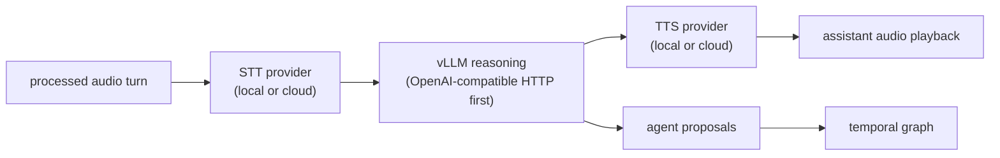

# Provider Architecture: Local + Cloud Alternatives at Every Pipeline Stage

**Date:** 2026-04-16
**Status:** Implemented for existing providers; OpenAI Realtime and local S2S are planned

## Overview

AudioGraph has two product personalities:

- **Speech-to-notes / speech-to-temporal-graph:** durable transcript, notes,
  entity extraction, temporal graph, and chatbot recall.
- **Parallel speech-to-speech agent:** realtime voice collaborator that listens
  beside the graph path and speaks or proposes actions without blocking memory
  construction.

Every implemented speech-to-graph stage supports swappable local and cloud
providers. The user selects providers in the Settings UI. Credentials are
stored securely in `~/.config/audio-graph/credentials.yaml` (chmod 600 on Unix).
Non-sensitive settings (provider type, region, model names) live in
`settings.json`.

## Product Personalities and Provider Choices

### Speech-to-Notes / Speech-to-TemporalGraph

| Phase | Local Options | Cloud Options | UX Outcome | Status |
|---|---|---|---|---|
| Capture | rsac system/device/process/process-tree capture | N/A | User picks the exact desktop audio source to remember | DONE |
| Audio prep | Rust resampling, mono mix, Silero VAD, bounded queues | N/A | Silence is filtered and each downstream consumer receives bounded chunks | DONE |
| STT / ASR | Whisper, Sherpa-ONNX | Groq/OpenAI-compatible batch API, AWS Transcribe, Deepgram, AssemblyAI, planned OpenAI Realtime transcription | Transcript partials/finals drive notes and graph updates | DONE except OpenAI Realtime |
| Speaker labels | Local diarization feature clustering | AWS/Deepgram/AssemblyAI labels when enabled | Transcript entries can carry speaker attribution | DONE MVP |
| Entity extraction | llama.cpp, mistral.rs | OpenAI-compatible HTTP endpoints, vLLM, AWS Bedrock | Entities/relations become temporal graph deltas | DONE |
| Recall chat | Local LLM providers | OpenAI-compatible HTTP endpoints, vLLM, AWS Bedrock | User asks questions over the transcript and graph | DONE |
| Persistence | Local transcript, graph, sessions index, usage files | N/A | Sessions can be restored and searched later | DONE |

### Parallel Speech-to-Speech Agent

| Phase | Local Options | Cloud Options | UX Outcome | Status |
|---|---|---|---|---|
| Capture fan-out | Processed-audio dispatcher + bounded per-consumer queues | N/A | Agent and graph path hear the same selected source | DONE for speech + Gemini |
| Realtime voice model | Local/hybrid STT -> vLLM -> TTS chain; future local S2S server | Gemini Live today, planned OpenAI Realtime `gpt-realtime-2` | Agent can respond while graph work continues | PARTIAL |
| Agent reasoning | Local LLM/vLLM through the OpenAI-compatible provider | Gemini Live, OpenAI-compatible APIs, AWS Bedrock, planned OpenAI tools | Agent uses transcript/graph context for proposals | DONE for text/proposals |
| Tool/action routing | Backend proposal queue | Provider tool calls normalized by backend | Unsafe actions wait for user approval | DONE queue; realtime tool calls planned |
| Speech output | Future local TTS such as Kokoro/Piper/Coqui or local S2S | Gemini Live responses today, planned OpenAI Realtime speech output; cloud TTS such as Deepgram Aura in hybrid mode | Spoken collaboration instead of only text | PARTIAL |
| Latency telemetry | Backend stage timing events | Provider-specific timing samples | UI shows which stage is slow | DONE baseline |

## Pipeline Stages and Providers

### 1. ASR (Automatic Speech Recognition)

| Provider | Type | Protocol | Diarization | Latency | Cost | Status |
|----------|------|----------|-------------|---------|------|--------|
| **Local Whisper** | Local | whisper-rs + Metal/CUDA | No (separate) | ~500-2000ms | Free | DONE |
| **OpenAI-compatible API** | Cloud/Batch | HTTP multipart | No | ~200-3000ms + 2s accum | Varies | DONE |
| **AWS Transcribe Streaming** | Cloud/Stream | HTTP/2 (SDK) | Yes (built-in) | ~200-500ms partial | $0.024/min | DONE |
| **Deepgram** | Cloud/Stream | WebSocket | Yes (built-in) | ~300-800ms | $0.0077/min | DONE |
| **AssemblyAI** | Cloud/Stream | WebSocket | Yes (built-in) | ~300-800ms | $0.012/min | DONE |
| **SherpaOnnx** | Local | ONNX Zipformer | No built-in (separate diarization stage) | ~200ms | Free | DONE |
| **OpenAI Realtime Transcription** | Cloud/Stream | WebSocket / realtime transcription session | Assume no built-in labels; use AudioGraph diarization unless verified | Low-latency deltas | OpenAI audio/token pricing | PLANNED |

Cost figures in this design note are illustrative snapshots; check provider
pricing pages before using them for operational estimates.

**Settings enum (implemented in `settings/mod.rs`):**
```rust
#[derive(Serialize, Deserialize)]
#[serde(tag = "type")]
pub enum AsrProvider {
    #[serde(rename = "local_whisper")]
    LocalWhisper,
    #[serde(rename = "api")]
    Api { endpoint: String, api_key: String, model: String },
    #[serde(rename = "aws_transcribe")]
    AwsTranscribe { region: String, language_code: String, credential_source: AwsCredentialSource, enable_diarization: bool },
    #[serde(rename = "deepgram")]
    DeepgramStreaming { api_key: String, model: String, enable_diarization: bool },
    #[serde(rename = "assemblyai")]
    AssemblyAI { api_key: String, enable_diarization: bool },
    #[serde(rename = "sherpa_onnx")]
    SherpaOnnx { model_dir: String, enable_endpoint_detection: bool },
}
```

### 2. LLM / Entity Extraction

| Provider | Type | Protocol | Notes | Status |
|----------|------|----------|-------|--------|
| **Local llama.cpp** | Local | llama-cpp-2 | GBNF grammar-constrained, Metal GPU | DONE |
| **OpenAI-compatible API** | Cloud | HTTP JSON | Ollama, OpenAI, Groq, Together, etc. | DONE |
| **AWS Bedrock** | Cloud | HTTP (SDK) | Claude, Llama, Mistral via AWS | DONE |
| **mistral.rs (Candle)** | Local | In-process GGUF | JSON Schema structured output | DONE |

**Settings enum (implemented in `settings/mod.rs`):**
```rust
#[derive(Serialize, Deserialize)]
#[serde(tag = "type")]
pub enum LlmProvider {
    #[serde(rename = "local_llama")]
    LocalLlama,
    #[serde(rename = "api")]
    Api { endpoint: String, api_key: String, model: String },
    #[serde(rename = "aws_bedrock")]
    AwsBedrock { region: String, model_id: String, credential_source: AwsCredentialSource },
    #[serde(rename = "mistralrs")]
    MistralRs { model_id: String },
}
```

### 3. Full Pipeline (Speech + Extraction combined)

| Provider | Type | Protocol | Notes | Status |
|----------|------|----------|-------|--------|
| **Custom Speech Processor** | Local+Cloud mix | Internal | ASR + Diarization + LLM extraction | DONE |
| **Gemini Live** | Cloud | WebSocket | Streaming transcription + model responses | DONE |
| **OpenAI Realtime Voice Agent** | Cloud | WebSocket / WebRTC / SIP | Planned `gpt-realtime-2` speech-to-speech alternative to Gemini Live | PLANNED |
| **Local / Hybrid vLLM Voice Agent** | Local+Cloud mix | STT provider + OpenAI-compatible vLLM + TTS provider | Planned composed speech-to-speech path for local reasoning with local or cloud STT/TTS | PLANNED |

### 4. Gemini Authentication

| Auth Mode | Use Case | Mechanism | Status |
|-----------|----------|-----------|--------|
| **AI Studio API Key** | Developer/consumer | Query param `?key=` | DONE |
| **Vertex AI** | Enterprise/GCP | Bearer token (gcp_auth) | DONE |

**Settings (implemented in `settings/mod.rs`):**
```rust
#[derive(Serialize, Deserialize)]
#[serde(tag = "type")]
pub enum GeminiAuthMode {
    #[serde(rename = "api_key")]
    ApiKey { api_key: String },
    #[serde(rename = "vertex_ai")]
    VertexAI { project_id: String, location: String, service_account_path: Option<String> },
}
```

## Credential Management

### Implementation

Credentials are stored in `~/.config/audio-graph/credentials.yaml` via the
`credentials/mod.rs` module. The `CredentialStore` struct holds optional fields
for each provider's API keys and secrets.

**Implemented Tauri commands:**
- `save_credential_cmd(key, value)` -- Upserts a credential
- `load_credential_cmd(key)` -- Returns a single credential
- `load_all_credentials_cmd()` -- Returns the entire store
- `list_aws_profiles()` -- Parses `~/.aws/config` for profile names

### AWS Credentials

Three modes offered (all implemented):

| Mode | Description | Storage | Status |
|------|-------------|---------|--------|
| **DefaultChain** | Auto-detect env, profiles, SSO | Nothing stored | DONE |
| **Profile** | Named AWS profile | Profile name in settings.json | DONE |
| **AccessKeys** | Manual access key + secret | credentials.yaml | DONE |

### Google Credentials

| Mode | Description | Storage | Status |
|------|-------------|---------|--------|
| **AI Studio API Key** | Single API key | credentials.yaml | DONE |
| **Vertex AI ADC** | `gcloud auth application-default login` | Nothing stored | DONE |
| **Vertex AI Service Account** | Path to SA JSON | Path in settings.json | DONE |

## Dependencies (all added to Cargo.toml)

```toml
# AWS SDK (always compiled)
aws-config = { version = "1.1", features = ["behavior-version-latest", "sso"] }
aws-sdk-transcribestreaming = "1.102"
aws-credential-types = "1"
aws-sdk-sts = "1.101"
aws-smithy-http = "0.63"
tokio-stream = "0.1"

# Google Cloud auth (Vertex AI)
gcp_auth = "0.12"

# WebSocket (Gemini, Deepgram, AssemblyAI)
tokio-tungstenite = { version = "0.29", features = ["native-tls"] }

# Credential storage
serde_yaml = "0.9"
dirs = "6"

# HTTP multipart (cloud ASR API)
reqwest = { version = "0.13.2", features = ["blocking", "json", "multipart"] }
```

## Implementation Status

### Planned: OpenAI Realtime Provider

OpenAI Realtime should be treated as a separate provider family, not folded
into the existing OpenAI-compatible HTTP API path:

- **STT-only mode:** route realtime transcription sessions through a Rust
  WebSocket client and normalize transcript deltas/finals into the existing
  `asr-partial` and `transcript-update` event contracts.
- **Speech-to-speech mode:** add a Gemini-like full-pipeline path for
  `gpt-realtime-2`, preserving graph updates, tool/action proposals, latency
  samples, and backend-owned credentials.
- **Browser route:** only use WebRTC directly from React for future
  browser-origin audio or provider-native widget modes. The default `rsac`
  pipeline should remain backend-direct.
- **Audio format contract:** define the OpenAI input audio format, sample rate,
  Base64 append framing, and any resampling before coding. The current
  AudioGraph pipeline emits 16 kHz mono PCM chunks; the OpenAI Realtime client
  must own any provider-specific conversion.
- **Transcript event correlation:** aggregate OpenAI transcription deltas and
  completed events by provider item id before emitting AudioGraph
  `asr-partial` or final transcript updates. Do not assume provider completion
  order matches local turn order.
- **Diarization fallback:** assume OpenAI Realtime transcription does not supply
  usable speaker labels until proven by fixture tests and route finals through
  AudioGraph speaker handling.

### Planned: Local / Hybrid vLLM Speech-to-Speech Provider

The local/hybrid S2S route should be a composed pipeline rather than a single
model family:



- **Local STT choices:** Whisper and Sherpa-ONNX.
- **Cloud STT choices:** Deepgram, AWS Transcribe, AssemblyAI, OpenAI Realtime
  transcription, or existing OpenAI-compatible batch APIs where latency allows.
- **Reasoning:** vLLM should remain an external OpenAI-compatible endpoint until
  measurements show the HTTP route cannot satisfy turn latency.
- **Local TTS choices:** future Kokoro/Piper/Coqui-style provider.
- **Cloud TTS choices:** Deepgram Aura streaming TTS or OpenAI speech/realtime
  output, depending on the selected route.
- **Protocol:** copy the HF `streaming-speech-to-speech` turn-state semantics:
  bounded turn buffers, explicit start/end/cancel, cancel acknowledgement before
  immediate retry, aggressive token flush to TTS, and latency milestones.

### Phase 1: Foundations -- DONE
- [x] Credential management module (`credentials/mod.rs`)
- [x] Settings module with all provider enums (`settings/mod.rs`)
- [x] Cloud ASR via HTTP multipart (`asr/cloud.rs`)
- [x] Settings load/save Tauri commands

### Phase 2: AWS Integration -- DONE
- [x] AWS SDK dependencies (always compiled, not feature-gated)
- [x] AWS Transcribe streaming worker (`asr/aws_transcribe.rs`)
- [x] AWS credential management (DefaultChain, Profile, AccessKeys)
- [x] `list_aws_profiles` command

### Phase 3: Vertex AI + Gemini Auth -- DONE
- [x] `gcp_auth` dependency
- [x] Gemini Live client with API Key and Vertex AI auth modes (`gemini/mod.rs`)
- [x] GeminiAuthMode enum in settings

### Phase 4: Streaming ASR Providers -- DONE
- [x] Deepgram WebSocket streaming client (`asr/deepgram.rs`)
- [x] AssemblyAI WebSocket streaming client (`asr/assemblyai.rs`)
- [x] Both providers added to AsrProvider enum and speech processor dispatch

### Phase 5: LLM Providers -- DONE
- [x] Local llama.cpp with GBNF grammar (`llm/engine.rs`)
- [x] OpenAI-compatible API client (`llm/api_client.rs`)
- [x] AWS Bedrock support via LlmProvider::AwsBedrock
- [x] Extraction chain fallback logic in speech processor

### Phase 6: Local Streaming + Advanced LLM -- DONE
- [x] sherpa-onnx streaming ASR via Zipformer transducer (asr/sherpa_streaming.rs)
- [x] mistral.rs LLM with JSON Schema-constrained structured generation (llm/mistralrs_engine.rs)
- [x] Whisper model size picker (5 sizes: tiny, base, small, medium, large-v3)
