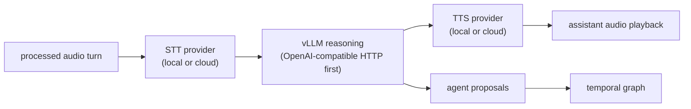

# Provider Architecture: Local + Cloud Alternatives at Every Pipeline Stage

**Date:** 2026-04-16 (refreshed 2026-06-28)
**Status:** Implemented across ASR/LLM/TTS + Gemini Live and OpenAI Realtime
(transcription + `gpt-realtime-2` S2S). Local/hybrid vLLM S2S is the remaining
planned path.

## Overview

AudioGraph has two product personalities:

- **Speech-to-notes / speech-to-temporal-graph:** durable transcript, notes,
  entity extraction, temporal graph, and chatbot recall.
- **Parallel speech-to-speech agent:** realtime voice collaborator that listens
  beside the graph path and speaks or proposes actions without blocking memory
  construction.

Every implemented speech-to-graph stage supports swappable local and cloud
providers. The user selects providers in the Settings UI. Credentials are
stored securely in the desktop credential backend first (Keychain on macOS,
Credential Manager on Windows, Secret Service/libsecret on Linux). AudioGraph
can also import from or explicitly fall back to
`~/.config/audio-graph/credentials.yaml` when
`AUDIO_GRAPH_CREDENTIAL_BACKEND=file` is selected. Non-sensitive settings
(provider type, region, model names) live in `settings.json`, and the frontend
only reads non-secret per-key presence/source metadata for saved credentials.

## Provider Addition Content-Egress Checklist

Any future provider or transport that can send user/session content off-device
must satisfy this checklist before it is marked `Implemented`, exposed as
selectable runtime UI, or used by a live session path. This applies to OpenAI
Realtime S2S, Gladia, Speechmatics, RevAI, ElevenLabs, embeddings, org-sync,
and new WebRTC, SIP, gRPC, native SDK, sidecar, or WebSocket transports.

1. **Registry privacy metadata:** add or update the `ProviderDescriptor` with
   accurate `privacy.data_classes_sent`, `privacy.data_classes_returned`,
   `privacy.health_check_data_classes`, `privacy.data_leaves_device`, lifecycle,
   transport, source policy, and audio/input contract metadata. Content-bearing
   providers stay `Planned` or `Watch` until the runtime guard and tests below
   exist.
2. **Readiness/runtime separation:** readiness and model discovery may only send
   credential auth, provider configuration, endpoint connectivity, model
   catalog metadata, or SDK dependency probes. If a probe requires audio,
   transcript text, prompts, notes, graph context, generated text, generated
   audio, embeddings payloads, or org content, it is a runtime content path, not
   a readiness probe. Leave `health_check_command` or `model_catalog_command`
   unset until a no-content probe exists.
3. **Session command gate:** every command that can start a content-bearing
   session must enforce the user privacy mode before opening provider sockets,
   HTTP requests, SDK sessions, sidecars, WebRTC peers, or SIP calls. Use
   `enforce_session_content_policy` and the selected provider's
   `requires_cloud_content_transfer()` equivalent for the exact data classes.
4. **Low-level provider guard:** every content-bearing adapter must receive
   `ProviderContentEgressPolicy` or an equivalent low-level guard in its config
   or constructor. Defaults must be blocked or require an explicit policy. The
   first send/write/append operation for audio, text, prompt, JSON, embeddings,
   generated speech text, org-sync batch, or tool/session context must call the
   guard before bytes are written to the provider transport.
5. **Blocked-policy harness fixtures:** new provider harness tests must include
   a blocked-policy case that proves no session content is written when policy
   blocks egress. For streaming transports, assert that audio append frames,
   prompt/session instruction frames, TTS text frames, embeddings requests, or
   org-sync payloads are not emitted. Parser-only event fixtures are useful but
   do not satisfy this runtime blocked-policy requirement.
6. **No payload echo:** blocked-policy errors, readiness errors, diagnostics,
   logs, fixtures, and UI messages may name the provider, privacy mode, and data
   class, but must not echo API keys, audio, transcript text, prompts, notes,
   graph content, embeddings input, generated text, generated audio, or org
   payloads.
7. **Candidate-specific notes:** OpenAI Realtime S2S must guard both session
   instructions/tool context and audio appends; Gladia, Speechmatics, RevAI,
   and ElevenLabs must guard audio or generated-speech text before streaming
   writes; embeddings must treat source text and graph/notes context as content
   egress; org-sync must remain an explicit promotion/sync flow, not an
   implicit live-session side channel; new transports must place the guard at
   the transport write primitive, not only at the UI or command boundary.

## Product Personalities and Provider Choices

### Speech-to-Notes / Speech-to-TemporalGraph

| Phase | Local Options | Cloud Options | UX Outcome | Status |
|---|---|---|---|---|
| Capture | rsac system/device/process/process-tree capture | N/A | User picks the exact desktop audio source to remember | DONE |
| Audio prep | Rust resampling, mono mix, source tagging, bounded queues, local fixed-window turn fallback | N/A | Each downstream consumer receives bounded chunks with stable source attribution | DONE; dedicated local VAD planned |
| STT / ASR | Whisper, Sherpa-ONNX, Moonshine | Groq/OpenAI-compatible batch API, AWS Transcribe, Deepgram, AssemblyAI, Soniox, OpenAI Realtime transcription | Transcript partials/finals drive notes and graph updates | DONE |
| Speaker labels | Local diarization: `Simple` audio-feature MVP, `Sortformer` ≤4-speaker neural, or unbounded sherpa-onnx live **clustering** (ADR-0017) | AWS/Deepgram/AssemblyAI labels when enabled | Transcript entries carry speaker attribution; all paths normalize into the provider-neutral `SpeakerTimeline` revision ledger (eb6c) | DONE MVP (clustering accuracy gate pending) |
| Entity extraction | llama.cpp, mistral.rs | OpenAI-compatible HTTP endpoints, vLLM, AWS Bedrock | Entities/relations become temporal graph deltas | DONE |
| Recall chat | Local LLM providers | OpenAI-compatible HTTP endpoints, vLLM, AWS Bedrock | User asks questions over the transcript and graph | DONE |
| Persistence | Local transcript, graph, sessions index, usage files | N/A | Sessions can be restored and searched later | DONE |

### Parallel Speech-to-Speech Agent

| Phase | Local Options | Cloud Options | UX Outcome | Status |
|---|---|---|---|---|
| Capture fan-out | Processed-audio dispatcher + bounded per-consumer queues | N/A | Agent and graph path hear the same selected source | DONE for speech + Gemini |
| Realtime voice model | Local/hybrid STT -> vLLM -> TTS chain; future local S2S server | Gemini Live + OpenAI Realtime `gpt-realtime-2` | Agent can respond while graph work continues | DONE for cloud S2S; local S2S planned |
| Agent reasoning | Local LLM/vLLM through the OpenAI-compatible provider | Gemini Live, OpenAI-compatible APIs, AWS Bedrock, planned OpenAI tools | Agent uses transcript/graph context for proposals | DONE for text/proposals |
| Tool/action routing | Backend proposal queue | Provider tool calls normalized by backend | Unsafe actions wait for user approval | DONE queue; realtime tool calls planned |
| Speech output | Future local TTS such as Kokoro/Piper/Coqui or local S2S | Gemini Live + OpenAI Realtime speech output; cloud TTS such as Deepgram Aura in hybrid mode | Spoken collaboration instead of only text | DONE for cloud S2S/TTS; local TTS planned |
| Latency telemetry | Backend stage timing events | Provider-specific timing samples | UI shows which stage is slow | DONE baseline |

**Near-term provider focus:** build the S2S turn contract around Deepgram and
local providers first. Deepgram supplies cloud STT, cloud TTS, and model-level
turn signals; local Whisper/Sherpa plus the fixed-window fallback keep the
offline baseline usable until dedicated local VAD lands. The same turn
lifecycle should feed both product modes: finalizing graph/notes transcript
segments and starting/cancelling voice-agent LLM/TTS work.

## Pipeline Stages and Providers

### 1. ASR (Automatic Speech Recognition)

| Provider | Type | Protocol | Diarization | Latency | Cost | Status |
|----------|------|----------|-------------|---------|------|--------|
| **Local Whisper** | Local | whisper-rs + Metal/CUDA | No (separate) | ~500-2000ms | Free | DONE |
| **OpenAI-compatible API** | Cloud/Batch | HTTP multipart | No | ~200-3000ms + 2s accum | Varies | DONE |
| **AWS Transcribe Streaming** | Cloud/Stream | HTTP/2 (SDK) | Yes (built-in) | ~200-500ms partial | $0.024/min | DONE |
| **Deepgram** | Cloud/Stream | WebSocket | Yes (built-in) | ~300-800ms | $0.0077/min | DONE |
| **AssemblyAI** | Cloud/Stream | WebSocket | Yes (built-in) | ~300-800ms | $0.012/min | DONE |
| **SherpaOnnx** | Local | ONNX Zipformer | No built-in (separate diarization stage) | ~200ms | Free | DONE |
| **Soniox** | Cloud/Stream | WebSocket | Token-level speaker tags | Low-latency deltas | Soniox pricing | DONE |
| **Moonshine** | Local | Native C API streaming | No built-in (separate diarization stage) | Low-latency deltas | Free | DONE |
| **OpenAI Realtime Transcription** | Cloud/Stream | WebSocket / realtime transcription session | Assume no built-in labels; use AudioGraph diarization unless verified | Low-latency deltas | OpenAI audio/token pricing | DONE |

Cost figures in this design note are illustrative snapshots; check provider
pricing pages before using them for operational estimates.

**Settings enum (implemented in `settings/mod.rs`):**
```rust
#[derive(Serialize, Deserialize)]
#[serde(tag = "type")]
pub enum AsrProvider {
    #[serde(rename = "local_whisper")]
    LocalWhisper,
    #[serde(rename = "api")]
    Api { endpoint: String, api_key: String, model: String },
    #[serde(rename = "aws_transcribe")]
    AwsTranscribe { region: String, language_code: String, credential_source: AwsCredentialSource, enable_diarization: bool },
    #[serde(rename = "deepgram")]
    DeepgramStreaming {
        api_key: String,
        model: String,
        enable_diarization: bool,
        endpointing_ms: u32,
        utterance_end_ms: u32,
        vad_events: bool,
        eot_threshold: f32,
        eager_eot_threshold: f32,
        eot_timeout_ms: u32,
    },
    #[serde(rename = "assemblyai")]
    AssemblyAI { api_key: String, enable_diarization: bool },
    #[serde(rename = "sherpa_onnx")]
    SherpaOnnx { model_dir: String, enable_endpoint_detection: bool },
    #[serde(rename = "soniox")]
    Soniox { api_key: String, model: String, enable_diarization: bool, /* + endpointing knobs */ },
    #[serde(rename = "moonshine")]
    Moonshine { model_dir: String, enable_speaker_hints: bool },
    #[serde(rename = "openai_realtime_transcription")]
    OpenAiRealtimeTranscription { api_key: String, model: String, language: Option<String> },
}
```

The native speech-to-speech voice agent (OpenAI Realtime `gpt-realtime-2`) is a
separate provider under the parallel S2S agent path, not an `AsrProvider`
variant — see [Full Pipeline](#3-full-pipeline-speech--extraction-combined).

#### Speaker diarization and the `SpeakerTimeline` ledger

Speaker attribution comes from engines that do **not** agree on speaker identity,
so AudioGraph routes all of them through one provider-neutral seam — the
`SpeakerTimeline` revision ledger (`src-tauri/src/projections.rs`, Seed
`audio-graph-eb6c`, merged 2026-06-28). This matches the canonical description in
[`ARCHITECTURE.md`](../ARCHITECTURE.md) / `DATA_FLOW.md` / [ADR-0017](../adr/0017-unbounded-speaker-diarization.md);
read those for the full contract. Four distinct concepts:

- **Local diarization.** Three backends in `src-tauri/src/diarization/`, selected
  by `make_diarization_config` (`speech/mod.rs`):
  - `Simple` — pure-Rust RMS/ZCR fingerprint, nearest-neighbour, soft cap
    `max_speakers = 10`. Always available, runs **inline** on the ASR worker.
  - `Sortformer` — NVIDIA Sortformer ONNX via `parakeet-rs`, **hard-capped at 4
    speakers** (`SORTFORMER_MAX_SPEAKERS`), feature `diarization`. Runs inline.
  - `Clustering` — **unbounded** sherpa-onnx pyannote-segmentation + TitaNet
    embedding + FastClustering (`num_clusters = -1`), feature
    `diarization-clustering` (ADR-0017). Its live `LiveDiarizationWorker`
    (`diarization/worker.rs`) runs on a dedicated `diarization-clustering`
    thread, re-diarizing a rolling window and emitting `DIARIZATION_SPAN_REVISION`.
    `Clustering` is **mutually exclusive** with `Sortformer` at build time (ORT
    single-link constraint). The one remaining gate is multi-speaker accuracy
    verification on a curated clip.
- **Provider diarization.** Deepgram / AWS Transcribe / AssemblyAI return their
  own labels on transcript segments; `speech/mod.rs` normalizes each final
  segment into a `DiarizationSpanRevision` via
  `diarization_span_revision_for_transcript`. The raw `provider_speaker_id` is
  retained as provenance only — **never** the durable identity.
- **Metadata join (the default).** The durable identity is the provider-neutral
  `span_id`; the ledger keys spans by it, replaces earlier revisions with later
  ones, rejects stale revisions, and treats a disagreeing same-revision payload as
  a conflict (mirroring `TranscriptLedger`). The clustering worker maps spans onto
  transcript times by **time overlap** (`overlap_speaker_for_segment`), not an
  audio split. Notes/graph patches that cite speaker spans are staleness-gated by
  `validate_diarization_basis`.
- **Physical multi-channel projection (research-gated, experimental).** AudioGraph
  does **not** synthesize one audio channel per diarized speaker. The processed
  pipeline is mono (ADR-0020) and diarization is a metadata join over it. The
  `DiarizationSpanRevision.channel` field exists so channel-aware providers can be
  normalized later, but `supports_multichannel` stays `false` until both a capture
  source and a provider adapter prove real, ordered, stable channels. See
  [`docs/research/speaker-channel-routing-2026-06-26.md`](../research/speaker-channel-routing-2026-06-26.md).

### 2. LLM / Entity Extraction

| Provider | Type | Protocol | Notes | Status |
|----------|------|----------|-------|--------|
| **Local llama.cpp** | Local | llama-cpp-2 | GBNF grammar-constrained, Metal GPU | DONE |
| **OpenAI-compatible API** | Cloud | HTTP JSON | Ollama, OpenAI, Groq, Together, etc. | DONE |
| **AWS Bedrock** | Cloud | HTTP (SDK) | Claude, Llama, Mistral via AWS | DONE |
| **mistral.rs (Candle)** | Local | In-process GGUF | JSON Schema structured output | DONE |

**Settings enum (implemented in `settings/mod.rs`):**
```rust
#[derive(Serialize, Deserialize)]
#[serde(tag = "type")]
pub enum LlmProvider {
    #[serde(rename = "local_llama")]
    LocalLlama,
    #[serde(rename = "api")]
    Api { endpoint: String, api_key: String, model: String },
    #[serde(rename = "aws_bedrock")]
    AwsBedrock { region: String, model_id: String, credential_source: AwsCredentialSource },
    #[serde(rename = "mistralrs")]
    MistralRs { model_id: String },
}
```

**Streaming chat:** all four LLM providers stream token deltas (no longer
deferred). `Api`/`OpenRouter` stream OpenAI-compatible SSE; `LocalLlama` and
`MistralRs` use their engines' token loops bridged into `TokenDelta`
(`run_local_llama_stream` / `run_mistralrs_stream` in `llm/streaming.rs`); and
`AwsBedrock` drives the native `ConverseStream` event stream via
`BedrockConverseStreamAdapter` (`llm/bedrock.rs`). `provider_supports_streaming`
(`commands.rs`) returns `true` for all of them.

### 3. Full Pipeline (Speech + Extraction combined)

| Provider | Type | Protocol | Notes | Status |
|----------|------|----------|-------|--------|
| **Custom Speech Processor** | Local+Cloud mix | Internal | ASR + Diarization + LLM extraction | DONE |
| **Gemini Live** | Cloud | WebSocket | Streaming transcription + model responses | DONE |
| **OpenAI Realtime Voice Agent** | Cloud | WebSocket | `gpt-realtime-2` speech-to-speech sibling to Gemini Live (`openai_realtime/` module: session, resumption, reconnect/backoff, usage tracking) | DONE |
| **Local / Hybrid vLLM Voice Agent** | Local+Cloud mix | STT provider + OpenAI-compatible vLLM + TTS provider | Planned composed speech-to-speech path for local reasoning with local or cloud STT/TTS | PLANNED |

### 4. Gemini Authentication

| Auth Mode | Use Case | Mechanism | Status |
|-----------|----------|-----------|--------|
| **AI Studio API Key** | Developer/consumer | Query param `?key=` | DONE |
| **Vertex AI** | Enterprise/GCP | Bearer token (gcp_auth) | DONE |

**Settings (implemented in `settings/mod.rs`):**
```rust
#[derive(Serialize, Deserialize)]
#[serde(tag = "type")]
pub enum GeminiAuthMode {
    #[serde(rename = "api_key")]
    ApiKey { api_key: String },
    #[serde(rename = "vertex_ai")]
    VertexAI { project_id: String, location: String, service_account_path: Option<String> },
}
```

## Credential Management

### Implementation

`credentials/mod.rs` persists secrets through a keychain-first credential store.
Legacy `credentials.yaml` remains available for import and explicit fallback
flows, but it is not the default desktop storage path. The frontend receives
non-secret presence/source state per credential key so Settings can show where a
saved secret came from without reading the plaintext value back into React.

**Implemented Tauri commands:**
- `save_credential_cmd(key, value)` -- Upserts a credential
- `load_credential_presence_cmd()` -- Returns non-secret key presence/source state
- `list_aws_profiles()` -- Parses `~/.aws/config` for profile names

### AWS Credentials

Three modes offered (all implemented):

| Mode | Description | Storage | Status |
|------|-------------|---------|--------|
| **DefaultChain** | Auto-detect env, profiles, SSO | Nothing stored | DONE |
| **Profile** | Named AWS profile | Profile name in settings.json | DONE |
| **AccessKeys** | Manual access key + secret | Desktop credential store first; YAML import/fallback available | DONE |

### Google Credentials

| Mode | Description | Storage | Status |
|------|-------------|---------|--------|
| **AI Studio API Key** | Single API key | Desktop credential store first; YAML import/fallback available | DONE |
| **Vertex AI ADC** | `gcloud auth application-default login` | Nothing stored | DONE |
| **Vertex AI Service Account** | Path to SA JSON | Path in settings.json | DONE |

## Dependencies (all added to Cargo.toml)

```toml
# AWS SDK (always compiled)
aws-config = { version = "1.1", features = ["behavior-version-latest", "sso"] }
aws-sdk-transcribestreaming = "1.102"
aws-credential-types = "1"
aws-sdk-sts = "1.101"
aws-smithy-http = "0.63"
tokio-stream = "0.1"

# Google Cloud auth (Vertex AI)
gcp_auth = "0.12"

# WebSocket (Gemini, Deepgram, AssemblyAI)
tokio-tungstenite = { version = "0.29", features = ["native-tls"] }

# Credential storage
serde_yaml = "0.9"
dirs = "6"

# HTTP multipart (cloud ASR API)
reqwest = { version = "0.13.2", features = ["blocking", "json", "multipart"] }
```

## Implementation Status

### DONE: OpenAI Realtime Provider

OpenAI Realtime is implemented as a separate provider family, not folded into
the existing OpenAI-compatible HTTP API path:

- **STT-only mode (DONE):** realtime transcription (`gpt-realtime-whisper`)
  runs through a Rust WebSocket client (`asr/openai_realtime.rs`,
  `AsrProvider::OpenAiRealtimeTranscription`) normalizing deltas/finals into
  the existing `asr-partial` and `transcript-update` event contracts.
- **Speech-to-speech mode (DONE):** a Gemini-like full-pipeline path for
  `gpt-realtime-2` ships in the `openai_realtime/` module (session, resumption,
  reconnect/backoff, usage tracking) wired into the converse FSM, preserving
  graph updates, tool/action proposals, latency samples, and backend-owned
  credentials.
- **Browser route:** only use WebRTC directly from React for future
  browser-origin audio or provider-native widget modes. The default `rsac`
  pipeline should remain backend-direct.
- **Audio format contract:** define the OpenAI input audio format, sample rate,
  Base64 append framing, and any resampling before coding. The current
  AudioGraph pipeline emits 16 kHz mono PCM chunks; the OpenAI Realtime client
  must own any provider-specific conversion.
- **Transcript event correlation:** aggregate OpenAI transcription deltas and
  completed events by provider item id before emitting AudioGraph
  `asr-partial` or final transcript updates. Do not assume provider completion
  order matches local turn order.
- **Diarization fallback:** assume OpenAI Realtime transcription does not supply
  usable speaker labels until proven by fixture tests and route finals through
  AudioGraph speaker handling (the local diarization backends + `SpeakerTimeline`
  ledger described in [§1](#speaker-diarization-and-the-speakertimeline-ledger)).

### Planned: Local / Hybrid vLLM Speech-to-Speech Provider

The local/hybrid S2S route should be a composed pipeline rather than a single
model family:



- **Local STT choices:** Whisper and Sherpa-ONNX.
- **Cloud STT choices:** Deepgram, AWS Transcribe, AssemblyAI, OpenAI Realtime
  transcription, or existing OpenAI-compatible batch APIs where latency allows.
- **Reasoning:** vLLM should remain an external OpenAI-compatible endpoint until
  measurements show the HTTP route cannot satisfy turn latency.
- **Local TTS choices:** future Kokoro/Piper/Coqui-style provider.
- **Cloud TTS choices:** Deepgram Aura streaming TTS or OpenAI speech/realtime
  output, depending on the selected route.
- **Protocol:** copy the HF `streaming-speech-to-speech` turn-state semantics:
  bounded turn buffers, explicit start/end/cancel, cancel acknowledgement before
  immediate retry, aggressive token flush to TTS, and latency milestones.

### Phase 1: Foundations -- DONE
- [x] Credential management module (`credentials/mod.rs`)
- [x] Settings module with all provider enums (`settings/mod.rs`)
- [x] Cloud ASR via HTTP multipart (`asr/cloud.rs`)
- [x] Settings load/save Tauri commands

### Phase 2: AWS Integration -- DONE
- [x] AWS SDK dependencies (always compiled, not feature-gated)
- [x] AWS Transcribe streaming worker (`asr/aws_transcribe.rs`)
- [x] AWS credential management (DefaultChain, Profile, AccessKeys)
- [x] `list_aws_profiles` command

### Phase 3: Vertex AI + Gemini Auth -- DONE
- [x] `gcp_auth` dependency
- [x] Gemini Live client with API Key and Vertex AI auth modes (`gemini/mod.rs`)
- [x] GeminiAuthMode enum in settings

### Phase 4: Streaming ASR Providers -- DONE
- [x] Deepgram WebSocket streaming client (`asr/deepgram.rs`)
- [x] AssemblyAI WebSocket streaming client (`asr/assemblyai.rs`)
- [x] Both providers added to AsrProvider enum and speech processor dispatch

### Phase 5: LLM Providers -- DONE
- [x] Local llama.cpp with GBNF grammar (`llm/engine.rs`)
- [x] OpenAI-compatible API client (`llm/api_client.rs`)
- [x] AWS Bedrock support via LlmProvider::AwsBedrock
- [x] Extraction chain fallback logic in speech processor

### Phase 6: Local Streaming + Advanced LLM -- DONE
- [x] sherpa-onnx streaming ASR via Zipformer transducer (asr/sherpa_streaming.rs)
- [x] mistral.rs LLM with JSON Schema-constrained structured generation (llm/mistralrs_engine.rs)
- [x] Whisper model size picker (5 sizes: tiny, base, small, medium, large-v3)
