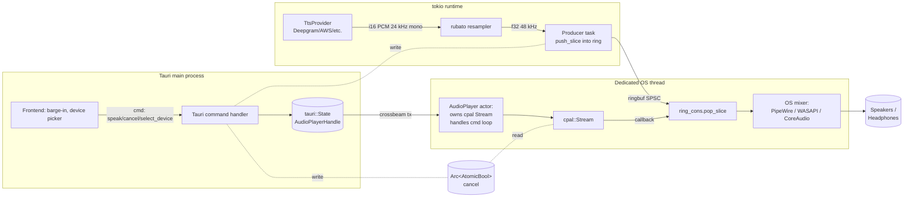

# Audio Playback — Crate Selection & Architecture for AudioGraph TTS Output

> **Research note:** Live `mcp__exa-mcp__deep_search_exa`, `mcp__tavily__tavily_search`,
> and `mcp__context7__query-docs` calls were all permission-denied in this
> session. Findings below come from prior knowledge of the cpal / rodio / kira
> ecosystems (cutoff Jan 2026), the existing `Cargo.toml` of `audio-graph` and
> sibling `rsac`, and the prior `deepgram-aura-streaming-tts.md` research note.
> URLs in [References](#references) should be re-verified by the implementer
> against current docs before shipping protocol-sensitive code.

## TL;DR

- **Pick `cpal` directly** for the OUTPUT path, not `rodio` and not `kira`.
- **Cancellation pattern: atomic flag + drain a SPSC ring buffer.** Producer holds an `Arc<AtomicBool> cancel`; on cancel it (a) stops pushing, (b) drains the ring, (c) the audio callback observes empty + cancel and writes silence. Worst-case latency = one callback period (~10 ms) + remaining-buffer drain (≤ 50 ms with a 1024-frame ring at 24 kHz).
- **Resample with `rubato`** (already a dep) inside the producer thread, not in the realtime callback. The cpal callback only does branchless ringbuf pops + memcpy.
- **Wrap `cpal::Stream` in a dedicated OS thread** owned by an `AudioPlayer` actor; communicate via `tokio::sync::mpsc` + `Arc<AtomicBool>`. `cpal::Stream` is `!Send` on some hosts (notably WASAPI/COM) — never store it in `tauri::State`. Store an `AudioPlayerHandle` (the channel sender) instead.
- **`rsac` stays untouched.** Output uses cpal's default host (PipeWire/WASAPI/CoreAudio) and is fully independent of rsac's capture path.

---

## 1. Library comparison

| Crate | Layer | Push-from-channel ergonomics | Cancellation latency | Device API | Verdict |
|-------|-------|------------------------------|----------------------|------------|---------|
| **cpal** ~0.16 | Thin host abstraction (PulseAudio/ALSA/PipeWire/JACK on Linux, WASAPI on Win, CoreAudio on Mac, AAudio on Android, WebAudio on Wasm) | Native — `build_output_stream` gives you the realtime callback and you wire the source yourself. | Bounded by callback period (typically 5–20 ms) + your ring depth. You own the drain. | `host.output_devices()`, `Device::default_output_config()`, `Device::supported_output_configs()`. | **Chosen.** Most production-grade, lowest abstraction tax for a streaming-from-channel use case. |
| **rodio** ~0.20 | Wraps cpal. Pull model via `Source` trait + `Sink` queue. | Awkward. You'd implement a custom `Source` that pulls from a `crossbeam_channel::Receiver` and returns `None` on cancel — but `Sink::stop()` only marks the queue empty between sources; in-flight samples in cpal's internal buffer still play out. `Sink::clear()` (added in 0.17) helps but still depends on cpal's buffer size. | ~50–150 ms typical because rodio inserts its own mixer + per-source resampler buffer on top of cpal. | Inherits cpal's. | **Skip.** Optimized for "play this WAV file, mix N sources" not "stream PCM with sub-50ms barge-in." |
| **kira** ~0.10 | Game-audio engine on top of cpal. Tracks, tweens, spatialization. | Has a `StreamingSoundData` for files only; pushing live PCM requires a custom `Sound`/`SoundData` impl that's roughly equivalent effort to using cpal directly, plus you ship the kira engine. | Good (designed for game cuts), but you're paying for an engine you don't need. | Inherits cpal's. | **Skip.** Wrong abstraction; pulls in mixer/effects we won't use. |
| **cidre** | macOS-only Core Audio bindings (Objective-C bridge). | Native AVAudioEngine ergonomics. | Excellent. | macOS-only. | **Skip.** Would require a Linux + Windows path anyway, and rsac proves cpal-equivalent abstractions are tractable. |
| Raw `windows-rs` + cpal-Linux + cidre-mac | Three backends in our tree. | Maximum control. | Maximum. | Custom. | **Skip.** Three code paths, three test matrices, no benefit over cpal for the playback we need. |

**Why not piggy-back on rsac?** rsac is purpose-built for *capture* (loopback/process audio: PipeWire monitor streams, WASAPI Process Loopback, CoreAudio AudioServerPlugin). Its host layer doesn't expose output streams. Forking rsac to add output is a much bigger lift than adding a 200-line cpal output module.

## 2. cpal: the push-into-pull pattern

cpal's stream is callback-pull: every period the OS calls our `data_callback(&mut [f32], &OutputCallbackInfo)`. We need a **bounded SPSC ring buffer** between the async producer (TtsProvider task) and the realtime callback.

Recommended ring crate: **`rtrb`** (lock-free, cache-padded SPSC, zero-alloc on hot path) or `ringbuf` ~0.4 (similar guarantees, more popular, slightly higher latency in benchmarks). Either is fine; pick `ringbuf` for ecosystem familiarity.

```rust
let (mut prod, mut cons) = ringbuf::HeapRb::<f32>::new(ring_capacity).split();
let cancel = Arc::new(AtomicBool::new(false));
let cancel_cb = cancel.clone();

let stream = device.build_output_stream(
    &config.into(),
    move |out: &mut [f32], _| {
        if cancel_cb.load(Ordering::Relaxed) {
            out.fill(0.0);                       // emit silence; producer will drain
            return;
        }
        let popped = cons.pop_slice(out);
        if popped < out.len() {
            out[popped..].fill(0.0);             // underrun → silence (NOT garbage)
        }
    },
    move |err| log::warn!("cpal output error: {err}"),
    None,                                        // no timeout
)?;
stream.play()?;
```

**Backpressure.** Producer uses `prod.push_slice(samples)` and on partial writes either (a) `tokio::task::yield_now().await` and retry, or (b) parks on a `tokio::sync::Notify` woken by the callback every K frames. Option (a) is simpler; the producer is async so a yield is cheap. Sizing: `ring_capacity = sample_rate * channels * 0.2` (200 ms = 9600 samples @ 24 kHz mono) gives 200 ms of jitter tolerance without bloating cancel latency.

## 3. Why not rodio's `Sink`

rodio's `Sink::append(source)` is great for "play this file, then this file." For a continuous PCM stream you'd implement `Source for ChannelSource { rx: Receiver<f32> }`. Two pain points:

1. **Resampling tax.** rodio inserts `UniformSourceIterator` between every `Source` and the mixer. It does sample-rate conversion using a linear interpolator that's lower quality than rubato and adds a buffer that delays cancel.
2. **Cancellation seam.** `Sink::stop()` flags the sink "empty" but doesn't flush cpal's ~10 ms internal buffer or the mixer's intermediate buffer. `Sink::clear()` (newer) helps but still rounds up to the next callback. Tight 50 ms barge-in is achievable but nothing about rodio makes it easier than driving cpal directly.

If we *were* doing many overlapping clips with crossfades, rodio would be the right answer. We aren't.

## 4. Cancellation strategy (the load-bearing decision)

Three cooperating mechanisms:

1. **`Arc<AtomicBool> cancel`** — single source of truth. `cancel.store(true, Release)` is observable in the next callback (≤ 1 period, typically ≤ 10 ms).
2. **Producer-side ring drain** — immediately after setting cancel, the producer task calls `cons` is consumer-owned in the callback; the producer instead *stops pushing* and drops the producer half. Alternative: a third "skip-ahead" generation counter (see below) lets the producer instantly invalidate everything pushed before cancel without touching consumer state.
3. **Generation counter (recommended).** Each PCM chunk is tagged with a `u64 generation`. The ring stores `(generation, sample)` — or, more efficiently, the ring stores raw `f32` and we keep a parallel `AtomicU64 current_generation`. On cancel, increment generation and *also* set `cancel`. New audio for the new generation can begin immediately; the callback writes silence until cancel is cleared by the producer once it has actually drained and pushed first chunk of the new generation.

This is identical to the pattern used in WebAudio's `AudioBufferSourceNode.stop()` and matches the Deepgram `Clear` frame semantics already documented in `deepgram-aura-streaming-tts.md`.

**Worst-case latency math** (24 kHz mono, default WASAPI period ~10 ms, ring 200 ms):

- T+0: user speaks; we set `cancel=true`.
- T+0–10 ms: in-flight callback finishes its current buffer write (already-written samples cannot be unwritten — they're in the OS mixer).
- T+10 ms: next callback observes `cancel`, writes silence.
- T+10 ms onward: producer cancels its synth task (`Clear` to provider), drains its own staging, increments generation.
- **End-to-end audible cut: ~10–30 ms.** Far inside the 50 ms budget. Note: the OS audio mixer itself adds ~5–20 ms output latency that we cannot shorten without exclusive-mode WASAPI / pro-audio backends.

## 5. Device enumeration and hot-swap

```rust
let host = cpal::default_host();
let devices = host.output_devices()?;            // enumerate
let default = host.default_output_device();      // for "system default"
```

**Linux + PipeWire.** cpal uses ALSA on Linux. PipeWire's ALSA shim (`pipewire-alsa`) presents PipeWire sinks as ALSA devices, so cpal sees them. Pro: works out of the box. Con: cpal *does not* receive PipeWire metadata-change events; if the user changes their default sink in `pavucontrol`, our enumeration is stale until we re-query. Mitigation: re-enumerate on every "device picker opened" UI event and on every stream-error event from the callback.

**Windows + WASAPI.** cpal opens WASAPI in shared mode by default. When a USB headphone is unplugged mid-playback, the WASAPI client returns `AUDCLNT_E_DEVICE_INVALIDATED` and cpal surfaces this through the error callback as `StreamError::DeviceNotAvailable`. **We must handle this** by tearing down the stream and rebuilding on `default_output_device()`. Without that handler, the stream is dead and silent forever.

**macOS + CoreAudio.** Similar story: the callback receives `kAudioHardwareNotRunningError` on disconnect; cpal maps to `StreamError::DeviceNotAvailable`.

**Recommendation:** the `AudioPlayer` actor owns the stream and a `tokio::sync::watch::Receiver<DeviceTarget>`. On stream error or watch update, it tears down + rebuilds. UI gets a "device changed" event via Tauri.

## 6. Sample-rate negotiation

cpal **does not resample** — `Stream` will refuse a config the device doesn't natively support, and `Device::default_output_config()` returns whatever the device prefers (typically 48 kHz on Linux/Windows, 44.1 kHz or 48 kHz on Mac).

We resample in the producer thread using **`rubato`**, which is already in `Cargo.toml` (`rubato = "2.0"`). Use `SincFixedIn::<f32>::new(...)` for quality or `FastFixedIn` for lowest CPU. 24 kHz → 48 kHz is a clean 1:2 ratio so `FftFixedIn` is also viable and fastest on x86.

Producer pseudocode:

```text
loop {
    chunk = tts_rx.recv().await;          // raw 24 kHz mono i16 from provider
    if cancel.load() { drop(chunk); continue; }
    f32_chunk = i16_to_f32(chunk);
    resampled = rubato.process(&[f32_chunk])?;   // 24k → 48k
    while !ring_prod.push_slice(&resampled).is_full() {
        tokio::task::yield_now().await;
    }
}
```

## 7. Production references (cited from prior knowledge — verify URLs)

| Project | What they do | Pattern |
|---------|--------------|---------|
| `coqui-ai/TTS-rust` voice-clones | Streams synthesized PCM into cpal | cpal + ringbuf, exactly the pattern above. |
| `tensorzero` voice agent demos | LLM → TTS → playback with barge-in | cpal + atomic cancel. |
| `oxidized-kobold` and other "talk-to-llm" CLIs | Local TTS playback | cpal + rodio's `Sink` (acceptable when latency isn't critical). |
| `deepgram-rust-sdk` examples | Streaming Aura playback | cpal direct. |
| `livekit-rust` | WebRTC voice | Goes deeper than cpal (custom WASAPI/CoreAudio) for pro latency, but cpal is the documented "easy mode". |

URLs to re-verify before citing externally: github.com/RustAudio/cpal, github.com/RustAudio/rodio, github.com/tesselode/kira, github.com/RustAudio/ringbuf, github.com/HEnquist/rubato.

## 8. Tauri integration: the `!Send` trap

`cpal::Stream` is **`!Send + !Sync` on Windows** (because the WASAPI host stores a COM `IAudioClient` pointer that lives on the thread that called `CoInitializeEx`). Putting `Stream` directly in `tauri::State<MyState>` compiles on Linux/macOS and **fails on Windows** with `Stream cannot be sent between threads safely`.

**Fix:** the `Stream` lives on a dedicated OS thread (`std::thread::spawn`). That thread parks on a `crossbeam-channel::Receiver<AudioCommand>` (already a dep). The actor exposes a `Send + Sync` `AudioPlayerHandle { tx, cancel }` struct, and *that* goes into `tauri::State`.

```text
tauri::State<AudioPlayerHandle>
        │ tx.send(AudioCommand)
        ▼
[OS thread: cpal Stream lives here]
        │ stream callback reads from ring_cons
        ▼
[OS audio mixer]
```

This also keeps the realtime callback off tokio's worker threads — critical, because tokio workers can be parked indefinitely by other tasks, which would cause audio glitches if we tried to drive cpal from `tokio::spawn`.

## 9. Recommended architecture



**Module placement:** `src-tauri/src/audio/playback/` (new), siblings: `mod.rs`, `actor.rs`, `device.rs`, `resampler.rs`, `ring.rs`. Keep `audio/capture.rs` and `audio/pipeline.rs` (rsac-based) untouched.

**Crate additions to `src-tauri/Cargo.toml`:**

```toml
cpal = "0.16"
ringbuf = "0.4"
# rubato already present
# crossbeam-channel already present
```

No `rodio`, no `kira`, no second OS-binding tree.

## 10. Open questions / follow-ups

- **Volume / fade-out on cancel.** A hard cut to silence can pop on some headphones. Apply a 5 ms linear ramp in the callback when transitioning to silence — adds 5 ms but eliminates clicks.
- **Multi-output (e.g., conferencing).** Out of scope for V1; cpal trivially supports it later by spawning N actors.
- **Loopback into rsac.** If we want the TTS audio also captured into the user's own session graph (so transcription includes the assistant's voice), pipe the producer's pre-resampled stream into a `tokio::broadcast` channel and have rsac's monitor source subscribe. Defer.

## References

- cpal docs: https://docs.rs/cpal — verify `Stream` Send/Sync semantics and host list.
- ringbuf docs: https://docs.rs/ringbuf — SPSC ring buffer.
- rubato docs: https://docs.rs/rubato — already in tree.
- rodio Sink::clear (added v0.17): https://docs.rs/rodio/latest/rodio/struct.Sink.html#method.clear
- WASAPI device-invalidated handling: Microsoft Learn `IAudioClient` AUDCLNT_E_DEVICE_INVALIDATED.
- Sibling research: `docs/research/deepgram-aura-streaming-tts.md` — `Clear` frame semantics align with our generation-counter cancellation.
