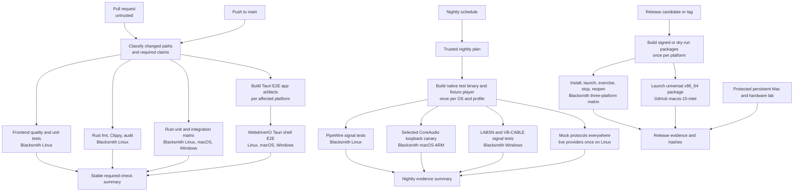

# AudioGraph cross-platform CI build and test architecture

- **Date:** 2026-08-19
- **Status:** Proposed architecture; workflow changes are approval-gated
- **Seed:** `audio-graph-ac35`
- **Reviewed source:** `origin/master` at `a4265de47f57e351a25e3f1ea29798486877436e`
- **Latest reviewed run:** [scheduled AudioGraph CI run 32239460382](https://github.com/Codeseys-Labs/audio-graph/actions/runs/32239460382), green on 2026-08-19

## Executive decision

AudioGraph should use a layered CI system instead of expecting one runner or one test to prove everything:

1. **Blacksmith is the default runner for automatic Linux, macOS, and Windows build and test work.** It already runs the current three-platform matrix, is a drop-in image-compatible replacement for GitHub-hosted runners, exposes high concurrency, and transparently colocates the standard Actions cache. Keep that advantage.
2. **GitHub-hosted runners remain a narrow compatibility tier, not a second full CI fleet.** The durable use is `macos-15-intel` to launch the x86_64 half of a universal macOS release while GitHub offers that image. A one-time Windows shadow canary should compare LABSN/VB-CABLE on GitHub and Blacksmith; if Blacksmith produces real correlated PCM reliably, do not maintain duplicate GitHub Windows audio jobs.
3. **The portable part of audio CI is the contract and fixture player, not a universal virtual-audio driver.** Use PipeWire on Linux, one selected CoreAudio loopback on macOS, and VB-CABLE on Windows. The same test must assert frames, signal correlation, timestamps, source identity, bounded stop, and cleanup on all three.
4. **The current green live-audio job is not yet a real round trip.** It proves enumeration and some format negotiation. Capture build/start failures and zero frames are logged rather than asserted. The target is fixture playback through the OS, capture through `rsac` and AudioGraph, then hard signal and pipeline assertions.
5. **Build native outputs once per OS, architecture, and feature profile, then test the exact outputs.** Caches accelerate rebuilds between runs; artifacts carry immutable binaries and packages between jobs in one run. Do not pass entire Cargo `target` directories as artifacts.
6. **Unit and deterministic integration tests never need external API keys.** Real Deepgram and OpenRouter calls belong in a protected nightly/manual tier using dedicated, expiring, low-budget keys and synthetic content only.
7. **A Dwarkesh Patel podcast must not be a required CI fixture without written permission.** Required CI should use repository-owned or permissively licensed offline fixtures. A permissioned Dwarkesh excerpt can be a useful nonblocking realism soak, pinned by episode, byte hash, and time range.
8. **Fix dependency provenance before restructuring workflows.** AudioGraph currently resolves `rsac` v0.4.1 at Git revision `7956e6ef...`, while CI and release clone and report obsolete v0.4.0 revision `a2d3088b...`. The user expects v0.4.4; upgrade once, track the lockfile, derive provenance from Cargo's actual resolution, and require `--locked` everywhere.

This document supersedes the recommendations in `docs/research/ci-virtual-audio-devices-2026-06-27.md` wherever they conflict, particularly its no-reboot and licensing assumptions for third-party virtual drivers.

## Evidence vocabulary

The architecture uses these words narrowly:

| Label | Meaning |
|---|---|
| **Verified current** | Observed in the reviewed repository, official documentation, or an executed CI run. |
| **Proposed** | The target workflow design in this document; it is not implemented yet. |
| **Canary required** | Technically plausible, but it must produce strict runner evidence before becoming a required gate. |
| **Lab required** | Hosted ephemeral runners cannot produce the claim because of permission, hardware, or reboot boundaries. |
| **Not covered** | No test currently supports the claim. A green neighboring test must not be used as a substitute. |

## Decisions reached during this review

### Runner allocation

- Keep normal CI and release builds on Blacksmith for all three platforms.
- Keep Linux PipeWire signal tests on Blacksmith.
- Keep the macOS hosted virtual-audio canary on Blacksmith; LABSN is not tied to GitHub's runner brand.
- Run a protected Blacksmith Windows LABSN/VB-CABLE actual-PCM canary after professional-use licensing is resolved.
- Use one GitHub `windows-2025` shadow run to compare the exact same binary, fixture, driver setup, and pass criteria. Retire it after Blacksmith is proven unless reliability data says otherwise.
- Keep GitHub `macos-15-intel` for release-candidate runtime testing if AudioGraph promises Intel macOS support. Blacksmith macOS runners are Apple Silicon M4 only, while GitHub currently exposes the x64 `macos-15-intel` image.
- Use a protected persistent Mac only for CoreAudio Process Tap consent, physical microphone/USB/Bluetooth/hotplug, and other claims that ephemeral managed runners cannot make.

[Blacksmith documents](https://docs.blacksmith.sh/blacksmith-runners/overview) its runners as image-compatible drop-in replacements, lists Windows Server 2025 as public beta, and lists macOS 15/26 only on Apple Silicon M4. [GitHub's runner-images inventory](https://github.com/actions/runner-images) lists `macos-15-intel` as x64; GitHub has announced that this last Intel image is available only through August 2027.

### LABSN and virtual audio

- Use the SHA-pinned `LABSN/sound-ci-helpers@d08c889...` action as the fast baseline where it works.
- Do not treat action completion, driver installation, or endpoint enumeration as a pass.
- Linux should continue to use an explicit PipeWire null sink and `.monitor`; LABSN's PulseAudio/systemd path is not the right headless Blacksmith path.
- On macOS, stop installing both Background Music and BlackHole in one job. First canary the LABSN-installed Background Music device by exact UID and actual PCM. If it fails, evaluate BlackHole separately rather than hiding failure behind `|| true`.
- On Windows, use the existing hardened installer flow when provenance-grade evidence is needed. The pinned LABSN action is acceptable for the first trusted canary after licensing, but signal proof and cleanup remain mandatory.

There is no maintained lightweight cross-platform virtual audio driver. Each OS exposes a different audio subsystem and driver model. The reusable engineering belongs in a shared test protocol plus small OS adapters.

### External provider calls

- Add real Deepgram and OpenRouter calls, but only as narrow protected smokes.
- Do not give secrets to pull requests, forks, or driver-install jobs.
- Do not repeat the same provider call on three OSes merely to prove an OS-independent HTTP/WebSocket protocol. Test capture and normalized PCM on each OS, test provider protocols deterministically with local mocks everywhere, then make one live call on Linux.
- Use structural, tolerant assertions for live models. Do not golden-test exact generated prose.

### Test media

- Required CI uses offline, checksum-pinned fixtures with clear redistribution rights.
- Reuse the existing CC BY 4.0 LibriSpeech-derived fixtures under `src-tauri/fixtures/source_separation/`.
- Add a short calibration tone/chirp fixture and a longer 20–45 second multi-turn speech fixture with a manifest.
- Bootstrap external application capture with pinned FFplay; evolve toward a tiny repository-owned CPAL fixture player that selects an explicit output device and exposes a stable PID.
- Keep VLC as an optional scheduled compatibility smoke, not a required dependency.
- A Dwarkesh excerpt is optional and permission-gated, never the only input proving AudioGraph works.

## Verified current state

### What is already strong

At the reviewed commit, the scheduled workflow completed 33 parallel jobs successfully in about 21 minutes. Current coverage includes:

- frontend lint, type checking, Vitest coverage, and a production web build;
- Rust checks and tests on Blacksmith Linux, macOS, and Windows;
- a cloud-only feature matrix and no-bundle Tauri compile smoke on all three OSes;
- multiple optional feature compile/test cells across all three OSes;
- Linux and macOS scheduled live-audio jobs;
- three-platform storage-engine evidence;
- three-platform release package builds;
- SHA-pinned third-party Actions and minimal default `GITHUB_TOKEN` permissions.

The current workflow is already Blacksmith-first. The regular jobs in `.github/workflows/ci.yml` and all three release builders in `.github/workflows/release.yml` use Blacksmith. The manual durability workflow is the notable GitHub Windows exception.

### Measured duplication and avoidable cost

The latest reviewed push run, [32214776220](https://github.com/Codeseys-Labs/audio-graph/actions/runs/32214776220), completed 28 jobs in about 9 minutes 25 seconds but consumed roughly 96.9 aggregate runner-minutes. The 33-job scheduled run completed in about 21 minutes. That is a good wall-clock result, but the repository currently buys it with duplicated setup and builds.

| Current inefficiency | Verified evidence | Target correction |
|---|---|---|
| Unused `rsac` sibling clone | 27 clone steps in the reviewed push consumed about 77 runner-seconds, but Cargo uses the Git dependency. | Delete clone and sibling-directory verification after the v0.4.4/lock correction. |
| Playback regression runs twice | Each cloud cell runs the filtered playback test, then the full cloud suite containing it. The reviewed push spent about 124 runner-seconds on the duplicate steps. | Run it once; use focused rerun only as failure diagnostics. |
| Frontend typecheck/build repeats | The frontend job runs `tsc --noEmit`; `bun run build` starts with `tsc` again; every Tauri build invokes the frontend build again through `beforeBuildCommand`. | Build one `dist/` artifact per workflow and embed the exact same bytes in native builds through a CI-specific Tauri configuration. |
| Default/no-bundle and release rebuild independently | CI uploads app binaries but no downstream job downloads them; release packages are built again. | Consume exact app/package artifacts in downstream E2E and release-validation jobs. |
| Optional feature matrix runs on every push | Five feature profiles × three OSes run on all non-PR events, alongside default and platform regressions. | Run affected profiles on relevant pushes and the full matrix nightly; unknown/build-system changes fail safe to full coverage. |
| Rust suites are globally serialized | Full suites use `--test-threads=1`, even though only a subset depends on global state. | Inventory and isolate stateful tests, then benchmark normal libtest parallelism or nextest before adopting shards. |
| Release lacks Rust cache reuse | Release provisions toolchains and builds cold without the Rust cache used by CI. | Add release-profile, OS, architecture, target, and lock-aware cache restore. |
| Cache identities do not fully describe profiles | Equivalent jobs cannot share some default job-scoped Rust caches, while optional matrix cells can contend without the feature string in the key. | Use explicit profile-aware shared keys and a single trusted writer per OS/profile. |
| Coverage HTML is generated but not retained | Vitest produces text/JSON/HTML, while CI uploads none. | Use text/JSON in PRs; generate/upload HTML only on nightly/manual or request. |
| `cargo-audit` is compiled repeatedly | The audit job installs an unversioned latest tool; the reviewed push spent about 86 seconds there. | Pin the tool/version and cache its binary or use a pinned prebuilt action after supply-chain review. |
| No stale-run cancellation or stable aggregate | Core CI has no workflow concurrency group, normal-job timeouts, or single required aggregator. | Cancel superseded PR/push work, keep evidence runs, add measured timeouts, and expose `ci-required`. |

The optimization target is therefore **lower aggregate runner-minutes without lengthening the critical path**. Maximal job count is not the goal.

### Current coverage gaps

| Claim | Current evidence | Gap |
|---|---|---|
| Frontend unit behavior | Vitest/JSDOM on Linux | Good for platform-neutral React logic; not a native desktop shell. |
| Rust unit/integration behavior | `cargo test` on all three OSes | Broad and useful, but most tests use mocks or synthetic inputs. |
| Tauri desktop E2E | No WDIO/Playwright suite | Current `tauri build --no-bundle` proves compilation, not launch, IPC, navigation, or teardown. |
| Live Linux audio | Virtual endpoint enumeration and best-effort capture | No required played signal, correlation, source identity, or nonzero frame assertion. |
| Live macOS audio | LABSN plus BlackHole install; same weak smoke | Dual virtual-device setup, `|| true`, no strict signal; positive Process Tap is TCC-blocked. |
| Live Windows audio | Held behind VB-CABLE licensing | No AudioGraph PCM round trip on Windows. The manual durability job proves endpoint enumeration only. |
| System/device/application capture | Source descriptors and pure capability tests | No strict AudioGraph round trip for each supported source type and OS. |
| Deepgram | Ignored handshake/model validation | Does not stream fixture audio or require normalized partial/final transcript events. |
| OpenRouter | Safe ignored live harness exists | Not wired to a protected CI environment. |
| Full capture-to-graph pipeline | Deterministic component tests | No real OS capture feeding ASR, transcript ledger, notes/graph, persistence, and UI in one bounded test. |
| Packaged artifact | Packages are built | The exact installer/app is not installed, launched, exercised, stopped, reopened, and checked for isolated writes. |
| macOS Intel runtime | Universal package build | The x86_64 slice is not launched on Intel. |
| Physical audio and permissions | None in hosted CI | Requires a controlled lab tier. |

### Why the current live-audio green is weaker than it looks

`src-tauri/src/audio/live_audio_smoke.rs` says that a full PCM round trip is deferred. Its short capture probe:

- returns when no supported format exists;
- logs `capture.start()` and builder failures rather than failing;
- counts buffers and frames but does not require either to be nonzero;
- has no tone correlation, RMS, FFT, source/PID, or timestamp assertion.

The 2026-08-19 scheduled macOS live-audio job took about 20 minutes, compared with about 4 minutes on Linux. This timing is consistent with—but by itself does not prove—the managed-macOS AUHAL stall documented by the upstream `rsac` v0.4.4 CI report. Because the AudioGraph probe logs capture failure, a long CoreAudio failure can still end in a green job.

Upstream `rsac` v0.4.4 documents a useful truth table: Linux and Windows produce real system/device/process PCM in hosted CI, while macOS system and process capture need the `kTCCServiceAudioCapture` grant and macOS device capture can stall on managed VMs. See the [rsac v0.4.4 CI audio testing guide](https://raw.githubusercontent.com/Codeseys-Labs/rust-crossplat-audio-capture/ea2019bba217cab695d45696bc2ca25430b23dc2/docs/CI_AUDIO_TESTING.md). AudioGraph should reuse those hard-won boundaries instead of claiming all nine cells are equivalent.

### Dependency provenance is currently inconsistent

`src-tauri/Cargo.toml` resolves `rsac` through Git revision `7956e6ef...`, the v0.4.1 release. `ci.yml` and `release.yml` still clone a sibling v0.4.0 checkout at `a2d3088b...` and release metadata reports that old SHA. Cargo does not use that sibling checkout, so the manifest can describe a dependency that is not in the binary.

The released [rsac v0.4.4 manifest](https://raw.githubusercontent.com/Codeseys-Labs/rust-crossplat-audio-capture/ea2019bba217cab695d45696bc2ca25430b23dc2/Cargo.toml) identifies version 0.4.4 at commit `ea2019bba217cab695d45696bc2ca25430b23dc2`. The correction is tracked by `audio-graph-4132` and `audio-graph-8913`.

## Target test taxonomy

Every result should say which layer it proves. A green lower layer must not be relabeled as a higher one.

| Layer | Purpose | Platforms | Default trigger |
|---|---|---|---|
| Unit | Pure Rust/TypeScript functions, parsers, state transitions, DSP, policies | All code paths; Rust compiles/tests on all OSes | Every PR |
| Component integration | Repository, pipeline, provider protocol mocks, Tauri mock runtime | Rust all three OSes; frontend once | Every PR |
| Native integration | Real filesystem, keychain, audio API, process lifecycle | Per OS | Push/nightly/manual according to cost |
| Desktop shell E2E | Actual Tauri shell, renderer, IPC, navigation, logs, stop/error UX | Linux, macOS, Windows | Relevant PRs and main |
| Signal-path E2E | Player process through real OS endpoint and `rsac` into AudioGraph PCM | Linux, Windows hosted; macOS hosted where honest | Nightly/manual trusted |
| Pipeline E2E | Captured PCM through normalization, ASR, transcript, graph/notes, persistence | All three with fake/local providers; one live-provider leg | Nightly |
| Provider live smoke | Real Deepgram/OpenRouter auth and current protocol | One trusted Linux job | Protected nightly/manual |
| Packaged E2E | Exact built installer/app launch, command smoke, stop/reopen, isolation | Linux, macOS ARM/Intel, Windows | Release candidate |
| Lab qualification | TCC consent, physical mic, Bluetooth/USB, hotplug, reboot behavior | Controlled Mac/Windows | Manual/release qualification |

## Proposed CI flow



In prose: untrusted PR work never receives secrets or installs privileged audio drivers. It fans out immediately across fast deterministic jobs. Trusted nightly work builds native executables once and then fans those exact binaries into short audio and provider jobs. Release work builds packages once and tests those exact bytes, including an Intel macOS launch when that architecture remains supported. Lab evidence augments hosted CI; it does not silently replace failed hosted jobs.

## Workflow tiers

### Tier A: fast PR gate

**Goal:** deterministic merge confidence with no secrets, network model calls, virtual drivers, or mutable external media.

Run in parallel:

- change classifier and generated-contract drift checks;
- frontend Biome, typecheck, Vitest, and production build on Blacksmith Linux;
- Rust format, Clippy, dependency/security checks on Blacksmith Linux;
- cloud-profile Rust unit/integration tests on Blacksmith Linux, macOS, and Windows;
- Tauri shell E2E with the embedded `@wdio/tauri-service` provider on affected platforms;
- local mock Deepgram WebSocket and OpenRouter HTTP/SSE contract tests;
- offline fixture manifest, PCM normalization, transcript, graph, persistence, and redaction tests.

Tauri now recommends WebdriverIO with `@wdio/tauri-service`; its embedded provider supports Windows, Linux, and macOS without an external platform WebDriver. Direct `tauri-driver` does not provide the same macOS path. See [Tauri's WebDriver guide](https://v2.tauri.app/develop/tests/webdriver/).

Use path classification to skip expensive native jobs only when the changed files cannot affect them. Changes to `src-tauri/**`, `src/**`, `package.json`, `bun.lock`, Cargo manifests/lock, Tauri config, build scripts, fixtures, or workflows must select the relevant native lanes. Documentation-only changes can run the smallest contract/docs gate.

Expose one stable branch-protection job such as `ci-required`. It should use `if: always()` and fail if any selected required job failed or was unexpectedly skipped. This prevents matrix names from destabilizing branch protection.

### Tier B: main-branch integration

**Goal:** prove the default application shape without making every PR pay for heavyweight local-model features.

- Build and test the default feature profile on all three Blacksmith OSes.
- Build the Tauri application artifact once per OS for shell E2E.
- Execute the real shell with mocked audio/provider commands.
- Run selected native keychain/filesystem tests where hosted evidence is meaningful.
- Keep secrets absent.

### Tier C: trusted nightly signal and provider tests

**Goal:** prove real OS capture and current provider protocols without making release quality depend on nondeterministic third parties.

- Build one native audio test binary plus fixture player per OS/profile.
- Provision the explicit virtual endpoint.
- Run system, device, application PID/name, and process-tree targets when `PlatformCapabilities` says the target is supported.
- If a target is unsupported or permission-blocked, require a typed, expected classification. A silent skip is not a pass for a target that is advertised as supported.
- Feed captured speech into the full AudioGraph pipeline using fake/local providers on every OS.
- Run one protected Deepgram stream and one protected OpenRouter request on Blacksmith Linux.
- Upload only content-free metrics, hashes, event counts, and failure diagnostics.

### Tier D: release-candidate exact-artifact tests

**Goal:** test what will actually ship.

- Build each package once with its resolved dependency manifest and SHA-256.
- Download the exact artifact into a fresh job; do not rebuild.
- Install or mount it, launch with isolated data/config directories, wait for a bounded ready signal, exercise a representative IPC command and UI route, stop the exact child, reopen, and confirm persistence behavior.
- Verify no writes occurred outside the isolated root.
- Verify package signature/notarization/updater metadata where enabled.
- Launch the universal macOS artifact on Blacksmith ARM and GitHub `macos-15-intel` while Intel remains a supported target.
- Retain longer-lived release evidence than PR artifacts.

### Tier E: protected lab qualification

Hosted CI cannot honestly prove:

- first macOS CoreAudio Process Tap consent and denied-to-granted recovery;
- physical microphone quality and microphone permission prompts;
- USB/Bluetooth device arrival, removal, route change, and hotplug recovery;
- reboot-dependent driver installation/uninstallation;
- acoustic echo, real room noise, or multiple physical devices;
- long-duration power/sleep/wake behavior.

Because the user has no local Mac, provision a protected persistent Mac runner or leased Mac host for the positive TCC and physical-device slice (`audio-graph-9f10`). Its credentials and network access should be narrower than normal developer machines, and its one-time grants, binary identity, cleanup, and re-provisioning procedure must be documented.

## Runner allocation matrix

| Workload | Primary runner | Residual/fallback | Decision |
|---|---|---|---|
| Frontend, lint, audit | Blacksmith Linux | None | Fast, platform-neutral, cached. |
| Rust/native matrix | Blacksmith Linux/macOS/Windows | None | Required cross-platform evidence. |
| Tauri shell E2E | Blacksmith all three | None | Embedded WDIO works cross-platform. |
| Linux virtual audio | Blacksmith Ubuntu | GitHub Ubuntu only for image comparison | PipeWire userspace endpoint; no need for a second fleet. |
| macOS virtual audio | Blacksmith macOS ARM | Alternate driver canary only | LABSN is runner-agnostic; strict signal decides viability. |
| Windows virtual audio | Blacksmith Windows after canary | Temporary GitHub `windows-2025` shadow; lab if reboot required | No permanent GitHub duplication after real PCM passes. |
| macOS Intel release launch | GitHub `macos-15-intel` | Physical Intel Mac | Blacksmith has no Intel macOS runner. |
| Provider live smoke | Blacksmith Linux | None | Protocol is OS-independent; isolate secrets from driver jobs. |
| macOS TCC-positive capture | Persistent protected Mac | Leased Mac host | Managed runners cannot grant `kTCCServiceAudioCapture`. |
| Physical device/reboot tests | Protected lab | None | Hosted VMs cannot prove the claim. |

Blacksmith's [Actions cache documentation](https://docs.blacksmith.sh/blacksmith-caching/dependencies-actions) says official and popular third-party cache actions are transparently redirected to its colocated cache with no workflow changes. It also says Rust `sccache` still uses GitHub's backend, so do not assume adding `sccache` automatically gets the same locality.

## Audio signal harness

### Portable contract

Each OS adapter must implement the same operations:

1. provision or locate an endpoint;
2. record the exact stable endpoint identity, driver/version, and original defaults;
3. launch the fixture player against the explicit output endpoint;
4. wait for the expected application/session/source descriptor;
5. capture through AudioGraph's public source path;
6. assert signal, timing, attribution, teardown, and cleanup;
7. restore any changed defaults even after failure.

Required pass criteria:

- at least one buffer and a minimum frame count;
- RMS/peak above silence and below clipping thresholds;
- calibration tone/chirp correlation or expected FFT-bin energy;
- expected sample rate/channel contract after normalization;
- monotonically increasing source timestamps and bounded discontinuities;
- correct capture target and source identity;
- application tests match the launched PID/process tree and reject unrelated sources;
- capture stop and player termination complete within a bounded timeout;
- no lingering process, device default mutation, temporary certificate, or unredacted content;
- full-pipeline tests create transcript spans and structural graph/note output citing those spans.

```mermaid
flowchart LR
  accTitle: AudioGraph deterministic audio and pipeline test flow
  accDescr: A checksum-pinned fixture is played by a stable process into an explicit OS endpoint. AudioGraph captures the device, system output, or application process through rsac, validates PCM and timing, and then sends normalized audio through mock or protected live providers into transcript, notes, graph, persistence, and shell assertions.

  Fixture["Pinned tone and speech fixtures<br/>with manifest and SHA-256"] --> Player["Repository fixture player<br/>or pinned FFplay canary"]
  Player --> Endpoint["Explicit OS endpoint<br/>PipeWire, CoreAudio, or VB-CABLE"]
  Endpoint --> Device["Device capture"]
  Endpoint --> System["System output capture"]
  Player --> App["Application PID, name,<br/>or process-tree capture"]
  Device --> Rsac["rsac public capture API"]
  System --> Rsac
  App --> Rsac
  Rsac --> Signal["Frames, RMS, correlation,<br/>timestamps, source identity"]
  Signal --> Normalize["AudioGraph normalization<br/>and processed-audio bus"]
  Normalize --> MockASR["Mock or local ASR<br/>on every platform"]
  Normalize --> LiveASR["Protected Deepgram smoke<br/>once on Linux"]
  MockASR --> Transcript["Transcript ledger"]
  LiveASR --> Transcript
  Transcript --> MockLLM["Mock/local graph and notes<br/>on every platform"]
  Transcript --> LiveLLM["Protected OpenRouter smoke<br/>once on Linux"]
  MockLLM --> Product["Notes, temporal graph,<br/>persistence, Tauri shell"]
  LiveLLM --> Product
```



### OS adapters

#### Linux

- Use `dbus-run-session` with PipeWire, WirePlumber, and `pipewire-pulse`.
- Create a named null sink with fixed 48 kHz, two-channel PCM and select its `.monitor` explicitly.
- Launch the fixture player into that sink.
- Test device, system, application PID/name, and process-tree paths as supported.
- Do not use `snd-aloop`; hosted runner kernels are not the contract and `rsac`'s Linux path is PipeWire.

[PipeWire documents](https://pipewire.pages.freedesktop.org/pipewire/page_pulse_modules.html) its Pulse-compatible module surface, including null sinks and loopback modules.

#### Windows

- Resolve the professional-use VB-CABLE license before automatic CI (`audio-graph-d3d3`).
- Use the SHA-pinned LABSN path for the first protected canary, or the existing hardened archive/catalog/certificate/DevCon path for provenance-grade evidence.
- Start and verify Windows Audio, identify the exact CABLE render and capture endpoints, and select them explicitly.
- Render the fixture to CABLE Input, capture from CABLE Output for device tests, and use WASAPI system/application/process capture for the other modes.
- Run the exact same artifact on Blacksmith Windows and GitHub `windows-2025` once. Promote Blacksmith only on actual correlated PCM.
- If the driver requires reboot on the ephemeral image, move this test to a prebooted protected Windows runner rather than calling enumeration a pass.

VB-Audio describes CABLE Input-to-Output forwarding, explicitly instructs users to [reboot after installation](https://vb-audio.com/Cable/), and says a [license must be paid for professional/company use](https://vb-audio.com/Services/licensing.htm). Those vendor statements take priority over an older CI report's no-reboot assumption.

#### macOS

- Use Blacksmith macOS ARM for build, shell E2E, and hosted canaries.
- First test the LABSN-installed Background Music endpoint alone by exact CoreAudio UID and strict PCM. Remove the redundant BlackHole install if it passes.
- If Background Music cannot satisfy the device contract, evaluate BlackHole in a separate approval-gated canary. BlackHole's README says the installer may request a system restart and that non-GPLv3 projects require a license; do not use `brew install ... || true` as a silent baseline. See the [BlackHole project](https://github.com/ExistentialAudio/BlackHole).
- Put short hard timeouts around AUHAL/Process Tap operations so a known permission or VM limitation cannot consume 20 minutes and still appear green.
- Managed hosted jobs should assert the expected typed TCC denial/not-determined behavior for Process Tap.
- Run positive system/application/process capture on the protected persistent Mac after one-time `kTCCServiceAudioCapture` consent.

## Media fixtures and headless playback

### Canonical required fixtures

Required CI should never download a moving remote media URL. Use:

1. a 3–5 second generated calibration tone/chirp for routing and correlation;
2. a 20–45 second two-speaker turn-taking fixture with pauses and one overlap segment;
3. the existing short LibriSpeech-derived overlap and turn-taking fixtures for source separation and diarization.

The repository already records LibriSpeech provenance, speakers, transcripts, and timing under `src-tauri/fixtures/source_separation/`. [OpenSLR publishes LibriSpeech under CC BY 4.0](https://www.openslr.org/12), which permits reuse with attribution.

Every fixture manifest should record:

- SHA-256 and byte length;
- sample format, sample rate, channels, duration, and loudness envelope;
- source and license;
- all modifications;
- speaker identifiers and reference transcript;
- word/turn/overlap timing when relevant;
- expected signal, ASR, diarization, and structural pipeline thresholds.

### Playback choice

**Bootstrap:** use pinned FFplay because it is small, portable, headless, and provides a stable external process for PID capture. Its documented `-nodisp` and `-autoexit` flags support noninteractive use:

```text
ffplay -hide_banner -loglevel error -nostats -nodisp -autoexit fixture.wav
```

See the [FFplay documentation](https://ffmpeg.org/ffplay.html). Pin the FFmpeg distribution and verify its digest; fail preflight if FFplay is absent.

**Required long-term gate:** add a tiny repository-owned fixture-player binary using AudioGraph's existing CPAL playback layer. It should:

- accept an explicit output device identity rather than changing the global default;
- play local PCM in a loop until stopped;
- emit its PID and content-free fixture/device metadata;
- expose a ready signal;
- terminate predictably in cleanup;
- be built once and reused as an artifact by the audio jobs.

Keep FFplay as an independent scheduled canary so the product and its test player do not share every playback failure.

**VLC:** `cvlc`/dummy-interface playback is feasible, but VLC is heavier and less predictable for process exit across platforms. Use it only as a later scheduled compatibility test for a recognizable desktop media application. It should not be installed in every required job.

### Dwarkesh Patel podcast decision

Do not store or make a Dwarkesh episode/excerpt a required fixture yet.

- The [official site](https://www.dwarkesh.com/about) displays a Dwarkesh Patel copyright notice and provides contact information, but no Creative Commons or redistribution grant.
- [Substack's terms](https://substack.com/tos) say creators retain copyright and do not provide a general downstream redistribution right.
- A full podcast enclosure is large, network-dependent, and content/model outputs can change. Fetching it on every run would be slow and nondeterministic even if rights were resolved.
- Sending the excerpt to Deepgram/OpenRouter is a separate third-party content-egress question that permission should cover.

The optional soak tracked by `audio-graph-dc43` may proceed only after written permission defines:

- the exact episode and excerpt duration;
- private CI versus public repository use;
- storage/cache and retention rights;
- whether derived transcripts and metrics may be retained;
- whether the content may be sent to the selected ASR/LLM providers.

If approved, pin the episode GUID, exact byte SHA-256, excerpt time range, speakers, and permission record. Store it only where allowed, preferably in a private fixture store. Never fetch "latest episode" and never publish the audio, transcript, or model reply as a workflow artifact. Assert tolerant quality/structure metrics, not exact prose.

Without permission, a developer may supply media manually to a local/lab run, but it must not enter the repository, Actions cache, or retained artifacts.

## Provider-key architecture

### What needs keys

Only these jobs need external credentials:

| Job | Secret | Purpose |
|---|---|---|
| Protected Deepgram streaming smoke | `DEEPGRAM_API_KEY` | Send a small synthetic PCM fixture and require normalized partial/final events plus bounded close. |
| Protected OpenRouter routed smoke | `OPENROUTER_API_KEY` | Send one tiny synthetic prompt and require current routing/auth/telemetry. |

No unit, mock integration, shell E2E, package smoke, or native audio-capture test requires either key.

### Secret controls

- Create separate provider test accounts/projects/workspaces where possible.
- Use test-only keys, never production credentials.
- Put keys in a branch-restricted GitHub Environment used only by scheduled/default-branch workflows.
- Keep manual extended/real-media soaks behind a separate reviewed Environment if needed; a required reviewer on the automatic nightly Environment would leave schedules waiting indefinitely.
- Give Deepgram the narrowest available project role, a short expiration, and a CI request tag. Deepgram recommends [different keys for testing and production](https://developers.deepgram.com/guides/fundamentals/authenticating).
- Give OpenRouter a key-level spending limit, model/provider allowlist, expiration, and no input/output logging. OpenRouter documents [per-key spending limits](https://openrouter.ai/docs/api/api-reference/api-keys/create-keys) and [guardrails](https://openrouter.ai/docs/guides/features/guardrails/overview).
- Set a low monthly budget and alerts; do not rely on free-model availability for required evidence.
- Rotate on a fixed schedule and revoke immediately on suspicious use.
- Never expose provider secrets to `pull_request_target`, fork code, a shared persistent audio lab, or a job that downloads and executes untrusted artifacts.
- Log model, request ID when safe, latency, token/event counts, and status only. Never log the key, prompt, transcript, reply, raw audio, signed URLs, or provider error bodies that may echo content.

GitHub recommends least-privilege secrets and supports branch restrictions and protected secrets through [deployment Environments](https://docs.github.com/en/actions/concepts/workflows-and-actions/deployment-environments). GitHub also warns that caches and artifacts restored from untrusted workflows must be treated as untrusted input.

### Live provider assertions

**Deepgram:** the current ignored test validates handshake/model acceptance but not audio. The target test streams the synthetic speech fixture through the real AudioGraph client and requires:

- authenticated WebSocket connection;
- at least one normalized transcript event;
- a final/speech-final event or the product's documented equivalent;
- expected fixture keywords with a tolerant threshold;
- monotonic timing metadata;
- bounded finalize and close;
- a sanitized report with no content.

Deepgram's [live streaming API](https://developers.deepgram.com/reference/speech-to-text/listen-streaming) exposes partial/final results and explicit finalize/close messages; its starter kit also demonstrates streaming a local WAV fixture.

**OpenRouter:** the current ignored `live_openrouter_routed_smoke` is close to the right shape: synthetic prompt, tiny `max_tokens`, and metrics-only output. Wire it to the protected job and require:

- authentication and one successful completion;
- selected model/provider or available routing metadata;
- token and latency accounting;
- configured privacy/routing guardrails;
- no prompt, response, or key in logs/artifacts.

**Full cloud pipeline:** do not call both providers three times just because there are three OS capture jobs. Prove the OS-specific capture-to-normalized-PCM boundary three times, then call the live providers once with that deterministic content. Use mocks/local providers for the all-OS transcript-to-graph path.

## Parallelism, artifacts, and caching

### Parallelize by independent claim

Start independent PR jobs immediately. Blacksmith documents unlimited runner concurrency, so the latency-critical path should not serialize frontend, lints, Linux, macOS, and Windows.

Good split boundaries:

- frontend quality;
- Rust lints/audit;
- OS matrix for cloud/default tests;
- shell E2E by OS;
- native audio by OS;
- provider live smokes;
- package validation by OS/architecture.

Do not split every small test into a separate job. Each job repeats checkout, toolchain, system setup, cache restore/save, and artifact transfer. Group tests that share a large feature profile and setup, then shard only when measured execution time dominates setup time.

The current 33-job nightly finishes in about 21 minutes, which shows parallelism is already effective. The next wall-clock win is eliminating the roughly 20-minute macOS live-audio compile/hang path, not adding more tiny jobs.

### Build once, fan out exact artifacts

Create immutable artifacts named by source SHA, OS, architecture, and feature profile, for example:

```text
native-tests-macos-arm64-cloud-live-audio-a4265de
fixture-player-windows-x64-a4265de
tauri-e2e-linux-x64-cloud-a4265de
release-macos-universal-a4265de
```

Each artifact carries a small manifest containing:

- AudioGraph source SHA;
- Cargo.lock and `bun.lock` hashes;
- resolved `rsac` version/source/revision from Cargo metadata;
- Rust/Bun/toolchain versions;
- OS, architecture, target triple, and feature set;
- binary/package SHA-256;
- build command and evidence class.

Use artifacts for:

- Rust test executables that a short privileged audio job can run without recompiling;
- the fixture-player process;
- Tauri app-under-test binaries for WDIO;
- exact release packages and installers;
- small sanitized failure/evidence reports.

Do not artifact the whole Cargo `target` tree. It is large, contains profile- and path-sensitive intermediates, and is a cache rather than a release output. Do not run an artifact built for one OS or architecture on another.

Build the platform-neutral frontend `dist/` once as an artifact too. Native matrix jobs should consume that exact directory using a CI-specific Tauri configuration that does not invoke `beforeBuildCommand` again. This both saves work and proves that every package embeds identical web assets.

The existing `os-native-test-binaries.yml` already demonstrates the useful pattern: build a native test binary, record the resolved source commit, upload it, and optionally execute it on a suitable host. Generalize that pattern into the audio and package tiers.

### Cache policy

Use caches only for reproducible, regenerable inputs/intermediates:

- Cargo registry/git data and compatible target intermediates through the existing Rust cache action;
- Bun's package download cache keyed by `bun.lock`, while continuing `bun install --frozen-lockfile`;
- optional model binaries only when license and checksum allow, keyed by model digest and runtime version;
- verified tool archives keyed by immutable SHA-256.

Cache keys must include at least:

- OS and architecture;
- Rust toolchain;
- Cargo.lock hash;
- feature/profile identity for target intermediates;
- relevant native build inputs.

Do not share target caches between incompatible feature profiles merely to raise a cache-hit percentage. Do not cache secrets, credentials, real media, transcripts, provider responses, mutable installer URLs, or trusted signed outputs.

GitHub distinguishes [caches from artifacts](https://docs.github.com/en/actions/concepts/workflows-and-actions/dependency-caching): caches accelerate regeneration and may miss; artifacts are named outputs passed between jobs or retained as evidence. Treat restored cache content as untrusted, especially across pull-request boundaries.

### Avoid cache stampedes

- Let untrusted PRs restore default-branch caches but avoid publishing privileged/shared cache entries.
- Prefer one cache writer per OS/profile on trusted pushes; parallel matrix followers can restore.
- Use immutable exact keys plus bounded restore prefixes.
- Preserve branch-protected cache scoping unless there is a measured reason to relax it.
- Measure restore time and hit rate before adding Blacksmith sticky disks; standard Actions caching is already colocated, while sticky disks are beta and introduce stateful coordination.

Keep Windows debug-CRT/native-ABI caches separate from normal Windows profiles. If nextest is considered, first measure a same-OS archive's upload/download time against its test time. The existing push critical path is already below ten minutes; reducing duplicate macOS and Windows compute is more valuable than sharding by instinct.

### Workflow reuse

Extract repeated setup into SHA-reviewed local composite actions or reusable workflows:

- checkout and toolchain setup;
- Linux Tauri/native packages;
- Windows MSVC/CMake/LLVM setup;
- macOS toolchain setup;
- dependency-provenance manifest;
- per-OS virtual-audio provisioning and cleanup;
- evidence upload.

Keep policy visible at the workflow level: trigger trust, permissions, Environment selection, runner, and pass/fail aggregation should not be hidden inside a generic helper.

### Concurrency and retention

- Cancel superseded PR/push runs by branch/ref.
- Never cancel nightly, release, durability, or paid lab evidence once started.
- Give every device/provider/package operation an explicit step and job timeout.
- Retain PR artifacts briefly, nightly evidence for roughly 7–14 days, and release manifests/packages according to release policy.
- Upload verbose logs on failure; upload small JUnit/JSON summaries always.

Release permissions should also be split: build/sign/package jobs receive only the secrets and read permissions they require; only the final publish job receives `contents: write`. A package should be published only after its exact-artifact tests pass.

## Test coverage target by platform

| Target | Linux hosted | Windows hosted | macOS hosted ARM | macOS Intel hosted | Persistent Mac/lab |
|---|---|---|---|---|---|
| Unit/component integration | Required | Required | Required | Not duplicated | Optional repeat |
| Tauri shell E2E | Required | Required | Required | RC launch only | Optional |
| System capture signal | Required | Required after license/canary | Typed hosted result; positive only if strict canary proves it | Not duplicated | Required positive |
| Device capture signal | Required | Required after license/canary | Strict selected-loopback canary with short timeout | Not duplicated | Required positive |
| Application/process capture signal | Required | Required | Expected TCC classification | Not duplicated | Required positive after consent |
| Capture-to-graph with mocks/local providers | Required | Required | Required using captured PCM where available and injected canonical PCM otherwise | Not duplicated | Required for TCC-positive capture |
| Deepgram/OpenRouter live | One Linux job | Not duplicated | Not duplicated | Not duplicated | Optional soak only |
| Exact package install/launch | Required | Required | Required ARM slice | Required x86_64 slice | Signed/notarized/permission qualification |
| Physical mic/hotplug/Bluetooth/reboot | Not claimed | Lab only | Not claimed | Not claimed | Required when release policy calls for it |

This is “test everything we can” without turning unsupported hosted behavior into fake green evidence.

## Implementation waves and durable work queue

### Wave 0 — make the build reproducible

**Seeds:** `audio-graph-4132`, `audio-graph-8913`

- update AudioGraph to `rsac` v0.4.4 commit `ea2019bba...` after compatibility review;
- track/update `Cargo.lock`;
- remove obsolete sibling v0.4.0 checkout/verification from CI and release;
- derive `rsac` provenance from Cargo metadata/lock used by the binary;
- add `--locked` to canonical checks, tests, Tauri builds, and releases;
- prove Linux/macOS/Windows before changing required checks.

Rollback: restore the previous Git revision and lockfile together; never change only the displayed provenance.

### Wave 1 — deterministic fixture and real round trip

**Seeds:** `audio-graph-f166`, `audio-graph-c237`

- add calibration and longer speech fixtures with manifests;
- add the repository-owned explicit-device fixture player;
- retain pinned FFplay as an independent canary;
- replace the nonasserting probe with strict frame/signal/timestamp/source/stop assertions;
- feed captured speech into fake/local pipeline stages and assert transcript-to-graph structure.

Rollback: keep the new tests manual/nonrequired until each OS has repeated evidence; do not weaken assertions to promote a runner.

### Wave 2 — provision native audio endpoints

**Seeds:** `audio-graph-6026`, `audio-graph-d3d3`

- Linux PipeWire adapter;
- one selected macOS loopback adapter, with the redundant driver removed;
- VB-CABLE professional license decision;
- Blacksmith/GitHub Windows shadow canary using identical artifacts;
- promote Blacksmith Windows only after repeated actual PCM.

Rollback: leave Windows nightly nonrequired and move reboot-dependent coverage to lab; keep unit/integration coverage required.

### Wave 3 — portable desktop shell E2E

**Seed:** `audio-graph-f9e0`

- add WebdriverIO and `@wdio/tauri-service` embedded-driver configuration;
- build the app-under-test once per OS;
- cover launch, renderer-to-Rust IPC, settings, capture ready/error/stop, navigation, logs, and cleanup with mocked native commands;
- fan out the exact app artifact across three OS runners.

### Wave 4 — protected live providers

**Seeds:** `audio-graph-315d`, `audio-graph-8772`

- provision dedicated Deepgram and OpenRouter keys in protected Environments;
- wire the current OpenRouter live harness;
- implement real Deepgram streaming audio and normalized event assertions;
- add budgets, rotation, redaction, and provider-unavailable classification;
- run live calls once on Linux, not per OS.

### Wave 5 — exact packaged artifact

**Seed:** `audio-graph-211f`

- make package build outputs the single source for downstream install/launch tests;
- verify hashes, dependency manifest, signing/notarization, isolated writes, stop/reopen, and failure artifacts;
- add GitHub Intel macOS runtime smoke if Intel remains supported.

### Wave 6 — close hosted-runner boundaries

**Seeds:** `audio-graph-9f10`, `audio-graph-dc43`

- provision positive macOS TCC/physical-device evidence on a protected persistent Mac;
- pursue written rights for an optional Dwarkesh realism soak;
- keep all real-media evidence nonblocking and private according to permission.

## Promotion gates

Do not promote a job to required until:

- its pass condition is a hard assertion, not a log or `continue-on-error`;
- it has passed repeatedly on the exact runner label and artifact profile;
- failure produces a small diagnostic artifact without secrets/content;
- a timeout cannot produce green;
- cleanup is verified;
- dependency and fixture provenance is exact;
- the Seed records commands, runs, artifact hashes, and remaining platform limits;
- rollback is a runner/tier demotion, not an assertion weakening.

## Open approvals and inputs

The architecture is decided, but these external choices remain:

1. Purchase/approve VB-CABLE professional-use licensing before Windows automated installation.
2. Decide whether Intel macOS remains a supported release target through GitHub's August 2027 hosted-image horizon.
3. Select and fund a persistent Mac option if positive TCC and physical-device evidence is release-critical.
4. Create dedicated Deepgram and OpenRouter CI credentials with low budgets and expiration.
5. Request written permission before retaining or sending a Dwarkesh excerpt through CI/providers.
6. Approve the workflow implementation waves in a clean branch/worktree; this document does not modify CI.

## Primary references

- AudioGraph current CI: `.github/workflows/ci.yml`
- AudioGraph release: `.github/workflows/release.yml`
- AudioGraph manual durability evidence: `.github/workflows/2df3-native-durability.yml`
- AudioGraph native test-binary pattern: `.github/workflows/os-native-test-binaries.yml`
- AudioGraph live smoke: `src-tauri/src/audio/live_audio_smoke.rs`
- AudioGraph provider harnesses: `src-tauri/src/asr/deepgram.rs`, `src-tauri/src/llm/openrouter.rs`
- AudioGraph fixture provenance: `src-tauri/fixtures/source_separation/`
- [Blacksmith runner overview](https://docs.blacksmith.sh/blacksmith-runners/overview)
- [Blacksmith Actions caching](https://docs.blacksmith.sh/blacksmith-caching/dependencies-actions)
- [GitHub dependency caching and artifacts](https://docs.github.com/en/actions/concepts/workflows-and-actions/dependency-caching)
- [GitHub secure Actions use](https://docs.github.com/en/actions/reference/security/secure-use)
- [Tauri WebDriver and WebdriverIO](https://v2.tauri.app/develop/tests/webdriver/)
- [rsac v0.4.4 CI audio testing](https://raw.githubusercontent.com/Codeseys-Labs/rust-crossplat-audio-capture/ea2019bba217cab695d45696bc2ca25430b23dc2/docs/CI_AUDIO_TESTING.md)
- [LABSN sound-ci-helpers pinned action](https://github.com/LABSN/sound-ci-helpers/tree/d08c889a7bba7d9b1b059f8f76dac4672ea3a9cf)
- [PipeWire Pulse-compatible modules](https://pipewire.pages.freedesktop.org/pipewire/page_pulse_modules.html)
- [VB-CABLE product and installation](https://vb-audio.com/Cable/)
- [VB-Audio licensing](https://vb-audio.com/Services/licensing.htm)
- [BlackHole](https://github.com/ExistentialAudio/BlackHole)
- [FFplay](https://ffmpeg.org/ffplay.html)
- [Deepgram streaming API](https://developers.deepgram.com/reference/speech-to-text/listen-streaming)
- [OpenRouter key limits](https://openrouter.ai/docs/api/api-reference/api-keys/create-keys)
- [Dwarkesh Podcast official site](https://www.dwarkesh.com/about)
- [Substack Terms of Use](https://substack.com/tos)
- [OpenSLR LibriSpeech](https://www.openslr.org/12)
